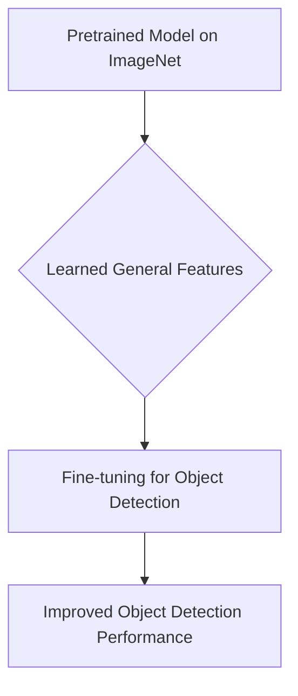
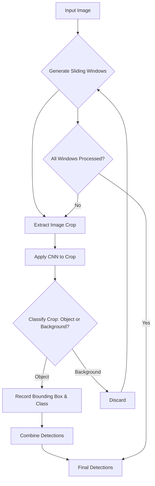
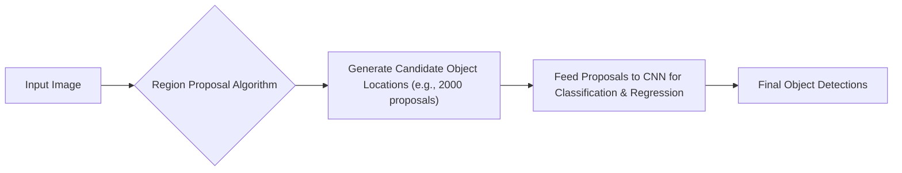

> [!summary] **Document Summary**
> This note covers advanced concepts in [[Machine Learning]] focusing on [[Computer Vision]] tasks such as [[Object Detection]], [[Semantic Segmentation]], and [[Instance Segmentation]]. It delves into problem frameworks like [[Multi-Task Learning]] and [[Transfer Learning]], explaining their benefits and applications. The document also details the process of detecting single and multiple objects, including the use of multitask loss functions and region proposal methods to improve efficiency.

## Advanced Machine Learning: Object Detection & Multi-Task Learning

### Course Overview
This course, "Advanced Machine Learning: Object Detection & Multi-Task Learning," is taught by Tatiana Tommasi during the Academic Year A.A. 2025/2026.

### Computer Vision Tasks
[[Computer Vision]] encompasses various tasks, each with distinct goals and outputs.

#### Image Classification
> [!definition] **Image Classification**
> The primary objective is to assign a single label to an entire image.

-   **Example**: An image might be classified as "Cat" with a probability of $0.9$, "Dog" with $0.05$, and "Car" with $0.01$. This indicates the model's confidence in each class for the given image.
-   **Process**: An input image is typically transformed into a high-dimensional `Vector` (e.g., $4096$ dimensions). This vector is then fed into a `Fully-Connected` layer, which maps these features to class scores. For instance, a $4096$-dimensional vector could be mapped to $1000$ different class scores, representing the likelihood of the image belonging to each of the $1000$ predefined categories.

#### Semantic Segmentation
> [!definition] **Semantic Segmentation**
> The aim is to classify every single pixel in an image into a specific category, creating a dense pixel-wise classification map.

-   **Output**: The result is an image where each pixel is labeled with its corresponding category, such as `GRASS`, `CAT`, `TREE`, or `SKY`.
-   **Characteristic**: A key feature of semantic segmentation is that it does not distinguish between individual instances of the same class. For example, if there are two cats in an image, all pixels belonging to both cats would simply be labeled `CAT`, without differentiating "Cat 1" from "Cat 2".

#### Object Detection
> [!definition] **Object Detection**
> This task involves both identifying and precisely locating multiple objects within an image. For each detected object, it provides a bounding box and a class label.

-   **Output**: The output consists of bounding boxes drawn around each object and their corresponding class labels. For example, an image might yield outputs like `CAT` (with its box), `DOG` (with its box), another `DOG` (with its box), and another `CAT` (with its box).
-   **Characteristic**: Object detection is specifically designed to handle scenarios with multiple objects, providing individual identification and localization for each.

#### Instance Segmentation
> [!definition] **Instance Segmentation**
> Instance segmentation goes a step further than semantic segmentation by delineating each distinct object instance at the pixel level, creating a unique mask for every individual object.

-   **Output**: The output comprises pixel-level masks for each individual object. For instance, if there are two dogs and one cat, the output would include a mask for "DOG 1", a separate mask for "DOG 2", and a mask for "CAT".
-   **Characteristic**: This task is unique in its ability to distinguish between multiple instances of the same object class, providing a more granular understanding of the scene compared to semantic segmentation.

### Problem Frameworks
Several frameworks are utilized to tackle complex [[Machine Learning]] problems, especially in [[Computer Vision]].

#### Multi-Task Learning (MTL)
> [!definition] **Multi-Task Learning (MTL)**
> [[Multi-Task Learning]] involves training a single model to perform multiple related tasks simultaneously, leveraging shared representations to improve performance across all tasks.

-   **Benefits**:
    -   **Bias**: MTL introduces a bias towards representations that are useful across various tasks, leading to more robust features.
    -   **Generalization**: It often improves the model's ability to generalize to unseen data or new tasks, as it learns more broadly applicable features.
    -   **Regularization**: Training on multiple tasks can act as a form of regularization, preventing the model from overfitting to a single task by forcing it to find common patterns.
    -   **Transfer**: MTL facilitates symmetric two-directional knowledge transfer, meaning insights gained from one task can benefit others, and vice-versa.
-   **References**: For further reading, refer to [Argyriou et al, Convex multi-task feature learning, 2008].

#### Structured Output Learning
> [!definition] **Structured Output Learning**
> [[Structured Output Learning]] refers to the process of training models where the output is not a simple scalar or a fixed-size vector, but rather a complex, structured object.

-   **Example**: [[Object Detection]] is a prime example of structured output learning. The output is not just a single class label, but a combination of class labels and bounding box coordinates for multiple objects, which forms a structured output.

#### Transfer Learning
> [!definition] **Transfer Learning**
> [[Transfer Learning]] is a technique where knowledge gained from solving one problem (the source domain) is applied to a different but related problem (the target domain). This is particularly useful when data for the target task is limited.

-   **Analogy**: A classic analogy is from "The Karate Kid": "Wax On...Wax Off." The seemingly unrelated task of waxing cars builds foundational skills (muscle memory, balance) that are transferable to karate.
-   **Application in Object Detection**: In [[Object Detection]], it is common practice to use models that have been pretrained on large datasets for [[Image Classification]] (e.g., ImageNet). These pretrained models capture rich visual features. Subsequently, they are fine-tuned on a smaller dataset specifically for the object detection task, adapting the learned features to identify and localize objects.

### Detecting a Single Object (Multitask Loss)
When detecting a single object, the model needs to perform two main tasks: classifying the object and localizing it with a bounding box. These are often combined using a [[Multitask Loss]].

#### Output Components
To detect a single object, a neural network typically produces two main types of outputs:
-   **Class Scores**: These represent the probability distribution over the possible classes.
    -   **Example**: An output like "Cat: $0.9$, Dog: $0.05$, Car: $0.01$" indicates the model's confidence for each class.
    -   **Layer**: A `Fully Connected` layer is commonly used to map high-level features to these class scores. For instance, a $4096$-dimensional feature vector might be mapped to $1000$ outputs, one for each class.
-   **Box Coordinates**: These are the parameters that define the bounding box around the detected object. They are typically represented as $(x, y, w, h)$, where $x, y$ are the coordinates of the box's center or top-left corner, and $w, h$ are its width and height.
    -   **Layer**: Another `Fully Connected` layer is used to output these coordinates. For example, a $4096$-dimensional feature vector could be mapped to $4$ outputs for $(x, y, w, h)$.
    -   **Nature**: Localization is fundamentally a [[Regression Problem]], as the model predicts continuous numerical values for the box coordinates.

#### Loss Functions
To train a model that performs both [[Classification]] and [[Localization]], a combined loss function is used.
-   **Softmax Loss**: This loss function is used for the classification task. It measures the discrepancy between the predicted class probabilities and the true class label.
    -   **Example**: For a `Cat` label, the Softmax Loss penalizes incorrect probability distributions.
-   **L2 Loss**: This loss function is applied to the bounding box regression task. It measures the squared Euclidean distance between the predicted bounding box coordinates and the ground-truth coordinates.
    -   **Correct box**: Let the ground-truth bounding box coordinates be $(x', y', w', h')$.
    -   **Squared Euclidean distance**: The L2 Loss is calculated as:
        $$L_2 = (x - x')^2 + (y - y')^2 + (w - w')^2 + (h - h')^2$$
        where $(x, y, w, h)$ are the predicted coordinates.
-   **Multitask Loss**: The overall loss for detecting a single object is a weighted sum of the classification loss and the localization loss. This allows the model to learn both tasks simultaneously.
    $$L_{total} = \lambda_1 L_{softmax} + \lambda_2 L_{L2}$$
    Here, $\lambda_1$ and $\lambda_2$ are hyperparameters that determine the relative importance of each loss component.

### Detecting Multiple Objects
Detecting multiple objects in an image presents unique challenges compared to single-object detection.

#### Challenge
The primary difficulty in detecting multiple objects is the variable number of objects present in an image. This leads to a variable number of outputs from the model.
-   **Example**: If an image contains only one `CAT`, the model needs to output $4$ numbers for its bounding box coordinates (e.g., $x, y, w, h$) and one class label. However, if an image contains three objects (e.g., a `DOG`, another `DOG`, and a `CAT`), the model would need to output $4 \times 3 = 12$ numbers for the bounding boxes plus three class labels. This variability makes designing a fixed-output neural network challenging.

#### Object Detection as Classification (Sliding Windows)
One early approach to address multiple [[Object Detection]] was to treat it as a repeated [[Classification]] problem using a [[Sliding Window]] technique.
-   **Approach**: A [[Convolutional Neural Network (CNN)]] is applied to numerous image crops, or "windows," extracted from the image.
-   **Process**: A window of a fixed size is slid across the entire image at various locations and scales. For each crop, the CNN classifies whether it contains an `object` (and which class) or if it's just `Background`.
-   **Problem**: This method is computationally very expensive because the CNN must be applied thousands of times for a single image, given the vast number of possible window locations and scales.

### Region Proposals
To overcome the computational inefficiency of the [[Sliding Window]] approach, the concept of [[Region Proposals]] was introduced.

-   **Goal**: The main objective of region proposals is to significantly reduce the computational expense of applying CNNs by identifying only "blobby" image regions that are highly likely to contain objects, rather than exhaustively checking every possible window.
-   **Method**: Instead of a brute-force sliding window, algorithms generate a small, manageable number of candidate object locations, known as region proposals. These proposals are then fed to the CNN for classification and refinement.
-   **Characteristics**: Region proposal methods are designed to be fast.
    -   **Example**: Selective Search, a well-known region proposal algorithm, can generate approximately $2000$ proposals in a few seconds on a CPU, dramatically cutting down the number of regions a CNN needs to process.
-   **References**:
    -   Alexe et al, “Measuring the objectness of image windows”, TPAMI 2012
    -   Uijlings et al, “Selective Search for Object Recognition”, IJCV 2013
    -   Cheng et al, “BING: Binarized normed gradients for objectness estimation at 300fps”, CVPR 2014
    -   Zitnick and Dollar, “Edge boxes: Locating object proposals from edges”, ECCV 2014

