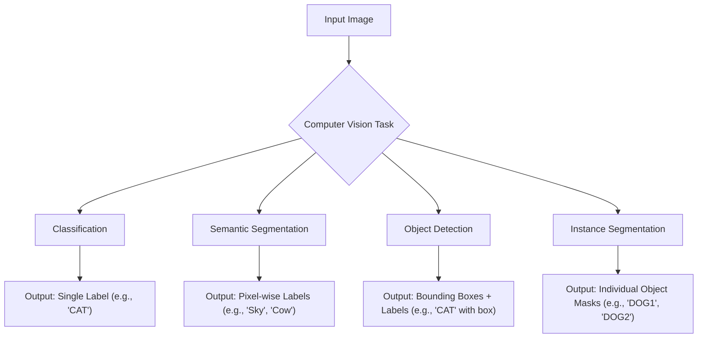
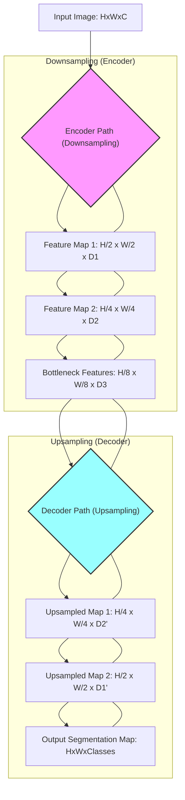

> [!summary] **Document Summary**
> This note introduces [[Semantic Segmentation]], a fundamental task in [[Computer Vision]] that involves assigning a category to every pixel in an image. It details the evolution from inefficient sliding window approaches to [[Fully Convolutional Networks (FCNs)]], which leverage an encoder-decoder architecture with downsampling and upsampling. A key focus is on [[Transpose Convolution]], a learnable upsampling technique crucial for restoring spatial resolution in FCNs, explaining its mechanics and differentiating it from normal convolution.

## Semantic Segmentation: Fully Convolutional Networks & Transpose Convolution

### Introduction to Computer Vision Tasks

[[Computer Vision]] (CV) encompasses various tasks, each addressing different aspects of image understanding:

-   **Classification**: This task assigns a single category or label to an entire image.
    -   > [!example] **Example: Classification**
        > An image containing a cat is labeled simply as `CAT`.
-   **Semantic Segmentation**: This task involves labeling *every pixel* in an image with a specific category. It does not distinguish between individual instances of the same category.
    -   > [!example] **Example: Semantic Segmentation**
        > In an image with a sky, two cows, and grass, all sky pixels are labeled 'Sky', all cow pixels are labeled 'Cow', and all grass pixels are labeled 'Grass'.
-   **Object Detection**: This task identifies and localizes multiple objects within an image. It provides bounding boxes around each detected object along with their respective labels.
    -   > [!example] **Example: Object Detection**
        > An image might show a `CAT` with a bounding box around it, and a `DOG` with its own bounding box.
-   **Instance Segmentation**: This task is more granular than semantic segmentation. It identifies and segments individual object instances, meaning it differentiates between multiple objects of the same class.
    -   > [!example] **Example: Instance Segmentation**
        > If an image contains two dogs, this task would label them as `DOG1` and `DOG2`, providing a distinct mask for each.



### Semantic Segmentation Approaches

#### Early Approach: Sliding Window

An early method for [[Semantic Segmentation]] was the `sliding window` approach. This technique operates as follows:

1.  **Extract Patch**: A small rectangular region, called a patch, is extracted from the image, centered around a specific `center pixel`.
2.  **Classify Center Pixel**: A [[Convolutional Neural Network]] (CNN) then processes this patch to classify *only* the `center pixel`.
3.  **Slide Window**: This process is repeated by sliding the window across the entire image, pixel by pixel, or with a certain stride.

> [!warning] **Problem with Sliding Window**
> This method is highly inefficient. As the window slides, it creates significant `redundant computations` because overlapping patches share many pixels that are processed multiple times.

#### Fully Convolutional Networks (FCNs) for Semantic Segmentation

`Fully Convolutional Networks` (FCNs) were developed to overcome the inefficiency of the sliding window approach.

-   **Core Idea**: An FCN consists entirely of convolutional layers, meaning it contains no dense (fully connected) layers. This design allows the network to make predictions for all pixels in an image simultaneously in a single forward pass, rather than processing patches individually.
-   **Input**: The network takes an image of size $3 \times H \times W$ as input, where $3$ is the number of color channels (e.g., RGB), $H$ is the height, and $W$ is the width.
-   **Network Structure**:
    -   `Conv` layers process the input image, extracting features.
    -   The final output layer produces `Scores` for each pixel, typically represented as a tensor of size $C \times H \times W$, where $C$ is the number of semantic classes.
    -   An `argmax` operation is then applied across the channel dimension for each pixel. This operation selects the class with the highest score for that pixel, yielding the final `Predictions` as an $H \times W$ segmentation map.
-   **Loss Function**: The network is trained using a `Per-Pixel cross-entropy` loss function. This loss is calculated by comparing the predicted class for each pixel to its true class label, effectively treating semantic segmentation as a pixel-wise classification problem.

> [!info] **Receptive Field Challenge**
> For accurate pixel labeling, especially for objects of varying sizes, a large `receptive field` is crucial. The receptive field refers to the area in the input image that a particular output pixel "sees". Achieving a large receptive field often requires many convolutional layers.
> -   **Example 1**: Two consecutive $3 \times 3$ convolutions effectively cover a $5 \times 5$ region in the input.
>     -   First $3 \times 3$ conv output: each pixel sees $3 \times 3$ input.
>     -   Second $3 \times 3$ conv output: each pixel sees $3 \times 3$ from the first conv's output, which means it sees $3 \times 3$ of $3 \times 3$ input regions, resulting in a $5 \times 5$ effective receptive field.
> -   **Example 2**: Three consecutive $3 \times 3$ convolutions effectively cover a $7 \times 7$ region in the input.

### Downsampling and Upsampling in FCNs

Modern FCN architectures often incorporate `downsampling` and `upsampling` operations. This design allows them to capture multi-scale information (details at different resolutions) while still producing a high-resolution output for pixel-wise predictions.

-   **Network Design**: A typical FCN architecture includes:
    -   Initial `Convolutional layers` for feature extraction.
    -   `Downsampling` layers to reduce spatial dimensions.
    -   `Upsampling` layers to restore spatial dimensions.
-   **Downsampling**: This process reduces the spatial dimensions (height and width) of the feature maps while simultaneously increasing the effective receptive field and capturing higher-level semantic information.
    -   **Methods**: Common techniques include `pooling` (e.g., max pooling, average pooling) or `strided convolution`.
    -   **Example**: An input image of size $3 \times H \times W$ might be downsampled sequentially:
        1.  First stage: $D_1 \times H/2 \times W/2$ (e.g., after a stride-2 convolution or pooling).
        2.  Second stage: $D_2 \times H/4 \times W/4$.
        3.  Third stage: $D_3 \times H/4 \times W/4$ (if no further spatial reduction).
        Here, $D_1, D_2, D_3$ represent the number of feature map channels, which typically increases with downsampling.
-   **Upsampling**: This process increases the spatial dimensions of the feature maps, restoring them to the original input resolution or a desired higher resolution for pixel-wise prediction.
    -   **Methods**: Common techniques include `unpooling` (which often uses indices saved during pooling) or `strided transpose convolution`.



### Learnable Upsampling: Transpose Convolution

`Transpose Convolution` is a crucial technique for learnable upsampling in [[Deep Learning]]. It is known by several other names, including `Deconvolution`, `Upconvolution`, `Fractionally strided convolution`, and `Backward strided convolution`.

#### Recall: Normal Convolution

To understand transpose convolution, it's helpful to review normal convolution:

-   **$3 \times 3$ convolution, stride 1, pad 1**:
    -   If the `Input` is a $4 \times 4$ feature map.
    -   The `Output` will also be a $4 \times 4$ feature map.
    -   In this case, the filter (kernel) moves 1 pixel in the input image for every 1 pixel generated in the output feature map.
-   **$3 \times 3$ convolution, stride 2, pad 1**:
    -   If the `Input` is a $4 \times 4$ feature map.
    -   The `Output` will be a $2 \times 2$ feature map.
    -   Here, the filter moves 2 pixels in the input for every 1 pixel generated in the output. The `Stride` parameter directly defines this input-to-output movement ratio.

#### Transpose Convolution Mechanics

`Transpose convolution` effectively reverses the spatial transformation of a normal convolution. It expands the spatial dimensions of its input.

-   **Example: $3 \times 3$ transpose convolution, stride 2, pad 1**:
    -   If the `Input` is a $2 \times 2$ feature map.
    -   The `Output` will be a $4 \times 4$ feature map (or similar, depending on padding and kernel size).
    -   **Mechanism**:
        1.  Each element in the input feature map acts as a weight for the convolutional filter.
        2.  For each input element, the filter is placed onto an output grid. The placement is determined by the `stride`.
        3.  The filter's values are multiplied by the input element's weight.
        4.  If filter outputs from different input elements overlap on the output grid, their corresponding values are summed together.
    -   **Stride in Transpose Convolution**: Unlike normal convolution, where stride dictates how many pixels the filter moves *in the input* for *one output pixel*, in transpose convolution, the `stride` defines how many pixels the filter moves *in the output* for *one input pixel*. A stride of 2 means the filter's weighted output is placed every 2 pixels in the output grid for each input element.
    -   **Overlapping Filter Outputs**: When filter applications from different input elements overlap, their values are added together to form the final output pixel value.

#### 1D Example of Transpose Convolution

Consider a 1D input $[a, b]$ and a 1D filter $[x, y, z]$. Let's assume a stride of 2 and no padding for simplicity in this conceptual example.

1.  The input element $a$ weights the filter $[x, y, z]$ to produce $[ax, ay, az]$.
2.  The input element $b$ weights the filter $[x, y, z]$ to produce $[bx, by, bz]$.

Now, these weighted filters are placed on the output grid according to the stride:

-   For $a$, $[ax, ay, az]$ is placed starting at index 0 of the output.
-   For $b$, $[bx, by, bz]$ is placed starting at index $0 + \text{stride} = 2$ of the output.

Output grid (conceptual, before summing overlaps):
$[ax, ay, az, 0, 0]$
$[0, 0, bx, by, bz]$

Summing the overlapping values:
$[ax, ay, az+bx, by, bz]$

The output size is typically $(I-1) \times S + K - 2P$, where $I$ is input size, $S$ is stride, $K$ is kernel size, $P$ is padding.
For input $I=2$, kernel $K=3$, stride $S=2$, padding $P=0$: output size is $(2-1) \times 2 + 3 - 0 = 1 \times 2 + 3 = 5$.
The resulting output is $[ax, ay, az+bx, by, bz]$. This example demonstrates how the output size expands and how values are summed.

> [!math] **Mathematical Intuition of Transpose Convolution**
> Normal convolution can be represented as a matrix multiplication $y = Cx$, where $C$ is a sparse matrix derived from the convolutional filter, $x$ is the flattened input, and $y$ is the flattened output.
> Transpose convolution performs the reverse operation. It can be represented as $y' = C^T x'$, where $C^T$ is the transpose of the convolution matrix $C$. This means that transpose convolution effectively reverses the spatial transformation (downsampling) performed by a normal convolution, making it an ideal candidate for upsampling.

```python
import numpy as np

def normal_convolution_1d(input_array, kernel, stride=1, padding=0):
    """Simulates 1D normal convolution."""
    padded_input = np.pad(input_array, padding, mode='constant')
    output_size = (len(padded_input) - len(kernel)) // stride + 1
    output = np.zeros(output_size)

    for i in range(output_size):
        start_idx = i * stride
        end_idx = start_idx + len(kernel)
        output[i] = np.sum(padded_input[start_idx:end_idx] * kernel)
    return output

def transpose_convolution_1d(input_array, kernel, stride=1, padding=0, output_padding=0):
    """
    Simulates 1D transpose convolution (conceptual).
    This is a simplified illustration, actual implementations are more complex.
    """
    kernel_len = len(kernel)
    input_len = len(input_array)

    # Calculate output size (simplified for illustration)
    # General formula: (input_len - 1) * stride + kernel_len - 2 * padding + output_padding
    output_len = (input_len - 1) * stride + kernel_len

    output = np.zeros(output_len)

    for i in range(input_len):
        # Place weighted kernel into output grid
        # For each input element, multiply kernel by it and add to output
        for k_idx in range(kernel_len):
            output_idx = i * stride + k_idx
            if output_idx < output_len: # Ensure within bounds
                output[output_idx] += input_array[i] * kernel[k_idx]
    return output

# Example for Normal Convolution
input_data_conv = np.array([1, 2, 3, 4])
kernel_conv = np.array([0.5, 1.0, 0.5])
stride_conv = 2
padding_conv = 0
output_conv = normal_convolution_1d(input_data_conv, kernel_conv, stride=stride_conv, padding=padding_conv)
print(f"Normal Convolution Input: {input_data_conv}")
print(f"Normal Convolution Kernel: {kernel_conv}")
print(f"Normal Convolution Output (stride={stride_conv}): {output_conv}")
# Expected output: [1*0.5 + 2*1.0 + 3*0.5, 3*0.5 + 4*1.0 + 0*0.5] = [0.5+2+1.5, 1.5+4] = [4.0, 5.5]

print("-" * 30)

# Example for Transpose Convolution
input_data_tconv = np.array([4.0, 5.5]) # Using output from normal conv as input for transpose
kernel_tconv = np.array([0.5, 1.0, 0.5]) # Same kernel
stride_tconv = 2
output_tconv = transpose_convolution_1d(input_data_tconv, kernel_tconv, stride=stride_tconv)
print(f"Transpose Convolution Input: {input_data_tconv}")
print(f"Transpose Convolution Kernel: {kernel_tconv}")
print(f"Transpose Convolution Output (stride={stride_tconv}): {output_tconv}")
# Note: Output might not perfectly match original input due to information loss during normal conv.
# This example is conceptual to show expansion and summation.
```

## References

-   Long, Shelhamer, and Darrell, “Fully Convolutional Networks for Semantic Segmentation”, CVPR 2015
-   Noh et al, “Learning Deconvolution Network for Semantic Segmentation”, ICCV 2015
-   Farabet et al, “Learning Hierarchical Features for Scene Labeling,” TPAMI 2013
-   Pinheiro and Collobert, “Recurrent Convolutional Neural Networks for Scene Labeling”, ICML 2014
-   For further details on transpose convolution: `http://d2l.ai/chapter_computer-vision/transposed-conv.html`
