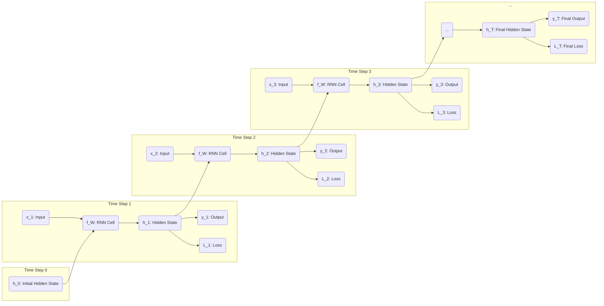
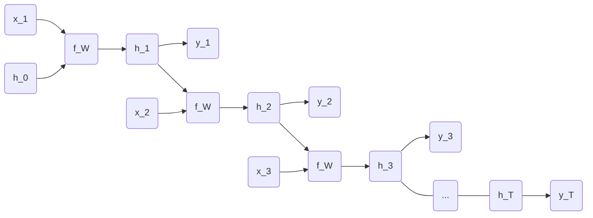
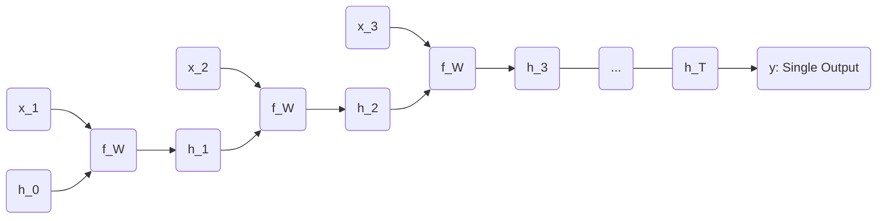
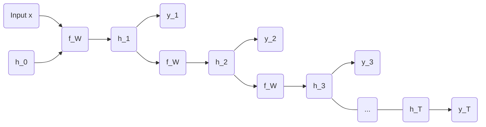
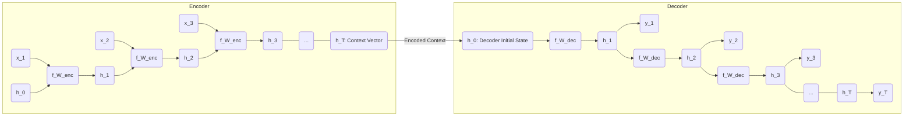
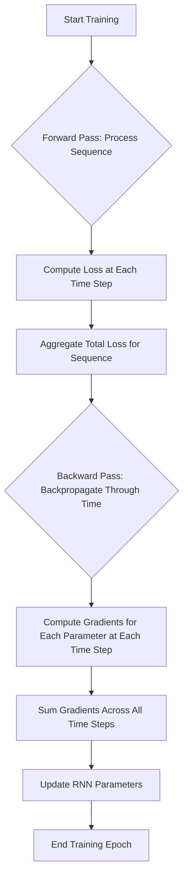
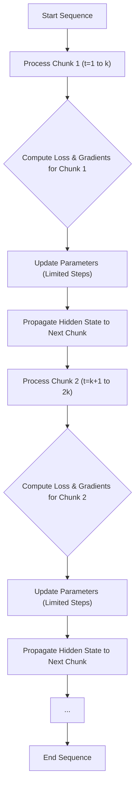
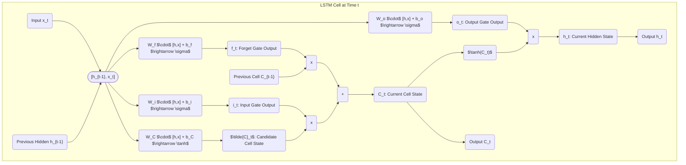
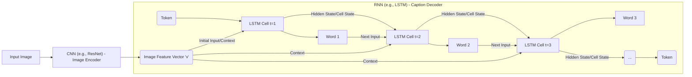

> [!summary] **Document Summary**
> This document provides a comprehensive overview of **Recurrent Neural Networks (RNNs)** and **Long Short-Term Memory (LSTM)** networks, detailing their fundamental concepts, architectural designs, diverse applications, and inherent challenges. It explores how these models process sequential data, addresses gradient flow issues, and highlights their utility in tasks like image captioning.

## Recurrent Neural Networks (RNNs) and LSTMs: Concepts and Applications

This document provides a comprehensive overview of [[Recurrent Neural Networks (RNNs)]] and [[Long Short-Term Memory (LSTM)]] networks. It delves into their fundamental concepts, architectural designs, diverse applications, and inherent challenges.

### 1. Introduction to Sequential Data

**Sequential data** is characterized by its dependence on previous data points or its inherent temporal order. Understanding this dependency is crucial for many real-world problems.

> [!example] **Examples of Sequential Data**
> -   **Videos**: A sequence of frames where each frame relates to the previous and subsequent ones.
> -   **Time series data**:
>     -   **Stock Exchange**: Stock prices over time, where future prices often depend on past trends.
>     -   **Biological Measurements**: E.g., Electrocardiograms (ECGs) or Electroencephalograms (EEGs), which show patterns over time.
>     -   **Climate Measurements**: Temperature, humidity, or rainfall readings recorded at regular intervals.
>     -   **Market Analysis**: Trends in sales or consumer behavior over periods.
> -   **Speech / Music**: Audio signals are inherently sequential, with sounds following each other in a specific order to form meaning or melody.
> -   **User behavior in websites**: A user's clickstream or navigation path forms a sequence of actions.

> [!example] **Applications of Sequential Data Processing**
> -   [[Machine Translation]]: Translating a sequence of words from one language to another.
> -   [[Image Captioning]]: Generating a descriptive sentence (a sequence of words) for an input image.
> -   [[Question Answering]]: Understanding a question (sequence of words) and generating an answer (sequence of words).
> -   **Video Generation**: Creating a sequence of frames to form a video.
> -   **Speech Synthesis**: Converting text (sequence of characters/words) into natural-sounding speech (sequence of audio signals).
> -   **Speech Recognition**: Transcribing spoken words (sequence of audio signals) into text (sequence of words).

### 2. From Vanilla Neural Networks to Recurrent Neural Networks

Traditional "**Vanilla**" [[Neural Networks]], such as [[Multi-Layer Perceptrons (MLPs)]], are designed to process fixed-size inputs and produce fixed-size outputs. They treat each input independently, lacking the inherent ability to handle sequences where the order of information is crucial or where inputs and outputs have variable lengths.

[[Recurrent Neural Networks (RNNs)]] address these limitations by introducing a mechanism to process sequences. They maintain an internal state, often referred to as a "**hidden state**," which acts as a memory, allowing the network to remember past information and influence the processing of current inputs. This makes them suitable for tasks involving sequential data.

### 3. Recurrent Neural Network (RNN) Concepts

#### 3.1 Core Idea
> [!definition] **Recurrence Formula**
> RNNs are designed to process a sequence of vectors, denoted as $x = (x_1, x_2, ..., x_T)$, by applying a recurrence formula at each time step $t$. This formula updates the network's internal state based on the current input and its previous state.
> $$h_t = f_W(h_{t-1}, x_t)$$
> -   $h_t$: Represents the new hidden state (or hidden vector) at the current time step $t$. This state encapsulates the network's memory up to $t$.
> -   $h_{t-1}$: Represents the old hidden state (or hidden vector) from the previous time step $t-1$. This is the information carried over from the past.
> -   $x_t$: Represents the input vector at the current time step $t$.
> -   $f_W$: Denotes a function (e.g., a simple neural network layer like $\tanh$ or $\text{ReLU}$ followed by matrix multiplications) parameterized by **weights** $W$. These weights are learned during training.

> [!example] **Example of $f_W$ (Vanilla RNN)**
> A common form for $f_W$ in a simple RNN is:
> $$h_t = \tanh(W_{hh}h_{t-1} + W_{xh}x_t + b_h)$$
> Here, $W_{hh}$ and $W_{xh}$ are weight matrices, and $b_h$ is a bias vector. The $\tanh$ activation function introduces non-linearity.

> [!example] **Numerical Calculation of a Simple RNN Step**
> Let's consider a highly simplified scenario where $h_{t-1}$ and $x_t$ are single values, and weights are scalars for illustration.
> Suppose:
> -   $h_{t-1} = 0.5$
> -   $x_t = 0.8$
> -   $W_{hh} = 0.6$
> -   $W_{xh} = 0.9$
> -   $b_h = 0.1$
> Then, the calculation for $h_t$ would be:
> $$h_t = \tanh(W_{hh}h_{t-1} + W_{xh}x_t + b_h)$$
> $$h_t = \tanh((0.6 \cdot 0.5) + (0.9 \cdot 0.8) + 0.1)$$
> $$h_t = \tanh(0.3 + 0.72 + 0.1)$$
> $$h_t = \tanh(1.12)$$
> $$h_t \approx 0.806$$
> This $h_t$ then becomes $h_{t-1}$ for the next time step.

A crucial characteristic of RNNs is that they use the **same function** ($f_W$) and **parameters** ($W$) at every time step. This shared parameterization allows the network to generalize across different positions in a sequence and significantly reduces the total number of parameters that need to be learned, making the model more efficient.

#### 3.2 RNN Computational Graph
> [!definition] **RNN Computational Graph**
> The RNN computational graph illustrates how the network processes a sequence by "unrolling" itself over time. This unrolling explicitly shows the evolution of the hidden state and the generation of outputs at each step.


-   **Weight Re-use**: As depicted, the **same function** $f_W$ (representing the RNN cell with its shared weight matrix $W$) is re-used at every time-step. This is fundamental to RNNs.
-   **Hidden State**: The network's memory is encapsulated in a single "**hidden**" vector $h$, which is passed from one time step to the next. $h_0$ typically represents an initial hidden state, often initialized to zeros or learned.

#### 3.3 RNN Architectures (Computational Graph Patterns)
> [!info] **RNN Architectures (Computational Graph Patterns)**
> RNNs can be configured in various ways to handle different types of input-output relationships, enabling them to solve a wide range of sequential tasks. These configurations define distinct computational graph patterns.

> [!definition] **Many-to-Many (Sequence to Sequence)**
> This architecture takes an input sequence and produces an output sequence of the same length, where each output $y_t$ corresponds to an input $x_t$.
> -   **Application**: [[Machine Translation]] (e.g., translating "I am cold" to "Je suis froid" word by word).
> -   **Characteristics**: All inputs $x_1, ..., x_T$ and outputs $y_1, ..., y_T$ are present and aligned in time.

> [!example] **Example: Many-to-Many**
> Predicting the next word in a sentence as it's being typed, or real-time speech recognition where a segment of audio maps to a word.

> [!definition] **Many-to-One**
> In this pattern, an entire input sequence is processed and encoded into a single vector, which then yields a single output.
> -   **Application**: [[Sentiment Analysis|Sentiment Classification]] (e.g., classifying a movie review as positive or negative).
> -   **Characteristics**: Inputs $x_1, ..., x_T$ are consumed, and a single output $y$ is produced, typically at the very end of the sequence processing.

> [!example] **Example: Many-to-One**
> Given a sequence of stock prices for a week, predict if the stock will go up or down on the following Monday.

> [!definition] **One-to-Many**
> This architecture takes a single input vector and generates an entire output sequence.
> -   **Application**: [[Image Captioning]] (generating a sentence from an image), Video Generation from a seed (generating a video from an initial frame or concept).
> -   **Characteristics**: A single input $x$ is provided, and it initializes the RNN, which then generates an output sequence $y_1, ..., y_T$ step by step.

> [!example] **Example: One-to-Many**
> Generating a musical melody (sequence of notes) given a starting genre or theme.

> [!definition] **Sequence to Sequence (Many-to-one + One-to-many)**
> This powerful architecture combines an "**encoder**" RNN (many-to-one) to process an input sequence into a fixed-size **context vector**, and a "**decoder**" RNN (one-to-many) to generate an output sequence from that context vector.
> -   **Application**: Widely used in [[Machine Translation]], where input and output sequence lengths often differ.
> -   **Encoder**: Reads the entire input sequence $x_1, ..., x_T$ and compresses it into a single hidden state $h_T$, which acts as the "context vector" or "**thought vector**."
> -   **Decoder**: Takes this context vector $h_T$ as its initial hidden state and generates the output sequence $y_1, ..., y_T$ word by word.

> [!example] **Example: Sequence to Sequence**
> Translating a sentence from English to French. The encoder reads the entire English sentence, and then the decoder generates the French sentence, which may have a different length.

### 4. Applications and Examples of RNNs

RNNs are versatile and can be applied to various tasks involving sequential data, both directly and indirectly.

#### 4.1 Processing Sequences
> [!info] **Processing Sequences**
> These are direct applications where the data inherently has a sequential structure.

> [!example] **Examples of Processing Sequences**
> -   [[Image Captioning]]: An input image is processed by a [[Convolutional Neural Networks (CNNs)|CNN]] to extract features, and then an RNN generates a sequence of words that describe the image.
> -   [[Sentiment Analysis|Sentiment Classification]]: A sequence of words (e.g., a review) is input to an RNN, which then outputs a single classification (e.g., positive, negative, neutral sentiment).
> -   **Video Classification**: A sequence of video frames is processed by an RNN to output a single label describing the action or content of the video (e.g., "running," "swimming").
> -   [[Machine Translation]]: A sequence of words in a source language is translated into a sequence of words in a target language using a sequence-to-sequence RNN model.
> -   **Video Captioning**: Similar to image captioning, but an RNN processes a sequence of video frames to generate a descriptive caption for the entire video.
> -   **Video Classification on Frame Level**: Instead of a single label for the whole video, an RNN outputs a sequence of labels, where each label corresponds to an object or action detected in a specific frame (e.g., object detection in each frame of a surveillance video).

#### 4.2 Sequential Processing of Non-Sequence Data
> [!info] **Sequential Processing of Non-Sequence Data**
> RNNs can also be used to process data that is not inherently sequential by imposing a sequential processing strategy. This is often done for tasks requiring attention or iterative refinement.

> [!example] **Examples of Sequential Processing of Non-Sequence Data**
> -   **Classify images by taking a series of "glimpses"**: Instead of processing an entire image at once, an RNN can be trained to iteratively focus on different parts of an image.
>     -   **Example**: The paper "Multiple Object Recognition with Visual Attention" (Ba, Mnih, and Kavukcuoglu, ICLR 2015) uses an RNN to simulate visual attention, where the network sequentially "glimpses" at different regions of an image to classify multiple objects within it.
> -   **Generate images one piece at a time**: RNNs can be used in generative models to construct images incrementally.
>     -   **Example**: "DRAW: A Recurrent Neural Network For Image Generation" (Gregor et al., ICML 2015) employs an RNN to generate images by iteratively adding "patches" or "strokes" to a canvas, building the image pixel by pixel or region by region.
> -   **Integrate with an oil-paint simulator**: This involves using an RNN to mimic artistic processes by generating a sequence of actions that build an image.
>     -   **Example**: "Synthesizing Programs for Images using Reinforced Adversarial Learning" (Ganin et al., ICML 2018) uses an RNN to output a sequence of drawing commands (e.g., brush strokes, colors) that are then rendered by a simulator to create an image, effectively learning to "paint."

#### 4.3 Character-level Language Model Example
> [!example] **Character-level Language Model Example**
> A character-level language model is a classic application of RNNs where the network predicts the next character in a sequence based on the characters it has seen so far.
>
> -   **Vocabulary**: Consider a very small vocabulary, for instance, `[h, e, l, o]`.
> -   **Example Training Sequence**: The word "hello".
> -   **Process**:
>     1.  The model takes the current character as input.
>     2.  It updates its internal hidden state based on this input and its previous hidden state.
>     3.  It then outputs a probability distribution (typically via a `softmax` layer) over all possible next characters in the vocabulary.
>     4.  During training, the model learns to make these predictions accurately.
>
> -   **At Test-Time (Generation)**: To generate new text, characters are sampled one at a time from the `softmax` output distribution. The sampled character is then fed back into the model as the next input, allowing the generation process to continue.
>
>     -   **Example Walkthrough for "hello"**:
>         | Step | Input Character | Predicted Output (via Softmax) | Sampled Character (Next Input) |
>         |:----:|:---------------:|:------------------------------:|:------------------------------:|
>         | 1    | `h`             | Probabilities for `[h, e, l, o]`  | `e`                            |
>         | 2    | `e`             | Probabilities for `[h, e, l, o]`  | `l`                            |
>         | 3    | `l`             | Probabilities for `[h, e, l, o]`  | `l`                            |
>         | 4    | `l`             | Probabilities for `[h, e, l, o]`  | `o`                            |
>         | 5    | `o`             | Probabilities for `[h, e, l, o]`  | (End token or next char)       |
>
>     **Conceptual Python Code for a Character-Level RNN Step**:
```python
import numpy as np

class SimpleCharRNN:
    def __init__(self, vocab_size, hidden_size):
        self.vocab_size = vocab_size
        self.hidden_size = hidden_size

        # Simplified weights and biases (actual RNNs have more complex structures)
        self.W_xh = np.random.randn(hidden_size, vocab_size) * 0.01 # Input to hidden
        self.W_hh = np.random.randn(hidden_size, hidden_size) * 0.01 # Hidden to hidden
        self.W_hy = np.random.randn(vocab_size, hidden_size) * 0.01 # Hidden to output
        self.b_h = np.zeros((hidden_size, 1)) # Hidden bias
        self.b_y = np.zeros((vocab_size, 1)) # Output bias

    def forward_step(self, x_one_hot, h_prev):
        # x_one_hot: one-hot encoded input character vector
        # h_prev: previous hidden state vector

        # Update hidden state
        h_curr = np.tanh(np.dot(self.W_xh, x_one_hot) + np.dot(self.W_hh, h_prev) + self.b_h)

        # Compute output (logits)
        y_logits = np.dot(self.W_hy, h_curr) + self.b_y

        # Apply softmax to get probabilities for next character
        exp_y = np.exp(y_logits - np.max(y_logits)) # for numerical stability
        y_probs = exp_y / np.sum(exp_y)

        return y_probs, h_curr

# Example Usage (conceptual)
# vocab_size = 4 (for h, e, l, o)
# hidden_size = 10
# rnn = SimpleCharRNN(vocab_size, hidden_size)

# h_prev = np.zeros((hidden_size, 1)) # Initial hidden state
# x_h = np.array([[1, 0, 0, 0]]).T # One-hot for 'h'
# y_probs, h_prev = rnn.forward_step(x_h, h_prev)
# # y_probs would be probabilities for next char (e.g., 'e')
# # Then sample from y_probs to get next_char_idx, and create x_next_char_one_hot
# # Repeat for 'e', 'l', 'l', 'o'
```

### 5. Training Recurrent Neural Networks

#### 5.1 Backpropagation Through Time (BPTT)
> [!definition] **Backpropagation Through Time (BPTT)**
> Training RNNs involves a specialized form of the backpropagation algorithm known as **Backpropagation Through Time (BPTT)**. This method is used to compute gradients for the weights of the RNN across all time steps.
>
> -   **Concept**: BPTT treats the unrolled RNN (where each time step is a distinct layer) as a very deep feedforward neural network. Gradients are then computed by applying the standard backpropagation algorithm to this unrolled network.
> -   **Process**:
>     1.  **Forward Pass**: The input sequence is fed through the RNN from the first time step to the last. At each step, the hidden state is updated, and an output (and corresponding loss) is computed. This continues until the entire sequence is processed, accumulating the total loss.
>     2.  **Backward Pass**: Once the total loss for the entire sequence is calculated, the gradients are computed by propagating the error backward through the unrolled network, from the last time step back to the first. This involves computing the gradient of the loss with respect to each weight parameter at each time step and summing them up to get the total gradient for each shared weight.



#### 5.2 Truncated Backpropagation Through Time
> [!definition] **Truncated Backpropagation Through Time (TBPTT)**
> -   **Challenge**: For very long sequences (e.g., thousands of time steps in a long document or audio file), performing full BPTT becomes computationally prohibitive and extremely memory-intensive. The unrolled graph would be too large.
> -   **Solution**: **Truncated Backpropagation Through Time (TBPTT)** is a practical approximation to full BPTT. It processes the sequence in smaller, fixed-size chunks rather than as a single, monolithic sequence.
> -   **Mechanism**:
>     1.  **Forward Pass**: The hidden states are propagated indefinitely through the entire sequence, just as in full BPTT, maintaining the network's long-term memory.
>     2.  **Backward Pass**: However, backpropagation is only performed for a fixed, smaller number of time steps (e.g., 10 or 20 steps) within each chunk. This limits the depth of gradient calculation, making it more manageable.
>     3.  **Gradient Flow**: While gradients are only calculated for a limited window, the hidden state itself continues to carry information from much further back, allowing some degree of long-term dependency learning, albeit imperfectly.



### 6. RNN Gradient Flow Issues

Vanilla RNNs, despite their ability to process sequences, often struggle with learning long-term dependencies. This difficulty arises from fundamental issues with how gradients flow during backpropagation.

-   **Problem**: When computing gradients for early hidden states (e.g., $h_0$) in a long sequence, the gradients must propagate through many time steps. This involves repeated multiplication by the weight matrix $W$ (specifically, $W_{hh}$) and the derivative of the `tanh` activation function at each step.
-   **Mathematical Implication**:
    -   > [!definition] **Vanishing Gradients**
        > If the largest singular value of the weight matrix $W$ (specifically $W_{hh}$) is consistently **less than 1**, and the derivative of the activation function (e.g., $\tanh$) is also less than 1 (which it usually is, especially for values far from 0), then repeated multiplication causes the gradients to shrink exponentially. They become infinitesimally small as they propagate backward through many time steps, effectively "**vanishing**."
        > -   **Effect**: Early layers or time steps receive negligible gradient updates, preventing the network from learning dependencies that span many time steps. The network "forgets" information from the distant past.
        > -   **Solution**:
        >     -   [[Gradient Clipping]] (for exploding gradients, but helps stabilize).
        >     -   **Change RNN architecture**: The most effective solution is to use architectures specifically designed to mitigate vanishing gradients, such as [[Long Short-Term Memory (LSTM)|Long Short-Term Memory (LSTMs)]] or [[Gated Recurrent Unit (GRU)|Gated Recurrent Units (GRUs)]].
        >     -   Using activation functions like `ReLU` can help in some contexts, as their derivative is 1 for positive inputs, but `ReLU` is less common in vanilla RNN hidden states due to its unbounded nature.
    -   > [!definition] **Exploding Gradients**
        > Conversely, if the largest singular value of $W_{hh}$ is consistently **greater than 1**, the gradients can grow exponentially large as they propagate backward.
        > -   **Effect**: This leads to extremely large updates to the network's weights, causing training instability, oscillations, or even **`NaN`** values (Not a Number) in the weights, effectively "**exploding**."
        > -   **Solution**: [[Gradient Clipping]] is the primary solution. This technique involves scaling the gradients down if their L2 norm exceeds a predefined threshold, preventing them from becoming too large.

**Summary Table of RNN Gradient Issues:**

| Issue                | Cause                                                                                                     | Effect                                                                                                                              | Solution(s)                                                                       |
| :------------------- | :-------------------------------------------------------------------------------------------------------- | :---------------------------------------------------------------------------------------------------------------------------------- | :-------------------------------------------------------------------------------- |
| **Vanishing Gradients** | Repeated multiplication by small weight values ($<1$) and derivatives of activation functions (e.g., `tanh`'s derivative is $<1$). | Gradients become extremely small, making it difficult for the network to learn long-term dependencies. Early layers/steps receive minimal updates. | **Change RNN Architecture (LSTMs, GRUs)**, careful weight initialization, `ReLU` (less common for hidden states). |
| **Exploding Gradients** | Repeated multiplication by large weight values ($>1$).                                                    | Gradients become excessively large, leading to unstable training, large weight updates, and potential `NaN` values.                 | **[[Gradient Clipping]]** (rescaling gradients if their norm exceeds a threshold).    |

These gradient flow issues were prominently highlighted by researchers like Bengio et al. (1994) and Pascanu et al. (2013), paving the way for more advanced recurrent architectures.

### 7. Long Short-Term Memory (LSTM) Networks

[[Long Short-Term Memory (LSTM)]] networks are a special type of [[Recurrent Neural Networks (RNNs)|Recurrent Neural Network]] explicitly designed to overcome the [[Vanishing Gradients|vanishing gradient problem]] and effectively capture long-term dependencies in sequential data. They achieve this by introducing a more sophisticated internal structure.

#### 7.1 Vanilla RNN vs. LSTM
> [!info] **Vanilla RNN vs. LSTM**
> -   **Vanilla RNN**: Has a simple recurrence relation, typically:
>     $$h_t = \tanh(W_{xh}x_t + W_{hh}h_{t-1} + b_h)$$
>     This structure makes it susceptible to vanishing gradients over long sequences.
> -   **LSTM**: Replaces the simple recurrence with a more complex internal mechanism that includes "**gates**" and a "**cell state**." These components allow LSTMs to selectively remember or forget information over extended periods.

#### 7.2 LSTM Architecture
> [!definition] **LSTM Architecture**
> At each time step $t$, an LSTM unit receives three inputs: the current input vector $x_t$, the hidden state from the previous time step $h_{t-1}$, and the cell state from the previous time step $c_{t-1}$. It then produces a new hidden state $h_t$ and a new cell state $c_t$.
>
> -   **Components**:
>     -   **Input Vector** ($x_t$): The data point for the current time step.
>     -   **Previous Hidden State** ($h_{t-1}$): The output of the LSTM unit from the previous time step, acting as a short-term memory.
>     -   **Previous Cell State** ($c_{t-1}$): The internal memory of the LSTM, running straight through the chain with only minor linear interactions. This is the "long-term memory."
>     -   **Gates**: LSTMs utilize three main types of gates, each controlled by a sigmoid activated neural network layer. These gates regulate the flow of information into and out of the cell state. Each gate has its own set of weight matrices ($W_f, W_i, W_C, W_o$) and bias vectors ($b_f, b_i, b_C, b_o$). The input to each gate is the concatenation of the previous hidden state and the current input, denoted as $[h_{t-1}, x_t]$.
>
>         -   > [!definition] **Forget Gate ($f_t$)**
>             > Determines what information from the previous cell state $C_{t-1}$ should be "forgotten" (i.e., discarded). A value close to 0 means "forget completely," while a value close to 1 means "keep completely."
>             > $$f_t = \sigma(W_f \cdot [h_{t-1}, x_t] + b_f)$$
>         -   > [!definition] **Input Gate ($i_t$)**
>             > Decides what new information from the current input $x_t$ and previous hidden state $h_{t-1}$ should be "stored" in the cell state.
>             > $$i_t = \sigma(W_i \cdot [h_{t-1}, x_t] + b_i)$$
>         -   > [!definition] **Candidate Cell State ($\tilde{C}_t$ or $g_t$)**
>             > This is a new candidate for the cell state, generated by a `tanh` layer. It represents potential new information to be added to the cell state.
>             > $$\tilde{C}_t = \tanh(W_C \cdot [h_{t-1}, x_t] + b_C)$$
>         -   > [!definition] **Output Gate ($o_t$)**
>             > Controls what parts of the updated cell state $C_t$ should be "outputted" to the hidden state $h_t$.
>             > $$o_t = \sigma(W_o \cdot [h_{t-1}, x_t] + b_o)$$
>
> -   > [!info] **Updating the Cell State**
>     > This is the core mechanism of LSTMs for maintaining long-term dependencies. The new cell state $C_t$ is computed by first forgetting irrelevant parts of $C_{t-1}$ (element-wise multiplication with $f_t$) and then adding the new, relevant information (element-wise multiplication of $i_t$ and $\tilde{C}_t$).
>     > $$C_t = f_t \cdot C_{t-1} + i_t \cdot \tilde{C}_t$$
>     > This additive interaction (rather than purely multiplicative) in the cell state update path is crucial for facilitating gradient flow and mitigating vanishing gradients.
>
> -   > [!info] **Updating the Hidden State**
>     > The new hidden state $h_t$ is derived from the new cell state $C_t$, but filtered by the output gate $o_t$. This means $h_t$ only exposes the relevant parts of the cell state.
>     > $$h_t = o_t \cdot \tanh(C_t)$$

**Detailed LSTM Cell Diagram:**




**Conceptual Python Code for an LSTM Cell Step**:
```python
import numpy as np

def sigmoid(x):
    return 1 / (1 + np.exp(-x))

def tanh(x):
    return np.tanh(x)

class LSTMCell:
    def __init__(self, input_size, hidden_size):
        self.input_size = input_size
        self.hidden_size = hidden_size

        # Weight matrices and biases for gates
        # W_f, W_i, W_o, W_c are for [h_prev, x_curr] combined
        # (hidden_size, hidden_size + input_size)
        self.W_f = np.random.randn(hidden_size, hidden_size + input_size) * 0.01
        self.b_f = np.zeros((hidden_size, 1))

        self.W_i = np.random.randn(hidden_size, hidden_size + input_size) * 0.01
        self.b_i = np.zeros((hidden_size, 1))

        self.W_c = np.random.randn(hidden_size, hidden_size + input_size) * 0.01
        self.b_c = np.zeros((hidden_size, 1))

        self.W_o = np.random.randn(hidden_size, hidden_size + input_size) * 0.01
        self.b_o = np.zeros((hidden_size, 1))

    def forward_step(self, x_curr, h_prev, c_prev):
        # Concatenate previous hidden state and current input
        concat_hx = np.vstack((h_prev, x_curr))

        # Forget Gate
        ft = sigmoid(np.dot(self.W_f, concat_hx) + self.b_f)

        # Input Gate
        it = sigmoid(np.dot(self.W_i, concat_hx) + self.b_i)

        # Candidate Cell State
        c_tilde_t = tanh(np.dot(self.W_c, concat_hx) + self.b_c)

        # Update Cell State
        c_curr = ft * c_prev + it * c_tilde_t

        # Output Gate
        ot = sigmoid(np.dot(self.W_o, concat_hx) + self.b_o)

        # Update Hidden State
        h_curr = ot * tanh(c_curr)

        return h_curr, c_curr

# Example usage (conceptual):
# input_dim = 50
# hidden_dim = 100
# lstm_cell = LSTMCell(input_dim, hidden_dim)

# x_t = np.random.randn(input_dim, 1)
# h_t_minus_1 = np.zeros((hidden_dim, 1))
# c_t_minus_1 = np.zeros((hidden_dim, 1))

# h_t, c_t = lstm_cell.forward_step(x_t, h_t_minus_1, c_t_minus_1)
```

#### 7.3 LSTM Gradient Flow
> [!info] **LSTM Gradient Flow**
> -   **Key Advantage**: The unique design of the LSTM's cell state update equation, $C_t = f_t \cdot C_{t-1} + i_t \cdot \tilde{C}_t$, provides a crucial mechanism for improved gradient flow.
> -   When backpropagating through the cell state, the gradient path from $C_t$ to $C_{t-1}$ primarily involves an element-wise multiplication by the forget gate $f_t$. Critically, this path **does not involve matrix multiplication by a large weight matrix** (like $W_{hh}$ in vanilla RNNs).
> -   This direct, additive path for the cell state allows gradients to flow more easily across many time steps, preserving their magnitude. As a result, LSTMs effectively mitigate the [[Vanishing Gradients|vanishing gradient problem]], enabling them to learn and remember information over much longer sequences compared to vanilla RNNs.

### 8. Other RNN Variants

Beyond vanilla RNNs and LSTMs, research has led to the development of several other recurrent architectures, each offering different trade-offs in complexity and performance.

> [!definition] **Gated Recurrent Unit (GRU)**
> Introduced by Cho et al. (2014), the **GRU** is a simpler and more computationally efficient variant of the LSTM. It combines the functionality of the forget and input gates into a single "**update gate**" and merges the cell state and hidden state into one "**hidden state**."
> -   **Update Gate ($z_t$)**: Controls how much of the previous hidden state should be carried over and how much new information should be added.
> -   **Reset Gate ($r_t$)**: Determines how much of the previous hidden state to forget.
> -   **Candidate Hidden State ($\tilde{h}_t$)**: A new candidate for the hidden state, similar to $\tilde{C}_t$ in LSTM, but influenced by the reset gate.
> -   **Hidden State Update**: $h_t = (1 - z_t) \cdot h_{t-1} + z_t \cdot \tilde{h}_t$.

**Comparison: LSTM vs. GRU**

| Feature              | LSTM                                                                        | GRU                                                                        |
| :------------------- | :-------------------------------------------------------------------------- | :------------------------------------------------------------------------- |
| **Complexity**       | More complex, three gates (forget, input, output) and a separate cell state. | Simpler, two gates (update, reset) and combines cell/hidden state into one. |
| **Number of Gates**  | 3                                                                           | 2                                                                          |
| **Memory Component** | Explicit Cell State ($C_t$)                                                 | No explicit cell state; hidden state ($h_t$) serves both roles.           |
| **Parameters**       | More parameters due to separate gates and states.                           | Fewer parameters, leading to faster training and less memory usage.        |
| **Performance**      | Often performs slightly better on very complex or long sequences.           | Generally performs comparably to LSTMs on many tasks, especially with less data. |
| **Gradient Flow**    | Excellent, due to additive cell state path.                                 | Very good, also addresses vanishing gradients effectively.                 |

-   Research on RNN variants continues to explore different gating mechanisms and architectures. Notable works include "LSTM: A Search Space Odyssey" (Greff et al., 2015), which systematically evaluated various LSTM configurations, and "An Empirical Exploration of Recurrent Network Architectures" (Jozefowicz et al., 2015), which explored many different RNN cell types.
-   More recent developments, such as "RWKV: Reinventing RNNs for the [[Transformers|Transformer]] Era," aim to combine the parallelizability advantages of Transformers with the sequential processing strengths of RNNs, indicating ongoing innovation in the field.

### 9. Interpretable Cells in RNNs

A fascinating aspect of RNNs, particularly LSTMs, is their ability to develop "**Interpretable Cells**" or hidden units that track specific, meaningful patterns in sequential data. Research by Karpathy, Johnson, and Fei-Fei (ICLR Workshop 2016) demonstrated this phenomenon, especially in character-level language models.

-   **Concept**: During training, individual hidden units (neurons) within an RNN can specialize to detect and maintain information about particular syntactic or semantic structures in the input sequence. Their activation patterns reveal what specific features of the input they are "paying attention to" or "remembering."
-   **Examples of interpretable cells identified in character-level RNNs**:
    -   `quote detection cell`: This cell activates when the RNN encounters an opening quote and remains active until a closing quote is processed, effectively tracking whether the network is currently "inside a quoted string."
    -   `line length tracking cell`: This cell's activation level might correlate with the current line length, increasing with each character and resetting at a newline character.
    -   `if statement cell`: This cell activates when the network enters an `if` block in code and remains active throughout the block, potentially helping the network understand code structure.
    -   `quote/comment cell`: A cell that can differentiate between characters inside a string literal (quotes) and characters within a comment block, crucial for syntax awareness.
    -   `code depth cell`: In programming code, this cell's activation might reflect the current indentation level or nesting depth of code blocks, increasing with an opening brace and decreasing with a closing brace.

This interpretability provides valuable insights into how RNNs process and understand sequential information, moving beyond just black-box predictions.

### 10. RNN Tradeoffs

Like any machine learning model, RNNs come with a set of advantages and disadvantages that influence their suitability for different tasks.

#### 10.1 RNN Advantages
> [!info] **RNN Advantages**
> -   **Can process any input length (no fixed context length)**: Unlike feedforward networks that require fixed-size inputs, RNNs can handle sequences of arbitrary length, making them ideal for tasks like natural language processing or speech recognition where input sizes vary.
> -   **Computation for step $t$ can (in theory) use information from many steps back**: The recurrent nature allows the hidden state to carry information from previous time steps, theoretically enabling the network to learn long-range dependencies.
> -   **Model size does not increase for longer input sequences**: The same set of weights is reused across all time steps, meaning the number of parameters remains constant regardless of the sequence length, making the model memory-efficient.
> -   **Same weights applied at every timestep, providing symmetry in input processing**: This weight sharing ensures that the network applies the same learned features and transformations across different parts of the sequence, promoting generalization.

#### 10.2 RNN Disadvantages
> [!info] **RNN Disadvantages**
> -   **Recurrent computation is inherently sequential, making it slow and difficult to parallelize effectively**: Each time step's computation depends on the previous hidden state. This sequential dependency prevents parallel processing of different time steps, leading to slower training and inference compared to models like [[Transformers]] that can process sequences in parallel.
> -   **In practice (especially for Vanilla RNNs), it is difficult to access information from many steps back due to [[Vanishing Gradients|vanishing/exploding gradients]]**: As discussed in Section 6, vanilla RNNs struggle with long-term memory due to gradient issues. While LSTMs and GRUs alleviate this, even they have practical limits to how far back they can effectively remember.

### 11. Detailed Application: Image Captioning with CNN-RNN

**Image Captioning** is a prominent application that showcases the power of combining [[Convolutional Neural Networks (CNNs)|Convolutional Neural Networks (CNNs)]] for spatial feature extraction with [[Recurrent Neural Networks (RNNs)|Recurrent Neural Networks (RNNs)]] for sequential text generation. The goal is to generate a natural language description (caption) for a given image.

> [!info] **Key Research in Image Captioning**
> This field has seen significant advancements, driven by several foundational papers:
> -   "Explain Images with Multimodal Recurrent Neural Networks" by Mao et al.
> -   "Deep Visual-Semantic Alignments for Generating Image Descriptions" by Karpathy and Fei-Fei
> -   "Show and Tell: A Neural Image Caption Generator" by Vinyals et al.
> -   "Long-term Recurrent Convolutional Networks for Visual Recognition and Description" by Donahue et al.
> -   "Learning a Recurrent Visual Representation for Image Caption Generation" by Chen and Zitnick

#### 11.1 Architecture
> [!info] **Image Captioning Architecture**
> The typical architecture for image captioning involves two main components:
> -   **`CNN`** (e.g., VGG, ResNet, Inception): This network acts as an **encoder**. It processes the input image and transforms it into a fixed-dimension feature vector `v` that encapsulates the image's semantic content.
> -   **`RNN`** (often an LSTM or GRU): This network acts as a **decoder**. It takes the image feature vector `v` as an initial input or context and generates a sequence of words, forming the caption.



#### 11.2 Process
> [!info] **Image Captioning Process**
> 1.  **Image Encoding**: The input image is first passed through a pre-trained CNN. The output of one of the CNN's final layers (before the classification head) is taken as a fixed-dimension vector `v`. This vector `v` serves as a rich, compact representation of the image's content.
> 2.  **Start Token**: The RNN (decoder) is initialized. It typically receives a special `<START>` token (e.g., $x_0$) as its first input, signaling the beginning of caption generation. The image feature vector `v` is also incorporated into the RNN's initial state or as an input at the first time step.
> 3.  **Hidden State Update**: The recurrence formula for the RNN's hidden state $h_t$ is modified to integrate the image feature vector `v`. A common way to do this for a vanilla RNN is:
>     $$h_t = \tanh(W_{xh} \cdot x_t + W_{hh} \cdot h_{t-1} + W_{ih} \cdot v + b_h)$$
>     -   Here, $W_{ih}$ is a new weight matrix specifically for integrating the image features `v` into the hidden state computation. For LSTMs, `v` might be used to initialize the hidden and cell states, or be concatenated with $x_t$ at each step.
> 4.  **Word Generation**: At each subsequent time step $t$:
>     -   The RNN computes an output probability distribution over its entire vocabulary, based on its current hidden state.
>     -   A word is then sampled from this distribution (e.g., using greedy search or beam search).
>     -   This sampled word (e.g., "straw") then becomes the input $x_{t+1}$ for the next time step.
> 5.  **End Token**: This iterative process continues, generating one word at a time, until the RNN samples a special `<END>` token, indicating that the caption is complete.

**Conceptual Python Code for Image Captioning Loop**:
```python
import numpy as np

# Assume these are pre-trained components
class CNNEncoder:
    def encode(self, image):
        # Placeholder: In reality, this would run a a [[Convolutional Neural Networks (CNNs)|CNN]]
        print("Encoding image with CNN...")
        return np.random.rand(512) # Returns a fixed-size feature vector

class RNNCaptionDecoder:
    def __init__(self, vocab, hidden_size, image_feature_size):
        self.vocab = vocab
        self.vocab_size = len(vocab)
        self.hidden_size = hidden_size
        self.image_feature_size = image_feature_size

        # Simplified weights and biases (real RNN/LSTM has more)
        # For simplicity, assume image feature is concatenated with input
        self.W_ih = np.random.randn(hidden_size, image_feature_size) * 0.01
        self.W_xh = np.random.randn(hidden_size, self.vocab_size) * 0.01 # Input word to hidden
        self.W_hh = np.random.randn(hidden_size, hidden_size) * 0.01
        self.b_h = np.zeros((hidden_size, 1))
        self.W_hy = np.random.randn(self.vocab_size, hidden_size) * 0.01 # Hidden to output word
        self.b_y = np.zeros((self.vocab_size, 1))

        self.start_token_idx = vocab.index("<START>")
        self.end_token_idx = vocab.index("<END>")

    def _softmax(self, x):
        e_x = np.exp(x - np.max(x))
        return e_x / e_x.sum(axis=0)

    def generate_caption(self, image_feature_vector, max_len=20):
        caption_indices = []
        h_t = np.zeros((self.hidden_size, 1)) # Initial hidden state

        # Integrate image feature into initial hidden state or first step
        # Here, we'll just add it to the first hidden state calculation
        # A more common approach is to use it as an initial state for LSTM/GRU

        current_word_idx = self.start_token_idx
        for _ in range(max_len):
            # One-hot encode current word
            x_t = np.zeros((self.vocab_size, 1))
            x_t[current_word_idx] = 1

            # Simplified RNN step with image feature
            # In a real model, image_feature_vector might be a constant input or initial state
            # For demonstration, let's treat it as a constant influence
            h_t = np.tanh(np.dot(self.W_xh, x_t) + np.dot(self.W_hh, h_t) + np.dot(self.W_ih, image_feature_vector.reshape(-1, 1)) + self.b_h)

            # Predict next word
            y_logits = np.dot(self.W_hy, h_t) + self.b_y
            y_probs = self._softmax(y_logits)

            current_word_idx = np.argmax(y_probs) # Greedy sampling
            caption_indices.append(current_word_idx)

            if current_word_idx == self.end_token_idx:
                break
        
        # Convert indices back to words
        idx_to_word = {i: word for word, i in self.vocab.items()}
        caption = [idx_to_word[idx] for idx in caption_indices]
        return " ".join(caption)

# Example usage:
# vocab_list = ["<PAD>", "<START>", "<END>", "a", "cat", "dog", "is", "sitting", "on", "the", "floor", "tree"]
# word_to_idx = {word: i for i, word in enumerate(vocab_list)}
# idx_to_word = {i: word for i, word in enumerate(vocab_list)}

# cnn = CNNEncoder()
# rnn_decoder = RNNCaptionDecoder(word_to_idx, hidden_size=256, image_feature_size=512)

# image = "some_image.jpg" # Placeholder
# image_features = cnn.encode(image)
# caption = rnn_decoder.generate_caption(image_features)
# print(f"Generated caption: {caption}")
```

#### 11.3 Example Results
> [!example] **Image Captioning Example Results**
> -   **Success Cases**: When trained effectively, these models can generate remarkably accurate and natural-sounding descriptions:
>     -   "A cat sitting on a suitcase on the floor"
>     -   "A cat is sitting on a tree branch"
>     -   "Two people walking on the beach with surfboards"
>     -   "A tennis player in action on the court"
> -   **Failure Cases**: Despite their successes, image captioning models can still make errors, often due to misinterpreting subtle details, context, or relationships between objects:
>     -   The model might misinterpret objects (e.g., mistaking a fur coat for a cat).
>     -   It might misrepresent actions or relationships (e.g., describing a handstand as "a person holding a mouse" if the hand is close to the ground and small objects are present). These failures highlight the ongoing challenges in achieving human-level understanding and reasoning in AI.

## References
- [[Neural Networks]]
- [[Convolutional Neural Networks (CNNs)]]
- [[Machine Learning Algorithms]]
- [[Deep Learning Concepts]]
- [[Transformers]]
- [[Gradient Descent]]