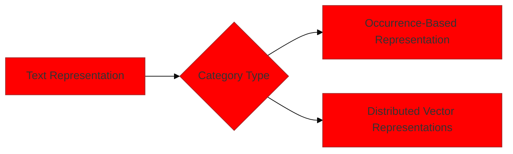
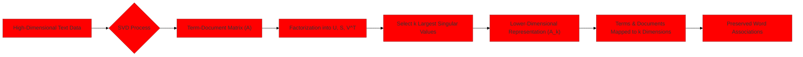
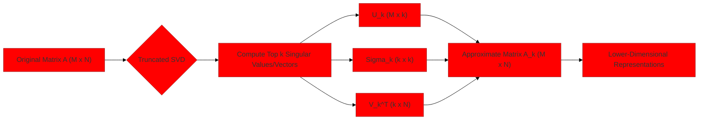
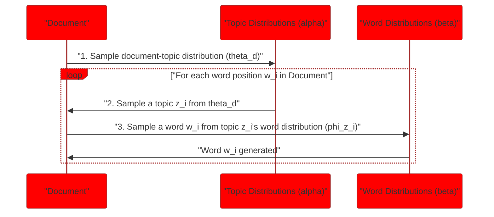
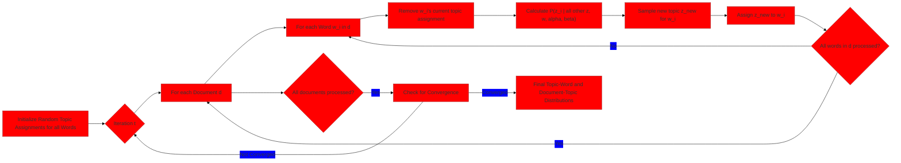
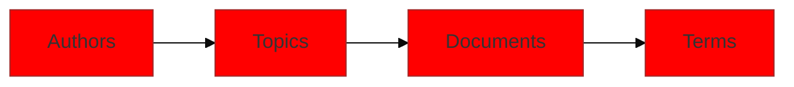

> [!summary] **Document Summary**
> This document details the transformation of unstructured text into numerical formats, exploring both occurrence-based and distributed vector representations. It covers [[Singular Value Decomposition (SVD)]] for dimensionality reduction and introduces key [[Topic Models]] like [[Latent Dirichlet Allocation (LDA)]] and the [[Author-Topic Model]], providing mathematical foundations and practical examples for each.

## Text Representation, SVD, and Topic Models

This document provides a comprehensive overview of how textual data is represented, explores [[Singular Value Decomposition (SVD)]] as a method for dimensionality reduction, and delves into prominent [[Topic Models]] such as [[Latent Dirichlet Allocation (LDA)]] and the [[Author-Topic Model]]. The primary goal is to clarify these complex concepts with logical explanations, concrete examples, and visual aids.

### Text Representation

> [!definition] **Text Representation**
> The process of transforming unstructured textual data into a structured numerical format that can be processed by machine learning algorithms.

Textual data representation generally falls into two main categories: occurrence-based and distributed vector representations.



| Category                        | Description                                                               | Key Characteristics                                 | Example Techniques                                  |
| :------------------------------ | :------------------------------------------------------------------------ | :-------------------------------------------------- | :-------------------------------------------------- |
| **Occurrence-Based**            | Features are derived directly from the frequency of textual units.        | High dimensionality, sparsity, direct count-based.  | [[Bag-of-Words]], [[TF-IDF]], [[N-grams]].                |
| **Distributed Vector**          | High-dimensional representations learned through neural networks.         | Lower dimensionality, dense, semantic relationships. | [[Word Embeddings|Word2Vec]], [[Word Embeddings|GloVe]], [[Word Embeddings|FastText]], [[BERT]].         |

#### Occurrence-Based Representation
In this approach, features are computed directly from the occurrence frequencies of textual units. These units can be words, [[N-grams|n-grams]] (sequences of n words), or phrases within a document.

> [!example] **Bag-of-Words Example**
> Consider a simple "[[Bag-of-Words]]" model. For the sentence "The cat sat on the mat", the occurrence-based representation would count each word's frequency:
> *   "The": 2
> *   "cat": 1
> *   "sat": 1
> *   "on": 1
> *   "mat": 1

#### Distributed Vector Representations of Text
These are high-dimensional text representations that are typically derived through the training of neural networks. Unlike occurrence-based methods, distributed vectors capture semantic relationships between words and documents.

> [!info] **Benefit of Distributed Vectors**
> These representations allow for the clustering of text into homogeneous groups, as words or documents with similar meanings will have similar vector representations in the high-dimensional space.

> [!example] **Word Embeddings Example**
> Techniques like [[Word Embeddings|Word2Vec]] or [[Word Embeddings|GloVe]] learn vector representations (embeddings) for words. For instance, the word "king" might have a vector that is numerically close to the vector for "queen" and "man" but far from "apple," reflecting their semantic relationships.

### Challenges in Text Representation and Feature Engineering

Working with textual data introduces specific challenges that must be addressed for effective analysis and modeling.

#### Data Sparsity
> [!definition] **Data Sparsity**
> A condition where a large proportion of the data matrix contains zero values, typically because most features (words) do not appear in most instances (documents).

*   **Observation**: The total number of unique words in a dictionary (vocabulary size) often significantly exceeds the number of documents in a corpus.
*   **Observation**: Individual documents typically contain only a limited subset of the entire dictionary's words. This leads to many zero entries in a [[Term-Document Matrix|term-document matrix]].
*   **Goal**: To counteract this inherent [[Data Sparsity|data sparsity]], various techniques are employed, such as dimensionality reduction (e.g., [[Singular Value Decomposition (SVD)]]) or specialized weighting schemes (e.g., [[TF-IDF|`tf-idf`]]).

> [!example] **Sparse Matrix Example**
> Consider a small corpus with a dictionary of 1000 unique words but only 5 documents. Each document might only contain 20-50 unique words. When creating a [[Term-Document Matrix|term-document matrix]] (where rows are terms and columns are documents), most cells will be zero.
>
> > [!math] Mathematical Expression
> > $$\begin{pmatrix}
> >     \\text{word}_1 & 0 & 1 & 0 & 0 \\
> >     \\text{word}_2 & 0 & 0 & 0 & 1 \\
> >     \\text{word}_3 & 2 & 0 & 0 & 0 \\
> >     \\vdots & \\vdots & \\vdots & \\vdots & \\vdots \\
> >     \\text{word}_{1000} & 0 & 0 & 0 & 0
> > \end{pmatrix}$$
> This matrix is highly sparse, with most entries being zero.

#### Term Frequency-Inverse Document Frequency (`tf-idf`)
> [!definition] **`tf-idf`**
> A numerical statistic that reflects how important a word is to a document in a corpus. It is a product of two terms: **term frequency (TF)** and **inverse document frequency (IDF)**.

*   > [!definition] **Term frequency (TF)**
    > The number of times a word appears in a document. It positively impacts the relative importance of a word within that specific document.
    > > [!math] Mathematical Expression
    > > $$TF(t, d) = \\text{number of times term } t \\text{ appears in document } d$$
*   > [!definition] **Inverse Document Frequency (IDF)**
    > A measure of how much information the word provides; it increases with the rarity of the word across all documents. It negatively impacts the relative importance if a word occurs in many documents.
    > > [!math] Mathematical Expression
    > > $$IDF(t, D) = \\log\\left(\\frac{N}{DF(t)}\\right)$$
    > Where $N$ is the total number of documents in the corpus, and $DF(t)$ is the number of documents containing term $t$.
*   > [!definition] **`tf-idf` Calculation**
    > > [!math] Mathematical Expression
    > > $$tf\\text{-}idf(t, d, D) = TF(t, d) \\times IDF(t, D)$$

> [!example] **`tf-idf` Calculation Example**
> Let's say we have a corpus of 100 documents ($N=100$).
> *   Word "cat" appears 5 times in Document A ($TF(\text{"cat"}, \text{Doc A})=5$).
> *   Word "cat" appears in 10 documents in the entire corpus ($DF(\text{"cat"})=10$).
> *   $IDF(\text{"cat"}) = \log(100/10) = \log(10) \approx 2.3$.
> *   $tf\text{-}idf(\text{"cat"}, \text{Doc A}) = 5 \times 2.3 = 11.5$.
>
> Now, consider a common word like "the":
> *   Word "the" appears 20 times in Document A ($TF(\text{"the"}, \text{Doc A})=20$).
> *   Word "the" appears in 90 documents in the entire corpus ($DF(\text{"the"})=90$).
> *   $IDF(\text{"the"}) = \log(100/90) \approx \log(1.11) \approx 0.1$.
> *   $tf\text{-}idf(\text{"the"}, \text{Doc A}) = 20 \times 0.1 = 2.0$.
>
> Even though "the" appears more often in Document A, its `tf-idf` score is much lower than "cat" because it is a common word across the corpus.

*   **Issue**: Raw `tf-idf` values can exhibit heavy-tailed or skewed distributions. This means a few terms might have extremely high `tf-idf` values, while most terms have very low values, which can disproportionately influence models.

#### `tf-idf` Weighting Normalization
> [!definition] **`tf-idf` Weighting Normalization**
> The process of scaling skewed weight distributions, bounding frequency variation, and introducing a unique free parameter `K` for fine-tuning. Normalization helps prevent long documents from having an unfair advantage due to higher raw term counts.

**Parameters often involved in normalization (e.g., in [[BM25]], a common `tf-idf` variant)**:
*   `Avgdl`: The average document length (in words) over all documents in the corpus. This parameter helps to normalize `tf` based on document length.
*   `k1`: A free parameter that controls term frequency saturation. A higher `k1` value means that term frequency continues to increase the score linearly for longer, while a lower `k1` causes the score to saturate more quickly.
*   `b`: A free parameter that controls the document length penalty score. A value of `b=1` means full document length normalization, while `b=0` means no length normalization. Values between 0 and 1 allow for partial normalization.

> [!example] **BM25 Normalization Formula**
> A common normalization formula, often used in [[BM25]], modifies the TF component:
> > [!math] Mathematical Expression
> > $$TF_{\\text{normalized}}(t, d) = \\frac{TF(t,d) \\times (k_1 + 1)}{TF(t,d) + k_1 \\times (1 - b + b \\times \\frac{|d|}{Avgdl})}$$
> Where $|d|$ is the length of document $d$.

```python
import math

def calculate_tf(term, document):
    """Calculates term frequency (TF)."""
    term_count = document.count(term)
    return term_count

def calculate_idf(term, corpus):
    """Calculates inverse document frequency (IDF)."""
    N = len(corpus)
    df_t = sum(1 for doc in corpus if term in doc)
    if df_t == 0:
        return 0  # Avoid division by zero
    return math.log(N / df_t)

def calculate_tf_idf(term, document, corpus):
    """Calculates TF-IDF score."""
    tf = calculate_tf(term, document)
    idf = calculate_idf(term, corpus)
    return tf * idf

# Example usage:
corpus = [
    ["the", "cat", "sat", "on", "the", "mat"],
    ["the", "dog", "ran", "fast"],
    ["a", "cat", "chased", "a", "mouse"]
]
document_A = corpus[0]
term_cat = "cat"
term_the = "the"

# Calculate TF-IDF for "cat" in document A
tf_idf_cat = calculate_tf_idf(term_cat, document_A, corpus)
print(f"TF-IDF for '{term_cat}' in document A: {tf_idf_cat:.2f}")

# Calculate TF-IDF for "the" in document A
tf_idf_the = calculate_tf_idf(term_the, document_A, corpus)
print(f"TF-IDF for '{term_the}' in document A: {tf_idf_the:.2f}")
```

### Singular Value Decomposition (SVD)

> [!definition] **Singular Value Decomposition (SVD)**
> A powerful matrix factorization technique used for dimensionality reduction and noise reduction in data, particularly effective for creating lower-dimensional representations of text.

#### Core Concept
[[Singular Value Decomposition (SVD)]] is fundamentally a method for transforming high-dimensional data into a lower-dimensional space while preserving the most important information.

*   **Definition**: It provides a lower-dimensional representation of occurrence-based text data, such as a [[Term-Document Matrix|term-document matrix]].
*   **Purpose**: SVD maps both terms (words) and documents to a common lower-dimensional space, often referred to as a "[[Latent Semantic Space|latent semantic space]]."
*   **Benefit**: This mapping preserves pairwise word associations derived from the original occurrence-based models, meaning words that frequently appear together will remain close in the reduced space.
*   **Underlying principle**: The "concepts" or "topics" and their associated weights are derived directly from the SVD decomposition.
*   **Matrix factorization**: SVD achieves this by factorizing a matrix (e.g., a [[Term-Document Matrix|term-document matrix]]) into a product of three simpler matrices.



#### Mathematical Formulation
A matrix $A$ (for example, a [[Term-Document Matrix|term-document matrix]] where rows are terms and columns are documents) can be decomposed into three distinct matrices using [[Singular Value Decomposition (SVD)|SVD]]:

> [!math] Mathematical Expression
> $$A = U S V^T$$

*   Where:
    *   $A$ is an $M \times N$ matrix (e.g., $M$ terms, $N$ documents).
    *   $U$ is an $M \times M$ **orthogonal matrix**, whose columns are the left singular vectors. These vectors represent the terms in the latent space.
    *   $S$ is an $M \times N$ **diagonal matrix** containing the **singular values**. These values indicate the strength or importance of each latent concept (topic).
    *   $V^T$ is an $N \times N$ **orthogonal matrix**, whose rows are the right singular vectors. These vectors represent the documents in the latent space.

> [!definition] **Orthogonal Matrix**
> A square matrix whose columns and rows are orthogonal unit vectors (orthonormal vectors). For an orthogonal matrix $Q$, $Q^T Q = Q Q^T = I$, where $I$ is the identity matrix. This implies that $Q^{-1} = Q^T$.

> [!definition] **Diagonal Matrix**
> A square matrix in which the entries outside the main diagonal are all zero.

> [!definition] **Singular values**
> These are the diagonal entries of the matrix $S$, typically denoted as $s_i$ or $\sigma_i$. They are ordered in decreasing magnitude: $\sigma_1 \ge \sigma_2 \ge \dots \ge \sigma_r \ge 0$, where $r$ is the rank of matrix $A$.
> > [!math] Mathematical Expression
> > $$S = \\text{diag}(\\sigma_1, \\sigma_2, \\dots, \\sigma_r)$$
> The magnitude of each singular value $\sigma_i$ reflects the importance of the corresponding $i$-th latent concept or topic. A larger singular value indicates a more relevant concept.

> [!example] **SVD Decomposition Example**
> Suppose we have a small [[Term-Document Matrix|term-document matrix]] $A$:
> > [!math] Mathematical Expression
> > $$A = \begin{pmatrix} 1 & 1 & 0 \\ 1 & 0 & 1 \\ 0 & 1 & 1 \end{pmatrix}$$
> After [[Singular Value Decomposition (SVD)|SVD]], we might get:
> > [!math] Mathematical Expression
> > $$U = \begin{pmatrix} -0.707 & -0.408 & 0.577 \\ -0.707 & 0.408 & -0.577 \\ 0 & 0.816 & 0.577 \end{pmatrix}, \quad S = \begin{pmatrix} 1.732 & 0 & 0 \\ 0 & 1.225 & 0 \\ 0 & 0 & 0 \end{pmatrix}, \quad V^T = \begin{pmatrix} -0.577 & -0.577 & -0.577 \\ -0.707 & 0.707 & 0 \\ 0.408 & 0.408 & -0.816 \end{pmatrix}$$
> Here, the singular values are $\sigma_1 \approx 1.732$, $\sigma_2 \approx 1.225$, and $\sigma_3 = 0$. This indicates that the first concept is the most important, followed by the second.

#### Rank-k Approximation
**Goal**: To find the best possible rank-$k$ matrix $A_k$ that approximates the original matrix $A$. This is achieved by minimizing the [[Frobenius Norm|Frobenius norm]] of the difference between $A$ and $X$, where $X$ is a rank-$k$ matrix.
> [!math] Mathematical Expression
> $$\\min_{X: rank(X)=k} ||A - X||_F$$
The [[Frobenius Norm|Frobenius norm]] $||M||_F = \sqrt{\sum_{i=1}^M \sum_{j=1}^N |M_{ij}|^2}$ is essentially the "length" of the matrix, similar to how Euclidean distance measures the length of a vector.

**Solution**: The optimal rank-$k$ approximation $A_k$ is obtained by retaining only the $k$ largest singular values in $S$ and setting all other singular values to zero. The corresponding columns of $U$ and rows of $V^T$ are also retained.

**Approximation error**: The error introduced by this approximation is directly related to the singular values that were discarded. Specifically, the [[Frobenius Norm|Frobenius norm]] of the approximation error is given by $||A - A_k||_F = \sqrt{\sum_{i=k+1}^r \sigma_i^2}$. If we only consider the $(k+1)$-th singular value, it represents the "energy" or "importance" of the first discarded component. Singular values beyond $\sigma_k$ are effectively zeroed, meaning their contribution to the original matrix is considered negligible for the approximation.

> [!example] **Rank-k Approximation Error**
> If $S = \text{diag}(10, 5, 1, 0.5)$ and we choose $k=2$, then $S_k = \text{diag}(10, 5, 0, 0)$. The approximation error would be related to $\sigma_3=1$ and $\sigma_4=0.5$.

#### Reduced SVD (Truncated SVD)
> [!definition] **Reduced SVD (Truncated SVD)**
> A practical variant of [[Singular Value Decomposition (SVD)|SVD]] where only the top $k$ singular values and their corresponding singular vectors are computed and retained, significantly reducing computational cost and storage, especially for sparse matrices.

*   **Typical scenario**: The original matrix (e.g., a [[Term-Document Matrix|term-document matrix]]) is often very sparse and high-dimensional.
*   **Approach**: Instead of computing the full [[Singular Value Decomposition (SVD)|SVD]], we consider only a smaller number of $k$ singular vectors, where $k$ is much less than $M$ (number of terms) or $N$ (number of documents).
*   **Components of reduced SVD**:
    > [!math] Mathematical Expression
    > $$A \\approx U_k \\Sigma_k V_k^T$$
    *   Where $U_k$ is an $M \times k$ matrix containing the first $k$ left singular vectors.
    *   $\Sigma_k$ is a $k \times k$ **diagonal matrix** containing the $k$ largest singular values.
    *   $V_k^T$ is a $k \times N$ matrix containing the first $k$ right singular vectors (transposed).



*   **Interpretation**:
    *   The columns of $U_k$ (multiplied by $\Sigma_k$) can be interpreted as **word vectors** in the $k$-dimensional latent space, representing how words relate to the $k$ topics.
    *   $\Sigma_k$ contains the relevance or "strength" of the $k$ selected topics.
    *   The rows of $V_k^T$ (multiplied by $\Sigma_k$) can be interpreted as **document vectors** in the $k$-dimensional latent space, representing how documents relate to the $k$ topics.
*   **Reconstruction**: To obtain a reduced document vector, one can multiply the relevant eigenvector (from $V^T$) by the **diagonal matrix** $\Sigma_k$. Similarly, for a reduced word vector, multiply the relevant eigenvector (from $U$) by $\Sigma_k$. More commonly, $U_k \Sigma_k$ gives term-topic matrix and $\Sigma_k V_k^T$ gives topic-document matrix.

> [!example] **Truncated SVD in Python (Conceptual)**
> ```python
> from sklearn.decomposition import TruncatedSVD
> import numpy as np
>
> # Assume 'X' is your sparse term-document matrix
> # X = scipy.sparse.csr_matrix(...)
>
> # For demonstration, let's create a dense matrix
> X = np.array([
>     [1, 1, 0, 0, 0],
>     [1, 0, 1, 0, 0],
>     [0, 1, 1, 0, 0],
>     [0, 0, 0, 1, 1],
>     [0, 0, 0, 1, 0],
>     [0, 0, 0, 0, 1]
> ]) # Example: 6 terms, 5 documents
>
> # Choose k, the number of components (topics)
> k = 2
>
> # Initialize TruncatedSVD
> svd_model = TruncatedSVD(n_components=k)
>
> # Fit and transform the data
> # This will return the document vectors in the k-dimensional space
> document_vectors_reduced = svd_model.fit_transform(X)
>
> # The components_ attribute gives the word vectors (transposed)
> # Each row represents a topic, and columns are words
> # To get word vectors directly: svd_model.components_.T
> word_vectors_reduced = svd_model.components_.T
>
> print("Original Matrix Shape:", X.shape)
> print("Reduced Document Vectors Shape (N_documents x k):", document_vectors_reduced.shape)
> print("Reduced Word Vectors Shape (N_terms x k):", word_vectors_reduced.shape)
> print("\nFirst few rows of Reduced Document Vectors:\n", document_vectors_reduced[:2])
> print("\nFirst few rows of Reduced Word Vectors:\n", word_vectors_reduced[:2])
>
> # The singular values are also accessible
> print("\nSingular Values:", svd_model.singular_values_)
> ```

#### Heuristic for Choosing `k`
One common heuristic for determining the optimal number of components `k` (the dimensionality of the latent space) is to define $\sigma_k$ as the smallest singular value that is still greater than half of the largest singular value ($\sigma_1/2$). This suggests retaining components that contribute significantly to the overall variance.

> [!example] **Heuristic for `k` Example**
> Suppose the singular values are: $\sigma_1=10, \sigma_2=8, \sigma_3=3, \sigma_4=0.8, \sigma_5=0.2$.
> *   $\sigma_1/2 = 10/2 = 5$.
> *   We look for the smallest $\sigma_k$ such that $\sigma_k > 5$. In this case, $\sigma_2=8$ is the last singular value greater than 5.
> *   Therefore, we would choose $k=2$.

> [!example] **Reduced Vectors (Conceptual)**
> After applying [[Singular Value Decomposition (SVD)|SVD]] with $K=2$ (meaning we've reduced to 2 dimensions or topics), documents and words are represented by 2-dimensional vectors.
>
> *   **Document Vectors (in 2D space)**:
>     *   Document $d_1 = [-4.31, 6.85]$
>     *   Document $d_2 = [-4.31, 6.85]$ (Note: $d_1$ and $d_2$ are identical, suggesting they are very similar in content)
>     *   Document $d_3 = [-7.14, -2.72]$
>     *   Document $d_4 = [-7.14, -2.72]$ (Similarly, $d_3$ and $d_4$ are identical)
>     *   Document $d_5 = [-6.87, -3.16]$ (Close to $d_3$ and $d_4$, suggesting similar content)
>     These vectors allow us to cluster documents. For instance, $d_1, d_2$ form one cluster, and $d_3, d_4, d_5$ form another.
>
> *   **Word Vectors (in 2D space, simplified example values)**:
>     *   Word $W_1: [5.984, \dots]$ (e.g., strong association with the first topic)
>     *   Word $W_2: [5.11, \dots]$
>     *   Word $W_3: [5.11, \dots]$
>     *   Word $W_4: [-3.16, \dots]$ (e.g., strong association with the second topic, but negatively)
>     *   Word $W_5: [-3.92, \dots]$
>     *   Word $W_6: [-1.96, \dots]$
>     These values represent the coordinates of words in the reduced latent space, indicating their association with the underlying topics. Words with similar coordinates are semantically related.

#### Implementations
[[Singular Value Decomposition (SVD)|SVD]] and [[Reduced SVD (Truncated SVD)|Truncated SVD]] are widely available in various programming languages and libraries:
*   **MATLAB**: `https://www.mathworks.com/help/matlab/ref/svd.html`
*   **SK-Learn (Python)**: `https://scikit-learn.org/stable/modules/generated/sklearn.decomposition.TruncatedSVD.html`
*   **Hadoop Spark (Scala/Java/Python/R)**: `https://spark.apache.org/docs/2.2.0/mllib-dimensionality-reduction.html`
*   **R**: `https://www.rdocumentation.org/packages/base/versions/3.6.2/topics/svd`

### Topic Models

> [!definition] **Topic Models**
> Unsupervised statistical models that automatically discover abstract "topics" that occur in a collection of documents. A topic is typically represented as a collection of words that frequently co-occur.

#### Evolution of Topic Modeling
The field of [[Topic Models|topic modeling]] has seen significant advancements, moving from early methods like [[Latent Semantic Analysis]] (which uses [[Singular Value Decomposition (SVD)|SVD]]) to more sophisticated probabilistic models.
*   Rob Churchill and Lisa Singh. 2022. The Evolution of Topic Modeling. ACM Comput. Surv. 54, 10s, Article 215 (January 2022), 35 pages. `https://doi.org/10.1145/3507900`

### Latent Dirichlet Allocation (LDA)

> [!definition] **Latent Dirichlet Allocation (LDA)**
> A generative probabilistic model for collections of discrete data, such as text corpora. It assumes that each document is a mixture of various topics, and each topic is a mixture of words.

#### Core Concept
*   **Mechanism**: [[Latent Dirichlet Allocation (LDA)|LDA]] derives document-topic probability distributions (which topics are present in a document and in what proportion) and topic-term probability distributions (which words are associated with each topic and with what probability). This is achieved via a generative process based on [[Bayesian Inference|Bayesian inference]].
*   **Generative Process**: For each document in the corpus, [[Latent Dirichlet Allocation (LDA)|LDA]] assumes the following process generates its words:
    1.  A document-specific topic distribution (a probability distribution over all topics) is sampled.
    2.  For each word position in the document:
        *   A topic is chosen from the document's sampled topic distribution.
        *   A word is then sampled from that chosen topic's word distribution (a probability distribution over all words in the vocabulary).
*   **Key Property**: Documents are not assigned to a single topic; instead, they can be described by multiple topics simultaneously.
*   **Observation**: These topics appear in varying proportions within documents, allowing for a nuanced representation of document content.

> [!definition] **Bayesian Inference**
> A method of statistical inference in which Bayes' theorem is used to update the probability for a hypothesis as more evidence or information becomes available. In [[Latent Dirichlet Allocation (LDA)|LDA]], it's used to infer the hidden (latent) topic assignments and distributions based on the observed words.



#### Model Parameters
[[Latent Dirichlet Allocation (LDA)|LDA]]'s behavior is influenced by two key hyperparameters, typically denoted as **$\alpha$ (alpha)** and **$\beta$ (beta)**, which are parameters of [[Dirichlet Distribution|Dirichlet distributions]].

*   **$\alpha$ (alpha)**: This parameter influences the topics-per-document ratio.
    *   A **higher $\alpha$** value encourages documents to have a more uniform mixture of topics, meaning a document is likely to contain a significant proportion of many topics.
    *   A **lower $\alpha$** value encourages documents to be dominated by a few topics, leading to sparser document-topic distributions.

*   **$\beta$ (beta)**: This parameter influences the words-per-topic ratio.
    *   A **higher $\beta$** value encourages topics to have a more uniform mixture of words, meaning a topic is likely to contain a significant proportion of many words.
    *   A **lower $\beta$** value encourages topics to be dominated by a few key words, leading to sparser topic-word distributions and more distinct topics.

> [!example] **LDA Hyperparameter Influence**
> *   If $\alpha$ is high (e.g., 50), a document might have a topic distribution like [Topic1: 0.2, Topic2: 0.2, Topic3: 0.2, Topic4: 0.2, Topic5: 0.2].
> *   If $\alpha$ is low (e.g., 0.1), a document might have a topic distribution like [Topic1: 0.8, Topic2: 0.1, Topic3: 0.05, Topic4: 0.05, Topic5: 0.0].
> *   Similarly for $\beta$: a low $\beta$ for a "Science" topic might yield words like {"experiment": 0.3, "data": 0.2, "theory": 0.1, "cat": 0.001}, while a high $\beta$ would spread probability more evenly.

#### Statistical Inference
*   **Algorithm**: [[Gibbs Sampling|Gibbs sampling]], a type of [[Markov Chain Monte Carlo (MCMC)|Markov Chain Monte Carlo (MCMC)]] algorithm, or [[Expectation-Maximization (EM)|Expectation-Maximization (EM)]] are commonly used to infer the posterior distribution of the latent variables (topic assignments for each word, and the topic and word distributions) for a given corpus.
*   **Process (Gibbs Sampling)**: The [[Gibbs Sampling|Gibbs sampling]] algorithm for [[Latent Dirichlet Allocation (LDA)|LDA]] iteratively samples each word's topic assignment. It alternates between:
    1.  Optimizing the document-topic distributions ($\alpha$).
    2.  Optimizing the topic-word distributions ($\beta$).
    3.  Sampling each word's topic assignment from its conditional topic distribution, which is conditioned on the current topic assignments of all other words and documents. This process is repeated for many iterations until convergence.



#### Probability Calculation
The overall probability of a corpus $D$ under an [[Latent Dirichlet Allocation (LDA)|LDA]] model is calculated by integrating over the [[Dirichlet Distribution|Dirichlet distributions]] for document-topic mixtures ($\theta$) and summing over all possible topic assignments ($z$) for each word, then multiplying the marginal probabilities of each document.
The probability of a document $d$ given parameters $\alpha$ and $\beta$ is:
> [!math] Mathematical Expression
> $$P(d | \\alpha, \\beta) = \\int \\left( \\prod_{w \\in d} \\sum_{z=1}^K P(w | z, \\beta) P(z | \\theta) \\right) P(\\theta | \\alpha) d\\theta$$
The corpus probability is then the product of individual document probabilities.

#### Convergence
The iterative inference process (e.g., [[Gibbs Sampling|Gibbs sampling]] or [[Expectation-Maximization (EM)|EM]]) is considered to have converged when the $n$-th iteration shows no significant improvement or change in the model's parameters or the likelihood of the data compared to the $(n-1)$-th iteration. This indicates that the model has reached a stable state.

#### Implementations
[[Latent Dirichlet Allocation (LDA)|LDA]] is a widely implemented algorithm:
*   **MATLAB**: `https://www.mathworks.com/help/textanalytics/ref/ldamodel.html`
*   **SK-Learn (Python)**: `https://scikit-learn.org/stable/modules/generated/sklearn.decomposition.LatentDirichletAllocation.html`
*   **Hadoop Spark (Scala/Java/Python/R)**: `https://spark.apache.org/docs/2.3.1/api/java/org/apache/spark/mllib/clustering/LDA.html`

### Author-Topic Model

> [!definition] **Author-Topic Model**
> An extension of the [[Latent Dirichlet Allocation (LDA)|Latent Dirichlet Allocation (LDA)]] model that explicitly incorporates authors as a component in the generative process, allowing for the modeling of relationships between authors, documents, and topics.

#### Core Components
The [[Author-Topic Model]] expands on [[Latent Dirichlet Allocation (LDA)|LDA]] by introducing authors as a central entity, linking them to the topics they write about. Its core components are:
*   **Documents**: The textual content being analyzed.
*   **Terms**: The individual words within the documents.
*   **Authors**: The individuals who wrote the documents.



#### Key Questions Addressed
By explicitly modeling authors, the [[Author-Topic Model]] can answer more nuanced questions about a corpus:
*   **Who is the most authoritative author on a given topic?** This can be inferred by looking at which authors have a high probability of generating words from that topic.
*   **What are the topics covered by a given author?** The model can provide a distribution of topics for each author.
*   **What is the most authoritative paper of an author?** By combining author-topic and topic-document distributions, one can identify papers that strongly represent an author's core topics.

#### Probabilities
The model defines two primary probability distributions:
*   **$\Theta$ (Theta)**: Represents the probability of a given word occurring, conditioned on a specific topic. This is similar to the topic-word distribution in [[Latent Dirichlet Allocation (LDA)|LDA]].
    > [!math] Mathematical Expression
    > $$P(\\text{word} | \\text{topic})$$
*   **$\phi$ (Phi)**: Represents the probability of a topic occurring, conditioned on a specific author. This is the key addition that links authors to topics.
    > [!math] Mathematical Expression
    > $$P(\\text{topic} | \\text{author})$$
In the generative process, for each word in a document, an author is first chosen (if multiple authors), then a topic is sampled from that author's topic distribution ($\phi$), and finally, a word is sampled from that topic's word distribution ($\Theta$).

## References
- Christopher D. Manning and Pandu Nayak. Introduction to Information Retrieval. CS276.
- `https://nlp.stanford.edu/IR-book/information-retrieval-book.html`
- `https://nlp.stanford.edu/IR-book/pdf/06vect.pdf`
- David M. Blei, Andrew Y. Ng, Micheal I. Jordan. Latent Dirichlet Allocation. Journal of Machine Learning Research 3 (2003) 993-1022.
- D. M. Blei, A. Y. Ng, and M. I. Jordan. Latent dirichlet allocation. Journal of machine Learning research, 3(Jan):993–1022, 2003.
- Generating Summary Keywords for Emails Using Topics. Mark Dredze, Hanna M. Wallach, Danny Puller, Fernando Pereira. IUI’08. ACM. 2008.
- Michal Rosen-Zvi, Thomas Griffiths, Mark Steyvers, and Padhraic Smyth. 2004. The author-topic model for authors and documents. In Proceedings of the 20th conference on Uncertainty in artificial intelligence (UAI '04). AUAI Press, Arlington, Virginia, USA, 487–494.
- Modeling Documents. Amruta Joshi. Stanford University. Department of Computer Science.
---