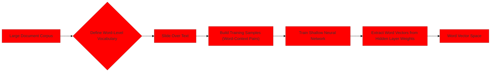
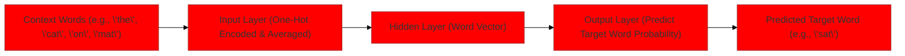
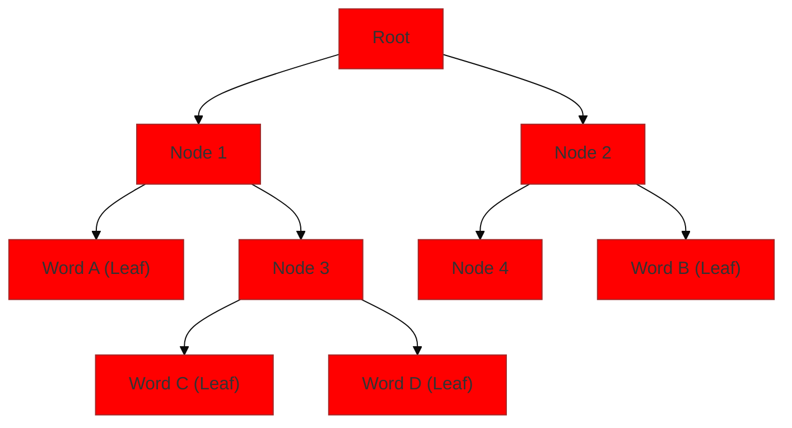

> [!summary] **Document Summary**
> This note explores **[[Word Embeddings|Word Embeddings]]**, dense vector representations of words that capture semantic and syntactic relationships, overcoming limitations of traditional text models. It details core concepts like the **[[Distributional Hypothesis|Distributional Hypothesis]]** and **[[Latent Space|Latent Space]]**, then delves into influential models: **[[Word2Vec]]** (CBOW and Skip-Gram architectures with optimizations), **[[FastText]]** (addressing OOV issues via subword information), and **[[GloVe]]** (leveraging global co-occurrence statistics). Finally, it covers intrinsic and extrinsic methods for evaluating embedding quality and discusses applications in transfer learning and domain-specific contexts.

## Word Embeddings: Concepts, Word2Vec, FastText, and GloVe

### Introduction to Word Embeddings

Traditional text representation methods, such as **[[One-Hot Encoding|one-hot encoding]]** or **[[Word-Document Representation|word-document representation]]**, face several significant limitations:
- They often miss important text nuances and new word meanings, as they treat words as independent entities without capturing semantic relationships.
- It is difficult for these methods to keep up-to-date with new words and changing corpora, requiring manual updates.
- They typically require significant human labor for feature engineering and are inherently subjective, leading to inconsistencies.
- These methods cannot compute text similarities effectively, making tasks like finding synonyms challenging.
- They are **not effective** due to the **[[Curse of Dimensionality|curse of dimensionality]]**.
    > [!definition] **Curse of Dimensionality**
    > In high-dimensional spaces (like those created by [[One-Hot Encoding|one-hot encoding]] for large vocabularies), data becomes extremely sparse, and the concept of "distance" or "similarity" between data points (words) loses its meaning. This makes it difficult for [[Machine Learning Algorithms|machine learning algorithms]] to find meaningful patterns.
- They are **not efficient** due to **[[Computational Complexity|quadratic complexity]]** with respect to word count.
    > [!definition] **Quadratic Complexity**
    > This means the computational cost grows proportionally to the square of the vocabulary size. For a vocabulary with $V$ words, operations might take $O(V^2)$ time, becoming prohibitively expensive for large vocabularies.
- [[Word-Document Representation|Word-document representation]] is sparse: the dictionary size often exceeds the document count, with very few dictionary words appearing in any single document. This leads to large matrices filled mostly with zeros.
- [[One-Hot Encoding|One-hot encoding]] is neither efficient nor flexible, as each word is represented by a unique, orthogonal vector, implying no semantic relationship between words.

**[[Word Embeddings|Word embeddings]]**, in contrast, directly address these issues by learning dense, low-dimensional vector representations of words. These vectors capture semantic and syntactic relationships, making them far more powerful for [[Natural Language Processing|natural language processing]] tasks.

### Core Concepts of Word Embeddings

> [!definition] **Word embeddings**
> Learned representations of word meaning, derived from their text distributions. These are typically dense real-valued vectors.

- **[[Distributional Hypothesis|Distributional Hypothesis]]**: This fundamental principle states that "A word is characterized by the company it keeps." (Firth, J.R. (1957); Lenci, A. (2018)). In essence, words that appear in similar contexts tend to have similar meanings.
    > [!example] **Distributional Hypothesis Example**
    > If the words "cat" and "kitten" often appear near words like "purr," "meow," "feline," and "pet," then their embeddings should be close to each other in the vector space, reflecting their semantic similarity.
- **[[Latent Space|Latent Space]]**:
    - Concepts are distributed across multiple features, not localized to a single dimension. This means that a single dimension in an embedding vector does not represent a specific, interpretable feature like "animal" or "verb." Instead, meaning emerges from the combination of values across many dimensions.
    - These [[Latent Space|latent space]] representations do not directly correspond to textual units. They are abstract numerical representations.
    - `Semantically related units` and similar words map to similar vectors or coordinates within this continuous space. This allows for mathematical operations on word meanings.
    > [!example] **Conceptual Representation of Word Vectors**
    > ```python
    > # Conceptual representation of word vectors in a latent space
    > import numpy as np
    >
    > # Fictional 2-dimensional embeddings
    > vector_king = np.array([0.8, 0.4])
    > vector_queen = np.array([0.7, 0.5])
    > vector_man = np.array([0.9, 0.3])
    > vector_woman = np.array([0.8, 0.45])
    >
    > # Cosine similarity (a measure of how similar two vectors are)
    > def cosine_similarity(vec1, vec2):
    >     return np.dot(vec1, vec2) / (np.linalg.norm(vec1) * np.linalg.norm(vec2))
    >
    > # Example of semantic similarity
    > print(f"Similarity between 'king' and 'queen': {cosine_similarity(vector_king, vector_queen):.2f}")
    > print(f"Similarity between 'man' and 'woman': {cosine_similarity(vector_man, vector_woman):.2f}")
    > print(f"Similarity between 'king' and 'man': {cosine_similarity(vector_king, vector_man):.2f}")
    > ```
- **Dimensionality**: Typically, `200-300 dimensions` are used for [[Word Embeddings|word embeddings]]. This range strikes a balance between informativeness (capturing enough semantic detail) and sparseness (avoiding the [[Curse of Dimensionality|curse of dimensionality]] and keeping models computationally feasible).
- **Units of Representation**: Embeddings can represent various linguistic units, including `characters`, `words`, `phrases`, `sentences`, `paragraphs`, `documents`, `N-grams`, `multiword groups`, or `entities`. The choice of unit depends on the specific task and model.
- **Context Examples**: The "context" used for learning these representations can vary in scope, such as `sections`, `paragraphs`, or `sentences`. The definition of context is crucial for how meaning is learned.
- **Dynamic Embeddings**: More powerful dynamic embeddings, which can adapt their representation based on the specific context a word appears in, will be introduced later.

### Word2Vec

**[[Word2Vec]]** is a highly influential model for learning [[Word Embeddings|word embeddings]], boasting over 20,000 citations (Google Scholar). It revolutionized how we approach word representation in [[Natural Language Processing|NLP]].

#### Core Idea and Process
- **Goal**: [[Word2Vec]] aims to train a shallow [[Neural Networks|neural network]] to predict surrounding words given a target word (this is the **[[Skip-Gram]]** model) or to predict a target word given its surrounding words (this is the **[[CBOW]]** model). (Mikolov et al., 2013).
- **Input**:
    - A large document corpus (a collection of text documents).
    - A dictionary of all unique words present in these documents.
- **Training Steps**: The process of generating [[Word Embeddings|word embeddings]] using [[Word2Vec]] involves several key steps:
    1.  Collect a large document corpus. This provides the raw text data from which word relationships will be learned.
    2.  Define a word-level vocabulary. All unique words in the corpus are identified and indexed.
    3.  Slide over the text to build training samples. This involves creating pairs of target words and their context words.
    4.  Train an ad hoc network. A shallow [[Neural Networks|neural network]] is trained on these word-context pairs.
    5.  Learn word vectors from the network. The weights from the hidden layer of the trained [[Neural Networks|neural network]] become the [[Word Embeddings|word embeddings]]. (Manning and Nayak, CS276)



- **Mechanism**:
    - For each word `w` in the corpus, [[Word2Vec]] computes its pairwise vector similarity with every word `w'` that appears in its defined contexts `C`.
    - It then computes probabilities $p(w'|w)$ (for [[Skip-Gram]]) or $p(w|w')$ (for [[CBOW]]) for all `w'` within the context `C`. These probabilities indicate how likely `w'` is to appear around `w`, or vice-versa.
    - Finally, the model adjusts the word vectors (embeddings) to maximize these probabilities, effectively pulling semantically related words closer together in the vector space.
- **Output**: The result is a word vector space where each word is represented by a unique, dense vector. Words with similar meanings will have vectors that are close to each other in this space.

#### Context Window
- The context window defines which words are considered "surrounding" a target word. It typically considers `3 to 5 words` subsequent or preceding the target word. The size of this window is a hyperparameter that can be tuned.
    > [!example] **Context Window**
    > In the sentence "Computers will understand sarcasm before Americans do," if `w` is "sarcasm", a context window of size 2 (meaning 2 words before and 2 words after) would identify:
    > - `c1` = "will"
    > - `c2` = "understand"
    > - `c3` = "before"
    > - `c4` = "Americans"
    > The training pairs would then be ("sarcasm", "will"), ("sarcasm", "understand"), ("sarcasm", "before"), and ("sarcasm", "Americans") for [[Skip-Gram]], or a combination for [[CBOW]].

#### Word Representation (One-Hot Encoding)
- Words are initially represented using [[One-Hot Encoding|one-hot encoding]] as input to the [[Neural Networks|neural network]]. This converts each word into a sparse binary vector.
    > [!example] **One-Hot Encoding**
    > For the simple sentence "Cats and dogs are pets" and a five-word vocabulary `{"Cats", "and", "dogs", "are", "pets"}`:
    > - `Cats`: $[1,0,0,0,0]$
    > - `and`: $[0,1,0,0,0]$
    > - `dogs`: $[0,0,1,0,0]$
    > - `are`: $[0,0,0,1,0]$
    > - `pets`: $[0,0,0,0,1]$

    ```python
    # Python example of one-hot encoding
    vocabulary = ["Cats", "and", "dogs", "are", "pets"]
    word_to_index = {word: i for i, word in enumerate(vocabulary)}
    vocab_size = len(vocabulary)

    def one_hot_encode(word, word_to_index, vocab_size):
        vector = [0] * vocab_size
        if word in word_to_index:
            vector[word_to_index[word]] = 1
        return vector

    print(f"One-hot encoding for 'Cats': {one_hot_encode('Cats', word_to_index, vocab_size)}")
    print(f"One-hot encoding for 'dogs': {one_hot_encode('dogs', word_to_index, vocab_size)}")
    ```

#### Word2Vec Architectures

[[Word2Vec]] primarily uses two distinct [[Neural Networks|neural network]] architectures:

##### 1. Continuous Bag-of-Words (CBOW)
- **Objective**: The [[CBOW]] model aims to predict the target word given its surrounding context words. It takes the context words as input and outputs the probability distribution of the target word.
- **Input layer**: Represents the context words (often averaged or summed).
- **Output layer**: Predicts the target word.



##### 2. Skip-Gram
- **Objective**: The [[Skip-Gram]] model, in contrast, predicts the surrounding context words given a single target word. It takes a target word as input and outputs the probability distribution of its context words.
- **Input layer**: Represents the target word.
- **Output layer**: Predicts the context words.


#### Efficiency and Optimization Techniques
Computing [[Word Embeddings|word embeddings]], especially for large vocabularies, is computationally costly. The cost is proportional to the dictionary size, which can range from $10^5$ to $10^7$ words. [[Word2Vec]] employs several ingenious optimization techniques to make training efficient.

##### 1. Hierarchical Softmax
- **Concept**: Instead of computing probabilities for every word in the vocabulary at the output layer, **[[Hierarchical Softmax]]** uses a **[[Binary Tree|binary tree representation]]** for the output layer. Each word is a leaf node in this Huffman tree.
    > [!definition] **Hierarchical Softmax**
    > A technique that replaces the full softmax layer with a binary tree structure, where each word is a leaf. The probability of a word is computed by traversing the path from the root to the leaf, making a binary decision at each internal node.
- **Benefit**: This technique significantly reduces the computational burden. It computes $\log_2(W)$ nodes (where $W$ is the vocabulary size) instead of $W$ output nodes. For a vocabulary of $10^5$ words, this reduces calculations from $10^5$ to approximately 17, a massive improvement.
- **Mechanism**: Each word `w` is a leaf node in the binary tree. $L(w)$ denotes the length of the path from the root of the tree to the word `w`. The nodes along this path are denoted as $n(w, 1)$ (the root) up to $n(w, L(w))$ (which is `w` itself). The probability of `w` is calculated by traversing this path, making a binary decision at each internal node. (Mikolov et al., 2013)



##### 2. Negative Sampling
- **Concept**: **[[Negative Sampling]]** is an alternative optimization technique that modifies the objective function. Instead of predicting all context words or traversing a tree, it focuses on a small subset of words.
    > [!definition] **Negative Sampling**
    > A technique where, for each training sample, the model is trained to distinguish between a few positive context words (actual context) and a few randomly chosen "negative" words (non-context words), rather than computing probabilities for the entire vocabulary.
- **Benefit**: This approach significantly reduces computational cost because each training sample updates only a small percentage of the model weights.
- **Mechanism**: For each target word, the model is trained to predict a few positive context words (words that *do* appear in its context) and a few randomly chosen "negative" words (words that *do not* appear in its context). This means the model learns to differentiate between actual context words and randomly sampled non-context words, rather than calculating probabilities for the entire vocabulary. (Mikolov etakov., 2013)

##### Handling Frequent Words (Subsampling)
- Very frequent words, such as "the," "a," or "is," appear in almost every word's context.
- While common, many samples involving these frequent words provide little new information about the meanings of other words. They can dominate the training process and skew the embeddings.
- **[[Subsampling Frequent Words|Subsampling frequent words]]** during training helps to mitigate this. By randomly discarding some occurrences of very frequent words, the model can focus more on less frequent but often more informative words. This improves both efficiency and the quality of embeddings, especially for less common words.

#### Complexity
- **[[CBOW]] Complexity**: The computational complexity of [[CBOW]] is approximately $N \times D + D \times \log_2(V)$, where:
    - $N$ is the total number of words in the corpus.
    - $D$ is the dimensionality of the [[Word Embeddings|word embeddings]].
    - $V$ is the size of the vocabulary (when using [[Hierarchical Softmax|hierarchical softmax]] for the output layer).
- **[[Skip-Gram]] Complexity**: The complexity of [[Skip-Gram]] is also dependent on the context window size ($C$), typically expressed as $N \times (C \times D + D \times \log_2(V))$. In practice, with optimizations like [[Negative Sampling|negative sampling]], the $\log_2(V)$ term is often replaced by a smaller constant representing the number of negative samples.

### Pre-trained Word Embeddings and Applications

#### Transfer Learning Paradigm
- [[Word Embeddings|Word embeddings]] are instrumental in facilitating a **[[Transfer Learning|transfer learning paradigm]]** in [[Natural Language Processing|NLP]].
- This means embeddings are first `trained on very large, general-purpose datasets` (e.g., Wikipedia, Google News corpus).
- Once trained, these embeddings are `stored` and `shared` with the community.
- They can then be `used as initial features or weights for solving other related NLP tasks`, even with smaller, task-specific datasets. This avoids the need to train embeddings from scratch for every new task, saving significant computational resources and often leading to better performance, especially when task-specific data is limited.


#### Availability of Pre-trained Models
- **General-purpose**: Many pre-trained models are publicly available, trained on vast text corpora.
    - `https://code.google.com/archive/p/word2vec/` (Original [[Word2Vec]] models)
    - `https://wikipedia2vec.github.io/wikipedia2vec/pretrained/` (Embeddings trained on Wikipedia)
- **Domain-specific**: While general models are useful, domain-specific embeddings often offer better performance.
    - `https://mccormickml.com/2016/04/12/googles-pretrained-word2vec-model-in-python/` (Resources for using Google's pre-trained [[Word2Vec]])

#### Domain-Specific Word Embeddings
- **Problem**: General-purpose [[Word Embeddings|word embeddings]], trained on broad corpora, may lack the specific nuances of specialized domains. This can yield noisy outputs when applied to domain-specific tasks, as general models often fail to capture local domain meanings.
    > [!example] **Domain-Specific Word Meaning**
    > The word "Alcohol" might have a neutral-to-mildly positive tone in a `common crawl corpus` (e.g., in recipes or social contexts), but it carries a strongly negative connotation in a `substance use disorder (SUD) dataset` (where it refers to addiction and health problems). (Sarma et al., 2018).
- **Solution**: To make embeddings instrumental for specific tasks or domains, it is often necessary to retrain general models on smaller, domain-specific data. This process adapts the embeddings to the particular terminology and semantic relationships prevalent in that domain, as domain-specific words are primarily involved.
- **Applications**: Domain-specific embeddings are particularly useful in specialized fields such as `finance`, `healthcare`, or `industry 4.0`, where precise understanding of terminology is critical. (Sarma et al., 2018; Cagliero & La Quatra, 2021)

#### Multilingual Word Embeddings
- **Use Case**: Multilingual [[Word Embeddings|word embeddings]] are highly useful for applications like **[[Machine Translation|machine translation]]** and **[[Cross-lingual Information Retrieval|cross-lingual information retrieval]]**.
- **Approach**: One common approach is to learn a (non-linear) transformation from a source language embedding space to a target language embedding space. This assumes that words with similar meanings in different languages should have similar positions in their respective embedding spaces, following an empirical distribution.
- **Method**: Given a bilingual lexicon (a set of word pairs with known translations), a mapping function is inferred. This function is then applied to the remaining words in the source language to project them into the target language's embedding space, enabling cross-lingual comparisons. (Sarma et al., 2018; Cagliero & La Quatra, 2021)

### Limitations of Word2Vec and Further Solutions

While [[Word2Vec]] was groundbreaking, it has certain limitations:

- **[[Out-of-Vocabulary (OOV) Issue|Out-of-Vocabulary (OOV) Issue]]**: A major drawback of [[Word2Vec]] is its inability to generate embeddings for words that were not present in its training vocabulary. If a new word appears in a test set, [[Word2Vec]] simply cannot provide a vector for it.
- **Solutions**: Subsequent advancements in [[Word Embeddings|word embedding]] models have addressed these limitations:
    - **[[Recurrent Neural Networks|RNN]]** or **[[Long Short-Term Memory|LSTM]]** architectures: These models can generate context-dependent embeddings, meaning the embedding for a word changes based on the words around it.
    - **[[FastText]]**: This model addresses the [[Out-of-Vocabulary (OOV) Issue|OOV issue]] by incorporating **[[Subword Tokenization|subword information]]** (character n-grams).
    - **[[GloVe]]**: This model leverages global co-occurrence statistics from the entire corpus, offering a different approach to learning embeddings.
    - **[[BERT]]**: Represents a more advanced generation of models that produce highly contextualized embeddings, where a word's vector is dynamically generated based on its full sentence context.

### FastText

[[FastText]] extends the principles of [[Word2Vec]], specifically addressing the critical [[Out-of-Vocabulary (OOV) Issue|OOV issue]] by looking *inside* words.

- **Core Idea**: [[FastText]] overcomes the [[Out-of-Vocabulary (OOV) Issue|Out-of-Vocabulary (OOV) problem]] by considering **[[Subword Tokenization|sub-words]]** (character n-grams) as its fundamental textual units, rather than whole words. This allows it to construct embeddings for words it has never seen before.
- **Mechanism**:
    - [[FastText]] applies a **[[Character N-grams|character n-gram based model]]**. Each word is represented as a bag of its constituent character n-grams, plus the word itself.
    - It incorporates **[[Subword Information|sub-word information]]** into the embedding space, meaning that the embedding for a word is the sum of the embeddings of its character n-grams. (Bojanowski et al., 2017)
    > [!example] **FastText Character N-gram Generation**
    > For the word "where", [[FastText]] might generate character n-grams like:
    > - `"<wh>"` (prefix bigram, with `< >` indicating start/end of word)
    > - `"wh"` (bigram)
    > - `"whe"` (trigram)
    > - `"her"` (trigram)
    > - `"ere"` (trigram)
    > - `"re"` (bigram)
    > - `"<re>"` (suffix bigram)
    > - And the special token `<where>` (representing the whole word itself).
    > The word's final vector is then the sum of the vectors of all these constituent character n-grams and the whole word token. This allows [[FastText]] to generate a vector for an unseen word by summing the vectors of its known n-grams.

    ```python
    # Python example of character n-gram generation for FastText concept
    def generate_ngrams(word, min_n=3, max_n=6):
        ngrams = []
        # Add word boundaries
        word_with_boundaries = f"<{word}>"
        # Iterate through possible n-gram lengths
        for n in range(min_n, max_n + 1):
            for i in range(len(word_with_boundaries) - n + 1):
                ngrams.append(word_with_boundaries[i:i+n])
        # Add the full word itself as a special n-gram
        ngrams.append(f"<{word}>") # Representing the whole word token
        return sorted(list(set(ngrams))) # Remove duplicates and sort for consistency

    word_example = "where"
    print(f"Character n-grams for '{word_example}': {generate_ngrams(word_example, min_n=2, max_n=4)}")
    # Expected output (min_n=2, max_n=4):
    # ['<w', '<wh', '<whe', '<wher', 'he', 'her', 'here', 're', 'rer', 'ere', 'er>', 're>', 'e>']
    # Note: The example above is a simplified illustration. Actual FastText handles boundaries and n-grams slightly differently.
    ```

- **N-gram Length**:
    - Shorter n-grams (e.g., bigrams, trigrams) tend to capture `syntactic information` (e.g., prefixes, suffixes, morphology), which is useful for understanding grammatical roles.
    - Longer n-grams (e.g., 4-grams, 5-grams) are more likely to capture `semantic information`, as they represent larger chunks of meaning within a word.
- **Pre-trained Vectors**: [[FastText]] also provides a rich set of pre-trained word vectors:
    - `https://fasttext.cc/docs/en/crawl-vectors.html` (Vectors trained on Common Crawl and Wikipedia)
    - `https://fasttext.cc/docs/en/aligned-vectors.html` (Cross-lingual word embeddings)

### GloVe (Global Vectors for Word Representation)

**[[GloVe]]** offers a different perspective on learning [[Word Embeddings|word embeddings]] by combining the strengths of two main approaches: **[[Matrix Factorization|global matrix factorization methods]]** (like **[[Latent Semantic Analysis|Latent Semantic Analysis (LSA)]]** or [[Latent Semantic Analysis|LSA]]) and **[[Context Window|local context window methods]]** (like [[Word2Vec]]).

- **Problem Addressed**: Traditional **[[Co-occurrence Matrix|word-word co-occurrence matrices]]**, which count how often words appear together, can be very sparse, especially with short texts. This sparsity makes them unsuitable for direct use in [[Neural Networks|neural network]] learning without significant dimensionality reduction.
- **Core Idea**: [[GloVe]] combines the advantages of **[[Prediction-based Models|prediction-based neural]]** models (like [[Word2Vec]], which learn by predicting context) and **[[Occurrence-based Models|occurrence-based]]** methods (which rely on global co-occurrence statistics). By leveraging both, [[GloVe]] achieves better effectiveness, particularly on shorter text snippets where local context alone might be insufficient. (Pennington et al., 2014)
- **Mechanism**: Instead of directly using co-occurrence probabilities, [[GloVe]] uses the **[[Co-occurrence Probability Ratio|ratio of co-occurrence probabilities]]**. This ratio more effectively encodes meaning components because it can distinguish between relevant and irrelevant co-occurrences. For example, if word A and word B are related, their co-occurrence with a third word C will show a distinct ratio compared to their co-occurrence with a fourth, unrelated word D.
- **Mathematical Formulation**: [[GloVe]] minimizes a specific cost function. This function aims to relate the dot product of word vectors to the logarithm of their co-occurrence probability, effectively encoding global co-occurrence statistics into the dense vectors.

    > [!math] **GloVe Cost Function**
    > $$J = \sum_{i=1}^V \sum_{j=1}^V f(X_{ij}) (w_i^T \tilde{w}_j + b_i + \tilde{b}_j - \log X_{ij})^2$$
    >
    > Where:
    > - $V$: The size of the vocabulary.
    > - $X_{ij}$: The co-occurrence count of word $i$ and word $j$. This is the number of times word $j$ appears in the context of word $i$ within the entire corpus.
    > - $w_i$: The word vector for word $i$. This is the primary embedding we are learning.
    > - $\tilde{w}_j$: The context word vector for word $j$. [[GloVe]] learns two sets of vectors (word and context), and they are symmetric, meaning $\tilde{w}_j$ can also be thought of as a word vector.
    > - $b_i$: The bias term for word $i$.
    > - $\tilde{b}_j$: The bias term for context word $j$.
    > - $\log X_{ij}$: The logarithm of the co-occurrence count. This term represents the observed relationship between words $i$ and $j$.
    > - $f(X_{ij})$: A weighting function that gives less weight to very frequent or very infrequent co-occurrences. This function prevents extremely common word pairs (like "the" with "a") from dominating the learning process and also downweights rare co-occurrences which might be statistical noise. It typically has a form that assigns a weight of 0 for $X_{ij}=0$, and increases for larger $X_{ij}$ up to a maximum value, then plateaus.
    >
    > The objective of this function is to minimize the squared difference between the dot product of the word and context vectors (plus their biases) and the logarithm of their co-occurrence count. By minimizing this, the model learns vectors such that their dot product effectively predicts the log co-occurrence probability, capturing global statistical relationships. (Pennington et al., 2014)

### Evaluation of Word Embeddings

Evaluating the quality of [[Word Embeddings|word embeddings]] is crucial to determine their effectiveness. There are two primary approaches: intrinsic and extrinsic evaluation.

#### 1. Intrinsic Evaluation
- **Method**: **[[Intrinsic Evaluation|Intrinsic evaluation]]** assesses the quality of [[Word Embeddings|word embeddings]] directly, often against a pre-determined ground truth or a "gold standard" dataset. It measures how well the embeddings capture linguistic regularities or semantic relationships.
- **Example**: **[[Word Analogy Tasks|Word analogy tasks]]**. This method evaluates word vectors by how well their **[[Cosine Similarity|cosine distance]]** (a measure of similarity between two vectors) after vector arithmetic captures intuitive semantic and syntactic analogy questions.
    > [!example] **Word Analogy Task**
    > **Analogy Example**: "Man : woman :: king : ?" expects "queen".
    > To solve this, the model attempts to find a word `x` such that the vector relationship between "man" and "woman" is similar to the relationship between "king" and `x`. Mathematically, this is expressed as finding `x` such that $vector(\text{man}) - vector(\text{woman}) + vector(\text{king}) \approx vector(x)$. The word whose vector is closest to the result of this arithmetic operation is chosen as the answer. (Mikolov et al., 2013)

    ```mermaid
    %%{init: {'theme':'base', 'themeVariables': {'primaryColor':'#ff0000'}}}%%
    flowchart TD
        A["Vector(Man)"] --> B["Subtract Vector(Woman)"]
        B --> C["Add Vector(King)"]
        C --> D["Resulting Vector"]
        D --> E{"Find Closest Word Vector"}
        E --> F["Predicted Word (e.g., Queen)"]
    ```

#### 2. Extrinsic Evaluation
- **Method**: **[[Extrinsic Evaluation|Extrinsic evaluation]]** assesses the quality of [[Word Embeddings|word embeddings]] indirectly, based on their impact on the performance of other downstream [[Natural Language Processing|NLP]] systems or specific [[Natural Language Processing|NLP]] tasks. The embeddings are used as features in a larger system, and the overall system's performance is measured.
    > [!example] **Extrinsic Evaluation**
    > Using [[Word Embeddings|word embeddings]] as input features in a **[[Sentiment Analysis|sentiment analysis classifier]]** (to determine if text expresses positive, negative, or neutral sentiment) or a **[[Named Entity Recognition|named entity recognition (NER)]]** system (to identify entities like names, locations, organizations). The performance of the sentiment analysis or [[Named Entity Recognition|NER]] system (e.g., **[[Accuracy|accuracy]]**, **[[F1-Score|F1-score]]**) then serves as an indicator of the quality of the [[Word Embeddings|word embeddings]]. If the embeddings lead to better performance in these tasks, they are considered high quality.

### References

- Bojanowski, P., Grave, E., Joulin, A., & Mikolov, T. (2017). Enriching Word Vectors with Subword Information. *Transactions of the Association for Computational Linguistics*, *5*, 135-146. DOI: 10.1162/tacl_a_00051
- Cagliero, L., & La Quatra, M. (2021). Inferring Multilingual Domain-Specific Word Embeddings From Large Document Corpora. *IEEE Access*.
- Chaubard, F., Mundra, R., & Socher, R. (2016). CS 224D: Deep Learning for NLP. Lecture Notes: Part I.
- Firth, J. R. (1957). A synopsis of linguistic theory 1930-1955. In *Studies in Linguistic Analysis*, pp. 1-32.
- Lenci, A. (2018). Distributional models of word meaning. *Annual Review of Linguistics*, *4*(1), 151-171.
- Manning, C. D., & Nayak, P. (n.d.). Introduction to Information Retrieval. CS276.
- Mikolov, T., Chen, K., Corrado, G., & Dean, J. (2013). Efficient estimation of word representations in vector space. *ICLR (Workshop Poster)*.
- Mikolov, T., Sutskever, I., Chen, K., Corrado, G., & Dean, J. (2013). Distributed representations of words and phrases and their compositionality. In *Proceedings of the 26th International Conference on Neural Information Processing Systems - Volume 2 (NIPS'13)* (pp. 3111-3119). Curran Associates Inc.
- Pennington, J., Socher, R., & Manning, C. D. (2014). GloVe: Global Vectors for Word Representation. In *Proceedings of the 2014 Conference on Empirical Methods in Natural Language Processing (EMNLP)* (pp. 1532-1543).
- Rosen-Zvi, M., Griffiths, T., Steyvers, M., & Smyth, P. (2004). The author-topic model for authors and documents. In *Proceedings of the 20th conference on Uncertainty in artificial intelligence (UAI '04)* (pp. 487-494). AUAI Press.
- Sarma, P. K., Liang, Y., & Sethares, W. A. (2018). Domain Adapted Word Embeddings for Improved Sentiment Classification. *ACL*.
- Socher, R., Bengio, Y., & Manning, C. D. (2012). Deep learning for NLP (without magic). In *Tutorial Abstracts of ACL 2012* (p. 5). Association for Computational Linguistics, USA.
- Source: `https://towardsdatascience.com` (latest access: September 2021)
- `https://radimrehurek.com/gensim/models/word2vec.html` (latest access: October 2021)
- A Visual Guide to FastText Word Embeddings
- [[Machine Learning]]
- [[Natural Language Processing]]
- [[Neural Networks]]
- [[Deep Learning]]
- [[Vector Space Models]]
---