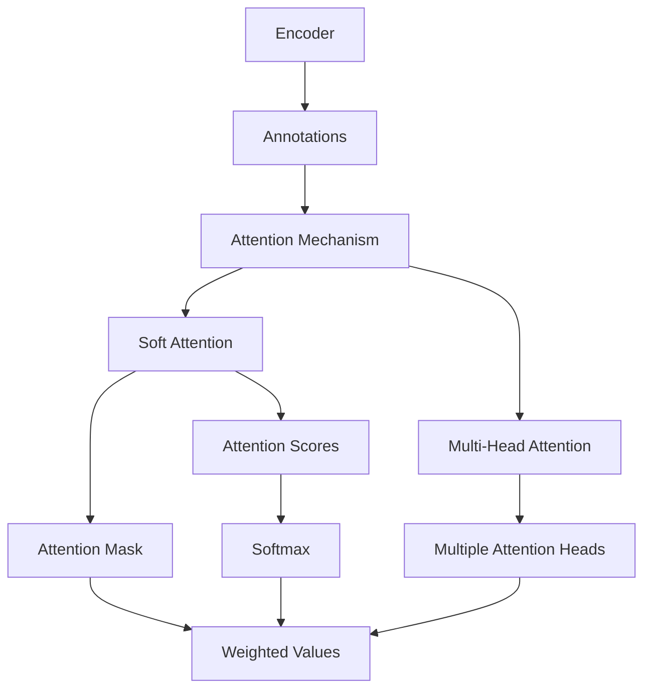

> [!summary] **Document Summary**
> This note explores attention mechanisms in neural machine translation (NMT), explaining their role in improving translation quality by allowing models to focus on relevant parts of the input. It covers the encoder-decoder architecture, types of attention (soft and multi-head), and provides an implementation example.

## Attention Mechanisms in Neural Machine Translation

### Overview of Neural Machine Translation

- **Traditional Neural Machine Translation (NMT):**
  - Encoder neural network reads and encodes a source sentence into a fixed-length vector
  - Decoder outputs a translation from the encoded vector
  - All necessary information of a source sentence must be compressed into a fixed-length vector
  - Difficult to cope with long sentences, especially those longer than training corpus

- **Encoder-Decoder Architecture:**
  - Encoder: Bidirectional RNNs
  - Decoder: Emulate search through a source sentence

### Attention Mechanisms

- **Attention Mechanism:**
  - Depends on a sequence of annotations to which an encoder maps the input sentence
  - Contains information about the whole sequence
  - Focuses on the parts surrounding the i-th word of the input sequence

- **Alignment Model:**
  - How well the inputs around position j and the output at position i match (based on state s_{i-1})

### Types of Attention

- **Soft Attention:**
  - Compute similarities between the query and each of the keys
  - Store the similarities in the attention mask
  - Extract the values corresponding to the highest attention score

- **Attention Mask:**
  - A mechanism to weight the importance of different parts of the input

- **Attention Scores:**
  - $S_i$: similarity score between $q$ and $k_i$
  - $P_i = \text{softmax}(S_i)$

- **Similarity Computation Methods:**
  - $S_i = w_3 \tanh(w_2^T q + w_1^T k_i)$
  - $S_i = q^T k_i$
  - $S_i = q^T k_i / d_k^{1/2}$

### Multi-Head Attention

- **Multi-Head Attention:**
  - Each head attends to a specific portion of the input data
  - To attend to multiple portions (or to multiple data granularities): a stack of multiple attention heads

- **Mathematical Representation:**
  - $ \sum $: used to represent the summation of attention scores

### Key Concepts

- **Query (q):**
  - A vector representing the current state of the decoder

- **Key (k):**
  - A vector representing the encoded input

- **Value (v):**
  - A vector representing the information to be retrieved

- **Attention Mask:**
  - A matrix that determines which parts of the input are attended to

- **Softmax Function:**
  - Used to normalize the attention scores

### Implementation Example

```python
def attention(query, keys, values):
    # Compute similarity scores
    scores = torch.matmul(query, keys.transpose(-2, -1)) / (keys.size(-1) ** 0.5)
    # Apply softmax
    attention_weights = torch.softmax(scores, dim=-1)
    # Compute weighted sum of values
    context_vector = torch.matmul(attention_weights, values)
    return context_vector
```

### Example

Example: Given a query vector $ q = [1, 2] $, keys $ k = [[3, 4], [5, 6]] $, and values $ v = [[7, 8], [9, 10]] $, compute the attention.

- Compute similarity scores:
  - $S_1 = q^T k_1 = 1*3 + 2*4 = 3 + 8 = 11$
  - $S_2 = q^T k_2 = 1*5 + 2*6 = 5 + 12 = 17$

- Apply softmax:
  - $P_1 = \frac{e^{11}}{e^{11} + e^{17}}$
  - $P_2 = \frac{e^{17}}{e^{11} + e^{17}}$

- Compute weighted sum of values:
  - $\text{context\_vector} = P_1 * v_1 + P_2 * v_2$

### Summary

- Attention mechanisms allow the model to focus on relevant parts of the input when generating output
- Soft attention computes similarity scores and uses softmax to weight the importance of different parts
- Multi-head attention allows the model to attend to multiple parts of the input simultaneously
- Attention mechanisms are crucial for handling long sentences and improving translation quality

### Mermaid Diagram


