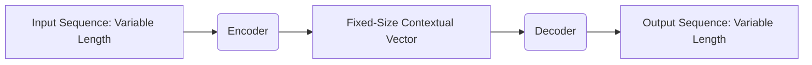
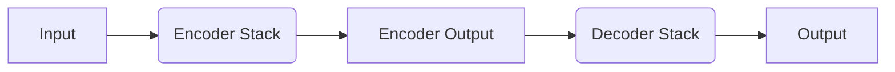
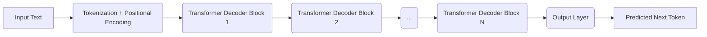
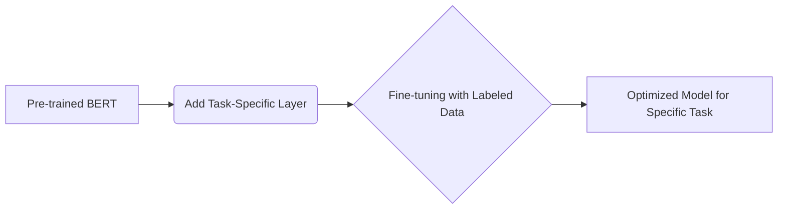
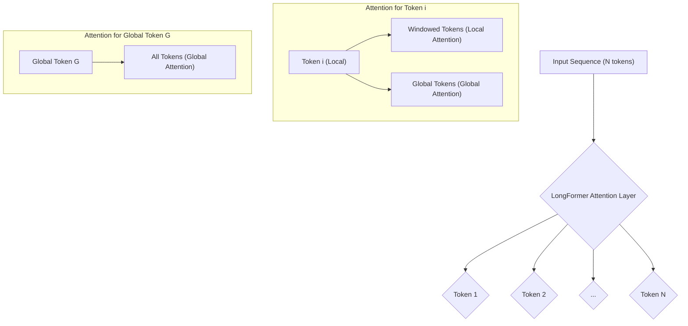
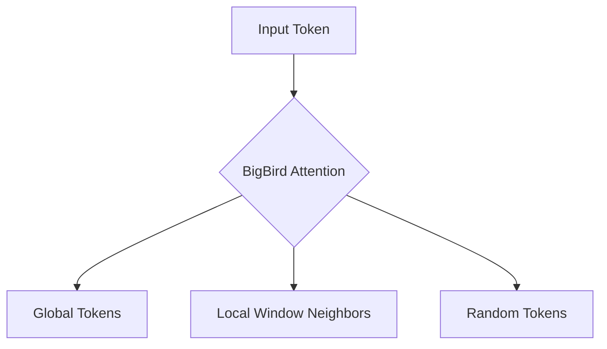

> [!summary] **Document Summary**
> This document provides a detailed overview of Transformer-based encoding and decoding mechanisms, focusing on **BERT** and **GPT** models. It clarifies their architectures, functionalities, and applications, covering the core Transformer, attention mechanisms, and how BERT (encoder-only) and GPT (decoder-only) differ in their design and pre-training objectives for tasks like understanding versus generation.

## Transformer-based Encoding & Decoding: BERT & GPT

This document provides a detailed overview of Transformer-based encoding and decoding mechanisms, with a specific focus on two prominent models: **BERT** and **GPT**. It aims to clarify their architectures, functionalities, and applications.

### Lecture Goals
This section outlines the key topics covered, ensuring a foundational understanding of Transformer models and their specific implementations.
- **Transformers recap**: A brief review of the core Transformer architecture.
- **Sentence encoding & decoding**: Understanding how Transformers process and generate sequences.
- **GPT decoders**: Exploring the [[Generative Pre-trained Transformer (GPT)|Generative Pre-trained Transformer's (GPT)]] decoder-only structure.
- **BERT encoder**: Examining the [[Bidirectional Encoder Representations from Transformers (BERT)|Bidirectional Encoder Representations from Transformers (BERT)]] encoder-only design.

### The Encoder-Decoder Mechanism
The fundamental concept behind many sequence-to-sequence models, including the [[Transformer Architecture|Transformer]], is the **encoder-decoder** architecture.
- > [!definition] **Encoder**
    > This component takes an input sequence of variable length and transforms it into a fixed-size contextual vector representation. This vector encapsulates the meaning of the entire input sequence.
    *Example*: If the input is "The cat sat on the mat", the encoder converts this sentence into a numerical vector that captures its semantic essence.
- > [!definition] **Decoder**
    > This component then reads the fixed-size vector produced by the encoder and generates an output sequence, which can also be of variable length.
    *Example*: If the encoder's vector represents "The cat sat on the mat", a decoder might generate a translation like "Il gatto si sedette sul tappeto" in Italian.

### The Transformer Architecture
The **Transformer** architecture, a pivotal innovation in natural language processing, was first introduced in the paper "Attention Is All You Need" by Vaswani et al. at NIPS 2017. Its primary innovation is the reliance solely on attention mechanisms, eschewing recurrent or convolutional layers.

### The Attention Mechanism
**Attention** is a core concept that allows models to weigh the importance of different parts of the input sequence when processing each element.
- **Concept**: At its heart, the attention mechanism allows each word's representation to act as a query. This query is then used to access and combine information from other words (values) based on their relevance (keys).
    *Example*: When translating the word "bank" in "river bank", the attention mechanism would allow "bank" to "pay more attention" to "river" than to other words in the sentence, correctly understanding its meaning as a river's edge.
- **Types**: There are primarily two types of attention mechanisms in Transformers:
    - **`Cross-attention`**: This occurs when the decoder attends to the encoder's output. The queries come from the decoder's current state, while the keys and values come from the encoder's output.
    - **`Self-attention`**: This mechanism allows words within a single sequence to attend to other words within the *same* sequence. This is crucial for understanding context.
        *Example*: In the sentence "The animal didn't cross the street because it was too tired," self-attention helps determine that "it" refers to "the animal."
- **Parallelizability**: A significant advantage of attention mechanisms is their high parallelizability. Since all words can interact with each other simultaneously at every layer, computations can be performed in parallel, leading to faster training times compared to sequential models like [[Recurrent Neural Networks (RNNs)|Recurrent Neural Networks (RNNs)]].

#### Self-Attention
**Self-attention** is a critical component of the Transformer, enabling it to model relationships between all words in a sequence regardless of their position.
- **Operation**: Self-attention uses three distinct types of vectors: queries ($q$), keys ($k$), and values ($v$). For each word in the input sequence, a query vector is generated. This query vector is then compared against key vectors of all other words (including itself) to determine relevance. The relevance scores are then used to weigh the value vectors, which are summed to produce the output for that word.
    > [!math] Mathematical Representation
    > The output of self-attention for a query $q_i$ against keys $k_1, \dots, k_T$ and values $v_1, \dots, v_T$ can be expressed as:
    > $$ \text{Attention}(q_i, K, V) = \sum_{j=1}^{T} \alpha_{ij} v_j $$
    > where $\alpha_{ij}$ is the attention weight, typically computed using a scaled dot-product:
    > $$ \alpha_{ij} = \frac{\exp(\frac{q_i \cdot k_j}{\sqrt{d_k}})}{\sum_{l=1}^{T} \exp(\frac{q_i \cdot k_l}{\sqrt{d_k}})} $$
    > Here, $d_k$ is the dimension of the key vectors, used for scaling to prevent large dot products from pushing the softmax function into regions with tiny gradients.
- **Mechanism**:
    - In self-attention, the queries, keys, and values are all derived from the same source, typically the output of the previous layer. For instance, for an input $x_i$, we might have $v_i = k_i = q_i = x_i$ (after linear transformations).
    - The most common form is `dot-product self-attention`, where the similarity between a query and a key is measured by their dot product.
- **Properties**:
    - **Input order unknown, non-sequential**: Unlike RNNs, Transformers do not inherently process input sequentially. Positional encodings are used to inject sequence order information.
    - **Aligns words within the same sequence**: It effectively captures long-range dependencies by allowing each word to attend to any other word in the input.
    - **More effective than LSTMs at avoiding `locality bias`**: LSTMs are biased towards nearby tokens due to their sequential nature. Self-attention can connect distant words directly.
    - **More efficient than recurrent/convolutional models**: Due to its parallelizable nature, self-attention can be computed much faster.
    - **Allows nonlinearities**: The attention weights and subsequent linear transformations introduce non-linearities into the model.

#### The Transformer Encoder
The **Transformer encoder** is responsible for processing the input sequence and generating a rich, contextualized representation.
- **Input**: The encoder receives a sequence of tokens. These tokens are numerical representations (indices) from a predefined vocabulary.
- **Output**: The encoder produces a sequence of vectors, where each vector corresponds to an input token. These output vectors are 'contextualized', meaning they incorporate information from all other tokens in the input sequence through the attention mechanism.
- **Multi-head Attention**: A key enhancement is **Multi-head Attention**. Instead of performing a single attention calculation, it performs multiple attention calculations in parallel (each with different learned linear transformations for queries, keys, and values). The results from these "attention heads" are then concatenated and linearly transformed. This allows the model to attend to different parts of the sentence, or different aspects of the context, simultaneously.
    *Example*: One head might focus on syntactic dependencies (e.g., subject-verb agreement), while another might focus on semantic relationships (e.g., synonyms).

#### Positional Encoding
Since the self-attention mechanism processes all words in parallel without regard for their order, **positional encoding** is crucial to inject information about the relative or absolute position of tokens in the sequence.
- **Concept**: Positional encoding creates a finite-dimensional representation of each unit's position within a sequence. This allows the model to understand word order, which is vital for language understanding.
- **Mechanism**: In the original Transformer, positional encodings are generated using sine and cosine functions of different frequencies. These encodings are then added to the input embeddings before they enter the encoder layers.
    > [!math] Mathematical Representation
    > For a token at position $pos$ and dimension $i$ of the positional encoding, the sine and cosine functions are used:
    > $$ PE(pos, 2i) = \sin(pos / 10000^{2i/d_{\text{model}}}) $$
    > $$ PE(pos, 2i+1) = \cos(pos / 10000^{2i/d_{\text{model}}}) $$
    > where $d_{\text{model}}$ is the dimensionality of the model's embeddings.
- **Key Insight**: The use of sine and cosine functions allows the model to easily learn to attend to relative positions. For instance, $PE(pos+k)$ can be expressed as a linear function of $PE(pos)$, making it easier for the model to generalize to sequences of different lengths. Absolute positions are less critical than the relationships between positions.

### Using Transformers for Sentence Encoding
Transformers are highly effective for sentence encoding, which involves mapping variable-length sequences of words into fixed-size, semantically sensitive, and contextualized vector representations. These representations capture the meaning and context of the entire sentence, making them suitable for various downstream [[Natural Language Processing (NLP)|NLP]] tasks.

### GPT vs. BERT
While both **GPT** and **BERT** are based on the Transformer architecture, they utilize different parts of it and are designed for different pre-training objectives and downstream tasks.
- The full Transformer architecture typically uses an `encoder stack` to model the input sequence and a `decoder stack` to generate the output, with the decoder attending to the encoder's output.

#### BERT Encoder
- **BERT** (Bidirectional Encoder Representations from Transformers) exclusively uses the `Transformer encoder stack`. Its primary goal is to learn rich, bidirectional representations of text for *understanding* tasks. It does not generate sequences in the way a decoder does.
- BERT is used when the objective is to train a language model for input tasks, such as classification or named entity recognition, where generating a sequence (like translation) is not required.

#### GPT Decoder
- **GPT** (Generative Pre-trained Transformer) exclusively uses the `Transformer decoder stack`. Its core purpose is "next word" modeling, also known as Forward Language Modeling (LM), where it predicts the subsequent word in a sequence given the preceding words.
- GPT does not utilize the Transformer encoder because its pre-training objective focuses solely on generating text based on a left-to-right context.

### Generative Pre-trained Transformer (GPT)
**GPT** models represent a powerful class of language models that leverage the Transformer decoder for unsupervised language model training. They excel at generating coherent and contextually relevant text.
- **Key Idea**: The central idea behind GPT is to use the Transformer's decoder architecture for sentence decoding, pre-trained on a massive corpus of text using an unsupervised language modeling objective. This allows the model to learn grammar, facts, and reasoning abilities from raw text.
- **Properties**:
    - **`Masked self-attention`**: This is a crucial feature of the GPT decoder. During training, the self-attention mechanism is modified (masked) so that each token can only attend to previous tokens in the sequence. This prevents the model from "cheating" by looking at future tokens when predicting the current one, thus enforcing a left-to-right generation process.
    - **`Byte Pair Encoding (BPE)`**: GPT models use BPE for tokenization. This subword tokenization algorithm efficiently handles out-of-vocabulary words and reduces vocabulary size by breaking down words into common subword units.
- **Applications**: GPT models have a wide range of applications, including:
    - **Machine Translation**: Translating text from one language to another.
    - **Abstractive Summarization**: Generating concise summaries that may not directly copy sentences from the original text.
    - **Creative Writing**: Generating stories, poems, or other creative content.
    - **Question Answering**: Providing answers to questions based on given context.
- **GitHub**:
    - For GPT-2 implementation details: [https://github.com/openai/gpt-2](https://github.com/openai/gpt-2)
    - For GPT-3 implementation details: [https://github.com/openai/gpt-3](https://github.com/openai/gpt-3)

#### GPT History and Versions
OpenAI has progressively developed several versions of GPT, each building upon the capabilities of its predecessor. Beyond general language tasks, GPT models have also been evaluated for specific tasks like protein-protein interaction identification, showcasing their versatility.

#### GPT-3
**GPT-3** marked a significant advancement in the field of large language models, demonstrating unprecedented capabilities in understanding and generating human-like text.

#### GPT-4
**GPT-4** represents an improved iteration over GPT-3.5, bringing substantial enhancements:
- **Advancements**: It is considered significantly more advanced, offering better context understanding and producing more precise and logical answers. This translates to a noticeable improvement in the quality and coherence of generated text.
- **Higher Memory Limit**: GPT-4 can process up to 25,000 words (or tokens, roughly equivalent to words), which is a substantial increase. This allows for longer conversations, more extensive responses, and the ability to analyze much larger texts at once.
    *Example*: A user could input an entire research paper and ask GPT-4 to summarize it or extract specific information.
- **Multimodal Feature**: A groundbreaking feature of GPT-4 is its multimodal capability, combining language and vision models. This means it can understand and process information from images in addition to text. This feature has significant implications for aiding visually impaired individuals, enhancing accessibility, and improving content moderation by understanding visual context.
    *Example*: A user could upload an image of a complex diagram and ask GPT-4 to explain it in detail.

#### GPT-5
**GPT-5** is the anticipated upcoming version, expected to push the boundaries of large language models even further.

#### GPT Fundamentals
A deeper look into the core mechanisms that empower GPT models:
- **Masked Self-Attention**: As mentioned, this is the fundamental mechanism that allows GPT to generate text token by token, ensuring that the prediction for the current token only depends on previously generated tokens. This is achieved by applying a mask to the attention scores, setting scores for future tokens to negative infinity (or a very large negative number) before the softmax, effectively zeroing out their contribution.
- **Reuse Previous Computations**: To achieve linear complexity in generation, GPT models are designed to efficiently reuse computations from previous steps. At each step, when generating a new output token, the model looks for `<q,k,v>` (query, key, value) results relative to the newly generated output. This avoids recomputing attention over the entire sequence, leading to more efficient inference.
- **Byte Pair Encoding (BPE)**: BPE is a data compression technique that is adapted for tokenization in NLP. It works by iteratively merging the most frequent pairs of bytes (or characters) in a text corpus into new, single tokens. This results in a vocabulary that includes common words, subword units (like prefixes and suffixes), and individual characters.
    *Example*: Consider the words "old", "older", and "oldest". BPE might learn to represent "old" as a token, and then "-er" and "-est" as separate subword tokens. This allows the model to infer relationships between words like "smart", "smarter", and "smartest", even if "smarter" and "smartest" weren't explicitly in the training vocabulary as whole words. It improves handling of rare words and reduces the overall vocabulary size.

#### GPT-2 Decoder Architecture
The GPT-2 decoder architecture, being a decoder-only Transformer, is inherently suited for generative tasks. For machine translation, it would typically be fine-tuned to generate target language sentences given source language sentences, often by concatenating the source sentence as a prefix to the target sentence during training.

#### Additional Reading on GPT-2
For a deeper understanding of GPT-2's capabilities and implications:
- Paper Title: "Language Models are Unsupervised Multitask Learners" by Radford et al.
- Access the paper here: [https://d4mucfpksywv.cloudfront.net/better-language-models/language-models.pdf](https://d4mucfpksywv.cloudfront.net/better-language-models/language-models.pdf)

#### Additional Reading on GPT-3
To explore the advancements introduced with GPT-3:
- Paper Title: "Language Models are Few-Shot Learners" by Brown et al.
- Access the paper here: [https://arxiv.org/pdf/2005.14165.pdf](https://arxiv.org/pdf/2005.14165.pdf)

### Bidirectional Encoder Representation from Transformers (BERT)
**BERT** is a powerful language representation model that utilizes the Transformer encoder to learn deep bidirectional representations from unlabeled text by jointly conditioning on both left and right context in all layers.
- **Key Idea**: BERT's core innovation is the unsupervised pretraining of bidirectional language models using the Transformer encoder. This means that when BERT processes a word, it considers its context from both the words preceding it and the words following it simultaneously.
- **Mechanism**: Unlike traditional left-to-right language models (like GPT) or concatenated left-to-right and right-to-left models, BERT jointly conditions on both the left and right context across all layers of the Transformer encoder. This allows for a much richer and more nuanced understanding of word meaning in context.
- **Properties**:
    - **State-of-the-art for most NLP tasks**: BERT achieved state-of-the-art results on numerous NLP benchmarks upon its release, demonstrating its effectiveness across a wide range of tasks.
    - **Fast to train**: Despite its complexity, BERT's Transformer architecture allows for parallel computation, making its pre-training relatively fast compared to older sequential models.
    - **Easy to fine-tune**: After pre-training, BERT can be easily adapted (fine-tuned) with a small amount of task-specific labeled data to achieve high performance on various downstream NLP tasks.
- **GitHub**: For the official implementation and further details: [https://github.com/google-research/bert](https://github.com/google-research/bert)

#### BERT Encoder Stack
BERT primarily consists of a stack of Transformer encoder layers.
- **Training Data**: BERT's effectiveness stems from its extensive pre-training.
    - **Pre-training**: It is pre-trained on massive text corpora, typically involving billions of sentences (e.g., 2.5 billion sentences from Wikipedia and BookCorpus).
    - **Fine-tuning**: For specific downstream tasks, BERT is then fine-tuned on much smaller, task-dependent datasets, often containing only around 1,000 sentences.
- **Vector Representations**:
    - **Sentence vectors**: For tasks requiring a representation of the entire sentence, BERT uses the vector corresponding to the special `[CLS]` token (classification token) at the beginning of the input sequence. This token's final hidden state is considered the aggregate representation of the entire input.
    - **Word-level vectors**: For tasks requiring representations of individual words (e.g., [[Named Entity Recognition (NER)|Named Entity Recognition]]), the output vectors corresponding to each word token are used. These can be aggregated via pooling if a single word vector is needed.

#### Model Pretraining Strategies
BERT's success is largely attributed to its innovative self-supervised pre-training objectives, which allow it to learn deep language understanding from unlabeled text. It minimizes a combined loss from two main tasks:
1. **`Masked Language Model (MLM)`**: This task helps BERT learn bidirectional context.
2. **`Next Sentence Prediction (NSP)`**: This task helps BERT understand relationships between sentences.

##### Masked LM
- **Self-supervised Training**: During pre-training, 15% of the words in each input sequence are randomly selected and replaced with a special `[MASK]` token.
- **Task**: The model's objective is to predict the original masked words based on the context provided by the unmasked words around them. This forces the model to learn a deep, bidirectional understanding of language.
- **Mechanism**:
    - A classification layer is added on top of the encoder's output.
    - The output vectors corresponding to the `[MASK]` tokens are taken.
    - These output vectors are then multiplied by the embedding matrix (which maps tokens to their vector representations) to project them into the vocabulary dimension.
    - Finally, a `softmax` function is applied to compute the probability distribution over the entire vocabulary for each masked position, predicting the most likely original word.
    *Example*: If the input is "The [MASK] sat on the mat", BERT must predict "cat" using context from both "The" and "sat on the mat".

##### Next Sentence Prediction
- **Input**: For this task, BERT is provided with pairs of sentences, denoted as Sentence A and Sentence B.
- **Task**: The model's objective is to predict whether Sentence B is the actual next sentence that immediately follows Sentence A in the original document, or if it's a randomly sampled sentence.
- **Self-supervised Training**: To achieve this, 50% of the input pairs consist of a true subsequent sentence (Sentence B immediately follows Sentence A), and the other 50% consist of a random, disconnected sentence (Sentence B is randomly chosen from the corpus). This helps BERT learn to understand relationships and coherence between sentences.
    *Example*:
        *True Pair*: "The quick brown fox. Jumps over the lazy dog." (IsNext=True)
        *False Pair*: "The quick brown fox. The sky is blue today." (IsNext=False)

#### Model Fine-tuning
After the extensive pre-training phase, BERT's learned representations can be fine-tuned for various downstream NLP tasks with relatively small amounts of task-specific labeled data. This involves adding a simple output layer specific to the task on top of the pre-trained BERT model and then training the entire model end-to-end.
- **`Sentence pair classification`**: Tasks like determining semantic similarity (e.g., checking if two sentences mean the same thing) or natural language inference (e.g., does sentence A entail sentence B?).
- **`Single sentence classification/regression`**: Assigning a label to a single sentence, such as sentiment analysis (positive/negative), spam detection, or topic classification.
- **`Question Answering`**: Given a question and a passage of text, the model identifies the span of text in the passage that answers the question.
- **`Sentence tagging`**: Tasks where each word in a sentence needs a label, such as [[Named Entity Recognition (NER)|Named Entity Recognition (NER)]] (identifying names of people, organizations, locations) or [[Part-of-Speech (POS) Tagging|Part-of-Speech (POS) tagging]].

### Long-Document Transformers
One of BERT's limitations is its fixed maximum input length, typically 512 tokens. This is due to the $O(n^2)$ computational complexity of full self-attention, where $n$ is the sequence length. Processing longer documents becomes computationally prohibitive. **Long-Document Transformers** address this by modifying the attention mechanism to be more efficient for longer sequences.

#### LongFormer
**LongFormer** is a Transformer model designed to handle much longer documents than traditional Transformers.
- **Capability**: It can encode sequences up to 32,000 tokens, significantly extending the context window.
- **Mechanism**: LongFormer replaces the standard full self-attention with a more efficient attention mechanism that sparsifies the attention matrix:
    - **Global Attention**: For selected tokens (e.g., the `[CLS]` token or specific task-relevant tokens), attention is applied globally. These "global" tokens attend to all other tokens in the sequence, and all other tokens attend to them. This ensures that critical information can be accessed from anywhere.
    - **Local Attention**: For most tokens, attention is restricted to a fixed-size window around them. This means a token only attends to its immediate neighbors within that window.
    - The model assumes that only a few global tokens are needed relative to the total number of local tokens.
- **Complexity**: By combining global and local attention, LongFormer achieves a linear computational complexity, $O(n)$, with respect to the sequence length $n$, making it feasible for very long documents.
- **LED**: The `Longformer-Encoder-Decoder (LED)` model extends LongFormer by using it as the encoder component in an encoder-decoder architecture. This allows it to handle long inputs for sequence generation tasks like summarization.
    - Documentation: [https://huggingface.co/docs/transformers/model_doc/led](https://huggingface.co/docs/transformers/model_doc/led)
- **Key Idea**: The core idea is to sparsify the full self-attention matrix by defining an "attention pattern" that dictates which tokens attend to which others, rather than having every token attend to every other token.

#### BigBird
**BigBird** is another Transformer encoder architecture that extends `LongFormer`'s concept of sparse attention to further improve efficiency and effectiveness for long sequences.
- **Architecture**: It builds upon the Transformer encoder framework but introduces a more sophisticated sparse attention mechanism.
- **Complexity**: Like LongFormer, BigBird achieves linear computational complexity with respect to the sequence length $n$, making it suitable for very long inputs.
- **Attention Mechanism**: BigBird's attention mechanism considers three types of attention patterns for each token:
    - $g$ **global tokens**: These are a small, fixed number of tokens (e.g., `[CLS]` token) that attend to all other tokens in the sequence and are attended to by all other tokens. This ensures global context is captured.
    - All tokens attend to $w$ **local neighbors**: Each token attends to a fixed-size window of $w$ tokens around it. This captures fine-grained local dependencies.
    - All tokens attend to $r$ **random tokens**: To ensure that information can flow between distant parts of the sequence that are not covered by global or local attention, each token also attends to a small number of randomly selected tokens across the entire sequence. This helps maintain connectivity and prevent information bottlenecks.

#### LSG (Local-Sparse-Global)
**LSG (Local-Sparse-Global)** is an efficient Transformer-based encoding method that combines different attention patterns to effectively process long sequences.
- **Key Ideas**: LSG attention is built on three main principles:
    - **Local Attention**: Similar to LongFormer, this involves a fixed-length sliding window where each token attends only to its immediate neighbors. This is crucial for capturing low-level, fine-grained information and dense local dependencies, which are often preferred for understanding immediate context.
    - **Sparse Connections**: Unlike BigBird's random connections, LSG captures extended context using specific token selection rules. This means certain tokens are strategically chosen to attend to others across longer distances, ensuring relevant information is connected without the $O(N^2)$ overhead.
    - **Global Attention**: This component ensures that certain tokens (e.g., `[CLS]` token) attend to every other token in the sequence, and all other tokens attend back to them. This mechanism, similar to BERT and LongFormer, allows for the aggregation of higher-level information across the entire document.
    - The underlying principle is that for larger contexts, higher-level information is sufficient, meaning attention to a limited number of tokens chosen by specific rules can effectively capture long-range dependencies without needing full quadratic attention.

### Additional Reading
For those interested in delving deeper into the research behind these models:

#### BERT
- Paper Title: "BERT: Pre-training of Deep Bidirectional Transformers for Language Understanding" by Devlin et al. (NAACL-HLT 2019).
- Access the paper here: [https://arxiv.org/pdf/1810.04805.pdf](https://arxiv.org/pdf/1810.04805.pdf)

#### LongFormer
- Paper Title: "Longformer: The Long-Document Transformer" by Beltagy et al. (CoRR abs/2004.05150, 2020).
- Access the paper here: [https://arxiv.org/abs/2004.05150](https://arxiv.org/abs/2004.05150)

#### BigBird
- Paper Title: "Big Bird: Transformers for Longer Sequences" by Zaheer et al. (NeurIPS 2020).
- Access the paper here: [https://arxiv.org/pdf/2007.14062.pdf](https://arxiv.org/pdf/2007.14062.pdf)

#### LSG
- Paper Title: "LSG Attention: Extrapolation of Pretrained Transformers to Long Sequences" by Condevaux and Harispe (PAKDD (1) 2023: 443-454).
- Access the paper here: [https://arxiv.org/pdf/2210.15497.pdf](https://arxiv.org/pdf/2210.15497.pdf)

### Acknowledgements and Copyright License
This material is provided under a specific copyright license.
- **Copyright License**: Attribution + Noncommercial + NoDerivatives. This means the content can be used and distributed, but credit must be given, it cannot be used for commercial purposes, and no modifications or adaptations of the work are permitted.
- **Affiliation**: The author and staff involved in creating this content are members of the Database and Data Mining Group at Dipartimento di Automatica e Informatica (Politecnico di Torino) and the SmartData interdepartmental centre.
    - Visit the Database and Data Mining Group website: [https://dbdmg.polito.it](https://dbdmg.polito.it)
    - Visit the SmartData interdepartmental centre website: [https://smartdata.polito.it](https://smartdata.polito.it)