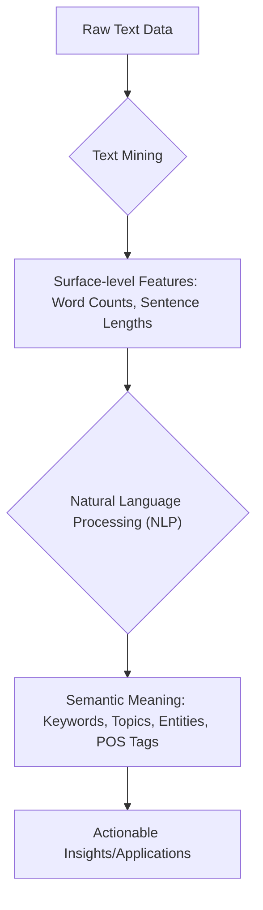
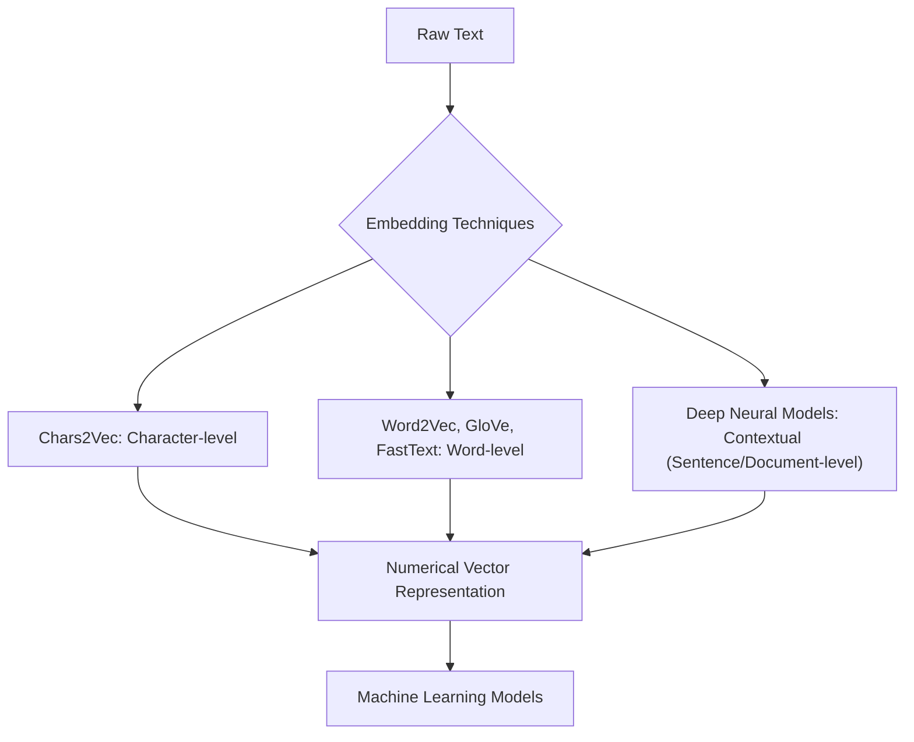

> [!summary] **Document Summary**
> This document explores [[Deep Natural Language Processing|Deep NLP]], distinguishing between [[Text Mining]] and [[Natural Language Processing (NLP)|NLP]]. It outlines key tools and libraries in Python (NLTK, Gensim, spaCy, Stanza, Transformers), Java, and JavaScript. Fundamental deep learning architectures such as [[Transformer]], [[BERT]], [[BART]], [[BigBird]], and the [[GPT Family]] are detailed, along with computational requirements and types of embeddings.

## Deep Natural Language Processing: Tools, Models, and Architectures

### Introduction to NLP and Text Mining

To understand [[Deep Natural Language Processing|deep natural language processing]], it is essential to distinguish between **Text Mining** and **Natural Language Processing (NLP)** and recognize their complementary relationship.

-   > [!definition] **Text Mining**
    > This process focuses on extracting patterns and insights from raw text by analyzing its surface-level features.
    -   **Example**: Counting the frequency of words in a document, measuring sentence lengths, or identifying common phrases. It primarily deals with the textual data as it appears.
-   > [!definition] **Natural Language Processing (NLP)**
    > In contrast, [[Natural Language Processing (NLP)|NLP]] delves deeper to process the underlying semantic meaning of human language. It aims to understand the intent and context behind the words.
    -   **Example**: Identifying keywords, determining the main topic of a paragraph, recognizing **named entities** (like people or organizations), or performing **Part-of-Speech (POS) tagging** to classify words by their grammatical role (e.g., noun, verb).
-   **Relationship**: [[Text Mining]] often serves as a preparatory step for [[Natural Language Processing (NLP)|NLP]]. It is used for initial data pre-processing and statistical feature extraction, providing structured data that [[Natural Language Processing (NLP)|NLP]] models can then interpret semantically. While [[Text Mining]] primarily works with text documents, [[Natural Language Processing (NLP)|NLP]] is designed to handle any form of human communication, including spoken language once transcribed.



### Research/Industrial Tools for NLP

The landscape of [[Natural Language Processing (NLP)|NLP]] tools is dominated by specific programming languages and libraries that have become industry standards due to their flexibility and extensive functionalities.

-   **Programming Language Standard**: Python has emerged as the de-facto standard programming language for [[Natural Language Processing (NLP)|NLP]] due to its rich ecosystem of libraries and frameworks.

#### Key Python Libraries

Several Python libraries are fundamental for various [[Natural Language Processing (NLP)|NLP]] tasks, ranging from basic text manipulation to advanced semantic modeling and deep learning integration.

-   > [!definition] **NLTK (Natural Language Toolkit)**
    > This is a comprehensive library for foundational, low-level text manipulation tasks.
    -   **Functionalities**:
        -   `Tokenization`: Breaking text into individual words or sentences.
            > [!example] NLTK Tokenization Example
            ```python
            import nltk
            from nltk.tokenize import word_tokenize
            text = "Hello world! This is NLTK."
            tokens = word_tokenize(text)
            print(tokens) # Output: ['Hello', 'world', '!', 'This', 'is', 'NLTK', '.']
            ```
        -   `Lemmatization`: Reducing words to their base or dictionary form.
            > [!example] NLTK Lemmatization Example
            ```python
            from nltk.stem import WordNetLemmatizer
            lemmatizer = WordNetLemmatizer()
            print(lemmatizer.lemmatize("running")) # Output: run
            print(lemmatizer.lemmatize("better", pos="a")) # Output: good (pos="a" for adjective)
            ```
        -   `Part of Speech tagging`: Identifying the grammatical category of each word.
        -   `Dependency tree parsing`: Analyzing the grammatical relationships between words in a sentence.
-   > [!definition] **Gensim (Generate Similar)**
    > This library is a reference for semantic text modeling, particularly effective for unsupervised topic modeling and word embedding.
    -   **Supports**:
        -   `Word2Vec`: A technique to learn word embeddings by predicting context words.
        -   `FastText`: An extension of [[Word2Vec]] that considers character n-grams, useful for out-of-vocabulary words.
        -   `Latent Semantic Analysis` (LSA, LSI, SVD): Techniques for identifying relationships between terms and documents by analyzing a matrix of term-document co-occurrences.
        -   `Non-negative Matrix Factorization` (NMF): A method for dimensionality reduction and topic modeling, where matrices are decomposed into non-negative components.
        -   `Latent Dirichlet Allocation` (LDA): A generative statistical model that explains why some parts of a document are similar to others, assuming documents are mixtures of various topics.
-   > [!definition] **spaCy**
    > A Python package designed for efficient [[Natural Language Processing (NLP)|NLP]] and [[Text Mining|text mining]], known for its speed and production readiness.
    -   **Features**: Supports over 25 languages, includes pre-trained `Word Vectors` (numerical representations of words), integrates seamlessly with deep learning frameworks, and provides a streamlined approach for building [[Natural Language Processing (NLP)|NLP]] pipelines.
-   > [!definition] **Stanza**
    > Developed by the Stanford [[Natural Language Processing (NLP)|NLP]] Group, [[Stanza]] offers highly accurate linguistic analysis tools.
    -   **Features**: It serves as a Python wrapper for `CoreNLP`, supports more than 80 languages, and provides a comprehensive suite of tools for [[Natural Language Processing (NLP)|NLP]] practitioners.
-   > [!definition] **Transformers**
    > This library from Hugging Face has become the de-facto standard for deep learning in [[Natural Language Processing (NLP)|NLP]].
    -   **Offers**: Access to thousands of pre-trained models, easy-to-use APIs for model deployment, and support for major deep learning frameworks like `Jax`, `PyTorch`, and `TensorFlow`. Its `Pipeline API` simplifies the process by combining pre-processing steps with various model tasks (e.g., sentiment analysis, text generation).
        > [!example] Hugging Face Transformers Pipeline API Example
        ```python
        from transformers import pipeline

        # Load a sentiment analysis pipeline
        classifier = pipeline("sentiment-analysis")
        result = classifier("I love using the Hugging Face Transformers library!")
        print(result)
        # Output: [{'label': 'POSITIVE', 'score': 0.9998781681060791}]
        ```

### Deep Learning Revolution in NLP

Deep learning has fundamentally transformed [[Natural Language Processing (NLP)|NLP]], moving from feature engineering to end-to-end learning with powerful neural network architectures.

-   Deep learning libraries are crucial as they provide the tools to define and implement complex **Neural Network (NN)** architectures.
-   Modern [[Natural Language Processing (NLP)|NLP]] models typically follow a `pre-training + fine-tuning` paradigm, where a model is first trained on a large dataset for a general task (pre-training) and then adapted to a specific task with a smaller, labeled dataset (fine-tuning).

#### Foundational Models and Architectures

A series of groundbreaking models have driven the deep learning revolution in [[Natural Language Processing (NLP)|NLP]], each introducing significant architectural innovations.

-   > [!definition] **The Transformer (Attention Is All You Need, 2017)**
    > This architecture revolutionized sequence modeling by introducing the `attention mechanism`. This mechanism allows the model to weigh the importance of different parts of the input sequence when processing each element, enabling it to capture global dependencies efficiently. Crucially, it facilitates parallelization, significantly speeding up training. `Multi-head attention` further enhances this by allowing the model to attend to different representation subspaces simultaneously.
    -   **Reference**: https://arxiv.org/abs/1706.03762
    -   **Key Concept**: Attention allows the model to "focus" on relevant parts of the input.
        **Example**: In a translation, the word "bank" can mean "river edge" or "financial institution" depending on the context. Attention helps the model understand which meaning is relevant by observing surrounding words.
-   > [!definition] **BERT (Bidirectional Encoder Representations from Transformers, 2018)**
    > [[BERT]] built upon the `Transformer` architecture by stacking multiple `transformer encoders`. Its introduction solidified the `pre-training + fine-tuning` (PT+FT) paradigm as the dominant approach in [[Natural Language Processing (NLP)|NLP]]. [[BERT]] is a `discriminative` model, meaning it is trained to predict masked words in a sentence and predict whether two sentences are consecutive, learning to understand context bidirectionally.
    -   **Reference**: https://arxiv.org/abs/1810.04805
-   > [!definition] **BART (Denoising Sequence-to-Sequence Pre-training for Natural Language Generation, Translation, and Comprehension, 2019)**
    > [[BART]] is a `generative-model` that utilizes a `Transformer` backbone. It employs a denoising autoencoder approach, where the `Encoder` maps corrupted input words to a vector representation, and the `Decoder` then produces the original word sequence from this vector. This makes it suitable for tasks like summarization and translation.
    -   **Reference**: https://arxiv.org/abs/1910.13461
-   > [!definition] **BigBird (Transformers for Longer Sequences, 2020)**
    > One limitation of the original `Transformer` was its quadratic dependency on sequence length for attention calculations, making it computationally expensive for very long texts. [[BigBird]] addresses this with `sparse attention`, reducing the complexity to linear. This significantly improves performance on [[Natural Language Processing (NLP)|NLP]] tasks involving long contexts, such as processing entire documents.
    -   **Reference**: https://arxiv.org/abs/2007.14062
-   > [!definition] **GPT Family (Generative Pre-trained Transformers)**
    > This family of models consists of `generative models` primarily trained with `next-word prediction`. They excel at generating coherent and contextually relevant text.
    -   **Family Progression**: The [[GPT Family|GPT]] series has seen rapid development, from `GPT-1` (released June 2018) to more recent iterations like `o4` (mini/high) (April 2025) and `GPT-5` (mini) (August 2025), continually increasing in size and capability.
    -   **Reference**: https://cdn.openai.com/research-covers/language-unsupervised/language_understanding_paper.pdf
    -   **Next-word prediction example**: Given the input "The cat sat on the...", a [[GPT Family|GPT]] model would predict "mat", "rug", "couch", etc., with different probabilities.
        > [!math] Next-word prediction probability
        $$P(\text{next word} | \text{previous words})$$
-   > [!definition] **Jurassic-1**
    > This model emerged as a significant `GPT-3` competitor, showcasing similar capabilities in large-scale language generation.
    -   **Reference**: https://www.wordtune.com/

### Computational Requirements for Deep Learning

Deep learning, especially with large-scale models, is inherently computationally expensive. Specialized hardware is essential for efficient training and inference.

-   `GPUs` (Graphics Processing Units) and `TPUs` (Tensor Processing Units) are critical for accelerating deep learning workloads. They offer parallel processing capabilities far superior to traditional CPUs, enabling faster matrix multiplications and tensor operations, which are fundamental to neural network computations.
-   **Reference**: For a detailed comparison of these platforms, refer to the paper: Benchmarking TPU, GPU, and CPU Platforms for Deep Learning - https://arxiv.org/abs/1907.10701

### Different Types of Embeddings

**Text embedding** is a crucial technique in [[Natural Language Processing (NLP)|NLP]], transforming words or sentences into numerical vector representations that capture their semantic meaning. These embeddings are vital for machine learning models.

-   > [!definition] **Chars2Vec**
    > This method embeds sequences of characters. It is particularly useful for tasks like spellcheckers or handling out-of-vocabulary words, as it can derive meaning from sub-word units.
-   > [!definition] **Word2Vec**, **GloVe**, **FastText**
    > These are widely used methods for embedding individual words. They represent words as dense vectors in a continuous vector space, where words with similar meanings are located closer together.
    -   **Word2Vec**: Learns embeddings by predicting context words or predicting a word from its context.
    -   **GloVe (Global Vectors for Word Representation)**: Combines global matrix factorization and local context window methods.
    -   **FastText**: Extends [[Word2Vec]] by considering character n-grams, making it robust to morphological variations and rare words.
-   > [!definition] **Deep neural models**
    > While not primarily designed solely for generating embeddings, the final-layer representations (or intermediate layers) within complex deep neural networks (like [[Transformer|Transformers]]) often provide highly accurate and context-aware embedded text representations. These "contextual embeddings" are dynamic and change based on the surrounding words.



### Interesting Projects and Tools

The [[Natural Language Processing (NLP)|NLP]] ecosystem is rich with projects and tools across various programming languages, supporting different aspects of research and development.

#### Python

Python continues to be the primary language for [[Natural Language Processing (NLP)|NLP]] innovation, with several powerful libraries and frameworks.

-   **Sentence-BERT**: A Python framework that provides state-of-the-art sentence, text, and even image embeddings. It is known for its ease of use and good performance (e.g., capable of processing 900 sentences per second on a GPU). It also offers numerous pre-trained multi-lingual models.
    -   **Reference**: https://www.sbert.net/
-   **Transformer-Interpret**: This tool is designed for model explainability within the `transformers` package. It offers plug-and-play functionality with state-of-the-art deep learning models, providing visualizations for understanding model decisions, compatible with notebooks and HTML outputs.
    -   **Reference**: https://github.com/cdpierse/transformers-interpret
-   **Hugging Face Transformers**: The primary library for [[Transformer|Transformer]] models.
    -   **Link**: https://huggingface.co/transformers
-   **AllenNLP**: An open-source [[Natural Language Processing (NLP)|NLP]] research library built on PyTorch.
    -   **Link**: https://allennlp.org/
-   **Stanza**: Stanford's [[Natural Language Processing (NLP)|NLP]] library for Python.
    -   **Link**: https://stanfordnlp.github.io/stanza/

#### Java

Java also has a strong presence in [[Natural Language Processing (NLP)|NLP]], particularly with established academic and enterprise-grade tools.

-   **Stanford NLP**: A suite of [[Natural Language Processing (NLP)|NLP]] tools from Stanford University, including parsers, taggers, and named entity recognizers.
    -   **Link**: https://nlp.stanford.edu/software/index.html
-   **NLP4J**: An open-source natural language processing library for Java.
    -   **Link**: https://emorynlp.github.io/nlp4j/
-   **Apache OpenNLP**: A machine learning based toolkit for processing natural language text.
    -   **Link**: https://opennlp.apache.org/

#### Other Languages

[[Natural Language Processing (NLP)|NLP]] tools are also available in other programming languages, catering to specific use cases or environments.

-   **Compromise**: A lightweight JavaScript framework specifically designed for browser-based [[Natural Language Processing (NLP)|NLP]] tasks, making it suitable for client-side applications.
    -   **Reference**: http://compromise.cool/
-   **NLP.js**: Another comprehensive JavaScript library for [[Natural Language Processing (NLP)|NLP]], offering a wide range of functionalities.
    -   **Link**: https://github.com/axa-group/nlp.js
-   **wordVectors**: An R package for working with word embeddings.
    -   **Link**: https://github.com/bmschmidt/wordVectors

### Practical Resources

For those looking to dive deeper into practical applications and hands-on learning, several resources are available.

-   **Intro to Text Mining and NLP tools**: This Google Colab notebook provides an introductory guide to various [[Text Mining|text mining]] and [[Natural Language Processing (NLP)|NLP]] tools.
    -   **Link**: https://colab.research.google.com/drive/1q3wNlojAEBaGz-Jd6bh6U1Z-9MjvKbPm
-   **Deep dive into Hugging Face**: This resource offers a more in-depth exploration of the Hugging Face ecosystem, particularly its [[Hugging Face Transformers|Transformers]] library.
    -   **Link**: https://colab.research.google.com/drive/1RxJEp2sod1uRUnltWm2oJVL2h2M3Urlq