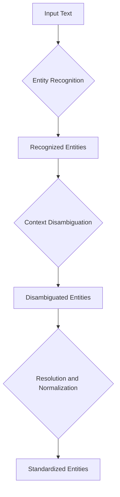
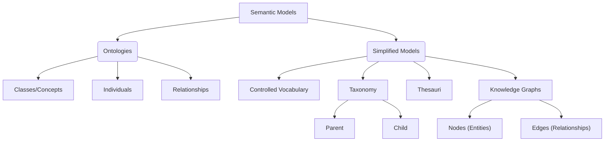
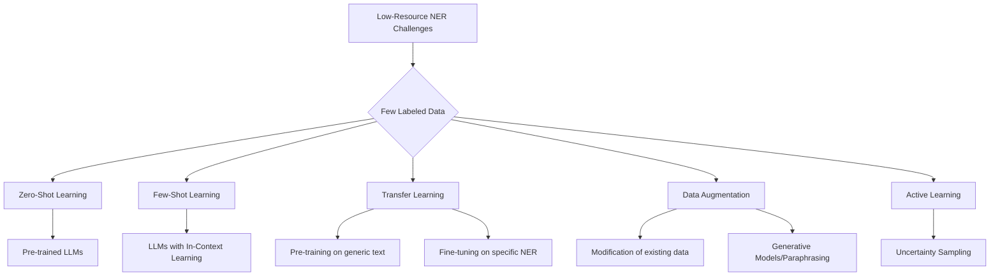

> [!summary] **Document Summary**
> This document provides a comprehensive overview of **NERD** (Named Entity Recognition and Disambiguation) within the context of Deep Natural Language Processing. It explores the fundamental components of recognition, disambiguation, and resolution, practical applications across various sectors, and different methodologies, ranging from rule-based and knowledge-based models to Machine Learning and Transformer-based approaches. It also discusses challenges and solutions for low-resource contexts and performance metrics for evaluating NER systems.

# Named Entity Recognition and Disambiguation (NERD) in Deep NLP

This document presents an overview of **NERD** (Named Entity Recognition and Disambiguation) in Deep Natural Language Processing, as illustrated by Prof. Luca Cagliero from Politecnico di Torino.

## Lesson Objective

The objective is to cover the definition of **NERD**, its applications, and the different methodologies for identifying and disambiguating entities: **Rule-based NER**, **Knowledge-based NER**, **Machine Learning-based NER**, and **Transformer-based NER**.

## Fundamental Components of NERD

**NERD** is a composite process that includes three main components, each with a specific role:

### Recognition
> [!definition] **Recognition**
> Recognition is the process of identifying **named entities** within a text. These entities are references to people, places, organizations, dates, etc.

> [!example] **Example of Recognition**
> In a sentence like "Barack Hussain Obama II was born in Honolulu," recognition would identify "Barack Hussain Obama II" as a person and "Honolulu" as a location.

### Disambiguation
> [!definition] **Disambiguation**
> Disambiguation consists of distinguishing the different meanings that the same entity can assume, based on the context. This is crucial when a name can refer to multiple real-world concepts.

> [!example] **Example of Disambiguation**
> The word "Cars" can refer to the animated movie "Cars (movie)" or the general concept of "Cars (vehicles)." Disambiguation determines which meaning is appropriate in the given context.

### Resolution
> [!definition] **Resolution**
> Resolution deals with correcting typographical errors (typos) and normalizing identified entities, bringing them back to their canonical or standardized form.

> [!example] **Example of Resolution**
> If "Obama Barackk" appears in a text, resolution would correct and normalize it to "Barack Hussain Obama II," ensuring consistency and accuracy.

## Purpose of NERD

The main goal of **NERD** is to find semantic references to specific real-world entities within the text. This allows systems to better understand the content and extract meaningful information.

### Applications of NERD

**NERD** finds application in various fields, improving the efficiency and accuracy of natural language processing systems:

#### Business Intelligence
- **Purpose**: **NERD** supports strategic decisions by transforming unstructured business data (such as reports, emails, customer feedback) into structured, actionable information.
- **Example**: Analyzing millions of product reviews to identify key entities (product names, features, competitor companies) and the associated sentiment, providing insights for new product development or marketing strategies.

#### Information Retrieval
- **Purpose**: [[Information Retrieval]] (IR) systems access large collections of documents through `full-text search` or `metadata-based search`. **NERD** improves result relevance by identifying and indexing named entities.
- **Example**: A search engine like Google uses **NERD** to understand that a query like "museums in Florence" should retrieve documents talking about specific museums located in the city of Florence, not just documents that contain the words "museums" and "Florence" generically.

#### Text Classification
- **Purpose**: Text classification involves assigning unlabelled texts to predefined classes, using annotated training data. **NERD** can provide additional features to improve classification accuracy.
- **Applications**:
    - `Sentiment analysis`: Determining the emotional tone (positive, negative, neutral) of a text.
    - `Topic discovery`: Identifying the main topics of a document.
    - `Language identification`: Recognizing the language of a text.
    - `Hate speech detection`: Identifying hate speech.
    - `Intent detection`: Understanding a user's intention.

#### Intent Detection
- **Purpose**: Understanding the actions a user intends to perform, using **NER** to identify relevant entities and **NED** to link them to specific concepts.
- **Example**: Given the query "What is the weather in Rome?", **NER** identifies "Rome" as an entity of type `LOC` (location). Subsequently, **NED** links "Rome" to the specific entity `/wiki/Rome` (the city of Rome) in a knowledge base, allowing the system to retrieve the correct weather forecasts for that city.

#### Question Answering
- **Purpose**: Providing natural language answers to questions, through a process that includes `question classification`, `information retrieval`, and `answer extraction`. It also includes `Visual QA` (visual question answering).
- **Example**: If a user asks "Who wrote 'War and Peace'?", **NERD** identifies "War and Peace" as a literary work and helps the system find the associated author, "Leo Tolstoy."

#### Summarization
- **Purpose**: Producing concise versions of multimodal content (texts, images, videos), incorporating the most salient information. **NERD** helps identify key entities and their attributes, which are often crucial elements to include in the summary.
- **Example**: Summarizing a long news article by identifying the protagonists (people), the locations of the events, and the organizations involved, ensuring that these essential elements are present in the concise version.

## Entity Recognition

### Purpose and Definition
- **Main Goal**: To recognize **entities**, which are identifiable single-word or multi-word forms within a text. These entities are specific elements that carry meaning.
- **Example**: In the phrase "Book a ticket for the movie," "movie" is an entity indicating a category of entertainment.

### Named Entities
- **Definition**: **Named entities** are real-world objects (such as people, places, organizations) that connect to specific and unique concepts in the real world. They are not just categories but specific instances.
- **Example**: "Leonardo da Vinci" is a specific person, "Paris" is a specific location.

### Named Entity Recognition Process
- The process consists of identifying and classifying named entities into predefined categories. This goes beyond simple word recognition, including its semantic categorization.

### Example of Entity Recognition (Spacy NER)
`Spacy NER` (https://spacy.io/) is a popular Python framework for natural language processing that uses predefined entity types for classification. These standardized types help categorize entities consistently.

- **Common entity types used by Spacy**:
    - `PERSON`: Names of people (e.g., "Barack Obama").
    - `NORP`: Nationalities, religious, or political groups (e.g., "Italian," "Republican").
    - `FAC`: Structures (e.g., "Eiffel Tower").
    - `ORG`: Organizations (e.g., "Google," "United Nations").
    - `GPE`: Geopolitical entities (countries, cities, states) (e.g., "Italy," "Rome").
    - `LOC`: Non-GPE locations (mountains, rivers) (e.g., "Mount Everest").
    - `PRODUCT`: Products (e.g., "iPhone").
    - `EVENT`: Named events (e.g., "Olympics").
    - `WORK_OF_ART`: Works of art (books, songs) (e.g., "The Mona Lisa").
    - `LAW`: Legal documents (e.g., "Constitution").
    - `LANGUAGE`: Languages (e.g., "English").
    - `DATE`: Absolute or relative dates (e.g., "January 1, 2023," "yesterday").
    - `TIME`: Times of day (e.g., "three in the afternoon").
    - `PERCENT`: Percentages (e.g., "50%").
    - `MONEY`: Currencies (e.g., "100 euros").
    - `QUANTITY`: Measurements (e.g., "10 kilograms").
    - `ORDINAL`: Ordinal numbers (e.g., "first," "second").
    - `CARDINAL`: Cardinal numbers (e.g., "one," "two").

#### Spacy NER Case Study
Consider the sentence: "Politecnico di Torino... Founded in 1859...".
- `Spacy NER` might recognize "Politecnico di Torino" as `ORG` (Organization).
- "Torino" might be recognized as `GPE` (Geopolitical Entity).
- If the sentence included "Italy," this would also be `GPE`.

**Potential problems**:
- **Missing Entities**: The system might not recognize "Politecnico di Torino" if it's not present in its model, or it might ignore the date "1859" if it's not configured to extract specific foundation dates as entities.
- **Incorrect Spans**: It might identify only "Politecnico" instead of "Politecnico di Torino," or include irrelevant words.

## Semantic Models

### Ontologies
> [!definition] **Ontologies**
> **Ontologies** are machine-readable semantic models that describe the world unambiguously. They are used for automated reasoning and structuring knowledge.

- **Key elements**:
    - `Classes or concepts`: Nodes representing general categories (e.g., "Person," "City").
    - `Individuals`: Specific instances of classes (e.g., "Luca Cagliero" is an individual of the class "Person").
    - `Relationships`: Edges connecting concepts or individuals, describing their interactions (e.g., "Luca Cagliero" *works_at* "Politecnico di Torino").
    - `Links to descriptors`: Properties that enrich entities (e.g., `dcterms:title` for a document title).
- **Detailed components**:
    - `Individuals`: Concrete instances in the world.
    - `Classes`: Collections or types of individuals.
    - `Attributes`: Properties describing individuals or classes (e.g., "name," "age").
    - `Relationships`: Links between individuals or classes (e.g., "is_part_of," "has_author").
    - `Events`: Actions or occurrences (e.g., "birth," "foundation").
    - `Function terms`: Expressions that map individuals to a value.
    - `Restrictions`: Conditions that must be met.
    - `Rules`: Logical inferences.
    - `Axioms`: Statements true by definition.

### Why Semantic Models?
- Semantic models are essential for explicitly modeling semantic relationships between concepts (through vocabularies, taxonomies, ontologies).
- They were crucial for traditional NLP and continue to be used in Deep NLP to provide structured knowledge.

### Do we always need ontologies for NER?
- Often, for **NER**, modeling only a subset of objects and relationships is sufficient. In these cases, simplified relationships and *ad hoc* search tools may suffice, as full ontology querying can be computationally expensive.

### Simplified Semantic Models (when ontologies are unavailable or unnecessary)

#### Controlled Vocabulary
> [!definition] **Controlled Vocabulary**
> A predefined list of terms or phrases used to describe concepts. It serves to prevent linguistic errors and standardize terminology.

- **Example**: A vocabulary of standardized medical terms to avoid ambiguous synonyms.

#### Taxonomy
> [!definition] **Taxonomy**
> A hierarchical representation of concepts within a controlled vocabulary, specific to a given subject. It uses `Parent` (broader term) and `Child` (more specific term) relationships.

- **Example**:
    - `Animal` (Parent)
        - `Mammal` (Child of Animal, Parent of Dog)
            - `Dog` (Child of Mammal)
            - `Cat` (Child of Mammal)

#### Thesauri
> [!definition] **Thesauri**
> Extended models of taxonomies, specific to a subject, which also include synonymy, antonymy, and related term relationships, in addition to `Parent` and `Child` relationships.

- **Example**: A medical thesaurus indicating that "myocardial infarction" is a preferred term over "heart attack," and that "hypertension" is related to "cardiovascular diseases."

#### Knowledge Graphs (Semantic Networks)
> [!definition] **Knowledge Graphs**
> Interconnected networks of real-world entities, often stored in graph databases. They represent knowledge in a structured and relational way.

- **Components**:
    - `Nodes`: Represent objects, events, or concepts (e.g., "Rome," "Colosseum," "is_located_in").
    - `Edges`: Represent the relationships between nodes (e.g., "Colosseum" *is_located_in* "Rome").

## The Semantic Web
- **Definition**: An extension of the [[World Wide Web]], promoted by [[W3C]] standards, aiming to make Internet data machine-readable and interpretable.

### Resource Description Framework (RDF)
- **Concept**: `Resource` corresponds to a `Uniform Resource Identifier (URI)`, which uniquely identifies an entity on the web.
- **Structure**: RDF data is expressed as triples `<Subject – Predicate – Object>`.
    - `Subject`: The resource being talked about (e.g., `http://example.org/person/Luca`).
    - `Predicate`: The property or relationship describing the subject (e.g., `http://purl.org/dc/elements/1.1/creator`).
    - `Object`: The value of the property, which can be another resource or a literal string (e.g., `http://example.org/book/NERD` or `"Luca Cagliero"`).
- **Syntax**: `RDF/XML` uses the XML format to represent triples; `RDF` is the underlying data model.
- **Purpose**: Designed to be machine-readable, not for direct human visualization.
- **Examples of use**:
    - Describing the properties of items in an online store.
    - Specifying event times on the web.
    - Providing detailed information on web pages.
    - Describing the content and rating of images.
    - Improving content for search engines.
    - Building electronic libraries with rich metadata.

## Named Entity Disambiguation (NED)
- **Purpose**: **NED** aims to link an entity mention (a text string) to a specific and unique concept within an ontology or knowledge base.
- **Distinction from NER**:
    - **NER** (Named Entity Recognition) classifies a text string into a generic category (e.g., "Rome" is a `LOC`).
    - **NED** (Named Entity Disambiguation) goes further, linking that text string to a specific instance in the real world (e.g., "Rome" is linked to the entity `dbpedia:Rome` or `wikidata:Q220`, distinguishing it from other entities with the same name). This requires understanding the context in which the entity appears.

## Approaches to NER

There are two main macro-categories of approaches for Named Entity Recognition, distinguished by their methodology:

### 1. Knowledge Engineering
This approach relies on the manual creation of rules or the use of pre-existing knowledge bases.
- `Rule-based NER`
- `Ontology-based NER`

### 2. Machine Learning-based NER
This approach uses machine learning algorithms to learn entity recognition patterns from labelled data.
- `Standard classifiers`: [[Neural Networks (NNs)]], [[k-Nearest Neighbors (kNN)]], [[Support Vector Machines (SVMs)]], [[Bayesian Classifiers]].
- `Sequential models`: [[Recurrent Neural Networks (RNNs)]], [[Long Short-Term Memory (LSTMs)]], [[Transformers]].

### Comparison of Approaches
A comparative table highlights the key differences between the two main approaches:

| Feature          | Knowledge Engineering             | Machine Learning-based NER        |
|------------------|-----------------------------------|-----------------------------------|
| Precision        | High                              | High recall                       |
| Rules            | Manual generation                 | No manual rules created           |
| Training Data    | Small quantity needed             | Large quantity needed             |
| Domain Dependence| Strong domain dependence          | Does not depend on semantic models|
| Development Cost | Expensive                         | -                                 |

### Rule-based NER
- **Mechanism**: Uses regular expressions (regex) and linguistic patterns to identify and classify entities. It is often domain-specific.
- **Advantages**: Improves generalization compared to purely resource-based systems.
- **Limitations**: Fails in open (generic) domains due to the continuous emergence of new proper names not foreseen by the rules.
- **Examples of rules for people**:
    - Sequences of capitalized words (e.g., "Mario Rossi").
    - Title prefixes (e.g., "Dr.", "Prof.").
    - Initials (e.g., "G. B.").
    - Designation indicators (e.g., "CEO", "President").
    - Excludes non-alphabetic special characters.
- **Components of Regular Expressions**:
    - `\w`: Matches any alphanumeric character (letters, numbers, underscore).
    - `\d`: Matches any digit (0-9).
    - `\s`: Matches any whitespace character (space, tab, newline).
    - `.`: Matches any single character (except newline).
    - `\b`: Matches a word boundary.
    - `^`: Start of the string.
    - `$`: End of the string.
    - `?`: Matches 0 or 1 occurrence of the preceding character/group.
    - `+`: Matches 1 or more occurrences of the preceding character/group.
    - `{min,max}`: Matches a number of occurrences in the specified range.
- **Example of Regular Expression**: `^P[a-z][aeiou]`
    - This regex matches strings starting with 'P', followed by a lowercase letter and then a lowercase vowel.
    - Example: "Pino", "Paolo".
- **Challenges**:
    - **Entity variants**: "Luca Cagliero" vs. "Prof. Cagliero."
    - **Ambiguous names**: "Felice Buonanno" (could be a name or a greeting).
    - **Capitalization issues**: "Apple" (company) vs. "apple" (fruit).
    - **Nested entities**: "President of the [Italian Republic]" where "Italian Republic" is an entity within a larger one.
    - Requires *ad hoc* resolution to handle these complexities.

#### Enhanced Rule-based NER
- Combines regular expressions with NLP pre-processing techniques, such as:
    - `Part-of-speech (POS) tagging`: Assigning grammatical labels (e.g., noun, verb, adjective) to each word.
    - `Syntactic parsing`: Analyzing the grammatical structure of the sentence.
    - `Text-to-audio`: Converting text to audio (less common for NER, but useful in multimodal contexts).
    - Semantic word categories (e.g., `WordNet`): Using dictionaries of synonyms and semantic relationships.

### Knowledge-based NER
- **Mechanism**: Leverages existing, domain-specific knowledge graphs or ontologies.
- **Effectiveness**: Very high when ontological resources are complete and exhaustive.
- **Limitations**: Fails if entities are not present in the knowledge base used.
- **Examples of Ontologies/Knowledge Bases**:
    - `Yago`: Built from Wikipedia, WordNet, and GeoNames, containing over 10 million entities and 120 million facts.
    - `NERD`: Manually mapped taxonomies (e.g., `Thing`, `Person`).
    - `DBPedia`: Structured information crowdsourced from Wikipedia.
    - `Natural Language Toolkit (NLTK)`: Python platform for human language data, provides interfaces to corpora (like WordNet) and text processing libraries.
    - `Wikidata`: A free, open, and multilingual knowledge base that organizes knowledge into `items` (Qxy), `properties`, and `values`.

### Machine Learning-based NER
- **Mechanism**: Applies a [[Machine Learning]] pipeline to learn a predictive model from labelled data, generated by human annotations.

#### Phases of ML-based NER
1.  **Tokenization**: The text is split into smaller units called tokens (words, punctuation).
    - **Example**: "Politecnico di Torino" $\rightarrow$ ["Politecnico", "di", "Torino"]
2.  **Human Annotation**: Human annotators label the tokens with `BIO` prefixes (Beginning, Inside, Outside) to indicate the start, middle, or outside of an entity, and its category.
    - **Example**:
        - "Il" - O (Outside)
        - "Politecnico" - B-ORG (Beginning of Organization)
        - "di" - I-ORG (Inside of Organization)
        - "Torino" - I-ORG (Inside of Organization)
3.  **Feature Engineering**: Features are extracted from each token and its context to help the model make predictions.
    - **Example**:
        - `Word`: "Politecnico"
        - `POS (Part-of-Speech)`: Noun
        - `Symbol Count`: Number of characters, presence of capitalization.
        - `Is Capitalized?`: True
        - `Is a number?`: False
4.  **Classifier Training**: The model is trained on a labelled `training dataset`, learning to map the extracted features to entity labels.

#### Sequence Labeling for NER
- **Method**: Each token is classified using information about surrounding tokens, often through a `sliding window` that considers a limited context.
- **Techniques**:
    - [[Recurrent Neural Networks (RNNs)]]: Suitable for sequential data.
    - [[LSTMs (Long Short-Term Memory)]]: A variant of RNNs that better handles long-term dependencies.
    - `Hidden Markov Models (HMMs)`: Statistical models for sequences.
    - `Conditional Random Fields (CRFs)`: Discriminative models for sequence labelling.

#### Deep Learning-based NER
- Often uses existing Knowledge Graphs to enrich entity representations or guide the disambiguation process.

### Transformer-based NER
- **Mechanism**: Uses an `attention-based architecture`, allowing the model to weigh the importance of different parts of the input. Pre-trained models are then `fine-tuned` for the specific **NER** task.
- **Example**: [[BERT]] (Bidirectional Encoder Representations from Transformers) is a prominent example.

#### LUKE Architecture (Language Understanding with Knowledge-Based Embeddings)
- **Concept**: A state-of-the-art **NER** model (presented at EMNLP’20) that uses attention mechanisms to model relationships between words and entities.
- **Foundation**: Based on a pre-trained `BERT Masked Language Model`.
- **Pre-trained Representations**: Generates contextualized representations of words and entities using Wikipedia, where hyperlinks serve as entity annotations.
- **Extended Masked Language Model**: Predicts not only masked words but also masked entities.
- **Entity Handling**: Entities are treated as independent tokens. `LUKE` calculates intermediate and output representations for both words and entities, explicitly modeling their relationships through attention.
- **Input Embeddings**:
    - `Token embedding`: Vector representation of each word.
    - `Position embedding`: Information about the position of each token in the sequence.
    - `Entity type embedding`: Information about the entity type (if applicable).
- **Entity-aware attention mechanism**: Connects tokens based on attention scores, allowing the model to focus on the most relevant relationships.

### Prompt-based NER
- **Mechanism**: Uses `LLMs` (Large Language Models) with specific `prompts` and examples. Instead of training a model from scratch, the request is formulated so that the LLM can extract the entities.
- **Methods**:
    - Adopting pre-trained models and using them directly with prompts.
    - `Fine-tuning` pre-trained `LLMs` for the specific **NER** task.

## Challenges and Solutions for Low-Resource NER

- **Challenge**: Neural Networks require large amounts of training data, which is expensive to annotate and can introduce bias.

### Possible Solutions:

#### Zero-Shot Learning
- **Concept**: Pre-trained models are able to assign classes to elements never seen before during training.
- **Application in NER**: Detecting new entity types for which there is no specific training data.
- **Common use**: Pre-trained `LLMs` can be used without specific training data for the task.

#### Few-Shot Learning
- **Concept**: Building accurate models with a very limited amount of training data, often through data transformations or algorithmic changes.
- **Suitability**: Particularly effective with `LLMs` that support `in-context learning`, where the model learns from a few examples provided directly in the prompt.

#### Transfer Learning
- **Concept**: Applying knowledge acquired from one task (or domain) to a related task (or domain).
- **Use with Deep Networks**: A model is pre-trained on a vast generic text corpus, then `fine-tuned` on a smaller, specific **NER** dataset. This is particularly effective with [[Transformers]].

#### Data Augmentation
- **Concept**: Artificially increasing the amount of training data by modifying existing data or using generative models/paraphrasing (e.g., `Seq2Seq`).
- **Caveats**:
    - Modifications can alter entity classification.
    - Risk of introducing bias or errors into the augmented data.

#### Active Learning
- **Concept**: A form of semi-supervised learning in which the learning system actively chooses the most informative data to be labelled by an oracle (often a human annotator).
- **Open questions**:
    - What makes data "informative"?
    - How are the most informative data recognized?
- **Possible approach**: `Uncertainty sampling`, where the model selects examples for which its predictions are least reliable.

## Performance Metrics for NER

Evaluating the performance of an **NER** system is fundamental to understanding its effectiveness. Two main types of evaluation are distinguished:

### Exact Evaluation
This evaluation requires a perfect match between the entities recognized by the system and those present in the `Ground Truth` (the manually annotated baseline truth).

- `Precision`: The proportion of correctly recognized named entities by the system relative to all entities the system identified.
    $$Precision = \frac{\text{True Positives}}{\text{True Positives} + \text{False Positives}}$$
    - **Example**: If the system identifies 10 entities, and 8 of them are correct, the precision is $8/10 = 0.8$.
- `Recall`: The proportion of relevant named entities (present in the Ground Truth) that were correctly retrieved by the system.
    $$Recall = \frac{\text{True Positives}}{\text{True Positives} + \text{False Negatives}}$$
    - **Example**: If there are 12 entities in the Ground Truth, and the system correctly identifies 8 of them, the recall is $8/12 \approx 0.67$.
- `F1-score`: The harmonic mean of precision and recall, providing a balanced measure of performance.
    $$F1\text{-}score = 2 \times \frac{Precision \times Recall}{Precision + Recall}$$
    - **Example**: With precision $0.8$ and recall $0.67$, the F1-score is $2 \times \frac{0.8 \times 0.67}{0.8 + 0.67} \approx 0.73$.

#### How to handle multi-class
When there are multiple entity classes (e.g., PERSON, LOC, ORG), two approaches can be used to aggregate the metrics:

- `Macro-Average`: Calculates the metric (precision, recall, F1-score) for each single class and then averages them. Each class has the same weight.
    $$Macro\text{-}Avg = \frac{1}{N} \sum_{i=1}^{N} \text{Metric}_i$$
    where $N$ is the number of classes.
- `Micro-Average`: Calculates the metrics by aggregating the True Positives, False Positives, and False Negatives of all classes, and then calculates precision, recall, and F1-score on these totals. It gives the same weight to each individual sample.
    $$Micro\text{-}Avg\ Precision = \frac{\sum \text{TP}_i}{\sum \text{TP}_i + \sum \text{FP}_i}$$
    $$Micro\text{-}Avg\ Recall = \frac{\sum \text{TP}_i}{\sum \text{TP}_i + \sum \text{FN}_i}$$

### Relaxed Evaluation
Considers partial matching, going beyond strict classification or exact boundary.

#### Common Strategies

##### Message Understanding Conference (MUC)
- **Concept**: Compares system responses with the `Ground Truth` (manually annotated entities).
- **Categories of errors/corrections**:
    - `Correct (COR)`: The entity was correctly identified in both boundary and type.
    - `Incorrect (INC)`: The entity was identified, but with an incorrect boundary or type.
    - `Partial (PAR)`: The entity was identified, but only partially correct in the boundary.
    - `Missing (MIS)`: An entity present in the Ground Truth was completely missed by the system.
    - `Spurious (SPU)`: The system identified an entity that does not exist in the Ground Truth (false positive).

##### Semantic Evaluation Workshop (SemEval)
- **Concept**: Uses four precision/recall/F1-score measures based on the `MUC` model, with different levels of relaxation.
- **Metrics**:
    - `Strict`: Requires an exact match of the entity boundary AND its type.
    - `Exact`: Requires an exact match of the entity boundary, but the type can be any.
    - `Partial`: Requires a partial match of the entity boundary, and the type can be any.
    - `Type`: Requires only an overlap of the entity (even minimal), and the type can be any.