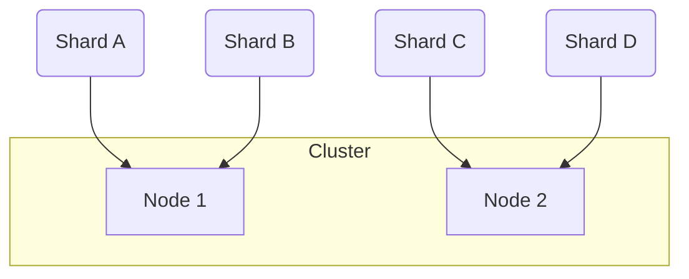

> [!summary] **Document Summary**
> Questo documento esplora l'[[Information Retrieval]] (IR), la ricerca web e [[ElasticSearch]], un motore di ricerca e analisi distribuito. Vengono trattati i modelli di recupero booleani e a spazio vettoriale, l'indicizzazione invertita e le sfide della ricerca web. Infine, si introduce la [[Semantic Search]] con [[Sentence-BERT]] (SBERT) e le future integrazioni di [[ElasticSearch]] con i modelli [[Retrieval Augmented Generation]] (RAG).

## Deep NLP: Information Retrieval, ElasticSearch & Semantic Search

### Lecture Goals
This lecture aims to cover three core topics:
- [[Information Retrieval]] (IR)
- [[Web Search]]
- [[ElasticSearch]]

### Information Retrieval (IR)
> [!definition] **Information Retrieval**
> **Information Retrieval** is the process of finding unstructured material, such as documents or text, from large collections stored on computers, that effectively satisfies a user's information need.
- This definition is based on the work of Christopher D. Manning, Prabhakar Raghavan, and Hinrich Schütze in their book *Introduction to Information Retrieval*, Cambridge University Press, 2008.

#### What does "search" mean?
The process of searching typically involves several key steps:
1.  **Take a query string**: The user provides a string of words or phrases.
2.  **Match it against documents**: This involves using **full-text search** techniques and considering **synonyms** to find relevant documents.
3.  **Calculate relevant results**: Determine which documents are pertinent to the query.
4.  **Score documents by relevance**: Assign a numerical score to each matching document, indicating how well it matches the query.
5.  **Display a sorted list**: Present the documents to the user in order of their relevance score, usually from most to least relevant.

#### Boolean Retrieval Model
**Goal**: The primary goal of the **Boolean Retrieval Model** is to avoid the computationally expensive process of scanning every piece of text for each query.
**Solution**: To achieve this, documents are indexed in advance, creating a structured representation that allows for faster searching.
**Method**: Queries in this model are constructed using Boolean expressions, which combine search terms with logical operators such as `AND`, `OR`, and `NOT`.
- **Example**: A query like "Ceasar AND Brutus" will retrieve only those documents that contain both the term "Ceasar" and the term "Brutus".

##### Term-document Incidence Matrix
This model uses a binary index, known as a **term-document incidence matrix**, to represent the presence or absence of terms in documents, thereby avoiding the need for full text scanning.
- **Example**: Consider a query `Brutus AND Ceasar AND NOT Calpurnia`. If we represent the presence of terms in documents as binary vectors, we can perform a bitwise logical operation.
    - Let's assume the following binary vectors for terms across a set of documents:
        - `Brutus`: $110100$ (meaning it appears in document 1, 2, 4)
        - `Ceasar`: $110111$ (meaning it appears in document 1, 2, 4, 5, 6)
        - `Calpurnia`: $010000$ (meaning it appears only in document 2)
    - The complement of `Calpurnia` would be $101111$.
    - The query `Brutus AND Ceasar AND NOT Calpurnia` translates to the bitwise operation: $110100 \text{ AND } 110111 \text{ AND } 101111$.
    - This calculation yields the result $100100$.
    - If document 1 is "Anthony and Cleopatra" and document 4 is "Hamlet", then these would be the resulting documents.

##### Drawbacks of Boolean Retrieval Model
Despite its simplicity, the **Boolean Retrieval Model** has several limitations:
- **Sparse representation**: The term-document incidence matrix can be very large and contain many zeros, making it inefficient for storage and processing.
- All terms weigh equally: It treats all search terms with the same importance, regardless of their frequency or significance, which often doesn't reflect actual relevance.
- Captures only syntactic text similarities: It only considers the exact presence or absence of words, failing to understand the underlying meaning or semantic relationships between terms.

##### Solutions to Drawbacks
To address these drawbacks, more advanced techniques are employed:
- **Model sparseness**: The [[Inverted Index|Inverted index]] is used, which stores only the occurrences of terms (the '1's), making it much more efficient.
- **Text similarities**: Instead of just '0's and '1's, models like [[BERT]] score can store **semantic similarities**, allowing for a deeper understanding of text meaning.
- **Term weighting**: [[TF-IDF]] (**Term Frequency-Inverse Document Frequency**) weights are introduced to assign different levels of importance to terms based on their frequency in a document and across the entire collection.
- **Syntactic-only text similarities**: To move beyond simple word matching, **semantic similarity measures** (e.g., [[BERT]] score) are utilized to gauge how conceptually similar documents are to a query.

#### Inverted Index
> [!definition] **Inverted Index**
> An **Inverted Index** is a data structure that significantly accelerates data retrieval, functioning similarly to indices found in relational databases.
- Every [[ElasticSearch]] document field is indexed by default. This means that for each field, an inverted index is created.
- All inverted indices are used during search operations to quickly locate relevant documents.
- Conversely, non-indexed fields are not searchable, as there is no pre-built structure to query them efficiently.
- **Full-text indexing**: [[ElasticSearch]] automatically builds an inverted index on every full-text field. This index lists all unique words found in the collection and, for each word, records the documents in which it appears.
    - > [!example] Inverted Index Example
        | Term      | Document IDs |
        |-----------|--------------|
        | "apple"   | [Doc1, Doc3] |
        | "banana"  | [Doc2]       |
        | "orange"  | [Doc1, Doc2] |

### Web Search
[[Web Search]] presents unique challenges due to the nature of the internet.

#### Challenges
- **Decentralized content publishing**: Anyone can publish content, leading to a vast and unorganized collection of information.
- **No central authorship control**: There's no single authority overseeing the quality or accuracy of web content.
- **Content in diverse languages and dialects**: The web hosts content in countless languages and regional variations, complicating search and relevance ranking.

#### Web as a Graph
The structure of the web can be effectively modeled as a directed graph:
- Web pages are represented as **nodes**.
- Hyperlinks between pages are represented as **edges**.
This graph structure is crucial for addressing web search challenges and is analyzed using **graph ranking algorithms** such as [[PageRank]] and [[HITS]] to determine the importance and authority of web pages.

#### Additional Reading
- **PageRank**: For a deeper understanding of [[PageRank]], refer to *The Anatomy of a Large-Scale Hypertextual Web Search Engine* by Sergey Brin and Lawrence Page. Computer Networks, vol. 30 (1998), pp. 107-117.
    - Download: https://snap.stanford.edu/class/cs224w-readings/Brin98Anatomy.pdf
- **HITS**: For insights into the [[HITS]] algorithm, consult Kleinberg, Jon (1999). "Authoritative sources in a hyperlinked environment" (PDF). Journal of the ACM. 46 (5): 604-632. doi:10.1145/324133.324140.
    - Download: http://www.cs.cornell.edu/home/kleinber/auth.pdf

### ElasticSearch
> [!definition] **ElasticSearch**
> **ElasticSearch** is a real-time, distributed search and analytics engine designed for horizontal scalability and efficient data exploration.

It offers a wide range of capabilities:
- **Full-text search**: This includes features like highlighted snippets in results, search-as-you-type suggestions, "did-you-mean" corrections, and "more-like-this" functionality to find similar documents.
- **Structured search**: Allows for precise queries on structured data fields.
- **Analytics**: Enables real-time queries and aggregations on mixed data types, including text and structured data, for powerful data analysis.
- **Document-oriented**: [[ElasticSearch]] stores data as [[JSON]] documents, making it flexible and capable of handling complex data structures such as dates, geographical locations, plain text, nested objects, and arrays.
- Built on [[Lucene]]: It leverages the powerful [[Lucene]] search engine library, meaning all documents are indexed and made searchable.
- **Highly available and horizontally scalable**: [[ElasticSearch]] is designed to be fault-tolerant and can scale out by adding more nodes to a cluster, distributing data and operations across them.

#### Popular Examples
[[ElasticSearch]] is widely adopted by many prominent organizations:
- **GitHub**: Utilizes [[ElasticSearch]] to query over 130 billion lines of code, providing fast and efficient code search.
- **Wikipedia**: Employs [[ElasticSearch]] to power its full-text search, offering users highlighted snippets in their search results for better context.
- **StackOverflow**: Combines full-text search with geolocation capabilities to help users find related questions and answers based on both content and location.

#### Data Representation
[[ElasticSearch]] uses a document-oriented data model, which differs from traditional relational databases. Here's a comparison:

- Data in [[ElasticSearch]] is stored in **named entries** of various types.
    - **ElasticSearch**: A **field** is analogous to a **SQL**: **column**. However, [[ElasticSearch]] fields are more flexible and can hold multiple values, similar to NoSQL databases.
- Data objects are referred to as **documents** in [[ElasticSearch]], which correspond to **rows** in SQL.
    - [[ElasticSearch]] **documents** are flexible and do not adhere to a strict schema, allowing for dynamic changes. SQL **rows**, in contrast, are bound by a rigid, predefined schema.
- An **index** in [[ElasticSearch]] is comparable to a **table** in SQL.
- **Indices** are logically grouped together within a **cluster** in [[ElasticSearch]], which is equivalent to a **database** in SQL.

##### Comparison Table
| ElasticSearch | SQL        |
|---------------|------------|
| `cluster`     | `database` |
| `index`       | `table`    |
| `document`    | `row`      |
| `field`       | `column`   |

#### The Index Term
The term "index" in [[ElasticSearch]] has two primary meanings:
- **(noun)**: Refers to a logical collection of documents that share similar characteristics. For example, you might have an "orders" index for all order documents.
- **(verb)**: Refers to the action of inserting a document into an index. If a document with the same ID already exists, the new document will replace it.

#### The Document
A **document** in [[ElasticSearch]] is the fundamental unit of information.
- It is a top-level (root) object that is serialized into [[JSON]] format.
- Each document is uniquely identified by a combination of:
    - `Index`: The specific index where the document is stored.
    - `Id`: A unique identifier for the document. This ID can either be provided by the user when the document is indexed or automatically generated by [[ElasticSearch]].

#### Search in ElasticSearch
[[ElasticSearch]] provides three primary ways to perform searches, which can also be combined for more complex queries:
1.  **Structured query**: Similar to SQL, these queries operate on specific fields and require exact matches or range-based conditions.
2.  **Full-text query**: This type of query finds documents that match keywords, and the results are sorted by their calculated relevance score.
3.  **Semantic Search**: This advanced method computes the similarity between the query and documents in a high-dimensional embedding space, allowing for more conceptual matching.

#### Key Concepts
Understanding these core concepts is crucial for working with [[ElasticSearch]]:
- **Mapping**: This defines how data in each field of a document is interpreted and stored. [[ElasticSearch]] attempts to guess the data types automatically, but explicit mapping can be defined for better control.
- **Analysis**: This refers to the process by which full text fields are processed and transformed for efficient search. It involves tokenization, normalization, and filtering.
- **Query DSL** (Domain Specific Language): This is the powerful, JSON-based query language used by [[ElasticSearch]] to construct search queries, aggregations, and other operations.

#### Search for Exact Values
Searching for exact values is typically used for structured data types:
- This applies to traditional data types such as integers, floats, dates, and exact strings.
- The value in the document's field must precisely match the query value, much like in SQL.
- **Examples**: Searching for a specific date, a particular user ID, or an exact string like a username or email address.
- **Question**: The underlying question for this type of search is: "Does this document match the query exactly?"

#### Search for Full-Text
Full-text search is designed for human language text:
- This is used for textual data written in natural human language.
- The search operates within designated textual fields.
- **Examples**: Searching through the content of a tweet or the body of an email.
- This type of search inherently requires defining how relevant a document is to a given query, as exact matches are rare.
- **Question**: The central question for full-text search is: "How well does this document match the query?"

##### Understanding Underlying Intent for Full-Text Queries
For effective full-text search, the system needs to go beyond literal word matching and understand the intent behind the query. This involves handling:
- **Abbreviations**: Recognizing that "USA" is equivalent to "United States of America".
- **Singulars/plurals**, **verb conjugation**: Understanding that "cat" and "cats" refer to the same concept, or that "does", "did", and "to do" are forms of the same verb.
- **Synonyms**: Identifying that "game" and "competition" can be used interchangeably in certain contexts.
- **Word order affecting context**: Distinguishing the meaning of "fox news hunting" (news about hunting foxes) from "fox hunting news" (news about fox hunting).

#### Analysis Steps
**Analysis** is a crucial process in [[ElasticSearch]] that prepares text for effective full-text search. It typically involves two main steps:
1.  **Tokenization**: This step breaks down a continuous block of text into individual terms or words, which are then used to build the inverted index.
    - **Example**: The sentence "The quick brown fox" might be tokenized into ["The", "quick", "brown", "fox"].
2.  **Normalization**: This process transforms the tokenized terms into a standard form to improve retrieval, specifically increasing **recall** (the ability to find all relevant documents).
    - The goal is to ensure that terms that are semantically similar are treated as identical for search purposes.
    - **Lowercase vs. uppercase**: Converting "Apple" and "apple" to "apple" ensures both are matched.
    - **Stemming**: Reducing words to their root form, e.g., "cats" to "cat", "running" to "run".
    - **Synonym management**: Mapping "car" to "automobile" so a search for one finds documents containing the other.
    - It is critical that both the indexed text and the query string undergo identical analysis to ensure consistent matching.

#### Analyzer
An **Analyzer** in [[ElasticSearch]] is a combination of built-in functions that perform the analysis steps:
- **Character filter**: This component cleans up the input string before tokenization. Examples include removing HTML tags or mapping special characters.
- **Tokenizer**: This is responsible for splitting the cleaned string into individual words or terms. Common tokenizers split by whitespace or punctuation.
    - **Example**: A whitespace tokenizer would split "hello world!" into ["hello", "world!"].
- **Token filters**: These operate on the individual terms produced by the tokenizer.
    - They can **change terms** (e.g., a lowercase filter transforms "HELLO" to "hello").
    - They can **remove terms** (e.g., a **stopwords** filter removes common words like "the", "a", "is").
    - They can **add terms** (e.g., a synonym filter might add "automobile" when "car" is encountered).

#### Filter vs. Query
Understanding the distinction between **filter** and **query** clauses is fundamental in [[ElasticSearch]] for efficient and accurate search results.

- **Filter**:
    - Used for exact values or **boolean** (yes/no) conditions.
    - Provides a strict **boolean** match or no match result.
    - It is generally more efficient because it does not calculate a relevance score and its results can be cached.
    - Filters are often used to reduce the set of documents that a subsequent query needs to examine.
- **Query**:
    - Primarily used for full-text search where the goal is to determine how well a document matches.
    - Asks the question: "How well does this document match the query?"
    - Calculates a **relevance score** for each matching document, which is then used for sorting results.
    - Relevance scoring is particularly suited for full-text search, as finding "correct" answers (exact matches) is rare, and instead, we look for the *best* matches.
- **Hint**: A useful guideline is to use query clauses when dealing with full-text search or whenever the relevance score is important for ordering results. For all other conditions, such as filtering by date range, user ID, or category, use filter clauses for better performance.

#### ElasticSearch Query DSL
The [[ElasticSearch]] **Query DSL** is a powerful, flexible, and [[JSON]]-based language used to define search queries.
- Queries are expressed in **Query DSL** and submitted as [[JSON]] in the HTTP request body.
- **Example**: An empty query returns all documents across all indices in the cluster.
    ```json
    POST /_search
    {}
    ```
- **Example**: To search within a specific index, you specify its name in the URI.
    ```json
    POST index1/_search
    {}
    ```
- The top-level field in a query is typically `"query"`, and the specific query type (e.g., `match`, `term`, `range`) is nested one level below.
- **Example**: A `match` query on the `name` field within the `departments` index.
    ```json
    POST departments/_search
    {
      "query": {
        "match": {
          "name": "John"
        }
      }
    }
    ```
    - This query will find documents in the `department` index where the `name` field contains the term "John".

##### Compound Queries
**Compound queries** allow for complex search criteria by combining multiple query clauses using the `bool` query.
- **Example**: This `bool` query combines `should`, `must`, and `must_not` clauses.
    ```json
    POST departments/_search
    {
      "query": {
        "bool": {
          "should": [
            { "match": { "name": "John" }},
            { "match": { "name": "Mark" }}
          ],
          "minimum_should_match": 1,
          "must": {
            "match": { "title": "developer" }
          },
          "must_not": {
            "match": { "lastname": "Smith" }
          }
        }
      }
    }
    ```
    - The `bool` query is used to specify a compound query with various logical conditions.
    - The `should` clause acts as an `OR` operator, meaning documents matching any of these conditions contribute to the relevance score.
    - `minimum_should_match`: This parameter specifies the minimum number of `should` clauses that must match for a document to be considered a hit. In this example, at least one of "John" or "Mark" must be present.
    - The `must` clause acts as an `AND` operator, requiring documents to match all specified conditions to be included in the results.
    - The `must_not` clause acts as a `NOT` operator, excluding documents that match its conditions from the results.

##### The Match Query
The `match` query is highly versatile and can be used for both full-text searches and exact value queries, depending on the field type.
- **On a full-text field**: When used on a field configured for full-text analysis, the `match` query first analyzes the query string (tokenizes, normalizes, etc.), then executes the search, and finally returns a `_score` indicating relevance.
- **On an exact or not analyzed string field**: If the field is configured to store exact values (e.g., `keyword` type) or is not analyzed, the `match` query performs an exact value search. In this case, it returns a `_score` of $1$ for a match, indicating a perfect, unranked match.
- When a `bool` query combines `match` queries on full-text fields, [[ElasticSearch]] aggregates the `_score` from all matching `must` or `should` clauses to determine the overall relevance.

##### Multiple Indices Search
[[ElasticSearch]] allows you to search across multiple indices simultaneously.
- To do this, you specify multiple index names in the query URI, separated by commas.
    ```
    POST rooms,students/_search {...}
    ```
- By default, [[ElasticSearch]] returns the top 10 most relevant results from the combined search across all specified indices.
- It's worth noting that earlier [[ElasticSearch]] versions included deprecated index types, which have been removed since version 7.0.

#### Data Definition and Updating
Managing data in [[ElasticSearch]] involves specific operations for insertion, update, and deletion.
- **Insert new single document**: A `POST` operation is used to insert a new document.
    - This requires specifying the index name and providing the document content as a [[JSON]] object.
    - The `<id>` for the document is optional; if not provided, [[ElasticSearch]] will automatically generate a unique ID.
- **Documents in ES are immutable**: Once a document is indexed, it cannot be directly modified in place. Any "update" operation is effectively a reindexing process.
    - When an update is requested, [[ElasticSearch]] internally retrieves the existing document, applies the modifications, deletes the old version, and then indexes the new, modified document.
    - The old version of the document immediately becomes inaccessible and is eventually deleted in the background during a merge process.
- **Update a document**: An update is typically performed using a `PUT` request targeting a specific document ID.
    - This requires the index name, the unique document ID, and the fields with their new values.
    - **Example**: To modify a document with `ID=123` in `index_name` and set its "color" field to "red":
        ```json
        PUT index_name/_update/123
        {
          "doc": {
            "color": "red"
          }
        }
        ```
        - This request modifies the document identified by `ID=123` within `index_name`, updating its "color" field to "red". Note the `_update` endpoint and the `doc` wrapper for partial updates.

#### Data Deletion
- **Deletion**: Documents are removed using a `DELETE` request.
    - This operation requires specifying the index name and the unique document ID to be removed.
    - The `DELETE` request removes the [[JSON]] document from the index. Similar to updates, the deletion is not immediate in terms of physical removal from disk but rather marked for deletion and eventually cleaned up during segment merges.
    ```
    DELETE index_name/_doc/id
    ```

#### Relevance Scoring
**Relevance scoring** is a core feature of [[ElasticSearch]] that quantifies how well each matching document satisfies a given query.
- Each matching document receives a floating-point `_score`.
    - This score is stored as `_score` in the search result for each hit.
    - A higher `_score` indicates that the document is considered more relevant to the query.
- By default, search results are sorted in descending order based on their `_score`, presenting the most relevant documents first.

##### Relevance Scoring Process
The process of determining relevance involves several steps:
1.  **Compute matching query results**: Initially, [[ElasticSearch]] identifies all documents that satisfy the basic Boolean criteria of the query.
    - For all identified results, a relevance score is computed.
2.  **Select top relevance documents**: From the scored results, [[ElasticSearch]] selects a specified number of top-scoring documents, referred to as **hits** (the default is 10).
3.  **(Optional) Re-score using more complex algorithm**: In some advanced scenarios, these initial top documents might be re-scored using more sophisticated or computationally intensive algorithms to refine their relevance ranking further.

##### Computing Similarity
To assign a relevance score, [[ElasticSearch]] needs to compute the similarity between the query and each document.
- Documents often contain only a subset of the terms present in the query, making exact matches rare and similarity measures essential.

##### Steps for Relevance Scoring
The detailed steps for calculating relevance scores are:
1.  **Select matching documents using [[Boolean Model]] (fast)**: First, a rapid filtering step using the Boolean model identifies potential candidate documents that contain some or all query terms.
2.  **Evaluate term importance (weight) in document relative to query**: For each term, its importance within a document and across the entire collection is assessed.
    - This is typically done using the [[TF-IDF]] (**Term Frequency/Inverse Document Frequency**) score.
    - Both the document and the query are represented in a **vector form** ([[Vector Space Model]]).
3.  **Evaluate similarity of query/document vector representations**: Finally, the similarity between the query vector and each document vector is calculated to assign a relevance score.

##### BM25 Score
The **BM25 Score** (Okapi BM25) is a ranking function used by [[ElasticSearch]] to estimate the relevance of documents to a given query.
- **Key factors**: It primarily considers **Term frequency** (how often a term appears in a document) and **Inverse document frequency** (how rare a term is across the entire collection).
- The `BM25` score is calculated and stored at index time for individual terms.
- It is used to determine the weight of a single term. Other methods may exist for specific use cases.
- When a query contains multiple terms, their individual `BM25` scores need to be combined to produce an overall document score.

#### Vector Space Model
The **Vector Space Model** is a fundamental concept in [[Information Retrieval]] that represents queries and documents as vectors in a multi-dimensional space.
- It represents both the query and each document as (term) vectors.
- This model is particularly effective for comparing multi-term queries against documents.
- The size of the query/document vector is equal to the total number of unique terms in the entire collection.
    - Each element in these vectors represents the weight of a specific term, which is typically calculated using [[BM25 Scoring]].
    - This model can be extended to incorporate [[Semantic Similarity Search]] by using embeddings instead of raw term weights.
- The vectors are compared using [[Cosine Similarity]], which measures the angle between them.
- The angle between the document vector and the query vector directly computes their similarity, thereby assigning a relevance score. A smaller angle indicates higher similarity.
    - > [!math] Cosine Similarity Formula
        $$\text{cosine_similarity}(A, B) = \frac{A \cdot B}{\Vert A \Vert \Vert B \Vert}$$

##### Vector Space Model Example
Consider the following example to illustrate how the [[Vector Space Model]] works:
- **Query**: "Happy hippopotamus"
- **Document examples**:
    - Document 1: "I am happy in summer." $\rightarrow [BM25_{happy}, 0]$ (High `BM25` for "happy", zero for "hippopotamus")
    - Document 2: "After Christmas I’m a hippopotamus." $\rightarrow [0, BM25_{hippopotamus}]$ (Zero for "happy", high `BM25` for "hippopotamus")
    - Document 3: "The happy hippopotamus helped Harry." $\rightarrow [BM25_{happy}, BM25_{hippopotamus}]$ (High `BM25` for both "happy" and "hippopotamus")
    - In this simplified representation, each document is a vector where each dimension corresponds to a query term, and the value is its `BM25` weight.

### Semantic Search
> [!definition] **Semantic Search**
> **Semantic Search** is an advanced extension of [[Full-text Search]] that leverages **representation learning models** to understand the meaning and context of queries and documents, rather than just keyword matching.

### Horizontal Scalability
[[ElasticSearch]] achieves **horizontal scalability** through **sharding** and **clustering**.

#### Sharding
> [!definition] **Sharding**
> **Sharding** is the process of dividing an index into smaller, manageable partitions called **shards**.
- Each document within an index belongs to exactly one shard.
- Each shard is, in itself, an independent [[Lucene]] index instance.
- Data written to a shard is periodically (typically every 1 second) written to a new, immutable [[Lucene Segment]] on disk, at which point it becomes queryable.
- Shards serve as the elementary units for distributing data across the nodes within an [[ElasticSearch]] cluster.

#### Clusters
A **cluster** in [[ElasticSearch]] is a collection of multiple machines, referred to as **nodes**, that work together to store and process data.
- Shards from various indices can be stored on any node within the cluster, allowing for flexible data distribution.


> [!example] Cluster with Shards
> In this cluster, Shard A and Shard B are hosted on Node 1, while Shard C and Shard D are on Node 2, demonstrating how shards are distributed across nodes.

#### Why Sharding?
Sharding provides several critical benefits for managing large datasets and ensuring high performance and availability:
- **Splits data into smaller chunks for large data volumes**: When dealing with massive amounts of data, sharding allows the data to be broken down into smaller, more manageable pieces.
    - This enables data to be distributed across multiple nodes, preventing any single node from becoming a bottleneck.
    - Shards can be stored on smaller disks (e.g., distributing 1TB of data across multiple nodes, each with a 250GB disk, rather than requiring a single 1TB disk).
- **Operations distributed and parallelized across nodes, increasing performance**: Search and indexing operations can be performed in parallel across multiple shards on different nodes, significantly improving overall performance and throughput.
- **Shards replicated on different nodes for availability**: For fault tolerance and high availability, shards can be replicated across different nodes. If one node fails, the replica shards on other nodes can take over, ensuring continuous operation.

#### Optimistic Concurrency Control
[[ElasticSearch]] employs an **optimistic concurrency control** strategy.
- It operates on the assumption that conflicts (multiple simultaneous updates to the same document) are relatively unlikely.
- An update operation will fail if the underlying data (the document being updated) has been modified by another process between the time it was read and the time the update is attempted.
- This approach differs from traditional [[ACID Transactions]] in relational databases, which typically rely on explicit locking mechanisms to prevent concurrent modifications.
- It is considered "simple" for centralized data management scenarios where conflicts are infrequent.

#### Modification Propagation
When documents are modified (`create`, `update`, `delete`), these changes need to be propagated across the [[ElasticSearch]] cluster.
- [[ElasticSearch]] data is distributed across multiple nodes, and **shards** may be replicated (known as **replica shards**).
- New document versions (resulting from create, update, or delete operations) are replicated to other nodes in the cluster.
    - The primary copy of the document is written first.
    - Replication requests are then sent to replica shards in parallel. Due to network latency and other factors, these requests may arrive at different nodes out of sequence.

#### Document Versioning
To ensure data consistency and prevent data loss, [[ElasticSearch]] implements **document versioning**.
- [[Elasticsearch]] prevents older document versions from overwriting newer ones.
    - Each document in [[ElasticSearch]] has a `_version` number, which is automatically incremented every time the document is changed (created, updated, or deleted).
- [[Elasticsearch]] uses this `_version` number to ensure that changes are applied in the correct chronological order.
    - If an older version of a document (with a lower `_version` number) arrives after a newer version has already been processed, the older version is simply ignored.
    - This `_version` mechanism is crucial for preventing data loss that could occur from conflicting application changes or out-of-order replication.
- The update and delete APIs in [[ElasticSearch]] also accept an optional `version` parameter. This allows applications to implement their own explicit **optimistic concurrency control** by specifying the expected `_version` of the document they intend to modify. If the actual `_version` on the server does not match the provided `version`, the operation will fail.

### Semantic Textual Similarity using BERT
Traditional [[BERT]] models, while powerful for understanding language, face significant challenges when applied to semantic textual similarity tasks due to computational overhead.
- Determining semantic similarity between two sentences with [[BERT]] requires feeding both sentences into the network as a pair.
- This leads to a massive computational overhead: for example, comparing 10,000 sentences to find similar pairs would require approximately 50 million inference computations, taking around 65 hours with a standard [[BERT]] setup.
- Consequently, [[BERT]] in its original form is unsuitable for large-scale semantic similarity search and unsupervised tasks like clustering, where many pairwise comparisons are needed.
- This limitation was highlighted in *Sentence-BERT: Sentence Embeddings using Siamese BERT-Networks* by Nils Reimers and Iryna Gurevych, EMNLP 2019.

#### Sentence-BERT (SBERT)
**Sentence-BERT** (**SBERT**) is a modification of [[BERT]] specifically designed to address the computational inefficiencies of pairwise sentence comparisons.
- **SBERT** modifies [[BERT]] by employing **siamese** and **triplet network structures**. This architecture allows **SBERT** to derive semantically meaningful sentence embeddings that can be directly compared using **cosine-similarity**.
    - This architectural change drastically reduces the time required to find similar pairs. For instance, finding similar pairs among 10,000 sentences is reduced from approximately 65 hours (with original [[BERT]]/[[RoBERTa]]) to about 5 seconds with **SBERT**, all while maintaining comparable accuracy to [[BERT]].
- The foundational paper for this approach is *Sentence-BERT: Sentence Embeddings using Siamese BERT-Networks* by Nils Reimers and Iryna Gurevych, EMNLP 2019.

##### Pooling Strategies
**SBERT** generates a single fixed-size vector (embedding) for an entire sentence from the outputs of the [[BERT]] model. This is achieved through different **pooling strategies**:
- **CLS-token** output: Using the output vector corresponding to the `[CLS]` token, which [[BERT]] often uses for classification tasks.
- Mean of all output vectors (**MEAN-strategy**): Averaging all the output vectors for the tokens in the sentence. This is often a robust strategy.
- Max-over-time of output vectors (**MAX-strategy**): Taking the maximum value across each dimension of all output vectors.

##### SBERT Classification Objective Function
For classification tasks, **SBERT** can be fine-tuned using a classification objective function. Let $u$ and $v$ be the embeddings for two sentences, $W$ be a trainable weight matrix, $n$ be the embedding dimension, and $l$ be the number of labels. The concatenation of $u$, $v$, and their element-wise difference $|u - v|$ is multiplied by $W$ to predict the label.
- > [!math] SBERT Classification Objective Function
    - The formula for the classification objective function can be represented as:
        $$O = \text{softmax}(W_t(u, v, |u-v|))$$
        where $W_t \in \mathbb{R}^{3n \times l}$ are trainable weights.

##### SBERT Regression Objective Function
For regression tasks, **SBERT** can be fine-tuned to predict a similarity score directly. This often involves using **cosine similarity** between the sentence embeddings $u$ and $v$, and then training to minimize a loss like Mean Squared Error (MSE).
- The objective is to minimize the difference between the predicted similarity and the true similarity score.

##### SBERT Triplet Objective Function
The **SBERT Triplet Objective Function** is inspired by networks designed for face recognition, such as [[FaceNet]].
- This approach is derived from the *FaceNet: A Unified Embedding for Face Recognition and Clustering* paper by Florian Schroff, Dmitry Kalenichenko, and James Philbin, IEEE CVPR 2015.

##### Siamese Triplet Network
In a **Siamese Triplet Network**, training involves triplets of embeddings:
- $a$: an **anchor** embedding.
- $p$: a **positive** embedding (semantically similar to the anchor).
- $n$: a **negative** embedding (semantically dissimilar to the anchor).
- $\alpha$: a **margin** that enforces a minimum distance between positive and negative pairs in the embedding space.
- $T$: represents the set of all possible triplets in the training set, with cardinality $N$.
- $f(x)$: denotes the embedding function that maps an input $x$ to a $d$-dimensional embedding vector.
- **Loss function to be minimized**: The goal is to minimize the following loss function, which ensures that the distance between the anchor and positive is smaller than the distance between the anchor and negative by at least the margin $\alpha$:
    > [!math] Triplet Loss Function
    $$L(a, p, n) = \sum_{i=1}^{N} [\Vert f(a_i) - f(p_i) \Vert_2^2 - \Vert f(a_i) - f(n_i) \Vert_2^2 + \alpha]_+$$
    - The notation $[\cdot]_+$ signifies the hinge loss, meaning the loss is zero if the condition inside the bracket is met (i.e., the positive pair is closer than the negative pair by at least $\alpha$), and positive otherwise.
    - For **SBERT**, the default distance metric used is [[Euclidean Distance]], and the typical margin $\alpha$ (or $\epsilon$) is $1$.

### Elastic & RAG: What's Next?
The integration of [[ElasticSearch]] with [[Retrieval Augmented Generation]] (RAG) models is a rapidly evolving area, with several key trends shaping its future:
- **Personalization**: [[RAG Models]] will increasingly incorporate user-specific knowledge and preferences to provide highly personalized responses, enhancing applications like recommendations and virtual assistants.
- **Customizable behavior**: Users will gain more control over the behavior of [[RAG Models]], allowing them to fine-tune the output to achieve desired results or specific styles.
- **Scalability**: Future [[RAG Models]] will be designed to handle even larger volumes of data and a greater number of simultaneous user interactions, ensuring robust performance in high-demand environments.
- **Hybrid models**: Expect to see deeper integration of [[RAG Models]] with other AI paradigms, such as reinforcement learning. This will lead to more versatile and context-aware systems capable of handling diverse data types and complex tasks.
- **Real-time and low-latency deployment**: The development of faster [[RAG Models]] will enable their deployment in applications that require rapid responses, such as real-time chatbots and virtual assistants, where latency is a critical factor.