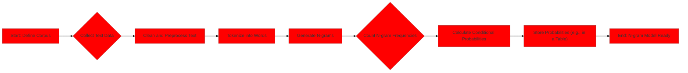
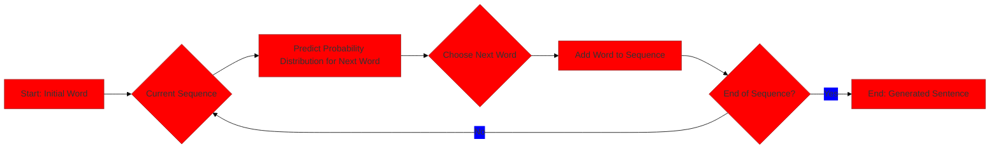

> [!summary] **Document Summary**
> This note introduces **Language Models (LMs)** as **probabilistic models** of **natural language**, detailing their function in assigning probabilities to word sequences and generating text. It covers **N-gram models** as a foundational approach, explaining their training and limitations like **data sparsity** and **context limitations**. Finally, it transitions to modern **Large Language Models (LLMs)**, highlighting the impact of **neural networks** and the **transformer architecture** in overcoming previous challenges through massive scaling.

## Introduction to Language Models: N-grams and LLMs

### What is a Language Model?

> [!definition] **Language Model (LM)**
> A **Language Model (LM)** is a **probabilistic model** of **natural language**. Its primary function is to assign a probability $P(w_1, ..., w_N)$ to any given sequence of words. This probability reflects how likely that sequence is to occur in a natural language.

> [!example] **Example Probabilities**
> Consider these sequences and their hypothetical probabilities:
> *   $P(\text{this, is, a, reasonable, sentence}) = 0.1$ (This sequence is highly plausible.)
> *   $P(\text{this, is, a, purple, sentence}) = 0.01$ (Less plausible, as "purple sentence" is an unusual phrase.)
> *   $P(\text{this, are, a, reasonable, sentence}) = 0.001$ (Very implausible due to grammatical error: "this are" instead of "this is".)

> [!info] **Key Principle**
> The sum of probabilities over all possible sentences in a language must equal 1. Consequently, plausible and grammatically correct sentences are assigned higher probabilities, while implausible or incorrect ones receive lower probabilities.

### Formal Definition for Language Models

The probability of a word sequence $w_1, ..., w_N$ is formally defined using the **chain rule of probability**. This rule breaks down the joint probability of a sequence into a product of conditional probabilities:

> [!math] **Chain Rule for Probability**
> $$P(w_1, ..., w_N) = \prod_{i=1}^{N} P(w_i | w_{i-1}, ..., w_1)$$

This formula means that the probability of the entire sequence is the product of the probability of the first word, multiplied by the probability of the second word given the first, and so on, up to the probability of the last word given all preceding words.

> [!example] **Example Application of Chain Rule**
> To calculate the probability of the sentence "this is a reasonable sentence," the chain rule is applied as follows:
> $$P(\text{this, is, a, reasonable, sentence}) = P(\text{this}) \cdot P(\text{is} | \text{this}) \cdot P(\text{a} | \text{this, is}) \cdot P(\text{reasonable} | \text{this, is, a}) \cdot P(\text{sentence} | \text{this, is, a, reasonable})$$

> [!info] **Core Task**
> The central challenge in building a language model is to accurately estimate each of these conditional probabilities, $P(w_t | w_{t-1}, ..., w_1)$. This is analogous to solving a `cloze` question, where the model predicts the most likely word to fill a blank, such as "This is a reasonable \_\_\_\_\_".

### Simple LMs – N-gram Models

> [!definition] **N-gram Models**
> **N-gram models** simplify the calculation of conditional probabilities by applying the **Markov assumption**. This assumption states that the probability of a word $w_t$ depends only on a limited window of `(n-1)` preceding words, known as its `context`, rather than on the entire history of words.

> [!math] **Markov Assumption for N-grams**
> $$P(w_t | w_{t-1}, ..., w_1) \approx P(w_t | w_{t-n+1}, ..., w_{t-1})$$

*   **Corpus Frequencies**: If this assumption holds true for a small value of $n$, these probabilities can be efficiently computed by counting the occurrences of word sequences in a large text [[Text Corpus|corpus]].

> [!definition] **Bigram Model (n=2)**
> In a **Bigram Model (n=2)**, the probability of the current word $w_t$ depends solely on the immediately preceding word $w_{t-1}$.
> $$P(w_t | w_{t-1}, ..., w_1) \approx P(w_t | w_{t-1})$$

> [!definition] **Trigram Model (n=3)**
> Similarly, in a **Trigram Model (n=3)**, $P(w_t)$ depends on the two preceding words, $w_{t-2}$ and $w_{t-1}$.

> [!example] **Example: Generating N-grams**
> To understand n-grams, consider the process of breaking down a sentence into sequences of `n` words.
>
> ```python
> def generate_ngrams(text, n):
>     """
>     Generates n-grams from a given text.
>     
>     Args:
>         text (str): The input text.
>         n (int): The size of the n-gram.
>         
>     Returns:
>         list: A list of n-grams.
>     """
>     words = text.split()
>     ngrams = []
>     for i in range(len(words) - n + 1):
>         ngrams.append(tuple(words[i:i+n]))
>     return ngrams
> 
> sentence = "The cat chased the mouse happily"
> 
> # Example: Unigrams (n=1)
> print(f"Unigrams: {generate_ngrams(sentence, 1)}")
> # Output: Unigrams: [('The',), ('cat',), ('chased',), ('the',), ('mouse',), ('happily',)]
> 
> # Example: Bigrams (n=2)
> print(f"Bigrams: {generate_ngrams(sentence, 2)}")
> # Output: Bigrams: [('The', 'cat'), ('cat', 'chased'), ('chased', 'the'), ('the', 'mouse'), ('mouse', 'happily')]
> 
> # Example: Trigrams (n=3)
> print(f"Trigrams: {generate_ngrams(sentence, 3)}")
> # Output: Trigrams: [('The', 'cat', 'chased'), ('cat', 'chased', 'the'), ('chased', 'the', 'mouse'), ('the', 'mouse', 'happily')]
> ```

### N-gram Language Model: Training and Probability Estimation

Building an n-gram language model involves two main steps:
1.  **Counting Occurrences**: Tallying the frequency of n-gram sequences within a large training [[Text Corpus|corpus]].
2.  **Estimating Probabilities**: Deriving conditional probabilities from these observed frequencies.

The conditional probability $P(w_t | w_{t-n+1}, ..., w_{t-1})$ is estimated using the **Maximum Likelihood Estimation (MLE)** method. For a bigram model, this is calculated as:

> [!math] **Bigram Probability Estimation (MLE)**
> $$P(w_t | w_{t-1}) = \frac{\text{Count}(w_{t-1}, w_t)}{\text{Count}(w_{t-1})}$$

This means the probability of seeing $w_t$ after $w_{t-1}$ is the number of times the bigram $(w_{t-1}, w_t)$ appears, divided by the number of times $w_{t-1}$ appears by itself (as the start of any bigram).

*   **Training sentences (corpus)**:
    *   "The cat chased the mouse happily"
    *   "The mouse ate the cheese"

Let's illustrate with the provided `corpus`:

*   **Count of "The"**: 4 occurrences ("The cat", "the mouse", "The mouse", "the cheese")
*   **Count of "The cat"**: 1 occurrence
*   **Count of "The mouse"**: 2 occurrences
*   **Count of "The cheese"**: 1 occurrence

> [!example] **Example of Bigram Probability Calculation**
> *   $P(\text{Cat} | \text{The}) = \frac{\text{Count}(\text{The}, \text{Cat})}{\text{Count}(\text{The})} = \frac{1}{4}$
> *   $P(\text{Mouse} | \text{The}) = \frac{\text{Count}(\text{The}, \text{Mouse})}{\text{Count}(\text{The})} = \frac{2}{4} = \frac{1}{2}$
> *   $P(\text{Cheese} | \text{The}) = \frac{\text{Count}(\text{The}, \text{Cheese})}{\text{Count}(\text{The})} = \frac{1}{4}$

> [!info] **Example of Bigram Probability Table (P(word\_i | word\_j))**
>
> |       | Ate | Cat | Chased | Cheese | Happily | Mouse | The |
> | :---- | :-: | :-: | :----: | :----: | :-----: | :---: | :-: |
> | **Ate** | 0   | 0   | 0      | 0      | 0       | 0     | 1   |
> | **Cat** | 0   | 0   | 1      | 0      | 0       | 0     | 0   |
> | **Chased** | 0   | 0   | 0      | 0      | 0       | 0     | 1   |
> | **Cheese** | 0   | 0   | 0      | 0      | 0       | 0     | 0   |
> | **Happily** | 0   | 0   | 0      | 0      | 0       | 0     | 0   |
> | **Mouse** | 1/2 | 0   | 0      | 0      | 1/2     | 0     | 0   |
> | **The** | 0   | 1/4 | 0      | 1/4    | 0       | 2/4   | 0   |
>
> *Note: Each table entry represents $P(\text{Column Word} | \text{Row Word})$. For instance, $P(\text{Cat} | \text{The}) = 1/4$, as derived from the counts.*



### Estimation & Generation with N-gram Models

Language models are primarily used for two tasks:
1.  **Estimate probabilities** for new, unseen sentences.
2.  **Generate** new, coherent sentences.

#### Autoregressive Generation

> [!definition] **Autoregressive Generation**
> **Autoregressive generation** is a common method for creating new sequences of text, word by word.
>
> 1.  **Initialization**: Begin with a starting word or a predefined prompt.
> 2.  **Probability Distribution**: Based on the current sequence of words, the model computes a probability distribution over all possible next words.
> 3.  **Word Selection**: A word is chosen from this distribution. This choice can be made deterministically (e.g., always picking the most probable word, known as greedy decoding) or stochastically (e.g., by random sampling according to the probabilities).
> 4.  **Sequence Extension**: The newly chosen word is appended to the current sequence.
> 5.  **Iteration**: Steps 2-4 are repeated until a stopping condition is met (e.g., a specific length is reached, or an end-of-sentence token is generated).



> [!example] **Example: Simplified Autoregressive Generation (Conceptual)**
>
> ```python
> import random
> 
> # Simplified bigram_probs from the table (conceptual, not actual dict)
> # For demonstration, we'll manually look up probabilities.
> 
> def generate_sentence_bigram(start_word, max_length, bigram_table):
>     """
>     Generates a sentence using a bigram model.
>     
>     Args:
>         start_word (str): The initial word for the sentence.
>         max_length (int): The maximum number of words to generate.
>         bigram_table (dict): A conceptual representation of the bigram probabilities.
>                              Format: {prev_word: {next_word: probability, ...}}
>     
>     Returns:
>         str: The generated sentence.
>     """
>     current_sentence = [start_word]
>     
>     for _ in range(max_length - 1):
>         last_word = current_sentence[-1]
>         
>         # In a real scenario, you'd look up probabilities from the table
>         # For this example, we'll use a simplified mapping for clarity
>         if last_word == "the":
>             possible_next_words = {"cat": 0.25, "cheese": 0.25, "mouse": 0.5}
>         elif last_word == "mouse":
>             possible_next_words = {"ate": 0.5, "happily": 0.5}
>         elif last_word == "ate":
>             possible_next_words = {"the": 1.0}
>         elif last_word == "cat":
>             possible_next_words = {"chased": 1.0}
>         elif last_word == "chased":
>             possible_next_words = {"the": 1.0}
>         else:
>             # If no next words are defined, stop generation
>             break
>             
>         # Select next word based on probabilities
>         # In a real model, this would involve sampling from the distribution
>         next_word = random.choices(
>             list(possible_next_words.keys()), 
>             weights=list(possible_next_words.values()), 
>             k=1
>         )[0]
>         
>         current_sentence.append(next_word)
>         
>         # Simple stop condition if a common end-of-sentence word is generated
>         if next_word in [".", "?", "!"]:
>             break
>             
>     return " ".join(current_sentence)
> 
> # The bigram_table here is a conceptual representation for lookup in the function
> # In practice, it would be derived from the actual counts as shown in the table above.
> # We'll use the manual lookup within the function for this example.
> generated_text = generate_sentence_bigram("the", 10, {}) 
> print(f"Generated sentence: {generated_text}")
> # Example output might be: "the mouse ate the cat chased the mouse ate the"
> ```

#### Estimating Probabilities Example

Let's estimate the probability of the sentence "the cat chased the cheese" using the bigram model and the provided table.

1.  **Full chain rule**:
    > [!math]
    > $$P(\text{the, cat, chased, the, cheese}) = P(\text{the}) \cdot P(\text{cat} | \text{the}) \cdot P(\text{chased} | \text{the, cat}) \cdot P(\text{the} | \text{the, cat, chased}) \cdot P(\text{cheese} | \text{the, cat, chased, the})$$
2.  **Bigram Markov assumption**: Applying the bigram assumption simplifies this to:
    > [!math]
    > $$P(\text{the, cat, chased, the, cheese}) \approx P(\text{the}) \cdot P(\text{cat} | \text{the}) \cdot P(\text{chased} | \text{cat}) \cdot P(\text{the} | \text{chased}) \cdot P(\text{cheese} | \text{the})$$
3.  **Using the table and assuming $P(\text{the}) = 1$** (a common simplification when "the" is the start word of a sentence in a corpus, implying it always starts a sentence or is very frequent):
    *   $P(\text{the}) = 1$
    *   $P(\text{cat} | \text{the}) = 1/4$ (from table, row "The", column "Cat")
    *   $P(\text{chased} | \text{cat}) = 1$ (from table, row "Cat", column "Chased")
    *   $P(\text{the} | \text{chased}) = 1$ (from table, row "Chased", column "The")
    *   $P(\text{cheese} | \text{the}) = 1/4$ (from table, row "The", column "Cheese")

    Therefore, the estimated probability is:
    > [!math]
    > $$P(\text{the, cat, chased, the, cheese}) \approx 1 \cdot \frac{1}{4} \cdot 1 \cdot 1 \cdot \frac{1}{4} = \frac{1}{16}$$

#### Generating New Sentences Example

Let's generate a sentence starting with "the" using the bigram table and random sampling:

1.  **Start "the"**:
    *   Possible next words from "The" row: P(cat|the)=1/4, P(cheese|the)=1/4, P(mouse|the)=1/2.
    *   Let's randomly sample "mouse".
    *   Current sentence: "the mouse".
2.  **Current "the mouse"**:
    *   Possible next words from "Mouse" row: P(ate|mouse)=1/2, P(happily|mouse)=1/2.
    *   Let's randomly sample "ate".
    *   Current sentence: "the mouse ate".
3.  **Current "the mouse ate"**:
    *   Possible next words from "Ate" row: P(the|ate)=1.
    *   Let's sample "the".
    *   Current sentence: "the mouse ate the".
4.  **Current "the mouse ate the"**:
    *   Possible next words from "The" row: P(cat|the)=1/4, P(cheese|the)=1/4, P(mouse|the)=1/2.
    *   Let's randomly sample "mouse".
    *   Current sentence: "the mouse ate the mouse".
5.  **Current "the mouse ate the mouse"**:
    *   Possible next words from "Mouse" row: P(ate|mouse)=1/2, P(happily|mouse)=1/2.
    *   Let's randomly sample "happily".
    *   Current sentence: "the mouse ate the mouse happily".

This process continues until a predefined length is reached or an end-of-sentence token is generated.

### Limitations of N-grams

Despite their simplicity, n-gram models suffer from significant limitations:

> [!warning] **Data Sparsity**
> This is the most critical issue. As the value of `n` increases, the number of possible n-grams grows exponentially ($V^n$, where $V$ is the vocabulary size). In any finite [[Text Corpus|corpus]], many plausible n-grams will simply not appear, leading to zero probabilities.
> *   **Example**: If the bigram "purple sentence" never appeared in the training corpus, its probability $P(\text{sentence} | \text{purple})$ would be 0, even though it's a grammatically valid (though unusual) phrase. This makes the model unable to handle unseen combinations.

> [!warning] **Context Limitations**
> N-gram models can only consider a very short, local context of `(n-1)` preceding words. This limits their ability to capture **long-range dependencies**, which are crucial for understanding complex sentences.
> *   **Example**: In the sentence "The student, who had studied diligently for weeks, finally passed the exam," the word "passed" depends on "student" and "studied diligently," which are far apart. An n-gram model with small `n` (e.g., bigram or trigram) would struggle to connect these distant words.

> [!warning] **Lack of Semantics**
> N-gram models treat words as discrete, independent tokens. They do not understand the meaning or semantic relationships between words.
> *   **Example**: Words like "cat" and "kitten" are semantically very similar, but an n-gram model treats them as entirely dissimilar tokens, just like "cat" and "automobile." It only considers their literal sequence, not their underlying meaning or context. This means it cannot generalize knowledge from one word to a semantically related one.

### Language Models in the '90s

Language models are not a recent invention. Efforts to build them using existing computational and statistical techniques were significant in the 1990s. However, due to the limitations of the technology and methodologies of the time, these early models often yielded mostly poor results, particularly when compared to modern approaches.

### Bigger and Better Language Models: The Rise of Neural Networks

The task of predicting $P(w_t | w_{t-n+1}, ..., w_{t-1})$ can be framed as a **classification function**: given the preceding `(n-1)` words, classify the next word from the entire vocabulary. [[Neural Networks]] proved to be exceptionally effective at performing this classification, especially by learning distributed, continuous representations ([[Word Embeddings|embeddings]]) of words. These embeddings help overcome the data sparsity and lack of semantics issues of n-gram models by representing similar words with similar vectors.

### Modern Large Language Models (LLMs)

> [!definition] **Large Language Models (LLMs)**
> Modern **Large Language Models (LLMs)** represent a significant leap forward, with substantial improvements observed starting around 2019. A pivotal development was the emergence of models like [[GPT-2]], which utilized a [[Transformer Architecture|decoder-only transformer]] architecture. The success of [[GPT-2]] was attributed to its "big" model size and extensive pretraining on vast amounts of text data. It demonstrated that even before the widespread public attention generated by [[ChatGPT]] in late 2022, sufficiently "large" models could achieve impressive performance in various language tasks.

### Putting the "Large" in LLM

The "Large" in [[Large Language Models|Large Language Models]] primarily refers to two key factors:

1.  **Architectural Refinement**: The "fixing" of the underlying architecture, predominantly settling on the [[Transformer Architecture|decoder-only transformer model]]. This architecture, based on the [[Attention Mechanism|transformer's attention mechanism]], allows models to process [[Long-Range Dependencies|long-range dependencies]] far more effectively than previous [[Recurrent Neural Networks|Recurrent Neural Networks (RNNs)]].
2.  **Massive Scaling**: A dramatic increase in both the number of [[Model Parameters|parameters]] in the model (leading to larger model sizes) and the sheer volume of [[Training Data|training data]] used.

This strategy of scaling up model size and data has proven to be remarkably effective, leading to significant performance gains across a wide range of natural language processing tasks. However, it is also recognized that this scaling may eventually face diminishing returns. Some models are considered **oversized & undertrained**, suggesting that simply making models larger without proportional increases in high-quality data or more efficient training methods might not always be the optimal path. Research continues into more efficient scaling laws and architectures.

### Takeaways

*   **Language Models (LMs)** are **probabilistic models** of **natural language** that assign probabilities to word sequences. They are used to compute sentence probability and generate new sentences through [[Autoregressive Generation|autoregressive generation]].
*   **Old-school models**, such as n-grams, faced significant challenges due to **data sparsity** (unseen word combinations), **context limitations** (inability to capture [[Long-Range Dependencies|long-range dependencies]]), and a **lack of semantics** (treating words as discrete tokens without understanding their meaning).
*   The advent of [[Neural Networks]], particularly the [[Transformer Architecture|transformer]] architecture, dramatically improved language model performance. This improvement was further amplified by **increasing model size** and training data, leading to the development of [[Large Language Models|Large Language Models (LLMs)]].

## References
- [[Potamianos and Jelinek - N-gram and Decision Tree Language Modeling]]
- [[Bengio, Ducharme, Vincent - Neural Probabilistic Language Model]]
- [[Radford et al - Language Models are Unsupervised Multitask Learners (GPT-2)]]
- [[Microsoft Research Blog - Megatron-Turing NLG 530B]]
