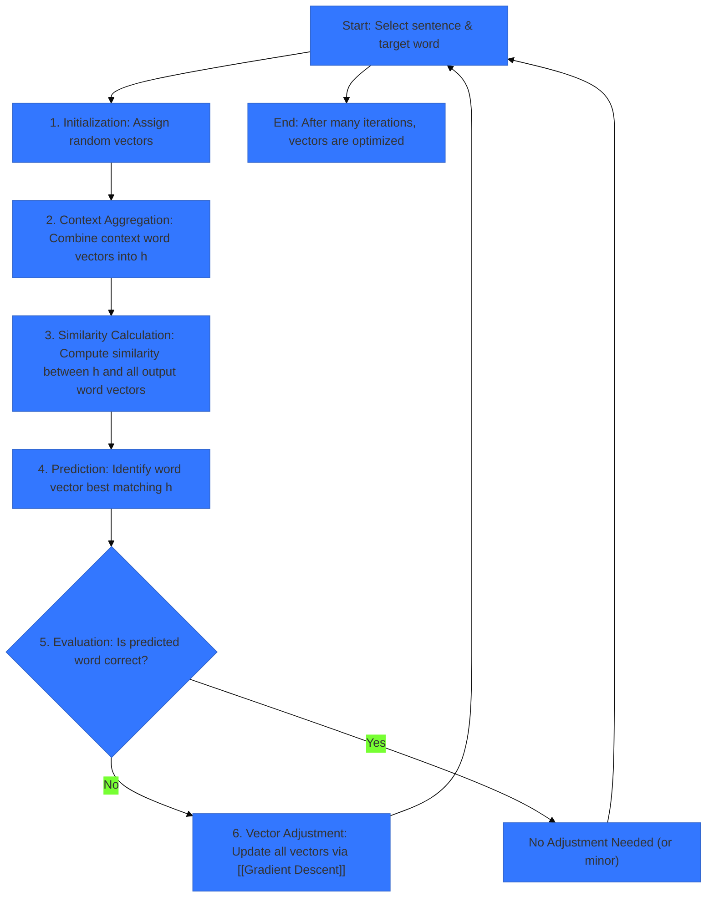
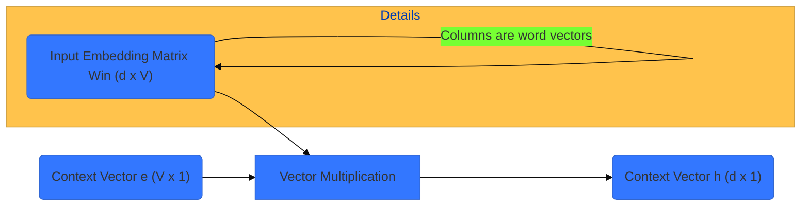
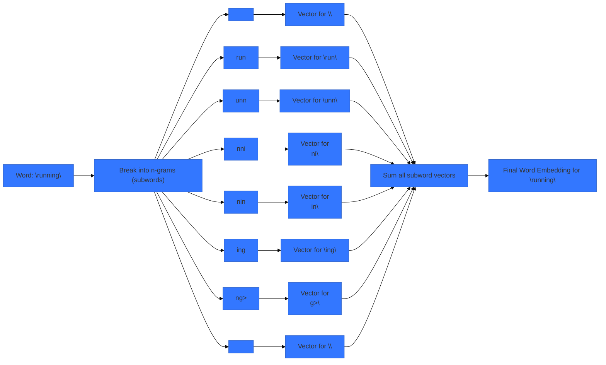

> [!summary] **Document Summary**
> This note explores **word embeddings**, dense vector representations that capture semantic meanings and relationships between words. It contrasts them with traditional [[One-Hot Encoding]] and details the iterative learning process using context-prediction tasks. Key models like [[word2vec]] (CBOW, Skip-gram) and [[FastText]] (subword embeddings for OOV handling) are discussed, alongside their mechanisms and limitations.

## Word Embeddings: Concepts, Learning, and Models

### Introduction to Word Embeddings

> [!definition] **Word Embeddings**
> **Word embeddings** are dense vector representations of words, providing a rich, numerical representation for each word that captures its semantic meaning and relationships.

-   They are **dense**, meaning most of their components (dimensions) contain non-zero values. This contrasts sharply with sparse representations like [[One-Hot Encoding]], where most components are zero.
-   Each word is mapped to a vector of real numbers. For instance, the word "cat" might be represented as `[0.2, -1.5, 0.8, ...]`.
-   Typically, these vectors use high-dimensionalities (e.g., $d=300$ dimensions). This allows them to represent various facets of a word's meaning and usage in a compact way.
-   Crucially, word embeddings **capture semantic meanings and relationships** between words.
    -   **Semantic Similarity**: Words with similar meanings have similar representations. This means their vectors are "close" to each other in the embedding space.
    -   **Relational Similarity**: Similar relationships between words are often reflected by similar vector transformations.
        > [!example] Practical Example
        > The relationship between "king" and "man" (i.e., "king" is a male royal) is similar to the relationship between "queen" and "woman" (i.e., "queen" is a female royal). This can be expressed mathematically as a vector analogy:
        >
        > [!math] Mathematical Expression
        > $$\vec{\text{king}} - \vec{\text{man}} \approx \vec{\text{queen}} - \vec{\text{woman}}$$
        > Rearranging this, we get:
        > $$\vec{\text{king}} - \vec{\text{man}} + \vec{\text{woman}} \approx \vec{\text{queen}}$$
        > This implies that if you take the vector for "king", subtract the "man" component, and add the "woman" component, you should arrive at a vector very close to "queen".

### Before Word Embeddings: One-Hot Encoding

Before the advent of dense word embeddings, [[One-Hot Encoding]] was a common method to represent words as vectors.

#### Concept of One-Hot Encoding

> [!definition] **One-Hot Encoding**
> **One-hot encoding** is a method where each word in a predefined [[Vocabulary]] is represented as a sparse vector with a dimension equal to the vocabulary size. For the $i$-th word, its vector has a value of $1$ at the $i$-th dimension and $0$ elsewhere.

-   This method assumes a predefined [[Vocabulary]] $W$ containing $|W|$ unique words. These words are typically ordered, for example, lexicographically.
-   For each of the $|W|$ words in the vocabulary, one-hot encoding creates a sparse vector with $|W|$ dimensions.
-   For the $i$-th word in the ordered vocabulary, its vector will have a value of $1$ at the $i$-th dimension and $0$ for all other dimensions.

> [!example] Practical Example
> Given a small vocabulary $W = \{ \text{dog, cat, fish, pen, pencil} \}$, where $|W|=5$:
> 1.  `dog` $\rightarrow [1 \ 0 \ 0 \ 0 \ 0]$
> 2.  `cat` $\rightarrow [0 \ 1 \ 0 \ 0 \ 0]$
> 3.  `fish` $\rightarrow [0 \ 0 \ 1 \ 0 \ 0]$
> 4.  `pen` $\rightarrow [0 \ 0 \ 0 \ 1 \ 0]$
> 5.  `pencil` $\rightarrow [0 \ 0 \ 0 \ 0 \ 1]$

Here's how you might generate a one-hot vector in Python:
```python
vocabulary = ['dog', 'cat', 'fish', 'pen', 'pencil']
word_to_index = {word: i for i, word in enumerate(vocabulary)}

def one_hot_encode(word, vocab_size):
    vector = [0] * vocab_size
    if word in word_to_index:
        index = word_to_index[word]
        vector[index] = 1
    return vector

# Example usage:
dog_vector = one_hot_encode('dog', len(vocabulary))
cat_vector = one_hot_encode('cat', len(vocabulary))
print(f"One-hot for 'dog': {dog_vector}")
print(f"One-hot for 'cat': {cat_vector}")
```
Output:
```
One-hot for 'dog': [1, 0, 0, 0, 0]
One-hot for 'cat': [0, 1, 0, 0, 0]
```

#### Problems of One-Hot Encoding

Despite its simplicity, one-hot encoding has significant limitations that hinder its effectiveness in natural language processing:

-   **Sparse Vectors**:
    -   This leads to severe scalability issues. For a typical vocabulary size of $50,000+$ words, each word would be represented by a $50,000$-dimensional vector.
    -   These vectors are extremely sparse (only one $1$ and many $0$s), which contributes to the [[Curse of Dimensionality|curse of dimensionality]].
    > [!info] Key Information
    > The **curse of dimensionality** refers to various phenomena that arise when analyzing and organizing data in high-dimensional spaces, which do not occur in low-dimensional settings. In this context, it means that the vast majority of the vector space is empty, making it difficult for [[Machine Learning Algorithms|machine learning models]] to find meaningful patterns.
    -   The vector space is used inefficiently; for $|W|$ words, $|W|-1$ dimensions are always $0$ for any given word vector.
-   **Orthogonal Vectors**:
    -   A critical flaw is that there is **no preservation of semantic similarity or relationships**. Each word is treated as entirely distinct and unrelated to every other word.
    -   All distinct word pairs have the same distance or dissimilarity. For example, "dog" and "cat" are semantically similar, while "dog" and "pencil" are not. However, one-hot encoding treats them identically in terms of vector distance.
    -   > [!definition] **Cosine Similarity**
        > [[Cosine Similarity]] is a metric that measures the cosine of the angle between two vectors. For any two distinct one-hot vectors $\vec{w_i}$ and $\vec{w_j}$ from the vocabulary $W$, their dot product is $0$, and their magnitudes are $1$. Thus, their cosine similarity is always $0$.
        >
        > [!math] Mathematical Expression
        > $$\cos(\vec{w_i}, \vec{w_j}) = \frac{\vec{w_i} \cdot \vec{w_j}}{|\vec{w_i}| |\vec{w_j}|} = \frac{0}{1 \cdot 1} = 0 \quad \forall \ \vec{w_i}, \vec{w_j} \in W, \ \vec{w_i} \neq \vec{w_j}$$
        >
        > [!example] Practical Example
        > Using the previous vectors:
        > $\vec{\text{dog}} = [1 \ 0 \ 0 \ 0 \ 0]$
        > $\vec{\text{cat}} = [0 \ 1 \ 0 \ 0 \ 0]$
        > $\cos(\vec{\text{dog}}, \vec{\text{cat}}) = \frac{(1 \cdot 0) + (0 \cdot 1) + (0 \cdot 0) + (0 \cdot 0) + (0 \cdot 0)}{\sqrt{1^2+0^2+0^2+0^2+0^2} \cdot \sqrt{0^2+1^2+0^2+0^2+0^2}} = \frac{0}{1 \cdot 1} = 0$
    -   > [!definition] **Euclidean Distance**
        > [[Euclidean Distance]] ($L_2$ norm) measures the straight-line distance between two points in a Euclidean space. For any two distinct one-hot vectors, the Euclidean distance is always $\sqrt{2}$.
        >
        > [!math] Mathematical Expression
        > $$L_2(\vec{w_i}, \vec{w_j}) = ||\vec{w_i} - \vec{w_j}||_2 = \sqrt{\sum_{k=1}^{|W|} (w_{ik} - w_{jk})^2} = \sqrt{1^2 + 1^2} = \sqrt{2} \quad \forall \ \vec{w_i}, \vec{w_j} \in W, \ \vec{w_i} \neq \vec{w_j}$$
        >
        > [!example] Practical Example
        > $\vec{\text{dog}} - \vec{\text{cat}} = [1 \ -1 \ 0 \ 0 \ 0]$
        > $L_2(\vec{\text{dog}}, \vec{\text{cat}}) = \sqrt{(1-0)^2 + (0-1)^2 + (0-0)^2 + (0-0)^2 + (0-0)^2} = \sqrt{1^2 + (-1)^2} = \sqrt{1+1} = \sqrt{2}$
        > This means "dog" is as far from "cat" as it is from "pencil", which is semantically incorrect.

### Distributed Representations

One-hot encoding is considered a **local representation**, where each entity (word) is assigned a unique, isolated identifier. This approach fails to capture any shared characteristics or relationships between entities.

-   In contrast, > [!definition] **Distributed Representations**
    > **Distributed representations** spread the information about an entity across several dimensions. Instead of a single "on" bit, multiple dimensions can be active, and the pattern of activation encodes the meaning. This allows for a more nuanced and efficient representation where similar items can share similar patterns of activation.
-   These representations are not manually designed; rather, models (such as [[Neural Networks|neural networks]]) learn these representations by performing a specific task. Through this learning process, the model discovers latent semantic properties of words.

### Learning Word Embeddings

The process of learning word embeddings involves setting up a task that requires the model to understand word relationships, and then iteratively adjusting the word vectors to improve performance on this task.

#### Framing the Task

A common and effective task for learning word embeddings is to predict a missing word based on its surrounding context. This is often referred to as "Fill in the blank."

> [!info] Key Information
> **Task**: The model is trained to estimate the probability $P(x_t = w | x_{t-k}, ..., x_{t-1}, x_{t+1}, ..., x_{t+k})$ for each word $w$ in the [[Vocabulary]]. Here, $x_t$ is the target word at position $t$, and $x_{t-k}, ..., x_{t-1}, x_{t+1}, ..., x_{t+k}$ represent the context words within a window of size $k$ around the target word.
>
> **Example**: Given the sentence fragment "I used a ... to write the essay", the model's task is to predict the most likely word that fills the blank, which in this case is "PENCIL". To do this successfully, the model must learn that "pencil" is semantically related to "write" and "essay" and that it's an object typically used for writing.

#### Solving the Task: An Iterative Process

The learning process is iterative and typically involves these steps, which are repeated millions of times over a large text corpus:



1.  **Initialization**: Each context word and candidate output word in the [[Vocabulary]] is initially assigned a random, dense vector. These vectors are essentially the word embeddings that the model will learn.
2.  **Context Aggregation**: The vectors of the context words (words surrounding the blank) are aggregated into a single context vector $h$. A simple method for aggregation is summing these vectors.
3.  **Similarity Calculation**: The model then computes the distance (or similarity) between this context vector $h$ and the vector of every output word (every word in the [[Vocabulary]] that could potentially fill the blank). A common measure is the [[Dot Product]].
4.  **Prediction**: Based on these similarity scores, the model identifies the word vector that best matches the context vector $h$. This word is the model's prediction for the blank.
5.  **Evaluation**: The predicted word is compared against the correct word (the actual word that was in the blank in the original training data).
6.  **Vector Adjustment**: If the prediction is incorrect, or even if it's correct but the confidence can be improved, all vectors involved (both the context word vectors and the output word vectors) are adjusted. This adjustment is performed using [[Gradient Descent]], an optimization algorithm that minimizes the prediction error by slightly changing the vector values in the right direction.

#### Rinse and Repeat!

-   This entire process is applied to millions of sentences extracted from a large text corpus.
-   > [!info] Key Information
    > The underlying principle is that **similar words are found in similar contexts**. For example, "cat" and "dog" are both often found in contexts like "the `animal` chased the `mouse`."
-   For the model to successfully predict words in such contexts, it must learn to assign similar word vectors to similar words. This is how semantic similarity emerges in the embedding space.

> [!example] Practical Example
> -   "I used a `pencil` to write the essay."
> -   "You used my `pen` to write a letter."
> In both sentences, "pencil" and "pen" appear in very similar contexts (e.g., "used a/my ... to write a/the ..."). As the model processes millions of such examples, it learns that "pencil" and "pen" are interchangeable in many contexts, causing their learned vectors to become numerically similar.

#### In Terms of Matrices (I)

The learning process can be formally described using matrix operations, which are efficient for computation.

-   Input word (context word) vectors are organized into a matrix $\mathbf{W}_{in}$. This matrix has dimensions $d \times V$, where $d$ is the embedding dimensionality and $V$ is the [[Vocabulary]] size. Each column of $\mathbf{W}_{in}$ represents the embedding vector for a specific word when it acts as a context word.
-   Similarly, output word (candidate word) vectors are stored in a matrix $\mathbf{W}_{out}$, also of dimensions $d \times V$. Each column here represents the embedding vector for a word when it acts as a target word.
-   The context for a target word is represented by a binary vector of presences, $\mathbf{e}$, with dimensions $V \times 1$. This vector is a simplified [[Bag of Words|bag of words]] representation, where $e_j=1$ if the $j$-th word in the [[Vocabulary]] is present in the context, and $e_j=0$ otherwise. This approach, by its nature, loses information about word order within the context window.
-   The context vector $\mathbf{h}$ ($d \times 1$) is computed by summing the vectors of the words present in the context. This is achieved through a matrix multiplication:

    > [!math] Mathematical Expression
    > $$\mathbf{h} = \mathbf{W}_{in} \mathbf{e}$$
    > -   In this operation, each $e_j$ in $\mathbf{e}$ effectively selects the $j$-th column (word vector) from $\mathbf{W}_{in}$ if $e_j=1$, and then these selected vectors are summed to form $\mathbf{h}$.


> [!example] Practical Example
> Suppose $d=3$ and $V=5$. Let $\mathbf{W}_{in}$ be:
> $$\mathbf{W}_{in} = \begin{pmatrix}
> 1.0 & 0.2 & 0.5 & 0.8 & 0.1 \\
> 0.3 & 1.1 & 0.6 & 0.0 & 0.9 \\
> 0.7 & 0.4 & 0.3 & 1.2 & 0.2
> \end{pmatrix}$$
> And let the context vector $\mathbf{e}$ indicate that words at index 0 and 2 are present:
> $$\mathbf{e} = \begin{pmatrix}
> 1 \\ 0 \\ 1 \\ 0 \\ 0
> \end{pmatrix}$$
> Then, $\mathbf{h}$ is the sum of the 0th and 2nd columns of $\mathbf{W}_{in}$:
> $$\mathbf{h} = \begin{pmatrix}
> 1.0 \\ 0.3 \\ 0.7
> \end{pmatrix} + \begin{pmatrix}
> 0.5 \\ 0.6 \\ 0.3
> \end{pmatrix} = \begin{pmatrix}
> 1.5 \\ 0.9 \\ 1.0
> \end{pmatrix}$$

#### In Terms of Matrices (II)

Once the context vector $\mathbf{h}$ is computed:

-   The next step is to find the vector in $\mathbf{W}_{out}$ that is most similar to $\mathbf{h}$.
-   The [[Dot Product|dot product]] is used to measure this similarity. It indicates "how aligned are the vectors?" – a larger dot product implies greater similarity.
-   The similarities between $\mathbf{h}$ and each output word vector (each column of $\mathbf{W}_{out}$) are collected into a vector $\mathbf{p}$:
    > [!math] Mathematical Expression
    > $$\mathbf{p} = \mathbf{h}^T \mathbf{W}_{out}$$
    > -   This operation results in a $1 \times V$ vector. Each element of $\mathbf{p}$ represents the similarity score between the context vector $\mathbf{h}$ and a specific output word vector from $\mathbf{W}_{out}$.
-   To transform these similarity scores into probabilities (values between $0$ and $1$ that sum to $1$), we apply the [[Softmax Function|softmax]] function:
    > [!math] Mathematical Expression
    > $$\hat{\mathbf{p}} = \text{softmax}(\mathbf{p})$$
    > > [!definition] **Softmax Function**
    > > The **softmax function** is defined as:
    > > $$\text{softmax}(z_i) = \frac{e^{z_i}}{\sum_{j=1}^{V} e^{z_j}}$$
    > > This function amplifies larger values and suppresses smaller ones, making them interpretable as probabilities.
-   Finally, knowing the correct target word from the training data, the model uses [[Cross-Entropy Loss|cross-entropy loss]] to quantify the error between its predicted probability distribution ($\hat{\mathbf{p}}$) and the true distribution (a one-hot vector for the correct word). This loss is then used to update the matrices $\mathbf{W}_{in}$ and $\mathbf{W}_{out}$ via [[Gradient Descent]], iteratively improving the word embeddings.

> [!example] Practical Example
> Continuing from the previous example, let $\mathbf{h} = \begin{pmatrix} 1.5 \\ 0.9 \\ 1.0 \end{pmatrix}$.
> Suppose $\mathbf{W}_{out}$ is:
> $$\mathbf{W}_{out} = \begin{pmatrix}
> 0.9 & 0.1 & 0.4 & 0.7 & 0.2 \\
> 0.2 & 1.0 & 0.5 & 0.1 & 0.8 \\
> 0.6 & 0.3 & 1.1 & 0.0 & 0.5
> \end{pmatrix}$$
> Then, $\mathbf{p} = \mathbf{h}^T \mathbf{W}_{out}$ would be a $1 \times 5$ vector of dot products:
> $$\mathbf{p} = \begin{pmatrix} 1.5 & 0.9 & 1.0 \end{pmatrix} \begin{pmatrix}
> 0.9 & 0.1 & 0.4 & 0.7 & 0.2 \\
> 0.2 & 1.0 & 0.5 & 0.1 & 0.8 \\
> 0.6 & 0.3 & 1.1 & 0.0 & 0.5
> \end{pmatrix}$$
> Calculating the first element of $\mathbf{p}$:
> $p_0 = (1.5 \cdot 0.9) + (0.9 \cdot 0.2) + (1.0 \cdot 0.6) = 1.35 + 0.18 + 0.6 = 2.13$
> Similarly, for all elements, resulting in a vector like $\mathbf{p} = [2.13, 1.25, 2.25, 1.14, 1.67]$ (example values).
> Then, $\hat{\mathbf{p}} = \text{softmax}([2.13, 1.25, 2.25, 1.14, 1.67])$ would convert these scores into a probability distribution over the [[Vocabulary]].

### Neural Language Models & word2vec

The approach of learning word embeddings by predicting words from their context forms the fundamental concept behind modern [[Neural Language Models]]. These models learn to represent words in a continuous vector space.

-   **Bengio et al. (2000)**: Pioneered this field by presenting a similar approach. Their model, however, incorporated causality, meaning it predicted only the next word based solely on the preceding words in a sequence.
-   > [!definition] **word2vec**
    > [[word2vec]] (Mikolov et al., 2013) is a highly influential model that significantly advanced the field of word embeddings. It performs context-prediction tasks with crucial optimizations that make it much more efficient for training on massive text corpora.

#### word2vec Tasks

[[word2vec]] implements two primary architectures, or "tasks," for learning word embeddings:

1.  > [!definition] **Continuous Bag of Words (CBOW)**
    > **Continuous Bag of Words (CBOW)**: The model's objective is to predict the middle word (the target word) given its surrounding context words. This is precisely the iterative learning task described in the previous section. The order of context words does not matter, hence "Bag of Words."

    ```mermaid
    %%{init: {'theme':'base', 'themeVariables': {'primaryColor':'#3377FF'}}}%%
    flowchart LR
        Context_Words["Context Words"] --> CBOW_Model["CBOW Model"]
        CBOW_Model --> Predicted_Middle_Word["Predicted Middle Word"]
    ```

2.  > [!definition] **Skip-gram**
    > **Skip-gram**: This is the inverse of CBOW. The model is given a single middle word (the target word) and is trained to predict its surrounding context words. This means, for each word in the context window, the model tries to predict it independently.

    ```mermaid
    %%{init: {'theme':'base', 'themeVariables': {'primaryColor':'#3377FF'}}}%%
    flowchart LR
        Middle_Word["Middle Word"] --> Skip_gram_Model["Skip-gram Model"]
        Skip_gram_Model --> Predicted_Context_Words["Predicted Context Words"]
    ```

#### Workarounds for Softmax

A major computational bottleneck during the training of word embedding models is the [[Softmax Function|softmax]] computation. Calculating probabilities for every word in a large [[Vocabulary]] ($V$) is extremely expensive in terms of processing time. [[word2vec]] introduces clever techniques to mitigate this:

-   > [!definition] **Hierarchical Softmax**
    > **Hierarchical Softmax**: Instead of computing a probability for every word, this method organizes the [[Vocabulary]] into a binary Huffman tree. Words that appear more frequently in the corpus are assigned shorter paths from the root to their leaf node. The model then predicts the path from the root of the tree to the target word's leaf node, rather than computing probabilities for all $V$ words directly. This significantly reduces computational complexity from $O(V)$ to $O(\log_2 V)$.

-   > [!definition] **Negative Sampling**
    > **Negative Sampling**: This technique transforms the original multi-class classification problem into a set of simpler binary classification problems. For each actual context-target word pair (positive example), the model samples a few negative words (not present in that context) and is trained to distinguish the correct word from these noise words. This greatly reduces the number of output probabilities computed per training step.

### Limitations of word2vec

While [[word2vec]] represented a significant leap forward in word representation, it still has certain limitations:

-   > [!definition] **Out-Of-Vocabulary (OOV) Words**
    > **Inability to handle Out-Of-Vocabulary (OOV) words**: A major drawback is that [[word2vec]] cannot generate a vector for words that were not present in its training [[Vocabulary]]. If a new or rare word appears in text after training, [[word2vec]] simply ignores it or assigns it an unknown token, thus failing to provide any meaningful representation.
-   **Lack of contextualized vectors**:
    -   [[word2vec]] assigns a fixed vector to each word. This vector remains constant regardless of the specific context in which the word appears.
    -   This means [[word2vec]] effectively "averages" all possible meanings and uses of a word during its learning process.
    -   > [!example] Practical Example
        > Consider the word "Bat". In the sentence "a `bat` is a mammal", it refers to an animal. In "the player swung the baseball `bat`", it refers to a piece of sports equipment. [[word2vec]] would assign the exact same vector to "bat" in both sentences, failing to capture the crucial contextual nuance and distinct meanings.

### FastText

> [!definition] **FastText**
> [[FastText]], developed by Facebook AI Research, addresses some of the key limitations of [[word2vec]], particularly the [[Out-Of-Vocabulary (OOV) Words|OOV]] problem and the inability to handle morphological variations, by learning representations for subwords.

-   **Addresses the [[Out-Of-Vocabulary (OOV) Words|Out-Of-Vocabulary (OOV)]] problem**:
    -   [[FastText]] tackles the OOV issue by breaking words down into their subwords or n-grams of characters. This means it learns representations not just for full words, but also for their constituent character sequences.
    -   > [!example] Practical Example
        > The word `<where>` (angle brackets denote word boundaries) might be broken down into character tri-grams like `<wh`, `whe`, `her`, `ere`, `re>`.
-   A vector representation is learned for each subword. These [[Subword Embeddings|subword embeddings]] capture morphological information (e.g., prefixes, suffixes, roots) that are shared across different words.
-   The vector for a full word is then computed as the sum of its constituent subword vectors.
    > [!math] Mathematical Expression
    > $$v_{word} = v_{<w} + v_{wh} + v_{whe} + v_{her} + v_{ere} + v_{re>} + v_{<where>}$$
    > (Note: The full word itself, enclosed in angle brackets, is also treated as a subword to ensure its unique representation is included.)
-   This compositional nature is key: it allows [[FastText]] to generate vectors for new words ([[Out-Of-Vocabulary (OOV) Words|OOV words]]) that were not seen during training. Even if a full word was unseen, its vector can be constructed by summing the vectors of its constituent subwords, provided those subwords were observed during training. This makes [[FastText]] robust to rare words and misspellings.

> [!example] Practical Example
> Imagine we have learned vectors for subwords.
> Let $v_{<ap} = [0.1, 0.2]$, $v_{app} = [0.3, 0.4]$, $v_{ppl} = [0.5, 0.6]$, $v_{ple} = [0.7, 0.8]$, $v_{le>} = [0.9, 1.0]$.
> And $v_{<apple>} = [1.0, 1.0]$ (the full word vector).
> Then the vector for the word "apple" would be:
> $v_{apple} = v_{<ap} + v_{app} + v_{ppl} + v_{ple} + v_{le>} + v_{<apple>}$
> $v_{apple} = [0.1+0.3+0.5+0.7+0.9+1.0, 0.2+0.4+0.6+0.8+1.0+1.0]$
> $v_{apple} = [3.5, 4.0]$



### Visualizations

Visualizing word embeddings is a powerful way to understand how they capture semantic meanings and relationships, even though the original vectors are in high-dimensional spaces.

#### Semantic Meanings

-   When `300-dimensional FastText vectors` for words belonging to distinct categories (e.g., Household items, Mammals, Birds) are reduced to 2 dimensions for visualization (typically using techniques like [[Principal Component Analysis (PCA)|Principal Component Analysis (PCA)]] or [[t-SNE]]), clear patterns emerge.
    -   > [!definition] **Principal Component Analysis (PCA)**
        > [[Principal Component Analysis (PCA)]] is a statistical procedure that uses an orthogonal transformation to convert a set of observations of possibly correlated variables into a set of linearly uncorrelated variables called principal components. In this context, it identifies the directions (components) in the 300-dimensional space that capture the most variance, allowing us to project the data onto these 2 most informative dimensions.
-   Words from the three distinct categories are observed to be well-separated and clustered together in the "compressed" 2-dimensional embedding space.
-   This clear separation and clustering demonstrate that the embeddings effectively group semantically similar words, confirming that this semantic grouping is preserved even when projected from the original high-dimensional latent space.

#### Relationships

Beyond mere semantic grouping, word embeddings also capture relational semantics through vector arithmetic, a property that can be visually demonstrated.

-   When visualizing words representing countries and their capital cities, a striking geometric property becomes apparent.
-   If you draw a vector connecting each country's embedding to its corresponding capital city's embedding (e.g., from "Germany" to "Berlin"), these connecting vectors often show a consistent transformation. This transformation is essentially a translation vector that links each country-capital pair.
-   This translation vector can be found by subtracting a capital city's vector from its country's vector.
    -   > [!example] Practical Example
        > The vector difference $\vec{\text{germany}} - \vec{\text{berlin}}$ represents the abstract relationship "capital of".
-   Remarkably, this learned transformation can then be applied to other countries to predict their capitals.
    -   > [!example] Practical Example
        > To find the capital of Spain, one would calculate $\vec{\text{spain}} + (\vec{\text{germany}} - \vec{\text{berlin}})$. The resulting vector should ideally be very close (in terms of [[Cosine Similarity|cosine similarity]] or [[Euclidean Distance|Euclidean distance]]) to the actual vector for $\vec{\text{madrid}}$. This illustrates the linear nature of semantic relationships captured by word embeddings.

## References
- [[Machine Learning]]
- [[Natural Language Processing]]
- [[Neural Networks]]
- [[Vector Space Models]]