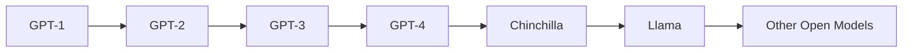
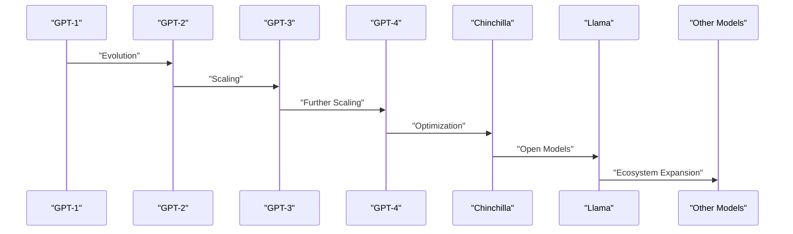
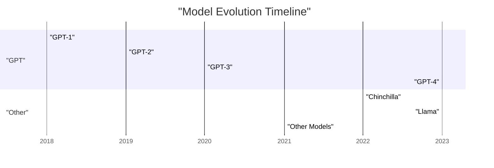

> [!summary] **Document Summary**  
> This note explores the evolution of the GPT family of models and the broader trends in large language models (LLMs). It covers the progression from GPT-1 to GPT-4, the impact of scaling laws, the rise of larger models, the shift toward more efficient training, and the emergence of open-source alternatives like the Llama family.

## GPT Family Evolution and LLM Trends

### The GPT Family

#### Evolution of GPT Models

- **GPT-1 (2018)**  
  - First in a (long series) of models  
  - Decoder-only transformer architecture  
  - Pretraining on a large corpus, fine-tuning on various tasks  
  - **Architecture**:  
    - 12 layers, decoder-only  
    - 12 heads each  
    - 768 dimensional states  
    - BPE with 40,000 merges  
    - Learned positional embeddings  
    - Context size: 512 tokens  
    - 117M parameters  
  - **Training**:  
    - Unsupervised pretraining on BooksCorpus (7,000 books, ~5 GB of text)  
    - Fine-tuning tasks: Natural language inference, question answering, semantic similarity, classification  

- **GPT-2 (2019)**  
  - Larger training set  
  - Initial controversies around the (lack of) release for potential misuse  
  - **Setup**:  
    - Unsupervised pretraining on WebText (45M links, 40GB of text)  
    - No fine-tuning  
    - BPE with 50,257 tokens  
    - Context size: 1024  
    - Up to 1.5B parameters  

- **GPT-3 (2020)**  
  - Scaling up: 175B parameters  
  - No other meaningful architectural changes w.r.t. GPT-2  
  - **Training**:  
    - Multiple datasets: (Filtered) CommonCrawl, WebText2, Books1, Books2, Wikipedia  
    - No fine-tuning done on GPT-3 – in-context learning only  
  - **In-context performance**:  
    - Larger models show remarkable 1- and few-shot performance  
    - The gap between 0- and 1-shot performance is remarkable  

- **GPT-4 (2023)**  
  - OpenAI no longer providing information on the model  

### Scaling Laws for Neural Language Models

- Published in January 2020, by OpenAI  
- Shows various empirical takeaways  
- The loss scales as a power-law with model size, dataset size, and amount of compute  

#### Other Takeaways

- Performance depends very weakly on other architectural hyperparameters such as depth vs. width (number of layers vs embedding size) for a fixed overall number of parameters  
- Empirically optimal results:  
  - $N \propto C^{0.54}$, $B \propto C^{0.35}$, $S \propto C^{0.07}$  
  - Where $N$ = model size, $B$ = batch size, $S$ = number of steps, $C$ = computing budget  

### The Race to Bigger Models

- These scaling laws resulted in a race toward building larger models  
- GPT-3 was the first 100B+ parameters model  
- Other larger models have been developed, following this trend  

#### Big Models Got Bigger

- **Jurassic-1**: 178B parameters, AI21labs (2021)  
- **Gopher**: 280B parameters, DeepMind (2021)  
- **Megatron-Turing NLG**: 530B parameters, NVIDIA + Microsoft (2021)  
- **PaLM (Pathways Language Model)**: 540B parameters, Google (2022)  

### Oversized and Undertrained!

- DeepMind publishes “Training Compute-Optimal Large Language Models” in March 2022  
- Main claims:  
  - Current large language models are significantly under-trained  
  - For every doubling of model size, the number of training tokens should also be doubled  
  - Chinchilla, a new correctly-sized model, outperforms larger ones  

#### Chinchilla

- **70B parameters** model  
- Trained on the same compute budget as Gopher (280B)  
- 5.76 ⋅ 10^22 FLOPs  
- Chinchilla is ¼ of Gopher’s size, and is trained on more tokens (1.4T vs 300B)  
- Chinchilla generally outperforms Gopher, but also GPT-3, on various tasks  

### A New Trend

- The previous trend of “always larger” models started fading  
- There has since been a return to smaller models, trained for longer  
- Smaller models can achieve better performance!  
- LLMs become more accessible  
- This led to a large ecosystem of (open) models  

### Llama Family

- **Llama (Large Language Model Meta AI)** is a family of models introduced by Meta AI, starting in 2023  
- All autoregressive, decoder-only architectures, trained on open datasets  
- All models are openly available  
- **Versions**:  
  - LLaMA (Feb '23): 7B, 13B, 32B, 65B  
  - Llama 2 (Jul '23): 7B, 13B, 70B  
  - Llama 3 (Apr '24): 8B, 70B  
  - 3.1 (Jul '24): 8B, 70B, 405B  
  - 3.2 (Sep '24): 1B, 3B, 11B, 90B (with multimodal version)  
  - Plus other versions (e.g., Code Llama – based on Llama 2, or instruction-tuned models)  
### Other Families of Open Models

- **GPT-Neo/GPT-J** (EleutherAI, 🇺🇸) – open source alternatives to the GPT family  
- **Mistral** (MistralAI, 🇫🇷) – wide variety of model sizes, code-tuned versions (for 80+ languages), multimodal versions (Pixtral)  
- **GLM** (Zhipu AI, 🇨🇳) – General Language Model, more oriented toward the Chinese language, but also works well on other languages, including English  
- **Falcon** (Technology Innovation Institute, 🇦🇪) – different sized models, they also released a Mamba-based model (State Space Language Models!)

