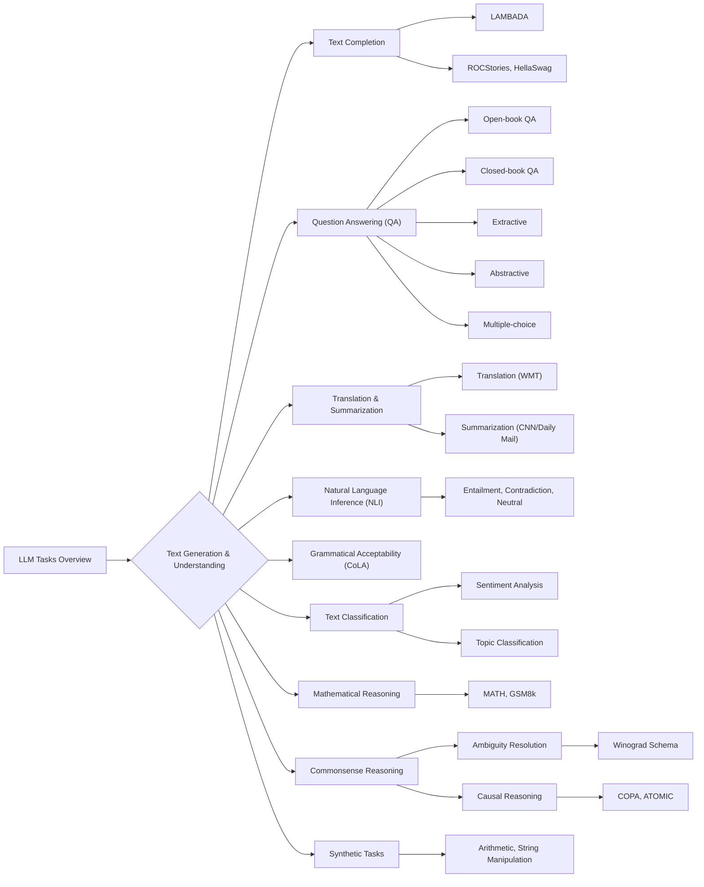

> [!summary] **Document Summary**
> This note provides a comprehensive overview of the metrics, tasks, and benchmarks used to evaluate Large Language Models (LLMs). It details quantitative metrics like Geometric Mean, Perplexity, BLEU, ROUGE, METEOR, BERT Score, and Exact Match, alongside various NLP tasks such as text completion, question answering, translation, summarization, and reasoning. Finally, it outlines key benchmarks like GLUE, SuperGLUE, and MMLU, and discusses the critical issue of LLM contamination.

## Large Language Models: Metrics, Tasks, and Benchmarks

### Metrics

Metrics are quantitative measures used to evaluate the performance of [[Large Language Models|LLMs]] on various tasks. They provide numerical values that indicate how well a model is performing.

#### Geometric Mean

The **geometric mean** ($GM$) is a type of average that is particularly useful for sets of numbers whose values are meant to be multiplied together or are percentages. It is calculated by multiplying $N$ values ($x_1, \dots, x_N$) together and then taking the $N$-th root of the product.
$$GM = \left(\prod_{i=1}^{N} x_i\right)^{1/N}$$
Unlike the **arithmetic mean**, the geometric mean places a greater penalty on lower values. This means that a single very low value can significantly reduce the overall geometric mean.

> [!example] Practical Example
> *   Consider the values $(0.1, 0.9, 0.9)$.
> *   The **arithmetic mean** is $(0.1 + 0.9 + 0.9) / 3 = 1.9 / 3 \approx 0.633$.
> *   The **geometric mean** is $(0.1 \cdot 0.9 \cdot 0.9)^{1/3} = (0.081)^{1/3} \approx 0.433$.
> Notice how the geometric mean is lower, reflecting the impact of the $0.1$ value more strongly.

Due to potential **numerical instability** when dealing with very small or very large numbers, the geometric mean is often computed using logarithms:
$$GM = \exp\left(\frac{1}{N} \sum_{i=1}^{N} \log x_i\right)$$
This logarithmic transformation converts multiplication into summation, which is more numerically stable for computers.

#### Perplexity

**Perplexity**: This metric quantifies how uncertain a language model is when predicting the next word in a sequence. It essentially measures how well a probability distribution predicts a sample.

*   A **high perplexity** value indicates that the model is very uncertain or surprised by the actual next word, suggesting poor performance.
*   A **low perplexity** value (closer to $1$) indicates that the model is very certain and predicts the next word accurately, suggesting good performance.

Perplexity is mathematically defined as the geometric mean of the inverse probabilities of each next word in a given sequence.

##### Perplexity Intuition
To understand perplexity intuitively, consider the sentence: "The dog chased the \_\_\_\_\_".
If a model assigns a probability $P(\text{cat}) = 0.25$ to "cat" being the next word, this is equivalent to the model being equally confused among $1/0.25 = 4$ possible words. The perplexity value directly relates to this "number of choices" the model has. A perplexity of $4$ means the model is as uncertain as if it had to choose uniformly from $4$ distinct words.

##### Perplexity Calculation
The **Perplexity** ($PPL$) for a sequence of words $w_1, \dots, w_N$ is calculated as:
$$PPL = \exp\left(-\frac{1}{N} \sum_{i=1}^{N} \log p(w_i | w_{<i})\right)$$
Here, $p(w_i | w_{<i})$ represents the probability assigned by the model to word $w_i$ given the preceding words $w_{<i}$.

*   If the model perfectly predicts each word, meaning $p(w_i | w_{<i}) = 1$ for all $i$, then $\log(1) = 0$. In this ideal scenario, `PPL` would be $e^0 = 1$, indicating absolute certainty.
*   If $p(w_i | w_{<i}) < 1$, which is usually the case, the term $-\log p(w_i | w_{<i})$ will be positive, and as the probabilities decrease, the `PPL` will increase, reflecting higher uncertainty.

##### Perplexity Example (Certain Model)
Let's consider a model that is very certain about the words in the sentence: `<bos>The dog chased the cat<eos>`.
Assume the negative log probabilities (or "surprisals") for each word are:
$p(\text{The}|\text{<bos>}) \rightarrow -\log p = 0.1054$
$p(\text{dog}|\text{<bos>The}) \rightarrow -\log p = 0.1625$
$p(\text{chased}|\text{<bos>The dog}) \rightarrow -\log p = 0.1278$
$p(\text{the}|\text{<bos>The dog chased}) \rightarrow -\log p = 0.2877$
$p(\text{cat}|\text{<bos>The dog chased the}) \rightarrow -\log p = 0.0513$
$p(\text{<eos>}|\text{<bos>The dog chased the cat}) \rightarrow -\log p = 0.2231$
The total number of words $N=6$.
The `PPL` would be calculated as:
$$PPL = e^{\frac{1}{6}(0.1054 + 0.1625 + 0.1278 + 0.2877 + 0.0513 + 0.2231)} = e^{\frac{1}{6}(0.9578)} = e^{0.1596} \approx 1.1731$$
A perplexity of approximately $1.17$ is very low, indicating a highly confident and accurate model.

##### Perplexity Example (Uncertain Model)
Now, let's consider a model that is very uncertain about the same sentence: `<bos>The dog chased the cat<eos>`.
Assume the negative log probabilities are much higher:
$p(\text{The}|\text{<bos>}) \rightarrow -\log p = 2.9957$
$p(\text{dog}|\text{<bos>The}) \rightarrow -\log p = 2.3026$
$p(\text{chased}|\text{<bos>The dog}) \rightarrow -\log p = 1.6094$
$p(\text{the}|\text{<bos>The dog chased}) \rightarrow -\log p = 4.6052$
$p(\text{cat}|\text{<bos>The dog chased the}) \rightarrow -\log p = 5.2983$
$p(\text{<eos>}|\text{<bos>The dog chased the cat}) \rightarrow -\log p = 6.9078$
The total number of words $N=6$.
The `PPL` would be calculated as:
$$PPL = e^{\frac{1}{6}(2.9957 + 2.3026 + 1.6094 + 4.6052 + 5.2983 + 6.9078)} = e^{\frac{1}{6}(23.719)} = e^{3.953} \approx 52.1$$
A perplexity of $52.1$ is significantly higher, reflecting a model that is much less confident and accurate in its predictions.

##### Perplexity Example (with GM indecision)
Perplexity can also be seen as the $N$-th root of the product of the inverse probabilities (the "indecision" or "branching factor" at each step).
For the uncertain model example above, the inverse probabilities would be $e^{2.9957} \approx 20$, $e^{2.3026} \approx 10$, $e^{1.6094} \approx 5$, $e^{4.6052} \approx 100$, $e^{5.2983} \approx 200$, $e^{6.9078} \approx 1000$.
So, the `PPL` is the geometric mean of these inverse probabilities:
$$PPL = (20 \cdot 10 \cdot 5 \cdot 100 \cdot 200 \cdot 1000)^{1/6} = (2 \cdot 10^{10})^{1/6} \approx 52.1$$
This shows that perplexity essentially tells us, on average, how many equally probable words the model is "considering" at each step.

#### BLEU

**BLEU** (**Bilingual Evaluation Understudy**) is a metric primarily used to evaluate the quality of text generated by a model, most commonly in machine translation. It compares a candidate (generated) sequence against one or more reference (human-created) sequences.

##### Computing BLEU-n
The BLEU score is computed through several steps:
1.  **Generate `i-grams`**: For each $i$ from $1$ to $n$ (where $n$ is typically up to $4$), extract all possible $i$-grams (sequences of $i$ words) from both the predicted sentence and the reference sentence(s).
2.  **Count `precision_i`**: Calculate the precision for each $i$-gram length. This is the fraction of $i$-grams in the generated sentence that also appear in any of the reference sentences. To avoid overcounting, the count of each $i$-gram in the generated sentence is clipped by its maximum count in any single reference sentence.
3.  **Compute `geometric mean`**: Calculate the geometric mean of these `precision_i` values across all $i$-gram lengths ($i=1, \dots, n$). This provides a combined measure of how many $n$-grams match.
4.  **Multiply by `brevity penalty` (BP)**: Finally, this geometric mean is multiplied by a **brevity penalty** to account for generated sentences that are too short compared to the reference(s).

The full formula for `BLEU-n` is:
$$BLEU-n = BP \cdot \exp\left(\frac{1}{n} \sum_{i=1}^{n} \log(\text{precision}_i)\right)$$

##### Brevity Penalty
The **brevity penalty** (BP) is a crucial component that prevents models from achieving high precision simply by generating very short sentences (which are more likely to have matching $n$-grams).
Let $g$ be the length of the generated sequence and $r$ be the effective reference length (usually the length of the reference sentence closest to $g$).
$$BP = \begin{cases} 1 & \text{if } g > r \\ e^{1 - r/g} & \text{if } g \le r \end{cases}$$
If the generated sentence is longer than the reference ($g > r$), the penalty is $1$ (no penalty). If it is shorter ($g \le r$), the penalty is a value between $0$ and $1$, which reduces the overall BLEU score.

##### BLEU Example
Let's calculate `BLEU-2` for a generated sentence against a reference:
*   **Reference**: "The dog chased the cat" ($r=5$ words)
*   **Generated**: "The dog ran after the cat" ($g=6$ words)

1.  **Unigrams ($i=1$)**:
    *   Generated unigrams: "The", "dog", "ran", "after", "the", "cat" ($6$ total)
    *   Reference unigrams: "The", "dog", "chased", "the", "cat"
    *   Matching unigrams (clipped): "The", "dog", "the", "cat" ($4$ matches)
    *   `precision_1` = $4 / 6 \approx 0.667$

2.  **Bigrams ($i=2$)**:
    *   Generated bigrams: "The dog", "dog ran", "ran after", "after the", "the cat" ($5$ total)
    *   Reference bigrams: "The dog", "dog chased", "chased the", "the cat"
    *   Matching bigrams (clipped): "The dog", "the cat" ($2$ matches)
    *   `precision_2` = $2 / 5 = 0.4$

3.  **Geometric Mean of Precisions**:
    *   Using the formula $\exp\left(\frac{1}{n} \sum_{i=1}^{n} \log(\text{precision}_i)\right)$ with $n=2$:
    *   `Geometric Mean` = $\exp\left(\frac{1}{2} \cdot (\log 0.667 + \log 0.4)\right) = \exp\left(\frac{1}{2} \cdot (-0.404 + -0.916)\right) = \exp\left(\frac{1}{2} \cdot (-1.32)\right) = \exp(-0.66) \approx 0.5165$

4.  **Brevity Penalty**:
    *   Since $g=6$ and $r=5$, we have $g > r$.
    *   `Brevity Penalty` = $1$.

5.  **`BLEU-2` Score**:
    *   `BLEU-2 Score` = `Brevity Penalty` $\cdot$ `Geometric Mean` $= 1 \cdot 0.5165 = 0.5165$.

##### BLEU Limitations
While widely used, BLEU has several limitations:
*   **Focus on Exact Matches**: It is effective for evaluating exact word and $n$-gram matches and their sequentiality.
*   **Ignores Semantic Similarity**: BLEU does not consider the **semantic** meaning, **fluency**, or overall **meaning** of the generated text. A sentence that conveys the same meaning using different words might get a low BLEU score.
*   **Poor Sentences, High Scores**: It's possible for grammatically incorrect or nonsensical sentences to achieve high BLEU scores if they share many $n$-grams with the reference.
*   **Limited Word Order**: Word order is only considered within the scope of $n$-grams. Larger structural or syntactic differences might be missed.

#### Other Metrics

Beyond BLEU, other metrics address different aspects of text quality:

*   **ROUGE** (**Recall-Oriented Understudy for Gisting Evaluation**): This is a family of metrics primarily used for evaluating summarization and machine translation tasks. Unlike BLEU, ROUGE focuses on **recall**, measuring how much of the information in the reference summary is present in the generated summary.
    *   `ROUGE-N`: Measures the overlap of $n$-grams between the generated summary and the reference summary.
        $$ROUGE-n = \frac{|\text{Generated } G_n \cap \text{Reference } R_n|}{|\text{Reference } R_n|}$$
        where $G_n$ is the set of $n$-grams in the generated text and $R_n$ is the set of $n$-grams in the reference text.
    *   `ROUGE-L`: Based on the **Longest Common Subsequence** (LCS) between the generated and reference texts. LCS does not require consecutive matches but preserves the order of words.
    *   `ROUGE-W`: A weighted LCS that gives more weight to consecutive matches.
    ROUGE primarily focuses on ensuring that important information from the reference is **recalled** in the generated output.

*   **METEOR** (**Metric for Evaluation of Translation with Explicit ORdering**): This metric aims to improve upon BLEU by addressing some of its limitations.
    *   It includes advanced matching techniques such as **stemming** (reducing words to their root form, e.g., "running" to "run") and **synonymy matching** (recognizing words with similar meanings).
    *   It combines both **precision** and **recall** into an F1-score, providing a more balanced evaluation.
    *   It also adds a **fragmentation penalty** to penalize generated sentences that are structurally different or too fragmented compared to the reference.

#### BERT Score

**BERT Score** leverages contextual embeddings from pre-trained language models like BERT to compare the semantic similarity between a generated sequence (`G`) and a reference sequence (`R`).

The process involves:
1.  **Tokenization and Vectorization**: Both the generated sequence `G` and the reference sequence `R` are tokenized, and their tokens are converted into contextualized embedding vectors using a pre-trained `BERT` model.
2.  **Cosine Similarity**: Each token's vector in the generated sequence is compared with every token's vector in the reference sequence using **cosine similarity**.
3.  **Precision and Recall Calculation**:
    *   **Precision**: For each token $G_i$ in the generated sequence, find the maximum cosine similarity with any token $R_j$ in the reference sequence. The precision is the average of these maximum similarities, normalized by the length of the generated sequence.
        $$\text{Precision} = \frac{1}{|G|} \sum_{i=1}^{|G|} \max_{j} \text{sim}(G_i, R_j)$$
    *   **Recall**: Similarly, for each token $R_j$ in the reference sequence, find the maximum cosine similarity with any token $G_i$ in the generated sequence. The recall is the average of these maximum similarities, normalized by the length of the reference sequence.
        $$\text{Recall} = \frac{1}{|R|} \sum_{j=1}^{|R|} \max_{i} \cos \text{sim}(G_i, R_j)$$
    *   An **F1 score** can then be computed as the harmonic mean of precision and recall, providing a single balanced metric.

##### BERT Score Example
Let's consider an example:
*   **Reference**: "the dog chased the cat"
*   **Predicted**: "the dog ran after the cat"

Assume the BERT model produces cosine similarity scores between the tokens.
*   **Precision Calculation**: For each token in "the dog ran after the cat", find its most similar token in "the dog chased the cat".
    *   sim("the", "the") $\approx 0.9967$
    *   sim("dog", "dog") $\approx 0.9968$
    *   sim("ran", "chased") $\approx 0.9351$ (assuming "ran" is semantically close to "chased")
    *   sim("after", "chased") $\approx 0.8868$ (assuming "after" is related to the action context)
    *   sim("the", "the") $\approx 0.9921$
    *   sim("cat", "cat") $\approx 0.9960$
    *   **Precision** = $\frac{1}{6} \cdot (0.9967 + 0.9968 + 0.9351 + 0.8868 + 0.9921 + 0.9960) = \frac{1}{6} \cdot 5.8035 \approx 0.96725$

*   **Recall Calculation**: For each token in "the dog chased the cat", find its most similar token in "the dog ran after the cat".
    *   sim("the", "the") $\approx 0.9967$
    *   sim("dog", "dog") $\approx 0.9968$
    *   sim("chased", "ran") $\approx 0.9351$
    *   sim("the", "the") $\approx 0.9921$
    *   sim("cat", "cat") $\approx 0.9960$
    *   **Recall** = $\frac{1}{5} \cdot (0.9967 + 0.9968 + 0.9351 + 0.9921 + 0.9960) = \frac{1}{5} \cdot 4.9167 \approx 0.98334$
    *(Note: The example provided identical precision and recall values, which is possible if the sets of maximum similarities average out to be the same, but generally they can differ slightly as shown in this detailed breakdown.)*

##### BERT Score Limitations
While BERT Score offers advantages in capturing semantic similarity, it also has limitations:
*   **Semantic Focus**: It effectively addresses **semantic similarity** by comparing contextualized embeddings, allowing for matches between synonyms or semantically related words.
*   **Implicit Order**: It implicitly considers word order through **contextualized tokens** (BERT embeddings are sensitive to surrounding words), but it does not explicitly enforce strict $n$-gram order like BLEU.
*   **Model Dependency**: Its quality relies heavily on the capabilities and biases of the underlying **external model** (BERT).
*   **Computational Intensity**: Generating contextual embeddings for every token and computing pairwise similarities can be **computationally intensive**, especially for long sequences.
*   **Interpretation**: The scores, being averages of cosine similarities, can sometimes **lack clear interpretation** compared to count-based metrics like BLEU.

#### Exact Match (EM)

**Exact Match (EM)** is a straightforward metric that provides a binary output: $1$ if the generated text is an exact match to the reference text, and $0$ otherwise. This metric is often sensitive to case and punctuation, meaning "Hello world!" is not an exact match to "hello world". EM is particularly useful for tasks where the correct answer is a precise phrase or value.

#### Ranking

For tasks where a model needs to select the correct answer from a list of candidates or order them by relevance, **ranking** metrics are employed. These metrics assign a **rank** to the correct word or item based on its predicted probability or score, typically in descending order.
Common ranking metrics include:
*   `Rank`: The position of the correct answer in a sorted list of predictions.
*   `MRR` (**Mean Reciprocal Rank**): The average of the reciprocal ranks of the first correct answer over a set of queries. If the first correct answer is at rank $k$, its reciprocal rank is $1/k$.
*   `NDCG` (**Normalized Discounted Cumulative Gain**): A measure of ranking quality that considers the relevance of items and their position in the ranked list. Highly relevant items at the top of the list contribute more to the score.
*   `precision@k`: The proportion of relevant items among the top $k$ retrieved items.
*   `recall@k`: The proportion of relevant items found within the top $k$ retrieved items, relative to all relevant items.

#### Task-specific Metrics

For specific tasks that involve predicting discrete word outputs, such as **cloze questions** (fill-in-the-blank), standard classification metrics are typically applied:
*   `Accuracy`: The proportion of correctly predicted words or labels.
*   `Precision`: The proportion of positive identifications that were actually correct.
*   `Recall`: The proportion of actual positives that were identified correctly.
*   `F1 score`: The harmonic mean of precision and recall, providing a balanced measure.

#### Human Evaluation

While automated metrics are efficient, **human evaluation** remains indispensable for assessing subjective qualities of generated text that are difficult for algorithms to capture. These qualities include **coherence** (how well the text flows), **creativity**, **relevance** (to the prompt or context), and **fluency** (naturalness of language).

**Limitations**: Human evaluation is inherently **costly** and **slow**, making it difficult to **scale** for large datasets or frequent model iterations. In some advanced scenarios, LLMs themselves are being explored as substitutes for human evaluators.
Common methods for human evaluation include:
*   `Rating scales`: Humans assign scores to generated text based on predefined criteria (e.g., 1-5 for fluency).
*   `Pairwise comparisons`: Humans compare two generated texts side-by-side and choose which one is better according to specific criteria.

### Tasks

[[Large Language Models|LLMs]] are designed to perform a wide array of [[Natural Language Processing|NLP]] tasks. These tasks often serve as benchmarks for evaluating the models' capabilities.

#### Text Completion

In **text completion** tasks, the model's objective is to complete an incomplete text or choose the most plausible continuation from a set of options. This tests the model's ability to understand context and generate coherent text.

##### LAMBADA
**LAMBADA** (Language Modeling Broadened to Account for Discourse Aspects) is a specific text completion dataset. It consists of narrative passages where humans require the full context of the passage to accurately guess the last word. This makes it a challenging task for models that only rely on local context.
*   **Metrics**: `Accuracy` (for exact word prediction), `Perplexity` (for model uncertainty), and `Rank` (of the correct word among predictions) are commonly used.

##### ROCStories, HellaSwag, StoryCloze
These are datasets composed of short stories with multiple possible endings.
*   `ROCStories`: A collection of five-sentence stories.
*   `HellaSwag`: A challenging dataset designed to be difficult for models but easy for humans, focusing on commonsense reasoning for plausible continuations.
*   `StoryCloze`: Similar to ROCStories, requiring models to choose the most logical ending for a four-sentence story.
These tasks evaluate the model's `accuracy` in choosing the correct ending, and sometimes `PPL` or `BLEU` if the model is required to **generate** the right answer rather than just select it.

#### Question Answering (QA)

**Question Answering** (QA) tasks require models to answer questions based on provided text or their internal knowledge.

##### Type of access to knowledge
The way a model accesses knowledge defines different QA scenarios:
*   **Open-book** QA: The model is given external documents or a specific **prompt context** (e.g., using **Retrieval-Augmented Generation** or RAG) from which it must extract or synthesize the answer. This tests its reading comprehension and information retrieval abilities.
*   **Closed-book** QA: The model must answer questions solely based on the knowledge **encoded in its parameters** during training, without access to any external documents at inference time. This measures its internalized world knowledge.

##### Type of answers
Answers can also vary in format:
*   **Extractive** answers: The model identifies and extracts a span of text directly from the source document as the answer.
*   **Abstractive** answers: The model generates a new answer in its own words, synthesizing information from the source or its knowledge base.
*   **Multiple-choice** answers: The model selects the correct answer from a predefined list of options.

##### QA Benchmarks
Several prominent datasets are used for benchmarking QA capabilities:
*   **SQuAD** (**Stanford Question Answering Dataset**): Contains over $100,000$ question-answer pairs derived from Wikipedia articles. Answers are always segments of text from the reading passage. `SQuAD 2.0` further challenges models by adding unanswerable questions, requiring them to determine if an answer exists.
*   **TriviaQA**: Features $650,000$ question-answer pairs along with supporting evidence from various trivia and web sources, making it a challenging open-domain QA dataset.
*   **Natural Questions**: Comprises real Google user queries and corresponding answers (both short and long) extracted from Wikipedia pages. This dataset reflects real-world information-seeking behavior.
*   **WebQuestions**: Consists of approximately $6,000$ QA pairs, where questions were generated by Google Suggest and answers were collected via Mechanical Turk from web snippets.

#### Translation, Summarization

These tasks involve transforming text from one form to another.

*   **Translation**: Models generate translated sentences from a source language to a target language. The quality of these translations is then evaluated.
    *   **Datasets**: `WMT` (**Workshop on Machine Translation**) provides a series of shared tasks and datasets (e.g., `WMT 2024`) for evaluating machine translation systems across many language pairs.
*   **Summarization**: Models generate concise summaries of longer texts, such as news articles or scientific papers.
    *   Summaries can be **Extractive** (selecting and concatenating important sentences from the original text) or **Abstractive** (generating new sentences that capture the main points).
    *   **Datasets**: `CNN/Daily Mail` (news articles with bullet-point summaries) and `PubMed Diabetes` (medical abstracts with expert-written summaries) are widely used.
*   **Metrics**: For both translation and summarization, common evaluation metrics include `BLEU`, `ROUGE`, `METEOR`, and `PPL`.

#### Natural Language Inference

**Natural Language Inference** (NLI) is a core task that assesses a model's understanding of logical relationships between sentences. Given a "premise" sentence, the model must determine if a "hypothesis" sentence is an **entailment** (logically follows from the premise), a **contradiction** (logically contradicts the premise), or **neutral** (neither entails nor contradicts).

*   **Datasets**: `Stanford NLI` (SNLI) and `Multi-genre NLI` (MultiNLI) are large-scale datasets for this task, containing millions of sentence pairs annotated with these relationships.
*   **Metrics**: **Classification-based** metrics such as accuracy, precision, recall, and F1 score are used, as NLI is essentially a 3-class classification problem.

#### Grammatical Acceptability

In **grammatical acceptability** tasks, models are required to identify whether a given sentence is grammatically correct or acceptable according to linguistic rules.

*   **CoLA** (**Corpus of Linguistic Acceptability**): A dataset consisting of over $10,000$ English sentences, each annotated by linguists as grammatically acceptable or unacceptable.
*   **Metrics**: **Binary classification** metrics (accuracy, F1 score for the positive class) are typically used.

#### Text Classification

**Text classification** involves categorizing sentences or documents into predefined classes. This is a fundamental NLP task with many real-world applications.

*   **Sentiment analysis**: Classifying text based on the sentiment expressed (e.g., positive, negative, neutral).
    *   **Datasets**: `IMDb` (movie reviews), `Yelp` (restaurant reviews), `SST-2` (**Stanford Sentiment Treebank**, fine-grained sentiment of movie reviews).
*   **Topic classification**: Assigning a main topic or category to a piece of text.
    *   **Datasets**: `AG News` (news articles classified into 4 categories), `20 Newsgroup` (documents classified into 20 different newsgroup topics).

#### Mathematical Reasoning

**Mathematical reasoning** tasks evaluate a model's ability to understand and solve mathematical problems, which often requires symbolic manipulation, logical deduction, and numerical computation.

*   **MATH**: A dataset containing $12,500$ challenging middle and high school mathematics problems, presented in LaTeX format, covering various topics like algebra, geometry, and number theory.
*   **GSM8k**: Comprises $8,500$ grade school math problems, each with a problem statement, a step-by-step solution, and annotations. This dataset emphasizes multi-step reasoning.

#### Commonsense Reasoning

**Commonsense reasoning** refers to a model's ability to infer and apply knowledge about the everyday world, including **cause-effect** relationships, **social norms**, and properties of **physical objects**. This is crucial for understanding human language beyond literal interpretation.

Tasks in commonsense reasoning often include:
*   `Ambiguity resolution`: Resolving unclear references or meanings.
*   `Causal reasoning`: Identifying cause and effect.
*   `Temporal reasoning`: Understanding sequences of events in time.
*   `Physical reasoning`: Inferring properties and interactions of physical objects.
*   `Social reasoning`: Understanding human interactions and intentions.
*   `Counterfactual reasoning`: Reasoning about hypothetical situations.

##### Ambiguity Resolution
In **ambiguity resolution**, models identify the correct referent for ambiguous pronouns or phrases within a given context.
**Example**: "The **trophy** didn't fit in the **suitcase** because **it** was too big."
A model needs to determine whether "it" refers to the "trophy" or the "suitcase".
*   **Datasets**:
    *   `Winograd Schema Challenge`: A set of carefully constructed sentences designed to be easy for humans but difficult for AI, specifically targeting pronoun disambiguation.
    *   `Winogrande`: An expanded version of the Winograd Schema Challenge, containing $273$ problems with "twin sentences" (sentences that are identical except for a few words, flipping the correct pronoun referent), designed to prevent models from using statistical biases.

##### Causal Reasoning
**Causal reasoning** tasks require models to determine cause-and-effect relationships between events or states.
*   **Datasets**:
    *   **COPA** (**Choice of Plausible Alternatives**): Consists of $1,000$ questions, each with a premise and two alternative choices, where the model must select the more plausible cause or effect.
    *   **ATOMIC** (**An Atlas of Machine Commonsense for If-Then Reasoning**): A large-scale knowledge graph containing $877,000$ if-then commonsense relations, representing how events and states relate to each other.

#### Synthetic Tasks

**Synthetic tasks** are artificially generated problems designed to test specific capabilities of LLMs, often focusing on their ability to generalize to unseen data, perform precise manipulations, or follow instructions. These tasks can isolate particular skills that might be obscured in more complex, natural language benchmarks.

*   **Examples**:
    *   "What is $4123 + 9421$?" (Tests arithmetic capabilities)
    *   "Remove the `$` from `"th$s is a$sentenc$e"`" (Tests string manipulation and pattern recognition)
    *   "Unscramble `"aplpe"`" (Tests knowledge of vocabulary and character rearrangement)

### Benchmarks

**Benchmarks** are standardized collections of tasks and datasets used to systematically evaluate and compare the performance of different LLMs. They provide a common ground for assessing progress in the field.

#### Benchmarking LLMs

Famous LLM benchmarks are designed to provide a well-rounded evaluation across a diverse set of tasks and datasets, covering various aspects of language understanding, generation, and reasoning.

#### GLUE

**GLUE** (**General Language Understanding Evaluation**) is a multi-task benchmark that aggregates performance across nine distinct [[Natural Language Understanding|NLU]] tasks. It provides a **single-number evaluation** score, allowing for straightforward comparison of models. Tasks include sentiment analysis, question answering, and textual entailment.

#### SuperGLUE

**SuperGLUE** was introduced as a successor to GLUE, featuring more difficult and diverse tasks. This was necessary because models had started to approach human-level performance on GLUE, indicating that the original benchmark was becoming less effective at differentiating between highly capable models. SuperGLUE aims to push the boundaries of NLU research further.

#### MMLU

**MMLU** (**Massive Multitask Language Understanding**) is a comprehensive benchmark specifically designed to evaluate a model's knowledge across a wide range of academic and professional domains.
*   It is primarily **Question Answering**-focused, presenting questions with multiple-choice options.
*   It contains approximately $16,000$ question-answer pairs, each with $4$ options.
*   The benchmark covers an extensive set of **57 topics** spanning humanities, social sciences, STEM, and more (e.g., Mathematics, Astronomy, Philosophy, Law). This broad coverage tests a model's ability to recall and apply factual knowledge across diverse fields, akin to a general knowledge exam for LLMs.

#### LLM Contamination

**LLM Contamination** refers to the phenomenon where benchmark datasets (or parts of them) are unintentionally or intentionally included in the training data of LLMs. This can happen during pre-training, fine-tuning, or even deployment stages.
*   For **closed LLMs** (models with private training corpora), it is often **hard to prove** or quantify the extent of contamination.
*   Contamination can artificially inflate model performance on specific benchmarks, making it appear as though the model has learned a task when it has, in fact, simply memorized parts of the test set.
*   It may also **contribute to continuous performance improvements** reported by model developers, as benchmarks are sometimes integrated into the ongoing training or evaluation loops. Researchers must be vigilant about this issue to ensure fair and accurate evaluation of LLM capabilities.
