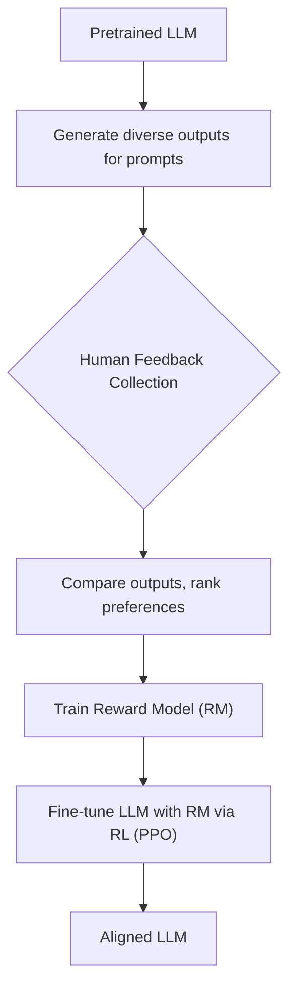
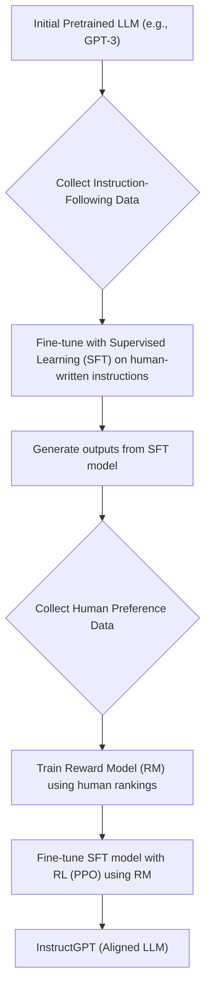

> [!summary] **Document Summary**
> This document explores how [[Large Language Models|LLMs]] evolve from simple next-token predictors into helpful, honest, and harmless conversational assistants through [[Instruction Tuning|instruction tuning]] and [[Model Alignment|model alignment]]. Key approaches like T0 and FLAN to improve generalization to new tasks are detailed, and the three-step process of [[Reinforcement Learning from Human Feedback|RLHF]] (Reinforcement Learning from Human Feedback) is explained. Finally, [[InstructGPT]] is presented as a successful example of how alignment, rather than model size, is crucial for user satisfaction.

## LLMs: Instruction Tuning & Model Alignment

[[Large Language Models|LLMs]] initially function as `next-token predictors`. To evolve into "ChatGPT-like" assistants, they must acquire specific capabilities:
- Accurately follow instructions provided by users.
- Generate responses that are helpful, polite, and harmless.
- Meet the `HHH goals`: **Helpful**, **Honest**, and **Harmless**.

> [!example] **Model Difference Example**
> Consider the difference in output between a pre-trained model and a fine-tuned model for a simple arithmetic query:
>
> - **Input (Pre-trained Llama 2 7b):** `what is 2 + 2?`
> - **Output (Pre-trained Llama 2 7b):** `What is 2 plus 2? What is the answer to 2 plus 2? What is the answer to 2 plus 2 in math?`
>   *This output demonstrates the model's tendency to continue a pattern or ask clarifying questions, rather than providing a direct answer.*
> - **Input (Fine-tuned Llama 2 7b):** `what is 2 + 2?`
> - **Output (Fine-tuned Llama 2 7b):** `The answer to 2 + 2 is 4.`
>   *This output shows the model's ability to directly answer the instruction after fine-tuning.*

### Language Models as Few-Shot Learners

Initially, models can `generalize to new tasks` when provided with a `few-shot` of examples. This means they learn from a small number of demonstrations.
- `Zero-shot performance`, where no examples are given, is typically low without specific training.
- The ultimate goal for assistants is to achieve robust zero-shot generalization, meaning they can perform new tasks without any prior examples.

### Including Instructions in Prompts (T5)

The [[T5 Architecture|T5 architecture]] integrates the task description directly into the prompt. This means the model `conditions its response` on the entire input context, including the instruction.

> [!example] **T5 Example**
> ```
> Input: "translate English to French: Hello"
> Output: "Bonjour"
> ```

#### Limitations of T5

Despite its innovative approach, T5 has limitations:
- It often `does not generalize well to new tasks` that deviate from its training.
- It `requires a specific format` for instructions; minor variations can lead to poor performance.

> [!example] **T5 Limitations Example**
> Let's see how T5 might struggle with format variations:
> - **Input 1:** `can you translate from English to German, What is your profession?`
> - **Output 1:** `Was ist Ihr Beruf?`
>   *This format matches what the model expects.*
> - **Input 2:** `can you translate from English to German the following sentence? What is your profession?`
> - **Output 2:** `<unk> <unk>...`
>   *A slight change in phrasing (adding "the following sentence?") causes the model to fail, producing unknown tokens (`<unk>`).*
> - **Input 3:** `compute: 2+2 =`
> - **Output 3:** `:2+2+2+2+2+2+2+2+2+...`
>   *Here, the model misunderstands "compute" and instead repeats the addition operation, indicating a lack of true understanding of the instruction.*

### Generalizing to New Tasks – T0

**T0** is a model inspired by the [[T5 Architecture|T5 architecture]], but with a focus on improving generalization.
- **Pre-training**: T0 undergoes a `masked LM task`, similar to [[BERT]], where parts of the input are hidden and the model predicts them.
- **Fine-tuning**: It is then fine-tuned on a `multitask mixture of question-answer pairs`. This diverse training helps it learn various instruction formats and tasks.
- **Objectives**: The main goals were to determine if T0 could:
    - Handle `prompts with different phrasings` effectively.
    - `Generalize to other tasks` it had not explicitly seen during fine-tuning.
- **Source**: This work was presented by Sanh et al. at ICLR 2022.

#### Fine-tuning Datasets

For T0, datasets were carefully split into fine-tuning and evaluation sets. This clear separation was crucial for verifying `zero-shot generalization`.
- The tasks used for training were distinct from those used for testing, ensuring the model's ability to generalize to `truly new tasks` could be assessed.

#### Templates for Prompting

T0 used `templates` to construct its question-answer pairs during fine-tuning.
- Tasks were formulated as questions, often with multiple reformulations to expose the model to linguistic variations.
- Sometimes, inverted tasks were included (e.g., given an answer, generate the question).
- This approach aimed for generalization by leveraging `semantic similarity` across different prompt formulations.

#### Generalization to New Tasks Performance

Results for T0 demonstrated a `notable improvement` in `zero-shot performance` on new tasks.
- T0 consistently `outperformed T5` on these generalization benchmarks.
- It generally performed `better than GPT-3` on these specific zero-shot tasks.

#### Prompt Robustness

T0 also showed `improved prompt robustness`.
- The use of `more prompt versions` during training led to better performance, even on new, unseen tasks.
- The variable $p$ represents the average number of prompts used per dataset, indicating that diversity in prompting is beneficial.

### Finetuned Language Net (FLAN)

**FLAN** stands for "Finetuned Language Net," and its core idea is summarized in the paper's title: "Finetuned Language Models are Zero-Shot Learners" (Wei et al., ICLR 2022).
- This work is similar in concept to T0 but was applied to `larger models`, scaling up to 137 billion parameters.
- **Main Result**: The research unequivocally demonstrated that `instruction tuning` significantly enhances `zero-shot performance` on tasks the model has not encountered before.

#### FLAN Setup/Results

- The experimental setup for FLAN was similar to T0, involving tasks reserved for evaluation and using roughly 10 prompts per dataset for training.
- The `instruction-tuned model versions` consistently and substantially `outperformed non-instruction-tuned models` in zero-shot scenarios.

### Aligning to Human Preferences

Although larger models tend to improve `next-token prediction` and `zero-shot task generalization`, they can still exhibit undesirable behaviors. They might be `untruthful`, generate `toxic` content, or simply be `unhelpful`.
- This indicates that these models are `not aligned with human preferences` by default.

#### Problems with Classic Training of LMs

According to Stiennon et al., 2020, classic training methods for LLMs have several issues:
- `Poor metrics` (e.g., [[ROUGE]] for [[Summarization|summarization]]) do not accurately capture the quality of the generated text from a human perspective.
- `Cross-entropy objectives`, which are common in language modeling, do not inherently distinguish between `important errors` and `minor mistakes`. All prediction errors are weighted similarly.
- Models trained this way often fail to distinguish `high-quality` data from `low-quality` data in their training corpus.
- **Goal**: The ultimate goal is to align LLM outputs with what humans consider useful and desirable.

### Three-Step Approach for Alignment (RLHF)

[[Reinforcement Learning from Human Feedback|Reinforcement Learning from Human Feedback]] (RLHF) provides a structured approach to aligning models with human preferences. This method was notably applied to the summarization of posts (e.g., Reddit TL;DRs) and involves three key steps:
1.  **Collect human feedback**: Gather data on human preferences regarding model outputs.
2.  **Train a reward model**: Create a model that predicts human preferences based on the gathered feedback.
3.  **Fine-tune the model with "human" feedback**: Use the reward model to guide the fine-tuning of the language model using reinforcement learning.



#### 1. Collect Human Feedback

In this step, humans are presented with model outputs and asked to choose their `preferred summary` from pairs.
- Humans are generally better at expressing `relative preference` (e.g., "Summary A is better than Summary B") than assigning absolute scores.
- In the context of [[Reinforcement Learning|Reinforcement Learning]] (RL), the `policy` refers to the model's output probability distribution conditioned on the input context.

##### Humans as Evaluation Functions

A human evaluator can be seen as an evaluation function $f(p, s_1, s_2)$, which takes a post $p$ and two summaries $s_1, s_2$ and returns a verdict (0 or 1) indicating which summary is preferred.
Alternatively, if humans could assign a `reward` $r(.)$ to each summary, the preference function could be expressed as:
$$f(p, s_1, s_2) = \mathbf{1}(r(p, s_1) > r(p, s_2))$$
where $r(p, s): C \to \mathbb{R}$ is a function that assigns a real-valued reward to a summary $s$ for a given post $p$. The indicator function $\mathbf{1}(\cdot)$ returns 1 if the condition is true and 0 otherwise.

##### Cons of Humans

Despite their importance, relying solely on humans for feedback has drawbacks:
- **Cost and scalability**: Collecting large amounts of human feedback is expensive and not easily scalable.
- **Inconsistency**: Human judgments can be inconsistent due to individual biases, fatigue, or different interpretations.
- **Simplicity of feedback**: The feedback (e.g., "A is better than B") might be too simple to capture the nuances needed for complex model improvements.

#### 2. Train a Reward Model

To overcome the limitations of direct human feedback, a `Reward Model` ($r_\theta$) is trained. This is typically another language model that predicts a `scalar value` representing the quality or desirability of an output.
- For two summaries $s_j$ and $s_k$ generated for a post $p$, the reward model assigns scores: $r_j = r_\theta(p, s_j)$ and $r_k = r_\theta(p, s_k)$.
- The reward model is trained using a loss function that maximizes the `reward gap`. If $s_j$ is preferred over $s_k$ by humans, then $r_j - r_k$ should be large.
- A common loss function used for this is based on the sigmoid function: $\log(\sigma(r_j - r_k))$, where $\sigma(x) = \frac{1}{1 + e^{-x}}$. This loss encourages $r_j$ to be greater than $r_k$ when $s_j$ is preferred.

#### How good is the Reward Model?

Research indicates the effectiveness of reward models:
1.  `Larger models` generally perform better as reward models. For instance, doubling the model size can lead to an increase of approximately 1.8% in performance.
2.  `More annotated data` to train the reward model also improves results. Doubling the amount of data can yield an increase of approximately 1.1% in performance.
3.  A well-trained reward model can approach the performance of a `single human annotator`.
4.  However, it is typically not as good as an `ensemble of humans`, which can average out individual inconsistencies.

#### 3. Fine-tune Model on Feedback (RLHF)

In the final step, a `copy` of the `original language model` (referred to as $\pi_{old}$) is fine-tuned ($\pi_{new}$) using the `Reward Model` $r_\theta$.
- The reward model's scores are used as the "human likeability" signal to guide the fine-tuning process.

##### Fine-tuning on Human Feedback

During fine-tuning, the new policy $\pi_{new}$ generates a summary $y$ for a given input $x$. The reward for this generation is calculated as:
$$R(x, y) = r_\theta(x, y) - \beta \log \frac{\pi_{new}(y|x)}{\pi_{old}(y|x)}$$
- The `main driver` of this reward is the `Reward Model` score $r_\theta(x, y)$, which directly reflects how much the output $y$ is "liked" by humans.
- The second term acts as a `Regularizer`: $\beta \log \frac{\pi_{new}(y|x)}{\pi_{old}(y|x)}$. This `KL divergence` term is crucial because:
    - It prevents $\pi_{new}$ from diverging too far from the original $\pi_{old}$. Without this, the model might exploit weaknesses in the reward model and generate outputs that score highly but are not actually useful.
    - The hyperparameter $\beta$ controls the strength of this regularization.
    - For greater stability, the probability ratio is often `clipped` (e.g., in [[Proximal Policy Optimization|Proximal Policy Optimization]], PPO).

##### Why use a "KL divergence"?

The reward model $r(.)$ is a `proxy` for true human preference, not a perfect representation.
- Maximizing $r(.)$ alone could lead to the generation of unhelpful summaries or "reward hacking," where the model produces outputs that score highly with the reward model but are not genuinely good according to human judgment. The KL divergence ensures the new model's output distribution remains close enough to the original, preventing it from drifting into undesirable territories while optimizing for the learned human preference.

#### Preference Results

Studies have consistently shown that annotators prefer Human Feedback fine-tuned models (`HF model`) over:
- `human-written` summaries
- `pre-trained only` models
- models trained with `supervised learning` alone.
This demonstrates the effectiveness of RLHF in aligning model outputs with human preferences.

### Aligning Instruction-Tuned Models (InstructGPT)

Ouyang et al., 2022 (OpenAI) extended the alignment paradigm to `various tasks` using [[InstructGPT]].
- This approach combined `instruction tuning` with `human-written responses` and the RLHF process.
- **Source**: Ouyang et al., 2022.

#### Main Takeaways of InstructGPT

The InstructGPT research yielded significant conclusions:
- Annotators consistently preferred the outputs of `InstructGPT (1.3B parameters)` over the much larger `GPT-3 (175B parameters)`. This highlighted that alignment is more critical than raw model size for user satisfaction.
- InstructGPT was found to be `more truthful` and `slightly less toxic` than GPT-3.
- The alignment achieved by InstructGPT generalized well to unseen annotators and was effective on `new tasks` it had not been explicitly trained on.

### InstructGPT Steps

InstructGPT essentially applies the three-step RLHF process, but specifically tailored with instruction-following data and human-written responses to improve its ability to follow instructions and align with human expectations across a wide range of tasks.



### A New Trend in Town

The success of InstructGPT established a new paradigm in LLM development:
- `Pre-training alone` is insufficient to achieve strong user alignment and usefulness.
- `Fine-tuning` with `high-quality instruction-following data` is essential to create truly helpful AI assistants.

#### New Approach (Current Paradigm)

The current standard approach for developing highly capable and aligned LLMs involves these steps:
1.  **Pre-train**: A large language model is initially pre-trained on `large, raw datasets` to learn general language patterns and knowledge. At this stage, it typically exhibits `alignment issues`.
2.  **Collect**: Smaller, `higher-quality datasets` are then collected. These datasets include human-written responses to instructions and human feedback on model outputs, specifically designed for instruction-based interactions.
3.  **Use RLHF**: [[Reinforcement Learning from Human Feedback|Reinforcement Learning from Human Feedback]] is applied to `align the models` with user preferences, leveraging the collected high-quality data. The original [[ChatGPT]] was based on the principles of [[InstructGPT]], using a GPT-3 175B model as its foundation.
---
## References
- [[Large Language Models]]
- [[T5 Architecture]]
- [[BERT]]
- [[Reinforcement Learning]]
- [[Proximal Policy Optimization]]
- [[InstructGPT]]
- [[ChatGPT]]
- [[ROUGE]]
- [[Summarization]]