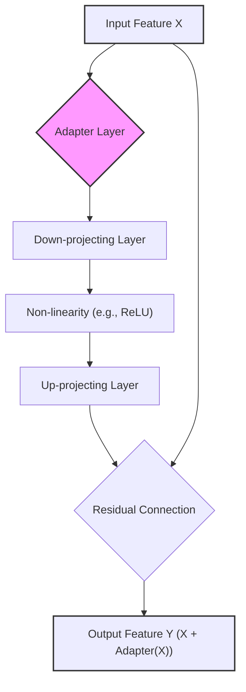
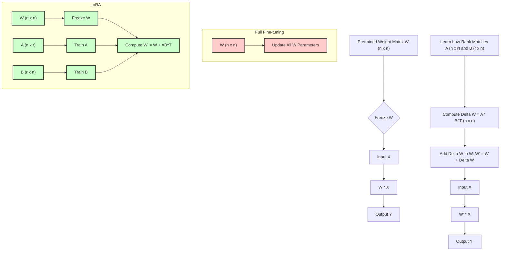
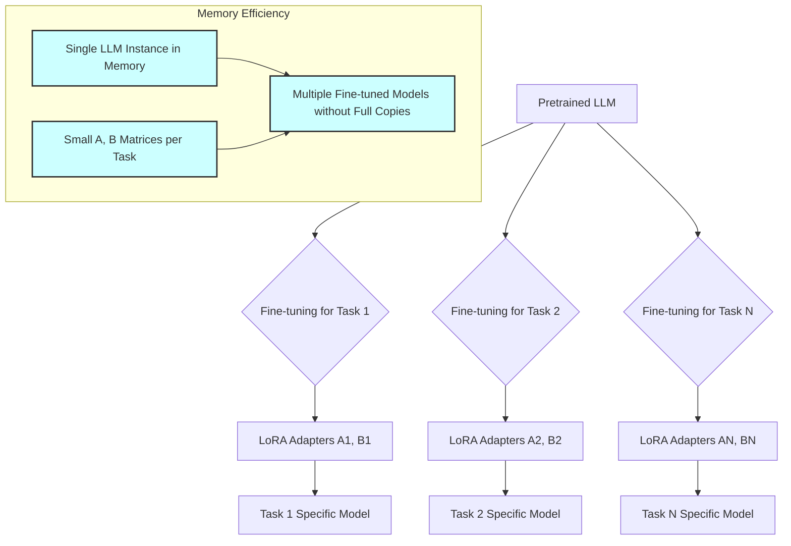
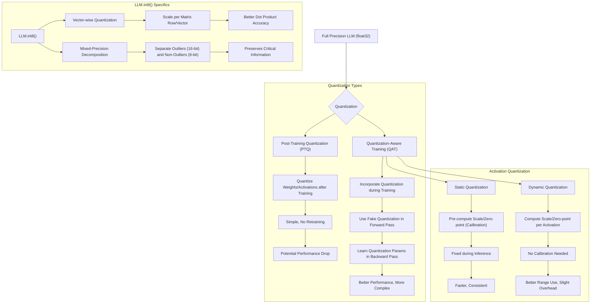
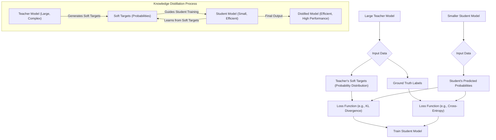

> [!summary] **Document Summary**
> This note explores techniques for efficient fine-tuning and inference of [[Large Language Models (LLMs)|LLMs]], addressing the computational challenges of traditional methods. It details [[Parameter-Efficient Fine-Tuning (PEFT)|PEFT]] approaches like [[BitFit]], [[Adapter Layers]], [[Low-Rank Adaptation (LoRA)|LoRA]], and [[Prompt Tuning]], alongside optimization strategies such as [[Quantization]], reduced floating-point precision, and [[Model Distillation]]. The goal is to maximize LLM performance on specific tasks while minimizing resource consumption.

## Efficient Fine-tuning and Inference for Large Language Models (LLMs)

### The Need for Fine-tuning LLMs

While **Large Language Models (LLMs)** like [[GPT-3]] and [[FLAN]] demonstrate impressive few-shot or zero-shot learning capabilities, [[Fine-tuning LLMs|fine-tuned]] models consistently achieve the **upper bound in performance** for specific tasks. This often means they can outperform even larger models that rely solely on [[In-Context Learning (ICL)|In-Context Learning (ICL)]]. Therefore, [[Fine-tuning LLMs|fine-tuning]] is a crucial step for maximizing the performance of an [[Large Language Models (LLMs)|LLM]] on a particular application.

### Fine-tuning

> [!definition] **Fine-tuning**
> This process improves a model's performance on new, specific tasks by continuing its training on data tailored to that task, building upon the knowledge acquired during its initial pretraining.
*   During [[Fine-tuning LLMs|fine-tuning]], all model weights can change, allowing for extensive adaptation.
*   **Pros**:
    *   It achieves performance levels comparable to training a model from scratch, but with significantly less data and computational cost.
    *   It enables fundamental behavior changes, such as [[Instruction Tuning|instruction following (instruction tuning)]] or aligning the model with human values ([[Model Alignment|model alignment]]), even with relatively smaller datasets.
*   **Cons**:
    *   It is very resource intensive, especially for large models, because a vast number of parameters need to be updated during the training process.

### Feature-based Transfer

> [!definition] **Feature-based transfer**
> In this approach, the **backbone model** (the pretrained [[Large Language Models (LLMs)|LLM]]) weights are **frozen**. This means their values are fixed and do not change during training; no gradient updates are applied to them.
*   Instead, a new, small, **trainable head** (typically a few layers) is added on top of the [[Feature-based Transfer|frozen]] backbone. Only the weights of this new head are updated. Optionally, the last few layers of the backbone model can be **unfrozen** to allow for some deeper adaptation.
*   The original, [[Feature-based Transfer|frozen]] model effectively acts as a **feature extractor**, providing high-level representations (features) to the newly added head, which then learns to map these features to the desired task output.
*   **Pros**:
    *   It is less resource intensive compared to full [[Fine-tuning LLMs|fine-tuning]] because only a small fraction of the total weights are updated.
    *   It is particularly effective when the new task is similar to the tasks the original model was pretrained on.
*   **Cons**:
    *   It can lead to sub-optimal performance for complex or highly diverse tasks that require more profound changes within the model's internal representations, which freezing the backbone prevents.

### Problems with "Classic" Approaches

The traditional methods of [[Fine-tuning LLMs|fine-tuning]] (full [[Fine-tuning LLMs|fine-tuning]]) and [[Feature-based Transfer|feature-based transfer]] present a trade-off: full [[Fine-tuning LLMs|fine-tuning]] offers high performance but demands significant resources, while [[Feature-based Transfer|feature-based transfer]] is resource-efficient but may compromise performance on complex tasks. With the increasing size of [[Large Language Models (LLMs)|LLMs]] and the diversity of tasks they are applied to, relying solely on either of these classic approaches becomes challenging. This challenge directly motivates the development of **Parameter-efficient Fine-Tuning (PEFT)** techniques.

### Parameter-efficient Fine-Tuning (PEFT)

> [!definition] **Parameter-efficient Fine-Tuning (PEFT)**
> These are a collection of techniques specifically designed to reduce the computational cost and memory footprint of [[Fine-tuning LLMs|fine-tuning]] [[Large Language Models (LLMs)|LLMs]] by drastically decreasing the number of parameters that need to be updated.
*   Key [[Parameter-Efficient Fine-Tuning (PEFT)|PEFT]] techniques include:
    *   `[[BitFit]]`
    *   `[[Adapter Layers|Adapter layers]]`
    *   `[[Low-Rank Adaptation (LoRA)|LoRA]]` (Low Rank Adaptation)
    *   `[[Prompt Tuning|Prompt tuning]]`

#### Bias-terms Fine-tuning (BitFit)

> [!definition] **BitFit**
> This is a sparse [[Fine-tuning LLMs|fine-tuning]] method that modifies *only the **bias terms*** within the model, or a selected subset of them.
*   **Bias terms** constitute a very small fraction of the total model weights. For instance, in a [[BERT]] model, they might represent only about $0.1\%$ of all parameters.
*   Research by Zaken et al. (2021) demonstrated that by tuning only these [[BitFit|bias terms]], [[BitFit]] can achieve performance levels comparable to full [[Fine-tuning LLMs|fine-tuning]].
*   Historically, [[BitFit|bias terms]] were sometimes overlooked (e.g., they weren't explicitly highlighted in the original Transformer paper). Their significant role in models like [[BERT]], when selectively tuned, might be considered a "fortunate mistake" in their initial design.

#### Adapters

> [!definition] **Adapters**
> These are small, specialized layers that are strategically inserted between existing layers of a pretrained model. Common insertion points include between the attention layers or within the fully-connected layers of a Transformer block.
*   During [[Fine-tuning LLMs|fine-tuning]], *only these **adapter layers** are trained*; the vast majority of the pretrained model's weights remain [[Feature-based Transfer|frozen]]. The only other flexible components are typically the **Layer Norms**, which might be slightly updated.
*   This approach significantly reduces the number of trained parameters while still allowing for deeper, more impactful changes to the model's internal representations compared to simple [[Feature-based Transfer|feature-based transfer]].

##### Adapter Layer Architecture

[[Adapter Layers|Adapter layers]] are typically designed as simple, feed-forward (fully-connected) neural networks:
*   A **down-projecting layer**: This layer reduces the dimensionality of the input.
    *   Example: It might transform a $768$-dimensional vector into a $32$-dimensional vector.
*   A **non-linearity**: An activation function like `ReLU` is applied to introduce non-linearity.
*   An **up-projecting layer**: This layer restores the dimensionality back to the original size.
    *   Example: It might transform the $32$-dimensional vector back into a $768$-dimensional vector.
*   More complex architectures for [[Adapter Layers|adapter layers]] often do not yield significant additional benefits over this simple design.
*   When an [[Adapter Layers|adapter]] is "injected" into a pretrained model, it is crucial that it initially acts as an **identity function**. This means $adapter(x) \approx x$ at the beginning of training. This prevents the [[Adapter Layers|adapter]] from "ruining" the finely tuned intermediate representations of the pretrained model. This [[Adapter Layers|identity behavior]] is achieved through a **residual connection** (where the original input $x$ is added back to the [[Adapter Layers|adapter]]'s output) and by initializing the weights of the [[Adapter Layers|up-projecting layer]] close to $0$.



> [!math] **Adapter Layer Parameters**
> Example: An [[Adapter Layers|adapter layer]] with a bottleneck dimension of $d_{bottleneck}$:
> Input dimension: $d_{model}$
> Output dimension: $d_{model}$
> Number of parameters in [[Adapter Layers|down-projecting layer]]: $d_{model} \times d_{bottleneck}$
> Number of parameters in [[Adapter Layers|up-projecting layer]]: $d_{bottleneck} \times d_{model}$
> Total parameters (excluding biases): $2 \times d_{model} \times d_{bottleneck}$

##### Results of Adapters

*   **Parameter reduction**: Consider a single Transformer layer within a [[BERT]] model, which typically has approximately $7$ million parameters. If we use [[Adapter Layers|adapters]] with a bottleneck dimension of $32$, each [[Adapter Layers|adapter layer]] would have roughly $50$ thousand parameters.
    > [!example] **Adapter Parameter Calculation**
    > This is calculated as: $(768 \times 32) + 32 \text{ (bias)} + (32 \times 768) + 768 \text{ (bias)} \approx 50 \text{K}$.
    If two [[Adapter Layers|adapters]] are inserted per Transformer layer (e.g., one after attention, one after the feed-forward network), this amounts to about $100$K parameters per layer. This represents a reduction by a factor of approximately $70$x compared to the $7$ million parameters of the full layer.
*   **Performance**: Despite the significant reduction in trainable parameters, [[Adapter Layers|adapters]] have been shown to achieve performance levels similar to classic full [[Fine-tuning LLMs|fine-tuning]], but at a mere fraction of the computational cost.

#### Low-Rank Adaptation (LoRA)

> [!definition] **LoRA**
> This technique freezes the original pretrained model's weight matrix $W$ and instead *only learns the **incremental change** $\Delta W$* that should be applied during [[Fine-tuning LLMs|fine-tuning]]. The updated weight matrix $W'$ is then calculated as $W' = W + \Delta W$.

##### Rank of Matrices (Digression)

> [!definition] **Rank of a matrix**
> The **rank of a matrix** is defined as the maximum number of linearly independent rows (or columns) it contains.
*   An $n \times n$ **full rank** matrix $F$ has all its rows (and columns) linearly independent. Such a matrix can be factored into $F = AB^T$, where $A$ and $B$ are also $n \times n$ matrices.
*   An $n \times n$ **low rank** matrix $L$ has rows (and columns) that are linearly dependent. This means its rank $r$ is less than $n$. A [[Low-Rank Adaptation (LoRA)|low-rank]] matrix can be factored into $L = AB^T$, where $A$ and $B$ are now $n \times r$ matrices, and $r$ is the rank.
*   **Example**: Consider the $3 \times 3$ matrix:
    > [!math] **Example Low-Rank Matrix**
    > $$\begin{pmatrix}
    > 1 & 2 & 1 \\
    > 2 & 4 & 2 \\
    > -1 & -2 & -1
    > \end{pmatrix}$$
    This matrix has a rank of $1$. Notice that row 2 is simply row 1 multiplied by $2$, and row 3 is row 1 multiplied by $-1$. This matrix can be factored into:
    > [!math] **Low-Rank Matrix Factorization**
    > $$A = \begin{pmatrix} 1 \\ 2 \\ -1 \end{pmatrix} \quad \text{and} \quad B = \begin{pmatrix} 1 \\ 2 \\ 1 \end{pmatrix}$$
    > Then
    > $$AB^T = \begin{pmatrix} 1 \\ 2 \\ -1 \end{pmatrix} \begin{pmatrix} 1 & 2 & 1 \end{pmatrix} = \begin{pmatrix} 1 \cdot 1 & 1 \cdot 2 & 1 \cdot 1 \\ 2 \cdot 1 & 2 \cdot 2 & 2 \cdot 1 \\ -1 \cdot 1 & -1 \cdot 2 & -1 \cdot 1 \end{pmatrix} = \begin{pmatrix} 1 & 2 & 1 \\ 2 & 4 & 2 \\ -1 & -2 & -1 \end{pmatrix}$$
*   **Near low-rank**: This term refers to matrices that are technically [[Low-Rank Adaptation (LoRA)|full rank]] but are very close to a [[Low-Rank Adaptation (LoRA)|low-rank]] matrix. Such matrices can be *approximated* effectively by a [[Low-Rank Adaptation (LoRA)|low-rank]] factorization $AB^T$. The quality of this approximation improves as the matrix's "distance" to a true [[Low-Rank Adaptation (LoRA)|low-rank]] matrix decreases.

##### LoRA (Low Rank Assumption of $\Delta W$)

*   Simply learning $\Delta W$ as a [[Low-Rank Adaptation (LoRA)|full rank]] matrix would not be efficient, as it would involve the same number of parameters as the original weight matrix $W$.
*   [[Low-Rank Adaptation (LoRA)|LoRA]]'s core insight is based on the empirical observation that the [[Low-Rank Adaptation (LoRA)|incremental change]] $\Delta W$ required during [[Fine-tuning LLMs|fine-tuning]] is generally **near low-rank**.
*   Therefore, $\Delta W$ can be effectively approximated by factoring it into two much smaller matrices, $A$ and $B$, such that $W' = W + AB^T$.
*   During [[Fine-tuning LLMs|fine-tuning]], we only learn the weights of these smaller matrices $A$ and $B$, which collectively approximate $\Delta W$ with a chosen rank $r$.
*   The parameter reduction is significant: If the original matrix $W$ has dimensions $n \times n$, then $\Delta W$ also has $n \times n$ parameters. However, $A$ has dimensions $n \times r$ and $B$ has dimensions $r \times n$. The total parameters for $A$ and $B$ combined are $(n \times r) + (r \times n) = 2nr$. If we choose a rank $r$ such that $r < n/2$, then $2nr < n^2$, meaning $A$ and $B$ collectively have fewer parameters than $\Delta W$.
*   **Initialization**: To ensure that the [[Low-Rank Adaptation (LoRA)|incremental change]] $\Delta W$ is initially zero (so $W' = W$ at the start of [[Fine-tuning LLMs|fine-tuning]]), matrix $A$ is typically sampled from a normal distribution $\mathcal{N}(0, \sigma^2)$, while matrix $B$ is initialized to all zeros. This makes $AB^T = 0$ at the beginning of training.



##### Results of LoRA

*   Empirical evidence strongly supports the assumption that weight updates during [[Fine-tuning LLMs|fine-tuning]] are indeed [[Low-Rank Adaptation (LoRA)|near low-rank]].
*   A relatively small rank, such as $r=4$, often yields excellent approximations for $\Delta W$, demonstrating the effectiveness of the [[Low-Rank Adaptation (LoRA)|low-rank]] assumption.
*   **Parameter reduction ([[BERT]] example)**: In a [[BERT]] Transformer layer, which has approximately $7$ million parameters, applying [[Low-Rank Adaptation (LoRA)|LoRA]] with $r=4$ to all four attention matrices ($W_q, W_k, W_v, W_o$, each $768 \times 768$) and both feed-forward (FF) layers ($768 \rightarrow 3072 \rightarrow 768$) results in a significantly reduced number of trainable parameters.
    > [!example] **LoRA Parameter Calculation**
    > The calculation is approximately $50$K parameters: $(768 \times 4 \times 2 \text{ (for A and B)} \times 4 \text{ (for } W_q, W_k, W_v, W_o)) + ((768 \times 4 + 3072 \times 4) \text{ for FF1} + (3072 \times 4 + 768 \times 4) \text{ for FF2})$.
    This is a reduction factor of approximately $140$x fewer parameters compared to full [[Fine-tuning LLMs|fine-tuning]].
*   [[Low-Rank Adaptation (LoRA)|LoRA]] also allows for further parameter reduction by selectively applying it to only certain parts of the Transformer architecture, such as just the query and value matrices in the attention mechanism.

##### Considerations on LoRA

*   **Scalability**: The benefits of [[Low-Rank Adaptation (LoRA)|LoRA]] become even more pronounced as model sizes increase. For extremely large models like [[GPT-3]] (with a model dimension $d_{model} = 12,288$), [[Low-Rank Adaptation (LoRA)|LoRA]] can lead to a reduction of trainable parameters by a factor of $10,000$x or more.
*   **Hardware**: While [[Low-Rank Adaptation (LoRA)|LoRA]] significantly reduces the number of *trainable* parameters, the original pretrained model weights still need to be loaded into memory. However, the memory required for storing gradients and optimizer states is drastically cut, leading to a typical reduction in hardware requirements (e.g., GPU memory) by up to $3$x.
*   **Multi-task learning**: [[Low-Rank Adaptation (LoRA)|LoRA]] is highly advantageous for scenarios involving multiple tasks. A single pretrained model instance can be loaded, and then [[Fine-tuning LLMs|fine-tuned]] for numerous distinct tasks. Each task would only require its own small set of $A_t, B_t$ [[Adapter Layers|adapter]] matrices, making it extremely space-efficient for storing multiple [[Fine-tuning LLMs|fine-tuned]] models.
*   **Inference time**: During inference, the updated weight matrix $W'$ can be precomputed by adding $W$ and $AB^T$ together ($W' = W + AB^T$). This means that during actual inference, the operation $W'x$ becomes a single matrix multiplication, completely eliminating any overhead that might otherwise be introduced by the [[Low-Rank Adaptation (LoRA)|LoRA]] layers.



#### Prompt Tuning

**Prompting**: This technique involves adding extra input information to the model's original input, with the goal of conditioning the model to generate a desired output.
*   Traditionally, **prompt design** involves carefully crafting and prepending specific vocabulary tokens (words or sub-word units) to the input. The aim is to maximize the likelihood of the model producing the correct or desired output.
> [!definition] **Prompt tuning**
> Instead of using existing vocabulary tokens, this method adds a fixed set of special, *learnable* tokens (often referred to as "soft prompts" or "virtual tokens") to the input prompt.
*   During [[Fine-tuning LLMs|fine-tuning]], *only the embeddings of these special tokens are updated*. The rest of the [[Large Language Models (LLMs)|LLM]]'s parameters remain [[Feature-based Transfer|frozen]]. This effectively "creates" optimal prompt words in the embedding space that guide the model towards the desired behavior for a specific task.

### Other Optimization Techniques

Beyond [[Parameter-Efficient Fine-Tuning (PEFT)|PEFT]], there are several other techniques aimed at reducing the memory footprint and computational cost of [[Large Language Models (LLMs)|LLMs]], both during training and inference. These methods often involve shrinking existing models or developing smaller, more efficient versions.

#### Quantization

> [!definition] **Quantization**
> This process involves mapping continuous (floating-point) values, which are typically used for model weights and activations, to discrete, lower-precision values. This reduces the number of bits required to represent these values, thereby limiting the range of representable values.
*   **Pros**:
    *   Significantly reduces storage requirements and memory usage for the model.
    *   Can improve computational efficiency, as operations with fewer bits (especially integers) are generally faster.
*   **Cons**:
    *   The reduction in precision typically results in some loss of model performance, which needs to be carefully managed.

##### Numerical Representations

> [!info] **Common Numerical Representations**
> Common numerical representations used in deep learning include:
*   **float32**: This is the standard single-precision floating-point format. It uses $1$ sign bit, $8$ exponent bits, and $23$ mantissa bits. Its positive range extends approximately from $1.18 \times 10^{-38}$ to $3.4 \times 10^{38}$.
*   **float16**: Also known as half-precision, it uses $1$ sign bit, $5$ exponent bits, and $10$ fraction bits. Its positive range is much smaller, approximately from $6.1 \times 10^{-5}$ to $6.5 \times 10^4$.
*   **bfloat16**: Brain Floating Point, it uses $1$ sign bit, $8$ exponent bits, and $7$ mantissa bits. Crucially, it shares the *same dynamic range* as [[Numerical Representations|float32]] (due to having $8$ exponent bits) but offers lower precision (due to fewer mantissa bits). This makes it robust to large values.
*   **int8**: This represents integer values, typically ranging from $-128$ to $127$.

##### Quantization Process

> [!info] **Quantization Mapping Scheme**
> The core of [[Quantization|quantization]] involves a **mapping scheme** that transforms values from a higher-precision domain (e.g., [[Numerical Representations|float32]]) to a lower-precision domain (e.g., [[Numerical Representations|int8]]). This scheme is typically defined by a **scale** factor ($S$) and a **zero-point** ($Z$).
*   The formula for [[Quantization|quantization]] is often: $Q = \text{round}(F/S + Z)$, where $Q$ is the quantized integer, and $F$ is the floating-point value. The dequantization formula is $F = (Q - Z) \times S$.
*   **Absmax quantization**: This is a **symmetric** scaling method. It identifies the largest absolute value ($a$) within a tensor and maps $-a$ to the minimum quantized value (e.g., $-127$ for [[Numerical Representations|int8]]) and $+a$ to the maximum quantized value (e.g., $+127$ for [[Numerical Representations|int8]]). A key advantage is that it inherently preserves the original $0$ value.
    > [!example] **Absmax Quantization Example**
    > For a [[Numerical Representations|float32]] tensor with values from $-10$ to $10$, and [[Numerical Representations|int8]] range $[-127, 127]$, $S = 10/127$. A float value of $5$ would be quantized to $\text{round}(5 / (10/127)) = \text{round}(63.5) = 64$.
*   **Zero-point quantization**: This is an **asymmetric** scaling method. It maps the minimum floating-point value ($min=a$) in the tensor to the minimum quantized value (e.g., $-128$ for [[Numerical Representations|int8]]) and the maximum floating-point value ($max=b$) to the maximum quantized value (e.g., $+127$ for [[Numerical Representations|int8]]). This approach is generally more efficient for distributions that are not symmetric around zero.
    > [!example] **Zero-point Quantization Example**
    > For a [[Numerical Representations|float32]] tensor with values from $0$ to $10$, and [[Numerical Representations|int8]] range $[-128, 127]$, $S = (10-0)/(127 - (-128)) = 10/255$. $Z = -128 - \text{round}(0/S) = -128$. A float value of $5$ would be quantized to $\text{round}(5 / (10/255) - 128) = \text{round}(127.5) - 128 = -1$. (Note: precise $Z$ calculation can vary.)

##### Types of Quantization

*   **Post-Training Quantization (PTQ)**: This method quantizes the model weights and/or activations *after* the model has been fully trained in [[Numerical Representations|full precision]]. It is straightforward to apply as it does not require any retraining. However, it can sometimes yield sub-optimal performance due to the sudden loss of precision.
*   **Quantization-Aware Training (QAT)**: This approach incorporates [[Quantization|quantization]] directly *during the training process*.
    *   **Forward pass**: During the **Forward pass**, (fake) quantized weights and activations are used. This means the values are rounded to their lower-precision equivalents, but the underlying representation might still be [[Numerical Representations|full precision]] for computational stability.
    *   **Backward pass**: Gradients are computed in [[Numerical Representations|full precision]]. Crucially, [[Quantization-Aware Training (QAT)|QAT]] employs various tricks (e.g., [[Straight-Through Estimator]]) to handle the non-differentiable rounding operations, allowing the model to learn optimal [[Quantization|quantization]] parameters (like [[Quantization|scale]] and [[Quantization|zero-point]]) alongside the model weights.
    *   [[Quantization-Aware Training (QAT)|QAT]] typically offers better performance compared to [[Post-Training Quantization (PTQ)|PTQ]] because the model "learns" to be robust to [[Quantization|quantization]] from the start, but it requires intervention in the training loop.

##### Static vs. Dynamic Quantization (for Activations)

> [!info] **Activation Quantization Strategies**
> The [[Quantization|scale]] and [[Quantization|zero-point]] parameters are essential for quantizing both weights and activations. While these parameters can be precomputed and fixed for weights, activations often require different strategies:
*   **Static quantization**: For **Static quantization**, the [[Quantization|scale]] and [[Quantization|zero-point]] for activations are pre-computed and fixed before inference. This is typically done during a **calibration phase**, where a small representative validation dataset is run through the model, and the ranges of activations are observed to determine optimal [[Quantization|quantization]] parameters. This approach leads to faster and more consistent inference.
*   **Dynamic quantization**: In **Dynamic quantization**, the [[Quantization|scale]] and [[Quantization|zero-point]] for activations are computed *on-the-fly* for each activation tensor during inference. This allows for better utilization of the [[Quantization|quantization]] range for each specific input, and it eliminates the need for a [[Static Quantization|calibration phase]]. However, this dynamic computation adds a small computational overhead at inference time.

##### `LLM.int8()`

> [!definition] **LLM.int8()**
> This is a specialized [[Quantization|quantization]] technique designed specifically for [[Large Language Models (LLMs)|Large Language Models]].
*   **Vector-wise quantization**: Instead of applying a single scaling constant to an entire weight matrix, [[LLM.int8()]] computes separate scaling constants for each *matrix row or vector*. This fine-grained scaling allows for much better-quantized dot products, especially when dealing with the diverse value ranges found across different parts of an [[Large Language Models (LLMs)|LLM]]'s weights.
*   **Mixed-precision decomposition**: A critical feature of [[LLM.int8()]] is its ability to handle "outlier" weights or activations. These are crucial, unusually large magnitude values (often representing only about $0.1\%$ of features) that can disproportionately impact performance if quantized to [[Numerical Representations|int8]]. [[LLM.int8()]] addresses this by decomposing matrices into two parts: a majority of **8-bit** quantized "non-outlier" values and a small fraction of "outlier" values that are kept in higher precision (e.g., **16-bit**). This [[LLM.int8()|mixed-precision approach]] preserves critical information while still achieving significant memory savings.



#### Reduced Floating Point Precision

> [!info] **Reduced Floating Point Precision**
> Converting a model to **half precision** ([[Numerical Representations|float16]] or [[Numerical Representations|bfloat16]]) is a less drastic optimization compared to full [[Quantization|quantization]].
*   While [[Numerical Representations|float32]] (single precision) is the default for many deep learning operations, it has been observed that lower precision is often sufficient for maintaining acceptable model performance.
*   This conversion effectively saves half the model's memory footprint, as each parameter now occupies $16$ bits instead of $32$ bits.
*   It is important to note that this is *not [[Quantization|quantization]]* in the strict sense, because the values still exist within a continuous range, albeit with fewer bits representing their mantissa and/or exponent.
*   In PyTorch, this conversion is straightforward:
    ```python
    model = model.half() # for float16
    ```
    or
    ```python
    model = model.bfloat16() # for bfloat16 if supported by hardware
    ```

#### Model Distillation

> [!definition] **Model distillation**
> This technique involves training a smaller, more efficient model (referred to as the **student** model) to mimic the behavior and knowledge of a larger, more complex, and typically higher-performing model (the **teacher** model). The goal is to "distill" the essential knowledge from the [[Model Distillation|teacher]] into the [[Model Distillation|student]].
*   Instead of merely training the [[Model Distillation|student]] model on the ground truth labels, the [[Model Distillation|student]] is trained to predict the [[Model Distillation|teacher]]'s **probability distribution** over all possible output classes (e.g., across all words in a vocabulary) for a given input.
*   Learning from the [[Model Distillation|teacher]]'s "**soft targets**" (the [[Model Distillation|full probability distribution]]) provides much richer and more nuanced semantic information than simply learning from "**hard**" ground truth labels.
    > [!example] **Soft Targets in Model Distillation**
    > For the input "The cat sat on the mat", if the ground truth label for a token is "cat", a [[Model Distillation|hard target]] would be $(cat: 1, everything else: 0)$. However, a [[Model Distillation|teacher]] model might provide a [[Model Distillation|soft target]] like $(cat: 0.6, kitten: 0.2, kitty: 0.1, cats: 0.1, dog: 0.001, etc.)$. This [[Model Distillation|soft distribution]] tells the [[Model Distillation|student]] not only that "cat" is the correct answer but also that "kitten" and "kitty" are semantically very similar and plausible alternatives, while "dog" is highly unlikely. This extra information helps the [[Model Distillation|student]] learn better generalizations.

##### Model Distillation in LLMs

> [!info] **Distilled LLM Examples**
> Distilled models, despite their smaller architectures, have consistently achieved performance levels comparable to their much larger [[Model Distillation|teacher]] counterparts.
*   **DistilBERT** (distilled from [[BERT]]): This [[Model Distillation|student]] model is $40\%$ smaller than [[BERT]], retains approximately $97\%$ of [[BERT]]'s performance, and offers a $60\%$ faster inference speed.
*   **TinyBERT** (also distilled from [[BERT]]): This model is even more compact, being $7.5$x smaller than [[BERT]]. It still manages to retain about $97\%$ of [[BERT]]'s performance while achieving a remarkable $9.4$x faster inference.
*   **MiniLM**: Another example, this model is $50\%$ smaller and maintains $99\%$ performance retention relative to its [[Model Distillation|teacher]].
*   **DistilGPT-2**: A distilled version of [[GPT-2]], showcasing the applicability of [[Model Distillation|distillation]] to generative language models.



## References
- [[Large Language Models (LLMs)]]
- [[Fine-tuning LLMs]]
- [[Parameter-Efficient Fine-Tuning (PEFT)]]
- [[Low-Rank Adaptation (LoRA)]]
- [[Quantization]]
- [[Model Distillation]]
- [[BERT]]
- [[GPT-3]]
- [[FLAN]]
- [[Instruction Tuning]]
- [[Model Alignment]]
- [[Adapter Layers]]
- [[Prompt Tuning]]
- [[BitFit]]
- [[Numerical Representations]]
- [[Absmax Quantization]]
- [[Zero-Point Quantization]]
- [[Post-Training Quantization (PTQ)]]
- [[Quantization-Aware Training (QAT)]]
- [[Straight-Through Estimator]]
- [[Static Quantization]]
- [[Dynamic Quantization]]
- [[LLM.int8()]]
- [[DistilBERT]]
- [[TinyBERT]]
- [[MiniLM]]
- [[GPT-2]]
- [[DistilGPT-2]]