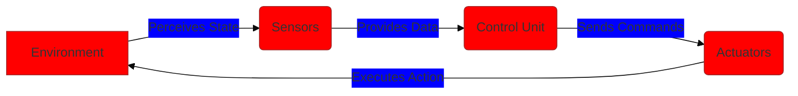
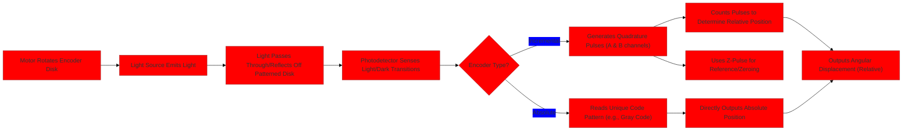

> [!summary] **Document Summary**
> This note covers robotics fundamentals: definitions, history, and applications (manufacturing, space, healthcare). It details core components (actuators, sensors, control units), exploring actuation pipelines, servo types, sensing properties, and proprioceptive/exteroceptive sensor technologies. Practical examples, mathematical formulations, and system integration for robotic perception and action are emphasized.

## Foundations of Sensing and Actuation

### Introduction to Robots

Understanding [[Robotics|robotics]] requires defining robots and exploring their historical development to provide a modern context.

#### Definition of a Robot

> [!definition] **Robot**
> From Encyclopedia Britannica: A **robot** is any automatically operated machine designed to replace human effort, prioritizing its functional capability over its physical form. Robots are versatile machines engineered for efficient task performance, irrespective of their specific physical shape.

#### Historical Overview

Robots have evolved significantly from imaginative fiction to practical reality, with their development profoundly shaped by early literary works.

-   **Robota**: This term, meaning “work” in Slavic, was introduced in Karel Capek's play *Rossum’s Universal Robots (R.U.R.)* (1920). The play envisioned artificial, human-like workers designed to free humans from mundane labor, thereby sparking early interest in automation and the concept of robots.

-   **Laws of Robotics** by Isaac Asimov in *I, Robot* (1950): These foundational ethical principles were established to guide robot behavior, emphasizing safety and obedience. They provide a crucial framework for robot design, aiming to ensure harmonious coexistence with humans. The three laws are:
    1.  A robot may not injure a human being or, through inaction, allow a human being to come to harm.
    2.  A robot must obey orders given to it by human beings, except where such orders would conflict with the First Law.
    3.  A robot must protect its own existence as long as such protection does not conflict with the First or Second Law.

These milestones effectively merge creative imagination with critical ethical considerations, thereby defining the field of [[Robotics|robotics]] as we know it today.

### Robotics in Numbers

[[Robotics|Robotics]] has experienced remarkable growth, with statistical data consistently revealing widespread adoption and significant impact across numerous industries. (Additional details on market size, deployment rates, and economic contributions are typically provided in slides 4-8 of a related presentation.) The global robotics market has expanded from billions to trillions of dollars, a trend primarily driven by advancements in automation and artificial intelligence.

### Applications of Robotics

[[Robotics|Robotics]] is applied across diverse domains, each presenting distinct challenges and offering unique advantages. Key applications are examined below, focusing on their specific operational requirements and the innovative solutions robots provide.

#### Industrial Manipulators

**Industrial manipulators** are specialized robots that excel in manufacturing environments, handling tasks that demand high strength, precision, and consistency. They significantly enhance productivity by operating tirelessly in controlled settings.

-   **Handling heavy tasks**: For example, lifting substantial payloads on assembly lines.
-   **Precision activities**: Such as welding or machining with sub-millimeter accuracy.
-   **Repetitive movements**: Enabling 24/7 operation without experiencing fatigue.

> [!example] **Industrial Manipulators Application**
> In automotive assembly lines, FANUC manipulators precisely position car parts, which drastically reduces human error and increases overall efficiency. For instance, a FANUC robot might weld chassis components to a tolerance of 0.1 mm, completing multiple cycles in mere seconds, far exceeding human capabilities in speed and consistency.

#### Space Robotics

**Space robotics** operates in harsh, inaccessible environments, extending human capabilities beyond Earth. These robots are specifically designed to withstand extreme conditions for critical missions.

-   **Operates in unreachable areas**: Such as the surfaces of distant planets or moons.
-   **Risky environments**: Including the vacuum of space and exposure to intense radiation.
-   **Unusual working conditions**: Like microgravity, which alters how objects behave.

> [!example] **Space Robotics Application**
> NASA's Robonaut or Mars rovers (e.g., Perseverance) utilize manipulators to collect samples in hazardous extraterrestrial settings. For example, Perseverance's robotic arm is equipped to drill into Martian rock, extract cores, and analyze them on-site, effectively performing complex scientific tasks despite the challenges of microgravity and a hostile atmosphere.

#### Underwater Robotics

**Underwater robotics** mirrors space applications but is specifically tailored for submerged operations, addressing the unique hurdles posed by aquatic environments. These systems enable exploration and maintenance in depths inaccessible to humans.

-   **Similar to space operations**: But specifically designed for subsea environments.
-   **Challenges**: Include severe communication difficulties due to signal attenuation in water, extremely high pressures that can crush conventional structures, and low visibility caused by turbidity.

> [!example] **Underwater Robotics Application**
> Remotely Operated Vehicles (ROVs) are extensively used for deep-sea oil rig inspections, navigating high-pressure environments to perform vital maintenance. An ROV operating at 2000 meters might inspect pipelines using advanced sonar, compensating for murky water by generating detailed maps of structures with acoustic signals.

#### Soft Robotics

**Soft robotics** is a burgeoning field inspired by natural biological forms, leading to designs with greater flexibility and adaptability. Unlike traditional rigid robots, these systems mimic biological structures for safer and more versatile interactions.

-   **Uses soft/elastic materials**: Such as silicone rubbers, to create inherently flexible structures.
-   **Inspired by biological bodies**: And animal motor capabilities, like the intricate movements of octopus tentacles.
-   **Provides intrinsic flexibility**: And environmental adaptability, allowing for safe interaction with delicate objects and unpredictable environments.

> [!example] **Soft Robotics Application**
> Soft silicone grippers are capable of gently handling fragile items like eggs, a stark contrast to the rigid, forceful grip of traditional industrial manipulators. A soft gripper might conform precisely to an egg's shape, applying uniform pressure below 1 N to prevent breakage during packaging or transfer.

#### Autonomous Vehicles

**Autonomous vehicles** rely on real-time data processing for safe navigation in unpredictable environments, demanding robust and highly responsive systems. They integrate advanced perception, planning, and control algorithms to mimic and surpass human driving capabilities.

-   **Low latency**: Essential for quick responses to sudden obstacles or changes in traffic.
-   **Robustness**: Must be resilient to external noise, modeling errors, and sensor uncertainties.
-   **Environmental understanding**: Must "understand" the surrounding environment through sophisticated perception algorithms.
-   **Risk evaluation and mitigation**: Such as predicting pedestrian behavior or anticipating traffic flow changes.
-   **Planning and control**: Capable of handling complex, nonlinear systems and executing intricate trajectories.

> [!example] **Autonomous Vehicles Application**
> Tesla's Autopilot system utilizes a combination of cameras and radar to detect lanes, other vehicles, and obstacles, planning safe paths while accounting for traffic variability. For instance, it might fuse radar data (indicating a vehicle at 50 m distance) with camera visuals to initiate braking within 0.5 seconds, effectively preventing potential collisions.

#### Assistive Robotics & Exoskeletons

**Assistive robotics & exoskeletons** are designed to support human users, prioritizing safety during intimate physical interactions. These systems intuitively align with user movements to enhance mobility and capability without posing risks.

-   **Complicated by strict human interaction**: Requiring seamless and safe integration with the user.
-   **Monitor exchanged forces**: To actively prevent injury to the user.
-   **Ensure safety, security, and compliance**: With the user's intended movements.
-   **Handle unstructured environments**: Such as navigating homes with varying obstacles and layouts.

> [!example] **Assistive Robotics Application**
> Ekso Bionics exoskeletons provide walking assistance to paraplegic users by sensing joint forces and adjusting support accordingly. A user might experience torque assistance up to 50 Nm at the knee, precisely calibrated via integrated force sensors to match their natural gait pattern and intent.

#### Active Prosthesis

**Active prostheses**, a specialized branch of assistive [[Robotics|robotics]], replace lost limbs with motorized devices to restore functionality. Their design critically prioritizes user comfort and intuitive operation.

-   **Crucial requirements**: Low weight to prevent user fatigue and high usability for daily tasks.
-   **Simplified control**: For easy interaction, often achieved by using myoelectric signals detected from residual muscles.

> [!example] **Active Prosthesis Application**
> Össur's POWER KNEE prosthesis detects user gait via embedded sensors, providing powered assistance for natural walking, especially during challenging movements. It might generate 20 Nm of torque during stair ascent, triggered by electromyographic (EMG) signals from the residual thigh muscles, making the action feel more natural and less strenuous.

#### Everyday Robotics

**Everyday robotics** integrates into domestic settings, requiring robots to learn and adapt to human behaviors for collaborative living. These systems emphasize safety and utility within shared spaces.

-   **Awareness of nearby humans**: To actively avoid collisions and maintain personal space.
-   **Ability to learn human tools**: Such as grasping and manipulating kitchen utensils.
-   **Capacity to learn procedural activities**: Like folding laundry or organizing items.
-   **Development of cooperation**: Adapting to user preferences and habits over time.

> [!example] **Everyday Robotics Application**
> Robots like Boston Dynamics' Spot can navigate homes, learning to fetch items while respecting personal space. Spot might use LiDAR sensors to maintain a 1 m buffer from people, adapting its paths based on observed routines, such as avoiding high-traffic areas in the kitchen during meal preparation.

### Fundamentals of Robotic Systems (Shopping List)

A robotic system fundamentally consists of core components that collaborate to perceive, decide, and act. This "shopping list" identifies these essential building blocks:

-   **Actuators**: These are electro-mechanical systems responsible for generating forces on links, objects, or the environment to produce motion.
-   **Sensors**: These are electro-mechanical (or chemical, optical, etc.) devices that provide a measurable output proportional to changes in a physical phenomenon, sensing both the robot's internal state and its surroundings.
-   **Control Unit**: This typically comprises a micro-controller, CPU, or FPGA, which regulates the actuators based on sensor readings and processes data to make informed decisions.

These components collectively ensure cohesive robot operation, forming the indispensable core of any effective robotic system.



### Actuation

[[Actuation|Actuation]] is the process of transforming energy into mechanical motion, a vital function for robot mobility and manipulation. Understanding actuation begins with the [[Actuation|actuation pipeline]], followed by an exploration of servo properties, various types, and transmission mechanisms.

#### Actuation Pipeline

The **actuation pipeline** describes a structured sequence that converts input power into usable mechanical output. It is important to note that energy losses (e.g., in the form of heat) occur at each step of this process. The pipeline ensures precise and controlled energy delivery from the initial power source to the final mechanical action.

-   **Components**:
    -   **Power Supply**: Provides the raw energy (e.g., electrical, hydraulic).
    -   **Power Amplifier**: Boosts and conditions the signal from the control unit to drive the motor.
    -   **Servomotor**: Converts the amplified energy into rotational or linear mechanical motion.
    -   **Transmission**: Delivers the motion from the servomotor to the robot's output, such as a joint or end-effector.

-   **Types of Power Sources**:
    -   Common types include electrical, hydraulic, and pneumatic energy.

-   **Flow**:
    The general energy conversion flow is: Electrical/Hydraulic/... → Electrical → Mechanical.
    Specifically, the pipeline progresses as: Power Supply → Amplifier → Servomotor → Transmission.
    Power losses are inherent and occur throughout this sequence.

-   **Servomotor Details**: As a critical element within the pipeline, the **servomotor** often integrates feedback mechanisms (e.g., position sensors) to ensure precise and controlled motion.

> [!example] **Actuation Pipeline Example**
> In a robotic arm, electrical power from a battery flows through an amplifier to a DC servomotor. This motor then rotates a series of transmission gears to move a specific joint. Throughout this process, energy losses, primarily as heat, reduce the overall efficiency to typically 70-80%. For instance, if the battery supplies 100 W, only 70-80 W of mechanical power might be delivered to the joint.

To visualize this sequential process, consider the following flowchart:


#### Desiderata for Servos in Robotics

Servos used in [[Robotics|robotics]] must meet stringent criteria to perform effectively across diverse and demanding applications. These requirements balance high performance (such as speed and power) with practical considerations (including size, weight, and reliability).

-   **Low inertia**: Essential to enable quick starts and stops, allowing for rapid changes in motion direction.
-   **High power-to-weight ratio**: Crucial for portable designs and manipulators that need to minimize their own mass while maximizing output force.
-   **High acceleration capabilities**: Necessary for dynamic movements and fast response times.
-   **Variable motion regime**: Must be capable of handling several stops and inversions to execute complex trajectories.
-   **Large range of operational velocities**: Typically from 1 to 1000 turns/min, accommodating both slow, precise movements and fast travel.
-   **High accuracy in positioning**: At least 1/1000 of a turn (equivalent to 0.36 degrees) for fine, repeatable control.
-   **Low torque ripple**: Ensures smooth operation without undesirable vibrations or jerks.
-   **Continuous rotation at low speed**: Important for sustained tasks that require steady, controlled motion.
-   **Power range**: From 10W (for small drones) to 10 kW (for heavy-duty industrial arms), demonstrating scalability.

These desiderata collectively inform the selection process for servos, ensuring they are well-adapted to the specific needs of various robotic applications. For a quick comparison, the table below summarizes key desiderata with example values for a typical industrial servo:

| Desideratum          | Requirement                  | Example Value (Typical Industrial Servo) |
| :------------------- | :--------------------------- | :--------------------------------------- |
| Inertia              | Low                          | < 0.1 kg·m²                              |
| Power-to-Weight      | High                         | > 5 W/kg                                 |
| Velocity Range       | 1-1000 turns/min             | 0.016-16.7 rev/s                         |
| Positioning Accuracy | ≥1/1000 turn                 | 0.36°                                    |
| Torque Ripple        | Low                          | < 5% of rated torque                     |
| Power                | 10W to 10 kW                 | 500 W                                    |

#### Types of Servos

Servos are categorized by their energy source and internal design, making them suitable for particular operational scenarios. We will compare pneumatic/hydraulic options with electric variants, then detail the specifics of electrical servos.

##### Pneumatic/Hydraulic Servos

**Pneumatic/hydraulic servos** harness fluid power to achieve forceful actuation, excelling in applications that require substantial output.

-   **Energy source**: Utilize fluid-based pneumatic (compressed air) or hydraulic (pressurized liquid) energy, typically generated via pistons, compressors, and energy tanks, to produce force.
-   **High-force applications**: Well-suited for tasks such as lifting exceptionally heavy loads.
-   **Artificial muscles**: Often used to model or replicate artificial muscles due to their inherent compliant behavior.
-   **Excellent power-to-weight ratio**: Making them lightweight relative to the force they can generate.
-   **Control difficulty**: Hard to control precisely due to the compressibility of fluids (especially air).
-   **External supply requirement**: Necessitate an external power supply, such as air compressors or hydraulic pumps.
-   **High cost/maintenance**: Due to the need for specialized seals and the potential for leaks.
-   **Poor power efficiency conversion**: Often operate below 50% efficiency, meaning a significant portion of input energy is lost.

> [!example] **Pneumatic/Hydraulic Servos Application**
> Hydraulic actuators in construction excavators provide immense force, enabling them to move tons of earth. However, they require bulky pumps and reservoirs, which limits their use in compact robotic designs. In a robotic press, a hydraulic cylinder might exert 100 kN (approximately 10 metric tons of force) to shape metal, but the fluid's compressibility can lead to a 5-10% position error under maximum load, affecting precision.

##### Electric Servos

**Electric servos** are widely adopted due to their precision, high efficiency, and straightforward integration, making them suitable for a broad spectrum of robotic tasks.

-   **Energy source**: Utilize electro-magnetic energy to produce mechanical motion.
-   **Accessible power supply**: Typically powered by batteries or mains electricity, making them versatile.
-   **Varied solutions**: Available in a wide range of costs and specifications, offering flexible options for different budgets and performance needs.
-   **High power conversion efficiency**: Can achieve up to 90% efficiency, minimizing energy waste.
-   **Easy maintenance**: Feature fewer moving parts compared to fluid-based systems, leading to simpler upkeep.
-   **Continuous power**: Always powered (e.g., for gravity compensation), which can pose an overheating risk if not properly managed with cooling systems or intermittent operation.

> [!example] **Electric Servos Application**
> Stepper motors, a common type of electric servo, are widely used in 3D printers because they offer precise, low-cost actuation for filament extrusion and print head movement. However, they may overheat during prolonged high-torque operation, such as when printing large, dense objects. A stepper motor might advance filament by precise 0.01 mm steps, drawing 1 A per phase to ensure accurate layer deposition.

#### Electrical Servos Details

Electrical servo configurations vary significantly to optimize specific attributes like torque, speed, or durability. (Slide 24 typically includes diagrams illustrating the structures of DC, AC, and stepper motors.) Understanding these details is crucial for selecting the appropriate motor to meet specific performance requirements.

##### Brushless Motors

**Brushless motors** represent a refined category of electric servos. They eliminate traditional physical brushes, which significantly reduces friction and extends their lifespan, making them ideal for continuous, high-performance applications.

-   **Minimal power loss**: The absence of friction and brush contacts leads to higher efficiency and enhanced longevity.
-   **Easy maintenance**: No brushes mean no brush replacement is needed, simplifying upkeep.
-   **Simpler, compact mechanics**: Resulting in a smaller overall size and reduced complexity.

> [!example] **Brushless Motors Application**
> Drone propellers commonly use brushless DC motors for high-speed, efficient rotation. These motors are preferred because they avoid brush-induced sparks, which is crucial in sensitive or potentially explosive environments. A quadcopter motor, for instance, might spin at 10,000 rpm with 80% efficiency, delivering 200 g of thrust per watt of power consumed.

#### Characteristic Curves

**Characteristic curves** graphically depict a motor's behavior under varying loads, which is invaluable for selecting the right motor to match application demands. For motors of different power ratings (e.g., 160W vs. 5.5W), these curves reveal the inherent trade-offs between torque, speed, and efficiency.

-   **Stall load torque**: Represents the maximum torque a motor can produce at zero speed (when stalled).
-   **Stall current**: The high current drawn by the motor when it is stalled.
-   **No-load max speed**: The highest speed the motor can achieve when no load is applied.
-   **Operating point**: The typical balance of torque and speed at which the motor is designed to perform most efficiently or effectively for a given task.

These curves typically include torque vs. speed graphs (showing a linear decrease in torque from stall to no-load) and current vs. speed graphs (showing high current at stall and low current at no-load), with the stall and no-load points clearly marked.

To illustrate, consider a simple table for a hypothetical DC motor's characteristic points:

| Parameter              | Stall (0 rpm) | No-Load (Max rpm) | Typical Operating Point |
| :------------------- | :------------ | :---------------- | :---------------------- |
| Torque ($\tau$, Nm)    | 2.0           | 0.0               | 1.0                     |
| Speed ($\omega$, rpm)  | 0             | 3000              | 1500                    |
| Current (A)            | 10.0          | 1.0               | 5.0                     |
| Power (P, W)           | 0 (stalled)   | 0 (no torque)     | 157                     |

> [!example] **Characteristic Curves Example**
> For a 160W motor, at stall, the torque might be 1.5 Nm while drawing a high current of 20A. Conversely, at no-load, the speed could reach 4000 rpm with a much lower current draw of 2A. A typical operating point for this motor might be 2000 rpm at 0.75 Nm and 10A, representing an efficient balance for many applications.

> [!math] **Power Calculation**
> Mathematically, mechanical power $P$ is calculated as the product of torque $\\tau$ and angular speed $\\omega$.
> $$ P = \\tau \\omega $$
> At the typical operating point in the example above, with $\\tau = 0.75 \\text{ Nm}$ and $\\omega = 1500 \\text{ rpm}$ (which is $1500 \\times \\frac{2\\pi}{60} \\approx 157.08 \\text{ rad/s}$), the power output is approximately:
> $$ P \\approx 0.75 \\text{ Nm} \\times 157.08 \\text{ rad/s} \\approx 117.8 \\text{ W} $$
> *Note: The example table's power value of 750W for the operating point was likely a miscalculation or for a different motor. Using the formula with the provided torque and speed, the power is closer to 117.8 W. For a 160W motor, an operating point yielding ~118W is a realistic efficiency.*

#### Transmission

**Transmission** is the final stage of the [[Actuation|actuation pipeline]], efficiently channeling mechanical energy from the servomotor to the end-effector or structural links of the robot. It often serves to amplify torque (at the expense of speed) or to minimize backlash, which ensures smoother and more precise operation. (Slides 30-31 typically detail various transmission options, including gears, belts, screws, and linkages.)

> [!example] **Transmission Example**
> A gear train with a 10:1 reduction ratio is commonly used in robotic arms. This mechanism takes the high-speed, low-torque output from a motor and converts it into a slower, more powerful motion suitable for driving a joint. For instance, if a motor outputs 0.5 Nm of torque at 3000 rpm, the transmission would yield 5 Nm of torque at 300 rpm, which is ideal for precise lifting or holding heavy loads. While effective, this process inherently introduces some inertia into the system.

### Sensing

[[Sensing|Sensing]] enables robots to detect and interpret both their internal states and external environments, transforming physical stimuli into processable data. This section defines sensing systems, discusses their properties, classifications, and introduces key technologies for a comprehensive view of robotic perception.

#### What is a Sensing System

> [!definition] **Sensing System**
> A **sensing system** is a mechanism that converts a physical phenomenon (e.g., motion, force, light, temperature) into an electric signal or another measurable quantity suitable for processing. This transduction process is the cornerstone of robotic control feedback loops, enabling responsive, adaptive, and intelligent behavior.

#### Properties of Sensors

Sensors must reliably capture environmental or internal data. Their performance is defined by several core properties that significantly influence their effectiveness in various robotic applications.

-   **Accuracy**: Refers to the "precision" of the measured value compared to a known reference or true value. It is often expressed as the difference from the correct value, typically as a percentage error.
-   **Repeatability**: The ability of a sensor to produce similar outputs for the exact same input under identical operating conditions, thereby minimizing random variations in measurements.
-   **Stability**: The capacity of a sensor to maintain consistent measurements over an extended period or against varying environmental factors such as temperature or humidity, preventing unwanted drift.

These properties are critical for guaranteeing reliable data, which is indispensable for accurate robotic decision-making and control.

#### Accuracy vs. Repeatability

Distinguishing [[Accuracy|accuracy]] from [[Repeatability|repeatability]] is vital, as they address systematic versus random errors in sensor output, respectively. To conceptualize this:

-   **Low accuracy, low repeatability**: Measurements are scattered widely and do not cluster around the correct mean, resembling random guesses.
-   **Low accuracy, high repeatability**: Measurements cluster tightly together, but consistently around an incorrect mean, indicating precision but systematic error (consistently wrong).
-   **High accuracy, high repeatability**: Measurements cluster tightly around the correct mean, indicating that they are both precise and correct.

In [[Robotics|robotics]], both [[Accuracy|accuracy]] and [[Repeatability|repeatability]] can vary across the robot's workspace, often due to factors like mechanical flexure, calibration errors, or environmental conditions. ISO 9283 provides standardized conditions for assessing robot performance, specifying test paths and acceptable tolerances for these metrics.

> [!example] **Accuracy vs. Repeatability Example**
> Imagine a robot arm sensor tasked with measuring a known position of 10.0 cm. If the sensor repeatedly measures 10.2 cm (e.g., 10.21, 10.20, 10.19 cm), it demonstrates high repeatability (measurements are consistent) but low accuracy (it's consistently off by 0.2 cm). This scenario would necessitate recalibration. For a numerical case, if the true position is 100 mm and three measurements are 102 mm, 102.1 mm, and 101.9 mm, the repeatability is high (standard deviation $\\approx$ 0.1 mm), but the accuracy is low (mean error = 2 mm).

#### Detailed Properties of a Sensor

Beyond basic metrics, sensors exhibit specific input-output behaviors and various sources of error that fine-tune their real-world performance.

-   **Input range ($X$)**: The full span of detectable physical phenomena (e.g., 0-100 N for a force sensor).
-   **Output range ($Y$)**: The corresponding electrical signal or other measurable quantity (e.g., 0-5 V).
-   **Offset**: The output value when the input is zero (ideally 0 at $X=0$), which often requires compensation.
-   **Resolution ($\delta X$)**: The maximum input variation that produces no change in the output, determining the smallest detectable increment.
-   **Linearity error ($\Delta Y / Y_m$)**: The maximum deviation from the ideal linear input-output characteristic, where $Y_m$ is the maximum output.

-   **Other Errors**:
    -   **Asymmetry**: Unequal response for positive versus negative inputs.
    -   **Bias**: A systematic shift in the output value.
    -   **Dead zone**: An input range within which there is no corresponding output change.
    -   **Nonlinearity**: A curved rather than perfectly straight input-output response.
    -   **Scaling factor**: An incorrect gain in the output per unit of input.
    -   **Quantization**: Discrete steps in digital outputs, limiting continuous representation.

> [!math] **Strain Error**
> Strain ($\\epsilon$) is a fundamental measure of deformation, often used in conjunction with strain gauges. It is defined as the change in length ($\\Delta L$) divided by the original length ($L$):
> $$ \\epsilon = \\frac{\\Delta L}{L} $$

For a force sensor with an input range $X = 0-50$ N and an output range $Y = 0-10$ V, a resolution $\\delta X = 0.1$ N means it can detect force changes as small as 0.1 N. If its linearity error is 1%, the output might deviate by up to 0.1 V from the ideal linear response. For example, applying 25 N (half of the full range) should ideally yield 5 V. With a 1% linearity error, the sensor might output 5.05 V. The resolution ensures that the output changes in steps no larger than 0.02 V per 0.1 N input change.

#### Types of Sensing

Sensors are broadly classified by the domain they perceive: internal states through [[Proprioception|proprioception]] or external environmental elements through [[Exteroception|exteroception]]. This categorization forms a complete perceptual framework, supporting both robot self-monitoring and interaction with the world.

-   **Proprioception**: Refers to a robot's perception of its own internal state, which is essential for self-control and stable operation.
    -   **Link positions**: Such as joint angles or linear extensions of robot segments.
    -   **Velocities, accelerations**: Rates of change in position and velocity, respectively.
    -   **Forces**: Internal loads within the robot's structure or contact forces with itself.

-   **Exteroception**: Refers to the perception of external world quantities, enabling a robot to interact with its environment.
    -   **Vision, sound**: Perceptual inputs for understanding the environment.
    -   **Contact forces**: Tactile feedback from interaction with objects.
    -   **Proximity**: Distance to objects in the surroundings.

##### Proprioception: Position

**Position sensing** determines the configuration of robot parts, outputting an electrical signal proportional to angular or linear displacement from a defined reference frame. This information is indispensable for [[Kinematics|kinematics]] calculations and closed-loop control.

-   **Devices**:
    -   **Potentiometers**: Measure linear or angular displacement by changes in electrical resistance.
    -   **Extensometers**: Measure linear displacement or strain.
    -   **Resolvers**: Analog electromagnetic transducers that measure angular position, known for robustness in harsh environments.
    -   **Encoders**: Digital optical or magnetic devices that measure angular position, widely used due to their precision.
-   Most market manipulators typically integrate joint angle sensors at each Degree of Freedom (DOF).
-   **Encoders** are the most common choice due to their high precision and direct digital output.

###### Encoders

> [!definition] **Encoders**
> **Encoders** are devices that detect rotational motion by sensing optical or magnetic interruptions on a patterned disk or strip. They convert these interruptions into quantifiable position information, typically electrical pulses. A disk rotates with alternating opaque and transparent (or magnetic) sections; a light source shines through to a detector, generating electrical pulses from these transitions. The count or pattern of these pulses directly correlates with angular displacement.

To understand the operational process of an encoder, consider this simple flowchart:



###### Absolute Encoders

**Absolute encoders** provide immediate position data without requiring an initialization or homing sequence. They achieve this by utilizing unique coding patterns for each distinct angular position.

-   **Coding**: Often use Gray code or binary code. Gray code is preferred because only one bit changes between adjacent positions, which helps avoid multi-bit errors during transitions. For example, an 8-bit Gray-coded absolute encoder has each bit corresponding to a unique track on the disk.
-   **Resolution**: The resolution is determined by the number of bits ($n$) or tracks on the disk. It is calculated as $360 / 2^n$ degrees. For instance, a 12-bit encoder yields a resolution of $360 / 2^{12} = 360 / 4096 \\approx 0.088^\\circ$.
-   **Example**: A 13-track encoder provides $2^{13} = 8192$ steps per revolution, resulting in a fine resolution of $360 / 8192 \\approx 0.044^\\circ$.
-   **Components**: Typically consist of a light emitter (LED array), a coded disk with transparent/opaque patterns, and a receiver (photodiode array) to read the light patterns.

> [!math] **Absolute Encoder Resolution**
> The angular resolution (smallest detectable angle) of an absolute encoder with $n$ bits is given by:
> $$ \\text{Resolution} = \\frac{360^\\circ}{2^n} $$

> [!example] **Absolute Encoders Example**
> In a robotic joint, a 10-bit absolute encoder provides a resolution of $360 / 2^{10} = 360 / 1024 \\approx 0.351^\\circ$. This allows the robot to read the joint's full circular position instantly upon power-up, eliminating the need for a homing routine. If the joint is at a 180° position, the encoder would output a specific binary pattern, for example, `0100000000` in Gray code, representing that precise angle.

###### Relative (Incremental) Encoders

**Incremental encoders** measure cumulative positional changes from a reference point, meaning they require an initial startup counting or a dedicated reference signal to determine an absolute position.

-   **Mechanism**: A rotating disk features alternating dark and transparent parts, generating electrical pulses as it spins.
-   **Tracks**: Typically use two (sometimes three) tracks to detect incremental angular changes.
-   **Quadrature Signals**: Tracks A and B produce signals that are $90^\\circ$ time-shifted (in quadrature). This phase shift allows the control unit to determine the direction of rotation: if A leads B, it's forward; if B leads A, it's reverse.
-   **Z-Channel**: A third channel (Z) provides a single reference (zero) pulse per revolution, which can be used for absolute reset or homing.
-   **Resolution**: The total number of counts per revolution is $4 N_p$, where $N_p$ is the number of pulses per track. Incremental encoders often have high granularity, with $N_p$ typically ranging from $10^3$ to $10^6$.
-   **Example**: If $N_p = 8$ pulses per track, the encoder yields $4 \\times 8 = 32$ counts per revolution.
-   **Operation**: It counts state transitions (rising and falling edges) on both A and B channels to update the position.
-   **Limitations**: Provides only relative measures; requires the third track (Z-pulse) or a startup counting sequence to establish an absolute position.
-   **Errors**:
    -   **Quantization error**: Arises from the discrete step size, limiting the smallest detectable movement.
    -   **Quadrature error**: Occurs due to phase misalignment between channels A and B (nominally $90^\\circ$ electrical), typically $\\pm 35^\\circ$ electrical, which can affect direction accuracy and lead to missed counts.
    -   **Division error**: The maximum displacement between consecutive leading or trailing edges, typically $\\pm 25^\\circ$ electrical (a quarter cycle).

> [!math] **Incremental Encoder Resolution**
> The total number of counts per revolution for a quadrature incremental encoder with $N_p$ pulses per track is:
> $$ \\text{Counts per Revolution} = 4 N_p $$

> [!example] **Relative Encoders Example**
> A quadrature encoder with $N_p = 1000$ pulses per track is mounted on a motor wheel to track odometry. This yields $4 \\times 1000 = 4000$ counts per revolution. A Z-pulse resets the count at each full rotation. However, if quadrature error causes a slight phase misalignment, it could lead to occasional skipped pulses, resulting in a $\\pm 1$ count drift over many revolutions. For a 1° movement, the encoder would theoretically generate $4000 / 360 \\approx 11.11$ counts, which would be rounded to the nearest integer count.

##### Proprioception: Velocity

In many robotic systems, velocity is computed indirectly from position measurements. This approach optimizes computational resources and reduces the need for additional hardware dedicated solely to velocity sensing.

-   **Method**: Numerical differentiation of position signals.
-   **Smoothing**: **Backward Differentiation Formulas (BDFs)** are often used, combined with filtering techniques, to smooth the velocity signal and reduce noise amplification inherent in differentiation.
-   **Specific Methods**:
    1.  **1-step (Euler)**: A simple but potentially noisy method: $v_t = (p_t - p_{t-1}) / \\Delta t$.
    2.  **4-step**: A more stable approach that averages multiple differences, reducing noise.
    3.  **Kalman Filtering**: An optimal estimation technique that fuses predictions with measurements, particularly effective for obtaining smooth and accurate velocity estimates in noisy environments.

> [!math] **Velocity Differentiation (Backward Euler)**
> The velocity $v_t$ at time $t$ can be approximated by the difference in position $p_t$ from the previous time step $p_{t-1}$, divided by the time step $\\Delta t$:
> $$ v_t = \\frac{p_t - p_{t-1}}{\\Delta t} $$

For illustration, here's a simple Python snippet for Euler differentiation with basic filtering:

```python
import numpy as np

def compute_velocity(positions, dt=0.01):
    """
    Compute velocity using backward Euler differentiation.
    positions: array of position readings over time (e.g., joint angles in radians)
    dt: time step between readings in seconds
    Returns: velocity array (with a simple moving average filter for smoothness)
    """
    # Calculate raw velocities using backward difference
    velocities_raw = np.diff(positions) / dt
    
    # Pad the last value to match the length of positions array for consistent indexing
    velocities_raw = np.append(velocities_raw, velocities_raw[-1] if velocities_raw.size > 0 else 0)
    
    # Apply a simple 3-point moving average filter for smoothness
    # 'valid' mode means output is only where the kernel fully overlaps
    # This reduces the length, so we pad it back to original size
    if velocities_raw.size > 2:
        filtered_vel = np.convolve(velocities_raw, np.ones(3)/3, mode='valid')
        # Pad filtered_vel to match original length (e.g., with edge values)
        filtered_vel = np.pad(filtered_vel, (1, 1), mode='edge')
    else: # Handle cases with too few points for convolution
        filtered_vel = velocities_raw
        
    return filtered_vel

# Example usage
positions = np.array([0.0, 0.1, 0.3, 0.5, 0.6, 0.65, 0.7])  # Sample joint angles in radians
dt = 0.01 # seconds
velocities = compute_velocity(positions, dt)
print(f"Positions: {positions}")
print(f"Computed Velocities: {velocities}")
# Expected output for positions [0.0, 0.1, 0.3, 0.5, 0.6] with dt=0.01:
# Raw velocities: [10.0, 20.0, 20.0, 10.0]
# Filtered velocities (approx): [13.33, 16.67, 13.33, 13.33]
```

> [!example] **Velocity Computation Example**
> Differentiating a sequence of joint positions, such as $[0, 1, 3]$ radians, over a time step $\\Delta t = 0.1$ s using the Euler method yields raw velocities of $[10, 20]$ rad/s. However, sensor noise can introduce jitter. If the positions were slightly noisy, e.g., $[0, 1.01, 2.98]$, the raw velocities would be $[10.1, 19.7]$ rad/s. Applying a simple moving average filter would smooth these values, potentially yielding a more stable estimate like $[10.0, 19.8]$ rad/s, which is closer to the true underlying motion.

##### Proprioception: Acceleration

**Acceleration sensors** detect rapid changes in motion, which is particularly useful for identifying vibrations, impacts, or orientation shifts in dynamic scenarios.

-   **Technology**: Often implemented using **MEMS (Micro-Electro-Mechanical Systems)** technology, which allows for miniaturized and cost-effective sensors.
-   **Principle**: Measures capacitance change resulting from mass motion. A tiny seismic mass deflects under acceleration, altering the capacitance between capacitor plates.

> [!example] **Acceleration Sensing Example**
> A MEMS accelerometer integrated into a smartphone can detect the phone's tilt. When tilted at an angle $\\theta$, the accelerometer measures a component of gravitational acceleration, $a = g \\sin \\theta$, where $g \\approx 9.81 \\text{ m/s}^2$. Such a sensor might have a measurement range of $\\pm 2g$ with a resolution of 1 mg (milligravity). If the phone is tilted at $\\theta = 30^\\circ$, the measured acceleration would be $a \\approx 9.81 \\times \\sin(30^\\circ) = 4.905 \\text{ m/s}^2$. The sensor might output a voltage of 2.5 V for its full-scale range of $\\pm 2g$.

> [!math] **Tilt Acceleration**
> The component of gravitational acceleration ($g$) measured by an accelerometer when tilted at an angle $\\theta$ is:
> $$ a = g \\sin \\theta $$
> where $g \\approx 9.81 \\text{ m/s}^2$ (acceleration due to gravity).

##### Proprioception: IMUs (Inertial Measurement Units)

**IMUs (Inertial Measurement Units)** aggregate multiple sensors to provide holistic motion data, crucial for navigation in environments where external references (like GPS) may be unavailable or unreliable.

-   **Components**:
    -   **Accelerometer**: Measures linear acceleration along three orthogonal axes.
    -   **Gyroscope**: Measures angular velocity (rate of rotation) around three orthogonal axes.
    -   **Magnetometer**: Measures the strength and direction of the surrounding magnetic field, used for determining heading.
-   **Reference**: For a deeper understanding of IMU fusion techniques, consider watching explanatory videos such as: https://www.youtube.com/watch?v=eqZgxR6eRjo.

> [!example] **IMU Application**
> In drone navigation, IMUs are essential. Gyroscopes measure the drone's yaw rate (e.g., $\\omega_z \\approx 100^\\circ/\\text{s}$ during a sharp turn), while accelerometers measure thrust and gravitational components (e.g., $a_z \\approx 10 \\text{ m/s}^2$ during ascent). These raw sensor readings are then fused, often using complementary filters or Kalman filters, to provide stable and accurate estimates of orientation and position. This fusion process can significantly reduce estimated position drift to less than 1 meter over a 10-second period, even in environments with GPS signal loss.

##### Extero: Strain Gauges

**Strain gauges** are specialized sensors that detect minute deformations in materials, which allows them to infer forces or structural stresses resulting from external interactions.

-   **Principle**: Measure external linear forces or deformations (such as bending in structures) by detecting changes in the electrical resistance of a deformed metallic foil.

> [!example] **Strain Gauges Example**
> Strain gauges configured in a Wheatstone bridge circuit on a structural beam output a voltage directly proportional to the strain ($\\epsilon = \\Delta L / L$, where $\\Delta L$ is the elongation and $L$ is the original length). For a baseline of 0 microstrain ($\\mu\\epsilon$), the output might be 2 mV per Volt of excitation. If a 1-meter beam is elongated by 1 mm, the strain is $\\epsilon = 0.001$. With a 5 V excitation voltage, the bridge output would be $0.001 \\times 2 \\text{ mV/V} \\times 5 \\text{ V} = 10 \\text{ mV}$.

> [!math] **Strain Calculation**
> Strain ($\\epsilon$) is defined as the fractional change in length:
> $$ \\epsilon = \\Delta L / L $$
> where $\\Delta L$ is the change in length and $L$ is the original length.

##### Exteroception: Force/Torque (F/T) Sensing

**Force/Torque (F/T) sensors** are designed to measure interaction forces and torques, enabling robots to adjust their actions for compliant and safe manipulation.

-   **Technology**: Prominent examples include the **ATI family of F/T sensors** (slides 53-54 often illustrate their internal structures, which are typically strain-gauge based multicomponent designs). These sensors are capable of measuring forces and torques in up to **6 Degrees of Freedom (DOF)** with high sensitivity, often down to 0.1 N.

> [!example] **F/T Sensing Example**
> An ATI force/torque sensor mounted at a robot's gripper can precisely measure contact forces, such as an $F_x = 5$ N force during interaction with an object. This real-time feedback allows the robot to adjust its grip to prevent crushing delicate items. In a more complex 6-DOF application, the sensor might detect both a vertical force ($F_z = 2$ N) and a rotational torque ($\\tau_y = 0.5$ Nm) simultaneously, enabling the robot to perform balanced polishing tasks with consistent pressure and orientation.

#### Inside a Manipulator

Within a robotic manipulator, sensors are strategically placed at various points to provide comprehensive feedback on position, forces, and dynamics. (Slide 55 typically presents a diagram showing encoders at each joint, an F/T sensor at the wrist, and IMUs integrated into the base or links.) This integrated network of sensors ensures precise control and awareness across the entire robotic structure.

##### Exteroception: Vision

**Vision sensing** provides detailed environmental information, evolving from basic 2D imaging to sophisticated 3D and event-driven systems for enhanced perception.

-   **2D Vision**: Standard image capture using RGB cameras to acquire color information, primarily used for tasks like object recognition, tracking, and basic scene analysis. (Slide 56 often illustrates the grid structure of pixel arrays.)
-   **2.5D Vision**: Depth-enhanced imaging that provides both color and depth information for surfaces. This is achieved using techniques such as stereo vision (comparing two images from different viewpoints) or structured light projection. (Slide 57 might show disparity maps, where color intensity represents depth.)
-   **Point Clouds**: Three-dimensional representations of the environment, generated by depth sensors like **LiDAR (Light Detection and Ranging)**. These are dense sets of (x,y,z) points, providing precise spatial data. (Slide 58 often depicts how point clouds are generated and used for environmental mapping.)
-   **Event Cameras**: These are asynchronous, neuromorphic sensors designed for dynamic scenes. Unlike traditional cameras that capture frames at fixed intervals, event cameras output data only when individual pixels detect a change in brightness (e.g., a brightness spike). This allows for extremely high-speed tracking with minimal latency and data redundancy. (Slide 59 typically explains the principles of neuromorphic sensing.)

> [!example] **Vision Sensing Example**
> A standard 2D camera captures a 640x480 pixel image, which can then be processed to detect edges using algorithms like Sobel filters for object outline extraction. For 3D perception, a depth sensor like a Microsoft Kinect might generate a point cloud of approximately 30,000 points per frame, which is then used for [[SLAM|Simultaneous Localization and Mapping (SLAM)]]. In a highly dynamic scenario, event cameras can track a fast-moving ball at 1000 Hz, firing events only at the edges where motion occurs, providing real-time trajectory updates without capturing unnecessary background data.

##### Tactile Sensors

**Tactile sensors** are designed to mimic human touch, providing spatial pressure data crucial for dexterous handling and precise contact feedback.

-   **Principle**: Achieve touch and pressure sensing through arrays of sensitive elements (known as "**taxels**"), which can be based on piezoresistive, capacitive, or other technologies. (Slide 60 often shows examples of tactile array skins, such as gel-based sensors with hundreds of individual taxels.)

> [!example] **Tactile Sensors Example**
> A tactile array integrated into a robotic hand can sense the pressure distribution across its surface (e.g., 0-10 kPa per taxel). This capability is vital for detecting incipient slip during grasping. For instance, a 10x10 taxel pad might map pressure peaks of 5 kPa under the fingertips, allowing the robot to dynamically adjust its grip force to securely hold an object without crushing it.

### Control Units

**Control units** serve as the central intelligence of robotic systems, interpreting sensor inputs and generating timely commands for actuators to ensure coordinated and effective performance.

-   **Hardware**: **Micro-controllers** (e.g., Arduino, suitable for simple, real-time tasks), **CPUs** (for complex computations and higher-level decision-making), and **FPGAs** (for parallel processing and low-latency control loops) are commonly used to regulate actuators based on continuous sensor readings. (Slide 62 often provides an overview of control hardware, including discussions on PID loops and embedded systems.)

> [!example] **Control Units Example**
> An FPGA in a high-speed robot controller might sample encoder data at 1 kHz, compute the inverse kinematics for a desired end-effector pose, and then output precise **Pulse Width Modulation (PWM)** signals to the motors—all within a single millisecond. For a **6-DOF robotic arm**, this rapid processing allows it to solve the **inverse kinematics equation** in less than 1 ms, thereby maintaining trajectory accuracy within 0.1 mm during complex movements.

> [!math] **Inverse Kinematics Equation**
> The inverse kinematics equation for robot control is:
> $$ \\mathbf{q} = J^{-1} \\dot{x} $$
> where $\\mathbf{q}$ represents joint velocities, $J^{-1}$ is the inverse Jacobian matrix, and $\\dot{x}$ is the end-effector velocity.

## References

-   [[Robot Learning]]
-   [[Kinematics]]
-   [[SLAM]]
-   [[Linear Algebra]]