> [!summary] **Document Summary**
> This note explores the **dynamics** of robot manipulators, focusing on the forces and motions that govern their behavior. It details the **canonical equations** of motion in **joint space**, including **inertia**, **Coriolis**, **centrifugal**, and **gravitational terms**, derived using the **Lagrange method**. Additionally, it covers the integration of **friction**, **external forces**, **joint elasticity**, and **kinematic loop constraints** for comprehensive and realistic robot modeling.

## Introduction to Dynamics

> [!definition] **Dynamics**
> The field of study that focuses on the forces acting on robot mechanisms and the resulting motions, such as accelerations and trajectories. This understanding is essential for enabling effective **physical interactions**.

For example, when a robot arm opens a door, it must account for the door's resistance and its own arm's motion to achieve a smooth and controlled operation.

Accurate representation of a robot's **dynamic behavior**, including how it interacts with its environment, is crucial for **accurate simulations**. These simulations, in turn, support the development of **reliable algorithms** that can be successfully transferred to real-world applications. By understanding dynamics, we can predict and control a robot's performance with greater precision.

## Canonical Equations

Robot equations of motion are typically expressed using **canonical forms** to describe the system's behavior. The two primary formulations are:

*   **Joint-space formulation**: This approach describes the robot's motion in terms of its **joint variables** (e.g., angles or displacements of each joint).
*   **Task-space formulation**: This method describes the robot's motion in terms of the **end-effector pose** (position and orientation) or specific **task requirements** (e.g., the force exerted by the end-effector).

The **joint-space formulation** is commonly represented by the following equation:

> [!math] **Joint-Space Equation of Motion**
> $$ M(q) \ddot{q} + C(q, \dot{q}) \dot{q} + g(q) = \tau $$

Each term in this equation represents a key physical component influencing the robot's motion:

*   > [!definition] **Generalized inertia matrix** ($M(q)$)
    > This is an $n \times n$ matrix (where $n$ is the number of degrees of freedom), which is always symmetric and positive-definite. This matrix captures how the robot's mass is distributed and how it resists acceleration, as a function of its current **joint positions** $q$.
    > [!example] **Inertia Matrix Example**
    > If a robot arm is fully extended, its **inertia** (resistance to acceleration) will be different than when it is fully retracted, due to the changing mass distribution relative to the joints.
*   > [!definition] **Coriolis and centrifugal terms** ($C(q, \dot{q})$)
    > This $n \times n$ matrix accounts for velocity-dependent effects that arise from the robot's motion.
    > *   **Coriolis forces** occur when a body moves in a rotating reference frame, causing a deflection perpendicular to the direction of motion.
    > *   **Centrifugal forces** are outward forces perceived in a rotating frame, pushing objects away from the center of rotation.
    > Both terms are significant at higher joint velocities.
*   > [!definition] **Gravity terms** ($g(q)$)
    > This vector represents the gravitational forces acting on the robot's links, which depend on the robot's current joint positions.
    > [!example] **Gravity Terms Example**
    > Holding a robot arm horizontally requires more joint torque to counteract gravity than holding it vertically upwards.
*   > [!definition] **Generalized forces** ($\tau$)
    > This vector represents the forces or torques applied at the robot's joints, which are responsible for driving its motion. These are the control inputs.

This fundamental equation establishes a balance between **inertial forces** (related to acceleration), **velocity-related forces** (Coriolis and centrifugal), and **gravitational effects** against the **applied forces** (torques). It is a foundational tool for both the analysis and control of robot manipulators.

For further details on related concepts, refer to [[Kinematics of Robot Manipulators]] and [[Linear Algebra]].

## Approaches to Dynamic Modeling

The terms within the canonical equation can be derived using several methods. Each method offers different perspectives and computational efficiencies:

*   > [!definition] **Lagrange method**
    > This is an **energy-based approach** that derives the equations of motion from the principle of **conservation of energy**. It typically yields **closed-form analytical expressions**, which are ideal for **symbolic computation** and provide a deep understanding of the system's energetics.
*   > [!definition] **Newton-Euler method**
    > This method relies on balancing **forces and torques** at each individual link of the robot, directly applying **Newton's laws of motion**. It uses a **recursive algorithm**, making it highly efficient for **numerical simulations**, especially in **real-time applications** where computational speed is critical.

Both the Lagrange and Newton-Euler methods ultimately yield the same canonical form of the dynamic equations. However, they differ significantly in their derivation process and their suitability for specific tasks. The choice between them depends on whether **analytical insight** or **computational speed** is the higher priority.

| Feature             | Lagrange Method                           | Newton-Euler Method                       |
|---------------------|-------------------------------------------|-------------------------------------------|
| **Approach**        | Energy-based (Kinetic & Potential Energy) | Force/Torque balance on each link         |
| **Derivation**      | Symbolic, analytical expressions          | Recursive, numerical algorithm            |
| **Output Form**     | Closed-form equations                     | Efficient for numerical computation       |
| **Best For**        | Analytical understanding, symbolic manipulation | Real-time simulation, inverse dynamics    |
| **Computational Cost** | High for complex systems (symbolic)       | Generally lower for numerical calculation |

## Lagrange Formulation

The **Lagrange formulation** derives the equations of motion using the **Lagrangian**, denoted by $\mathcal{L}$. The **Lagrangian** is defined as the difference between the total **kinetic energy** ($T$) and the total **potential energy** ($V$) of the system:

> [!math] **Lagrangian Definition**
> $$ \mathcal{L} = T - V $$

Where:
*   $T$: Represents the total **kinetic energy** of the robot. This includes both the translational and rotational motion of all individual links.
*   $V$: Represents the total **potential energy** of the robot. In most robotic applications, this primarily refers to gravitational potential energy.

The **Lagrange equations of the second kind** are then applied for each **degree of freedom** (DOF) of the system:

> [!math] **Lagrange Equations of the Second Kind**
> $$ \frac{d}{dt} \left( \frac{\partial \mathcal{L}}{\partial \dot{q}_i} \right) - \frac{\partial \mathcal{L}}{\partial q_i} = Q_i $$

This equation is applied for $i = 1, \dots, n$, where $n$ is the number of degrees of freedom. In this equation:
*   > [!definition] **Generalized coordinates** ($q_i$)
    > These are independent variables that fully describe the configuration of the system. For robot manipulators, these are typically the **joint angles** or **joint positions**.
*   $\dot{q}_i$: These are the **generalized velocities**, the time derivatives of the generalized coordinates.
*   > [!definition] **Non-conservative generalized forces** ($Q_i$)
    > These include forces or torques that cannot be derived from a potential energy function, such as joint torques applied by motors, friction forces, or external forces acting on the robot.

By systematically computing the partial derivatives and time derivatives, the full **dynamic equations** for the robot can be derived. This method is particularly powerful for systems where **energy conservation** provides clear insights into the system's behavior.

### Generalized Coordinates and Forces

The **Lagrange equations** offer the flexibility to be formulated in various **coordinate systems**. For a system with $n$ **degrees of freedom** (DOF), its motion can be fully described by $n$ independent variables, known as **generalized coordinates** ($q_1, \dots, q_n$). These coordinates can represent physical quantities like lengths or angles, and in the context of manipulators, they are typically the **joint variables**.

**Generalized forces** are the efforts (either forces or torques) that are "conjugate" to the **generalized coordinates**. This means they are the forces or torques that, when applied, directly cause changes in the corresponding generalized coordinates, thereby driving the system's configuration changes.

### Kinematic Chain

A **serial manipulator** is modeled as a **kinematic chain**, which is a series of **rigid bodies** (links) connected by **joints**. The **Lagrange method** simplifies the derivation by allowing the total kinetic and potential energies of the manipulator to be calculated as the sum of the individual contributions from each link.

### Kinetic Energy of a Link

The **kinetic energy** $T_i$ for an individual rigid link $i$ is calculated by integrating over its entire mass distribution. For a point $p$ on the link, with its **center of mass** located at $r_{c_i}$, the general form is:

> [!math] **General Kinetic Energy of a Link**
> $$ T_i = \frac{1}{2} \int_{link_i} v_p^T v_p \, dm $$

This general form simplifies into two distinct components: translational and rotational kinetic energy:

> [!math] **Kinetic Energy of a Link (Translational & Rotational)**
> $$ T_i = \frac{1}{2} m_i \, \dot{r}_{c_i}^T \dot{r}_{c_i} + \frac{1}{2} \omega_i^T I_i \omega_i $$

Where:
*   $m_i$: Represents the **mass** of link $i$.
*   $\dot{r}_{c_i}$: Represents the **linear velocity** of the link's center of mass. The term $\dot{r}_{c_i}^T \dot{r}_{c_i}$ is the square of the magnitude of this velocity.
*   $\omega_i$: Represents the **angular velocity** of link $i$.
*   > [!definition] **Inertia tensor** ($I_i$)
    > This is a $3 \times 3$ matrix that describes the link's **rotational inertia** about its center of mass. Its value is **frame-dependent**:
    > *   When expressed in the **base frame** of the robot, $I_i$ will vary with the robot's configuration ($q$).
    > *   When expressed in a **link-fixed frame** (a coordinate system attached to and moving with the link), $^i I_i$ is constant and is typically provided in datasheets for the link.

This equation clearly separates the **translational kinetic energy** (the first term, related to linear motion) from the **rotational kinetic energy** (the second term, related to spinning motion), thereby highlighting the dual nature of **rigid-body motion**.

> [!example] **Kinetic Energy Calculation**
> Consider a link with:
> *   Mass $m_i = 2$ kg
> *   Center-of-mass linear velocity $\dot{r}_{c_i} = \begin{bmatrix} 1 \\ 0 \\ 0 \end{bmatrix}$ m/s (moving purely along the x-axis)
> *   Negligible rotation ($\omega_i = \begin{bmatrix} 0 \\ 0 \\ 0 \end{bmatrix}$ rad/s)
>
> The translational kinetic energy for this link is calculated as:
> $$ T_i = \frac{1}{2} m_i \, \dot{r}_{c_i}^T \dot{r}_{c_i} = \frac{1}{2} \times 2 \, \text{kg} \times \left( \begin{bmatrix} 1 & 0 & 0 \end{bmatrix} \begin{bmatrix} 1 \\ 0 \\ 0 \end{bmatrix} \right) \, \text{m}^2/\text{s}^2 $$
> $$ T_i = \frac{1}{2} \times 2 \times (1^2 + 0^2 + 0^2) = 1 \, \text{Joule} $$
> The rotational kinetic energy term is $\frac{1}{2} \omega_i^T I_i \omega_i = 0$ since $\omega_i = 0$. So, the total kinetic energy for this link is $1$ J.

### Total Kinetic Energy

The **total kinetic energy** $T$ for the entire robot manipulator is simply the sum of the kinetic energies of all its individual links:

> [!math] **Total Kinetic Energy**
> $$ T = \sum_{i=1}^n T_i $$

From this total kinetic energy, the **inertia matrix** $M(q)$ emerges naturally. It is expressed as:

> [!math] **Inertia Matrix from Jacobians**
> $$ M(q) = \sum_{i=1}^n \left( m_i J_{v_i}^T J_{v_i} + J_{\omega_i}^T I_i J_{\omega_i} \right) $$

Here, $J_{v_i}$ and $J_{\omega_i}$ are the **Jacobians** that relate the **joint velocities** $\dot{q}$ to the **linear velocity** and **angular velocity** of link $i$'s center of mass, respectively. This matrix $M(q)$ effectively encapsulates the contribution of **joint accelerations** $\ddot{q}$ to the overall **inertia** of the robot system. For more information on Jacobians, refer to [[Jacobian Matrix]].

### Potential Energy of a Link

The **potential energy** for link $i$ is predominantly determined by **gravitational effects** in most robotics applications:

> [!math] **Potential Energy of a Link**
> $$ V_i = m_i g_0^T r_{c_i} $$

Where:
*   $m_i$: **Mass** of link $i$.
*   $g_0$: The **gravitational acceleration vector** expressed in the **base frame** of the robot. For instance, on Earth, if the y-axis points upwards, $g_0$ might be $g_0 = \begin{bmatrix} 0 \\ -9.81 \\ 0 \end{bmatrix}$ m/s².
*   $r_{c_i}$: The **position vector** of the center of mass of link $i$ relative to the base frame.

The **total potential energy** for the entire manipulator is the sum of the potential energies of all its links:

> [!math] **Total Potential Energy**
> $$ V = \sum_{i=1}^n V_i $$

This term is crucial because it varies with the robot's **posture** (its configuration) due to changes in the height of each link's center of mass relative to the ground.

> [!example] **Potential Energy Calculation**
> Consider a link with:
> *   Mass $m_i = 2$ kg
> *   Gravitational acceleration vector $g_0 = \begin{bmatrix} 0 \\ -9.81 \\ 0 \end{bmatrix}$ m/s² (gravity acting along the negative y-axis)
> *   Center-of-mass position $r_{c_i} = \begin{bmatrix} 0 \\ 1 \\ 0 \end{bmatrix}$ m (the center of mass is 1 meter above the base along the y-axis)
>
> The potential energy for this link is calculated as:
> $$ V_i = m_i g_0^T r_{c_i} = 2 \, \text{kg} \times \left( \begin{bmatrix} 0 & -9.81 & 0 \end{bmatrix} \begin{bmatrix} 0 \\ 1 \\ 0 \end{bmatrix} \right) \, \text{m}^2/\text{s}^2 $$
> $$ V_i = 2 \times (0 \times 0 + (-9.81) \times 1 + 0 \times 0) = 2 \times (-9.81) = -19.62 \, \text{Joule} $$
> The negative sign indicates that the potential energy is lower when the link is closer to the ground, which is consistent with the definition of potential energy.

### Dynamic Model

By substituting the expressions for total kinetic energy $T$ and total potential energy $V$ into the **Lagrange equations**, we arrive at the **canonical dynamic model** for the robot manipulator:

> [!math] **Canonical Dynamic Model (Lagrange)**
> $$ M(q) \ddot{q} + C(q, \dot{q}) \dot{q} + g(q) = \tau $$

In this model:
*   The **Inertia terms** $M(q) \ddot{q}$ capture the **acceleration-dependent forces** that arise from the robot's mass distribution and its resistance to changes in velocity.
*   The **Gravitation terms** $g(q)$ are derived directly from the **potential energy derivatives**, representing the torques required to counteract gravity at each joint.

The term $C(q, \dot{q})$ represents the **Coriolis and centrifugal terms**. These are **velocity-squared effects** that become significant as the robot moves faster. It is important to note that the matrix $C$ is not unique; different parameterizations can yield equivalent dynamics while having varying numerical properties.

### Computation of the Matrix C

The $n \times n$ matrix $C$, which represents the Coriolis and centrifugal effects, is generally asymmetric. Its elements $c_{ij}$ (at row $i$, column $j$) are defined using first-type **Christoffel symbols** of the second kind:

> [!math] **Coriolis and Centrifugal Term Element**
> $$ c_{ij} = \sum_{k=1}^n \Gamma_{ijk} \dot{q}_k $$

Where the **Christoffel symbols** $\Gamma_{ijk}$ are calculated from the partial derivatives of the **inertia matrix** elements $m_{ij}$:

> [!math] **Christoffel Symbols**
> $$ \Gamma_{ijk} = \frac{1}{2} \left( \frac{\partial m_{ij}}{\partial q_k} + \frac{\partial m_{ik}}{\partial q_j} - \frac{\partial m_{jk}}{\partial q_i} \right) $$

These symbols quantify how elements of the **inertia matrix** change with respect to **joint positions**. These changes, when multiplied by joint velocities, lead to the **velocity-coupled terms** that constitute the Coriolis and centrifugal forces. The full matrix $C$ is derived by expanding the time derivative of the **kinetic energy** in the **Lagrange formulation**. This derivation ensures certain **skew-symmetry properties** for **energy conservation**, specifically that the term $\dot{q}^T (C - \frac{1}{2} \dot{M} + C^T) \dot{q} = 0$, which implies that these **velocity-dependent forces** do no net work on the system.

## Two-Link Planar Manipulator

To provide a concrete illustration of dynamic modeling, let's consider a **two-link planar manipulator** operating within the xy-plane. This simplified model allows us to explicitly derive the dynamic equations. Key parameters for this manipulator include:

*   Masses: $m_1$ for link 1 and $m_2$ for link 2.
*   Link lengths: $a_1$ for link 1 and $a_2$ for link 2.
*   Distances from the respective joints to the centers of mass: $l_1$ for link 1 and $l_2$ for link 2.
*   Moments of inertia: $I_1$ and $I_2$ around axes parallel to $z_0$ (the base frame's z-axis) passing through the centers of mass of link 1 and link 2, respectively.
*   Generalized coordinates: $q = [\theta_1, \theta_2]^T$, where $\theta_1$ and $\theta_2$ are the joint angles, representing rotations about the $z_0$-axis.

From [[Kinematics of Robot Manipulators|kinematics]], the position vectors for the centers of mass are:
*   For link 1:
    > [!math] **Center of Mass Position for Link 1**
    > $$ r_{c_1} = \begin{bmatrix} l_1 c_1 \\ l_1 s_1 \\ 0 \end{bmatrix} $$
    > Here, $c_1 = \cos \theta_1$ and $s_1 = \sin \theta_1$.
*   For link 2:
    > [!math] **Center of Mass Position for Link 2**
    > $$ r_{c_2} = \begin{bmatrix} a_1 c_1 + l_2 c_{12} \\ a_1 s_1 + l_2 s_{12} \\ 0 \end{bmatrix} $$
    > Here, $c_{12} = \cos(\theta_1 + \theta_2)$ and $s_{12} = \sin(\theta_1 + \theta_2)$.

These position vectors are crucial for computing the velocities needed to determine the kinetic and potential energy terms. The abbreviations like $c_1$ and $s_1$ are used to simplify the trigonometric expressions.

Here's a table summarizing example values for these parameters:

| Parameter | Description                            | Example Value | Unit      |
|-----------|----------------------------------------|---------------|-----------|
| $m_1$     | Mass of link 1                         | 2             | kg        |
| $m_2$     | Mass of link 2                         | 1.5           | kg        |
| $a_1$     | Length of link 1                       | 0.5           | m         |
| $a_2$     | Length of link 2                       | 0.4           | m         |
| $l_1$     | Distance to COM for link 1             | 0.25          | m         |
| $l_2$     | Distance to COM for link 2             | 0.2           | m         |
| $I_1$     | Moment of inertia of link 1            | 0.1           | kg·m²     |
| $I_2$     | Moment of inertia of link 2            | 0.05          | kg·m²     |

### Inertia Matrix

The **Inertia matrix** $M(q)$ for the two-link planar manipulator is a $2 \times 2$ symmetric matrix. Its elements are computed from the contributions of both links to the total **kinetic energy**.

The elements are:

*   For $m_{11}$ (representing the inertia associated with joint 1, also influenced by link 2's motion):
    > [!math] **Inertia Matrix Element $m_{11}$**
    > $$ m_{11} = I_1 + I_2 + m_1 l_1^2 + m_2 (a_1^2 + l_2^2 + 2 a_1 l_2 \cos \theta_2) $$
*   For the off-diagonal terms ($m_{12}$ and $m_{21}$, which are symmetric, so $m_{12} = m_{21}$):
    > [!math] **Inertia Matrix Element $m_{12}$ and $m_{21}$**
    > $$ m_{12} = m_{21} = I_2 + m_2 (l_2^2 + a_1 l_2 \cos \theta_2) $$
*   For $m_{22}$ (representing the inertia associated with joint 2):
    > [!math] **Inertia Matrix Element $m_{22}$**
    > $$ m_{22} = I_2 + m_2 l_2^2 $$

In this planar case, the **angular velocities** $\omega_1 = \dot{\theta}_1$ and $\omega_2 = \dot{\theta}_1 + \dot{\theta}_2$ are aligned with the $z_0$-axis. The **rotation matrix** for each link (relative to the base frame) is constant (an identity matrix for rotations about the same axis) when considering the rotational kinetic energy component in the link's own frame.

> [!example] **$m_{11}$ Calculation**
> Using the values from the table, let's calculate $m_{11}$ when $\theta_2 = 0$ rad (meaning link 2 is straight out from link 1):
> *   $m_1 = 2$ kg, $m_2 = 1.5$ kg
> *   $a_1 = 0.5$ m, $l_1 = 0.25$ m, $l_2 = 0.2$ m
> *   $I_1 = 0.1$ kg·m², $I_2 = 0.05$ kg·m²
> *   $\cos \theta_2 = \cos(0) = 1$
>
> $$ m_{11} = 0.1 + 0.05 + (2 \times 0.25^2) + 1.5 \times (0.5^2 + 0.2^2 + (2 \times 0.5 \times 0.2 \times 1)) $$
> $$ m_{11} = 0.15 + (2 \times 0.0625) + 1.5 \times (0.25 + 0.04 + 0.2) $$
> $$ m_{11} = 0.15 + 0.125 + 1.5 \times (0.49) $$
> $$ m_{11} = 0.275 + 0.735 = 1.01 \, \text{kg·m}^2 $$

### C Matrix

The elements of the $C$ matrix, which accounts for Coriolis and centrifugal effects, are derived from the **partial derivatives** of the $M(q)$ matrix elements. For the two-link planar manipulator, the relevant nonzero **partial derivatives** are:

> [!math] **Partial Derivatives of Inertia Matrix for C Matrix**
> $$ \frac{\partial m_{11}}{\partial q_2} = -2 m_2 a_1 l_2 \sin \theta_2 $$
> $$ \frac{\partial m_{12}}{\partial q_1} = - m_2 a_1 l_2 \sin \theta_2 $$
> $$ \frac{\partial m_{21}}{\partial q_1} = - m_2 a_1 l_2 \sin \theta_2 $$

Using the **Christoffel symbols** and the definition $c_{ij} = \sum_{k=1}^n \Gamma_{ijk} \dot{q}_k$, the nonzero elements of $C(q, \dot{q})$ for this system are:

> [!math] **C Matrix Elements for Two-Link Planar Manipulator**
> $$ c_{12} = - \frac{1}{2} m_2 a_1 l_2 \sin \theta_2 (\dot{\theta}_1 + 2 \dot{\theta}_2) $$
> $$ c_{21} = - \frac{1}{2} m_2 a_1 l_2 \sin \theta_2 \dot{\theta}_1 $$
> Other elements ($c_{11}$, $c_{22}$) are zero in this specific planar case due to the simplified kinematics.

> [!example] **$c_{12}$ Calculation**
> Using the table values and assuming:
> *   $m_2 = 1.5$ kg, $a_1 = 0.5$ m, $l_2 = 0.2$ m
> *   $\theta_2 = \pi/2$ rad, so $\sin \theta_2 = 1$
> *   $\dot{\theta}_1 = 1$ rad/s, $\dot{\theta}_2 = 0.5$ rad/s
>
> Then $c_{12}$ is calculated as:
> $$ c_{12} = - \frac{1}{2} \times 1.5 \times 0.5 \times 0.2 \times 1 \times (1 + (2 \times 0.5)) $$
> $$ c_{12} = - 0.5 \times 1.5 \times 0.5 \times 0.2 \times (1 + 1) $$
> $$ c_{12} = - 0.075 \times 2 = -0.15 \, \text{N·m·s/rad} $$

### Gravitational Terms

Assuming the gravitational acceleration vector is $g_0 = [0, -g, 0]^T$ (where $g = 9.81$ m/s² and gravity acts along the negative y-axis), the **gravity vector** $g(q)$ for the two-link manipulator has the following components:

*   For $g_1$ (**torque** at joint 1 due to gravity):
    > [!math] **Gravity Term $g_1$**
    > $$ g_1 = - (m_1 l_1 + m_2 a_1) g \sin \theta_1 - m_2 l_2 g \sin(\theta_1 + \theta_2) $$
*   For $g_2$ (**torque** at joint 2 due to gravity):
    > [!math] **Gravity Term $g_2$**
    > $$ g_2 = - m_2 l_2 g \sin(\theta_1 + \theta_2) $$

These terms represent the **torque** exerted at each joint due to the weights of the links, projected onto the respective **joint axes**.

> [!example] **$g_1$ Calculation**
> Using the example values from the table, let's calculate $g_1$ when $\theta_1 = \pi/2$ rad and $\theta_2 = 0$ rad (arm extended horizontally, then link 2 straight):
> *   $m_1 = 2$ kg, $m_2 = 1.5$ kg
> *   $a_1 = 0.5$ m, $l_1 = 0.25$ m, $l_2 = 0.2$ m
> *   $g = 9.81$ m/s²
> *   $\sin \theta_1 = \sin(\pi/2) = 1$
> *   $\sin(\theta_1 + \theta_2) = \sin(\pi/2 + 0) = \sin(\pi/2) = 1$
>
> $$ g_1 = - ((2 \times 0.25) + (1.5 \times 0.5)) \times 9.81 \times 1 - (1.5 \times 0.2 \times 9.81 \times 1) $$
> $$ g_1 = - (0.5 + 0.75) \times 9.81 - (0.3 \times 9.81) $$
> $$ g_1 = - 1.25 \times 9.81 - 2.943 $$
> $$ g_1 = - 12.2625 - 2.943 = -15.2055 \, \text{N·m} $$

### Full Dynamic Model

The complete **two-link manipulator** dynamic model in joint space is assembled by substituting the derived $M(q)$, $C(q, \dot{q})$, and $g(q)$ terms into the canonical equation:

> [!math] **Full Dynamic Model for Two-Link Manipulator**
> $$ M(q) \ddot{q} + C(q, \dot{q}) \dot{q} + g(q) = \tau $$

This explicit model provides the necessary equations for **simulation** or **control** of the two-link robot. It can be implemented numerically to perform **forward dynamics** (calculating accelerations given torques) or **inverse dynamics** (calculating required torques given desired accelerations).

The process of deriving this model can be visualized as a sequential flow:

```mermaid
%%{init: {'theme':'base'}}%%
flowchart LR
    A["Define Robot Parameters (masses, lengths, inertias)"] --> B["Compute Center of Mass Positions (r_c1, r_c2)"]
    B --> C["Derive Linear and Angular Velocities (dot_r_ci, omega_i)"]
    C --> D["Calculate Total Kinetic Energy (T = sum(Ti))"]
    D --> E["Form Inertia Matrix M(q) from Kinetic Energy Derivatives"]
    E --> F["Calculate Total Potential Energy (V = sum(Vi))"]
    F --> G["Compute Christoffel Symbols for Coriolis/Centrifugal Matrix C(q, dot_q)"]
    G --> H["Derive Gravity Vector g(q) from Potential Energy Derivatives"]
    H --> I["Assemble Full Dynamic Model: M(q) ddot_q + C(q, dot_q) dot_q + g(q) = tau"]
```



## Friction and External Forces

Beyond **gravitational effects** and intrinsic dynamic terms, real robots experience additional forces that must be incorporated into the model for accurate representation and control:

*   > [!definition] **External forces**
    > These are forces applied at the robot's **end-effector** or through **contacts** with the environment. They are added to the right-hand side of the dynamic equation as $J(q)^T f_{ext}$.
    > *   $f_{ext}$: Represents the **external wrench** (a combination of force and torque) acting in **task space**.
    > *   $J(q)$: Is the [[Jacobian Matrix|Jacobian matrix]] that maps **joint velocities** to **task velocities** (or forces in task space to torques in joint space via its transpose).
*   > [!definition] **Viscous friction**
    > This type of friction is modeled as **linear damping**, which is proportional to velocity. It is represented as $F_v \dot{q}$.
    > *   $F_v$: Is a **diagonal matrix** containing the **viscous friction coefficients** for each joint.
    > *   $\dot{q}$: Is the vector of joint velocities.
*   > [!definition] **Static (Coulomb) friction**
    > This is a **nonlinear friction** that opposes motion and acts even when there is no relative motion (static friction). It is often approximated as $f_s(\dot{q}) = f_c \cdot \text{sgn}(\dot{q})$.
    > *   $f_c$: Is the **Coulomb friction coefficient** (a vector, one for each joint).
    > *   $\text{sgn}(\dot{q})$: Is the **sign function**, which returns +1 for positive velocity, -1 for negative velocity, and 0 for zero velocity.

The augmented **joint-space model**, which includes these additional forces, becomes:

> [!math] **Augmented Joint-Space Model (with Friction and External Forces)**
> $$ M(q) \ddot{q} + C(q, \dot{q}) \dot{q} + g(q) + F_v \dot{q} + f_s(\dot{q}) = \tau + J(q)^T f_{ext} $$

This extended form is absolutely vital for **realistic simulations** and **effective control** of robots. It allows for two key computations:
*   **Inverse dynamics**: This involves solving for the required **joint torques** $\tau$ given desired **joint accelerations** $\ddot{q}$. This is particularly useful for **trajectory tracking** control, where the controller needs to know what torques to apply to achieve a planned motion.
*   **Forward dynamics**: This involves solving for the **joint accelerations** $\ddot{q}$ given the applied **joint torques** $\tau$. This is essential for **simulation** and **prediction** of how the robot will move under specific control inputs or external disturbances.

> [!example] **Viscous Friction Calculation**
> For **viscous friction**, let's assume:
> *   **Viscous friction coefficient matrix** $F_v = \text{diag}(0.1, 0.05)$ N·m·s/rad (meaning $0.1$ at joint 1, $0.05$ at joint 2)
> *   **Joint velocity vector** $\dot{q} = \begin{bmatrix} 1 \\ 0.5 \end{bmatrix}$ rad/s
>
> The viscous friction term $F_v \dot{q}$ is calculated as:
> $$ F_v \dot{q} = \begin{pmatrix} 0.1 & 0 \\ 0 & 0.05 \end{pmatrix} \begin{pmatrix} 1 \\ 0.5 \end{pmatrix} = \begin{pmatrix} 0.1 \times 1 \\ 0.05 \times 0.5 \end{pmatrix} = \begin{pmatrix} 0.1 \\ 0.025 \end{pmatrix} \, \text{N·m} $$
> This means joint 1 experiences a $0.1$ N·m friction torque, and joint 2 experiences a $0.025$ N·m friction torque, both opposing the current motion.

## Joint Elasticity

Many modern robots, especially those with **compliant** or **flexible-joint designs**, exhibit **joint elasticity**. This is typically due to **transmission compliance** in components like gears, belts, or harmonic drives between the motor and the link. To accurately model this behavior, the **Lagrangian** formulation must be extended to include additional energy terms:

1.  > [!definition] **Motor Rotor Positions** ($\theta_m$)
    > We introduce a new set of generalized coordinates, representing the angles of the motor rotors.
2.  > [!definition] **Extended Generalized Coordinates** ($q_{full}$)
    > The full set of generalized coordinates now becomes $q_{full} = [q^T, \theta_m^T]^T$, effectively doubling the number of coordinates to $2n$.
3.  > [!definition] **Motor Kinetic Energy** ($T_m$)
    > An additional motor kinetic energy term is added to the total kinetic energy $T$:
    > $$ T_m = \frac{1}{2} \sum_{j=1}^n J_{mj} \dot{\theta}_{mj}^2 $$
    > Where $J_{mj}$ is the **motor inertia** for the $j$-th motor.
4.  > [!definition] **Elastic Potential Energy** ($V_e$)
    > An elastic potential energy term is added to the total potential energy $V$:
    > $$ V_e = \frac{1}{2} (q - \theta_m)^T K (q - \theta_m) $$
    > Here, $K$ is a **stiffness diagonal matrix** (or full matrix for coupled elasticity) where each diagonal element $k_{jj}$ represents the **stiffness** of joint $j$. This term models the energy stored in the elastic elements as the difference between the actual link position $q$ and the motor position $\theta_m$.

These new energy terms are incorporated into the total $T$ and $V$ for the Lagrange formulation. Motors are typically not directly affected by external work in the same way links are, so the **motor coordinate** equations generally do not include $Q$ terms for **external forces**. The extended model is crucial for capturing **oscillatory behavior** caused by **elasticity**, which is essential for achieving **high-precision control** in compliant robots. For more details on control, refer to [[Robot Control Systems]].

## Kinematic Loops

For mechanisms that contain **kinematic loops**, such as **parallel manipulators** (e.g., a Stewart platform), the standard **joint-space canonical equations** must be modified to explicitly account for the **constraints** imposed by these loops. The modified form of the dynamic equation is:

> [!math] **Dynamic Equation with Kinematic Loop Constraints**
> $$ M(q) \ddot{q} + C(q, \dot{q}) \dot{q} + g(q) = \tau + f_a - J_c^T \lambda $$

Where:
*   > [!definition] **Loop-closure active forces** ($f_a$)
    > These are internal forces (e.g., elastic, damping, or actuation forces) that actively enforce the loop constraints.
*   > [!definition] **Loop-closure constraint forces** ($\lambda$)
    > These are unknown forces that maintain the geometric closure of the loops. They act as **Lagrange multipliers** in the mathematical formulation.
*   > [!definition] **Constraint Jacobian** ($J_c$)
    > It relates the joint velocities to the rate of change of the constraint equations.

At the **acceleration level**, the **kinematic constraints** imposed by the loops are expressed as:

> [!math] **Acceleration-Level Kinematic Constraints**
> $$ J_c \ddot{q} + \dot{J}_c \dot{q} = 0 $$

This equation ensures that the accelerations of the joints are consistent with the geometric constraints of the closed loops.

The **constraint forces** $\lambda$ (an $n_c \times 1$ vector, where $n_c$ is the number of independent constraints) can be solved by combining the dynamic equations with the constraint equations. This typically involves projecting the dynamics onto the constraint space and then inverting a projected inertia matrix:

> [!math] **Solving for Lagrange Multipliers (Constraint Forces)**
> $$ \lambda = (J_c M^{-1} J_c^T)^{-1} \left( J_c M^{-1} (\tau + f_a - C \dot{q} - g) - \dot{J}_c \dot{q} \right) $$

In this context, $\lambda$ acts as **Lagrange multipliers**, which are mathematical tools used to enforce constraints without violating the underlying dynamics of the system. By combining the **canonical equations** with these **constraint equations**, a full system of equations is obtained for **parallel mechanisms**, enabling accurate **closed-chain motion simulation** and control.

The process of incorporating kinematic loop constraints can be visualized as an extension of the standard dynamic modeling:

```mermaid
%%{init: {'theme':'base'}}%%
flowchart LR
    A["Start with Canonical Dynamics: M(q) ddot_q + C(q, dot_q) dot_q + g(q) = tau + f_a"] --> B["Identify Kinematic Constraints for Loops: Phi(q) = 0"]
    B --> C["Derive Constraint Jacobian: J_c = d(Phi)/dq"]
    C --> D["Formulate Acceleration-Level Constraints: J_c ddot_q + dot_J_c dot_q = 0"]
    D --> E["Incorporate Constraint Forces (Lambda) into Dynamics: M ddot_q + C dot_q + g = tau + f_a - J_c^T Lambda"]
    E --> F["Solve for Lambda (Lagrange Multipliers) using Projected Inverse"]
    F --> G["Full System: Dynamics + Constraints Solved for Accelerations and Forces"]
    G --> H["Compute Robot Motion (ddot_q) and Constraint Forces (Lambda)"]
## References
- [[Kinematics of Robot Manipulators]]
- [[Newton-Euler Formulation]]
- [[Robot Control Systems]]
- [[Linear Algebra]]
- [[Jacobian Matrix]]