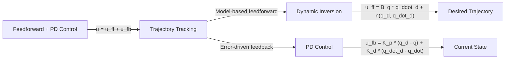

> [!summary] **Document Summary**
> This note covers robot motor control and stability analysis, including regulation control, trajectory tracking, Lyapunov stability theory, PID control, and Linear Quadratic Regulator (LQR) design for robotic systems.

## Robot Motor Control and Stability Analysis

### Lecture 3a: Stability and Regulation

#### Robot Control
**Robotics**: The intelligent connection of perception to action
- From "The intelligent connection of perception to action", J. M. Bradley, MIT AI Lab, 1986

#### Motion Control Objectives
Motion control defines how an autonomous system moves. Control objectives classify into three main classes:

1. **Regulation**: Reach and maintain a desired fixed configuration (joint or task space). Transient behavior not guaranteed.
   - start → goal

2. **Trajectory Tracking**: Follow a desired time-varying reference trajectory (task or joint space).
   - start → Reference trajectory → goal

3. **Contact Motion**: Physically interact with environment, exchanging forces.

#### Joint Space Control
- Task specification (end-effector motion/forces) in operational space, control actions (joint actuator forces) in joint space.
- Objectives in task space converted to joint space using `inverse kinematics`.

#### Task Space Control
Task space control based on operational space dynamics:

$$\dot{\boldsymbol{x}} = \boldsymbol{J}(\boldsymbol{q}) \dot{\boldsymbol{q}}$$

$$\boldsymbol{f}_c = \boldsymbol{\Lambda}_q \ddot{\boldsymbol{x}} + \boldsymbol{\Gamma}_q \dot{\boldsymbol{x}} + \boldsymbol{\mu}(\boldsymbol{q})$$

$$\boldsymbol{\tau} = \boldsymbol{B}_q \ddot{\boldsymbol{q}} + \boldsymbol{C}_q(\boldsymbol{q}, \dot{\boldsymbol{q}}) \dot{\boldsymbol{q}} + \boldsymbol{g}(\boldsymbol{q})$$

- Joint space dynamics
- Velocity mapping

#### Equilibrium States
Non-linear dynamical system:
$$\dot{\boldsymbol{x}} = \boldsymbol{f}(\boldsymbol{x}) + \boldsymbol{h}(\boldsymbol{x}) \boldsymbol{u}$$

**Equilibrium**: System stays in state once reached (without perturbations or with suitable input).

- **Unforced equilibrium**: $\boldsymbol{u} = \boldsymbol{0}$ : $\boldsymbol{f}_x^e = \boldsymbol{0}$
- **Forced equilibrium**: $\boldsymbol{u} = \boldsymbol{u}(\boldsymbol{x})$ : $\boldsymbol{f}_x^e + \boldsymbol{h}_x^e \boldsymbol{u}(\boldsymbol{x}^e) = \boldsymbol{0}$

#### Stability
**Stability of $\boldsymbol{x}_e$**
- Nonlinear system: $\dot{\boldsymbol{x}} = \boldsymbol{f}(\boldsymbol{x})$
- Equilibrium: $\boldsymbol{x}^*$ ($\boldsymbol{f}(\boldsymbol{x}^*) = \boldsymbol{0}$)

$$\forall \epsilon > 0 : \exists \delta > 0 : \|\boldsymbol{x}(t_0) - \boldsymbol{x}^*\| < \delta \Rightarrow \|\boldsymbol{x}(t) - \boldsymbol{x}^*\| < \epsilon, \forall t \geq t_0$$

#### Asymptotic Stability
**Asymptotic stability of $\boldsymbol{x}_e$**
- Nonlinear system: $\dot{\boldsymbol{x}} = \boldsymbol{f}(\boldsymbol{x})$
- Equilibrium: $\boldsymbol{x}^*$ ($\boldsymbol{f}(\boldsymbol{x} = \boldsymbol{0}$)

$$\exists \delta > 0 : \|\boldsymbol{x}(t_0) - \boldsymbol{x}^*\| < \delta \Rightarrow \|\boldsymbol{x}(t) - \boldsymbol{x}^*\| \to 0, \text{ for } t \to \infty$$

$\boldsymbol{x}^*$ stable + 

#### Exponential Stability
**Exponential stability of $\boldsymbol{x}_e$**
$$\exists \delta, c, \lambda > 0 : \|\boldsymbol{x}(t_0) - \boldsymbol{x}^*\| < \delta \Rightarrow \|\boldsymbol{x}(t) - \boldsymbol{x}^*\| \leq c e^{-\lambda (t - t_0)} \|\boldsymbol{x}(t_0) - \boldsymbol{x}|$$

- Allows convergence time estimation: for $c = 1$, $t - t_0 = \ln(2)/\lambda$ reduces initial error by 50%
- Typically local property; domain of attraction hard to estimate.

#### How to Check Stability?
Assessing nonlinear system stability is non-trivial. Cannot enumerate all trajectories.

**Example**:
$$\dot{x}_1 = 1 - x_1^2$$
$$\dot{x}_2 = x_1 - x_2^2$$

**System**: $\dot{\boldsymbol{x}} = \boldsymbol{f}(\boldsymbol{x})$

**Equilibria**:
$$\boldsymbol{x}^*_1 = (1, 1)$$
$$\boldsymbol{x}^*_2 = (1, -1)$$

#### Lyapunov
> [!definition] **Lyapunov candidate**
> $V(\boldsymbol{x}) : \mathbb{R}^n \to \mathbb{R}$ s.t. $V(\boldsymbol{x}^*) = 0$, $V(\boldsymbol{x}) > 0, \forall \boldsymbol{x} \neq \boldsymbol{x}^*$
> - $V$ positive definite. Typical choice: quadratic $(\boldsymbol{x} - \boldsymbol{x}^*)^T \boldsymbol{P} (\boldsymbol{x} - \boldsymbol{x}^*)$
> - $V$ may be local: $\forall \boldsymbol{x} : \|\boldsymbol{x} - \boldsymbol{x}^*\| < \delta$

Lyapunov functions provide stability conditions without enumerating trajectories!

#### Lyapunov Conditions
System $\dot{\boldsymbol{x}} = \boldsymbol{f}(\boldsymbol{x})$, Lyapunov candidate $V$ for $\boldsymbol{x}^*$:

- **Stability sufficient condition**: $\exists V : \dot{V}(\boldsymbol{x}) \leq 0$ along trajectories
- **Asymptotic stability sufficient condition**: $\exists V : \dot{V}(\boldsymbol{x}) < 0$ along trajectories
- **Instability sufficient condition**: $\exists V : \dot{V}(\boldsymbol{x}) > 0$ along trajectories

#### LaSalle Theorem
> [!info] **LaSalle Theorem**
> If $\exists V$ candidate : $\dot{V}(\boldsymbol{x}) \leq 0$ along trajectories

Then system trajectories asymptotically converge to largest invariant set $\mathcal{M} \subseteq \mathcal{S} = \{\boldsymbol{x} \in \mathbb{R}^n : \dot{V}(\boldsymbol{x}) = 0\}$

- $\mathcal{M}$ invariant if $\boldsymbol{x}(t_0) \in \mathcal{M} \Rightarrow \boldsymbol{x}(t) \in \mathcal{M}, \forall t \geq t_0$
- $\mathcal{M} \equiv \{\boldsymbol{x}^*\}$ implies asymptotic stability

#### Stability of Linear Systems
$$\dot{\boldsymbol{x}} = \boldsymbol{A}\boldsymbol{x}$$
$\boldsymbol{x}^* = \boldsymbol{0}$ always equilibrium.

1. Asymptotic stability
2. Global asymptotic stability
3. Exponential stability
4. $\sigma(\boldsymbol{A}) \subset \mathbb{C}^-$ (all eigenvalues have negative real part)
5. $\forall \boldsymbol{Q} \succ 0$, $\exists ! \boldsymbol{P} \succ 0 : \boldsymbol{A}^T \boldsymbol{P} + \boldsymbol{P}\boldsymbol{A} = -\boldsymbol{Q}$ and $(\boldsymbol{x} - \boldsymbol{x}^*)^T \boldsymbol{P} (\boldsymbol{x} - \boldsymbol{x}^*)$ is Lyapunov candidate

**ALL EQUIVALENT!**

If $\boldsymbol{x}^* = \boldsymbol{0}$ asymptotically stable, it is unique equilibrium.

**Lyapunov equation**:
$$\boldsymbol{A}^T \boldsymbol{P} + \boldsymbol{P}\boldsymbol{A} = -\boldsymbol{Q}$$

#### Linear Approximation
Let $\Delta \boldsymbol{x} = \boldsymbol{x} - \boldsymbol{x}^*$ and $\dot{\Delta \boldsymbol{x}} = \boldsymbol{A} \Delta \boldsymbol{x}$ be linear approximation of $\dot{\boldsymbol{x}} = \boldsymbol{f}(\boldsymbol{x})$ around $\boldsymbol{x}^*$.

- $\boldsymbol{A}$ asymptotically stable ($\sigma(\boldsymbol{A}) \subset \mathbb{C}^-$)
- Original nonlinear system exponentially stable at origin

**Note**: Local result only.

#### Regulation Control

#### Control
**Robot $\boldsymbol{B}_q \ddot{\boldsymbol{q}} + \boldsymbol{C}_q(\boldsymbol{q}, \dot{\boldsymbol{q}}) \dot{\boldsymbol{q}} + \boldsymbol{g}(\boldsymbol{q}) = \boldsymbol{u}$

**Goal**: Asymptotic stabilization of closed-loop equilibrium: $\boldsymbol{q} = \boldsymbol{q}_d$ with $\{\boldsymbol{q}} = \boldsymbol{0}$.

$\boldsymbol{q}_d$ possibly from kinematics: $\boldsymbol{q}_d = \boldsymbol{f}^{-1}(\boldsymbol{x}_d)$

**PD control law**:
$$\boldsymbol{u} = \boldsymbol{K}_p (\boldsymbol{q}_d - \boldsymbol{q}) - \boldsymbol{K}_d \dot{\boldsymbol{q}}$$
with $\boldsymbol{K}_p, \boldsymbol{K}_d >0$ positive definite symmetric.

#### Example: PD for Serial Manipulator
Without gravity ($\boldsymbol{g}(\boldsymbol{q}) \equiv \boldsymbol{0}$), robot state $(\boldsymbol{q}_d, \boldsymbol{0})$ under PD joint control globally asymptotically stable.

**Proof**:
- $\boldsymbol{e} = \boldsymbol{q}_d - \boldsymbol{q}$
- $V = \frac{1}{2} \dot{\boldsymbol{q}}^T \boldsymbol{B}_q \dot{\boldsymbol{q}} + \frac{1}{2} \boldsymbol{e}^T \boldsymbol{K}_p \boldsymbol{e} \geq 0$

$V =0 \iff \boldsymbol{e} = \dot{\boldsymbol{e}} = \boldsymbol{0}$

$$\dot{V} = \dot{\boldsymbol{q}}^T \boldsymbol{B}_q \ddot{\boldsymbol{q}} + \frac{1}{2} \dot{\boldsymbol{q}}^T \dot{\boldsymbol{B}}_q \dot{\boldsymbol{q}} - \boldsymbol{e}^T \boldsymbol{K}_p \dot{\boldsymbol{q}} = \dot{\boldsymbol{q}}^T \boldsymbol{u} - \dot{\boldsymbol{q}}^T \boldsymbol{C}_q \dot{\boldsymbol{q}} + \frac{1}{2} \dot{\boldsymbol{q}}^T \dot{\boldsymbol{B}}_q \dot{\boldsymbol{q}} - \boldsymbol{e}^T \boldsymbol{K}_p \dot{\boldsymbol{q}}$$

$$= \dot{\boldsymbol{q}}^T \boldsymbol{K}_p \boldsymbol{e} - \dot{\boldsymbol{q}}^T \boldsymbol{K}_d \dot{\boldsymbol{q}} - \dot{\boldsymbol{q}}^T \boldsymbol{C}_q \dot{\boldsymbol{q}} + \frac{1}{2} \dot{\boldsymbol{q}}^T \dot{\boldsymbol{B}}_q \dot{\boldsymbol{q}} - \boldsymbol{e}^T \boldsymbol{K}_p \dot{\boldsymbol{q}}$$

$$= -\dot{\boldsymbol{q}}^T \boldsymbol{K}_d \dot{\boldsymbol{q}} \leq 0$$

Proves stability only (equals zero if $\boldsymbol{C}$ built using Christoffel symbols).

#### Example: PD for Serial Manipulator (Continued)
$$\boldsymbol{B}_q \ddot{\boldsymbol{q}} + \boldsymbol{C}_q(\boldsymbol{q}, \dot{\boldsymbol{q}}) \dot{\boldsymbol{q}} + \boldsymbol{g}(\boldsymbol{q}) = \boldsymbol{K}_p \boldsymbol{e} - \boldsymbol{K}_d (\boldsymbol{0} - \dot{\boldsymbol{q}})$$

Proven simple stability, but $\dot{V} = 0 \Leftrightarrow \dot{\boldsymbol{q}} = \boldsymbol{0}$.

Thus $\dot{\boldsymbol{q}} = \boldsymbol{0}, \ddot{\boldsymbol{q}} = \boldsymbol{0} \Leftrightarrow \boldsymbol{e} = \boldsymbol{0}$.

From LaSalle theorem, trajectories converge to largest invariant set $\mathcal{M}$ where $\dot{\boldsymbol{q}} = \boldsymbol{0}$ ($\dot{\boldsymbol{q}} = \ddot{\boldsymbol{q}} = \boldsymbol{0}$).

$$\dot{\boldsymbol{q}} = \boldsymbol{0}$$
$$\ddot{\boldsymbol{q}} = \boldsymbol{B}_q^{-1} \boldsymbol{K}_p \boldsymbol{e}$$

Only invariant state in $\dot{V} = 0$ is $\boldsymbol{q} = \boldsymbol{q}_d, \dot{\boldsymbol{q}} = \boldsymbol{0}$.

#### Physical Interpretation
For diagonal positive definite $\boldsymbol{K}_p$ and $\boldsymbol{K}_d$, values correspond to stiffness of "virtual" springs and viscosity of "virtual" dampers at joints.

#### Plot of the Lyapunov Function
Time evolution of Lyapunov candidate.

#### Inclusion of Gravity
- **With gravity**, modify PD controller adding gravity compensation:
  $$\boldsymbol{u} = \boldsymbol{K}_p (\boldsymbol{q}_d - \boldsymbol{q}) - \boldsymbol{K}_d \dot{\boldsymbol{q}} + \boldsymbol{g}(\boldsymbol{q})$$
- **However**, if gravity approximately compensated:
  $$\boldsymbol{u} = \boldsymbol{K}_p (\boldsymbol{q}_d - \boldsymbol{q}) - \boldsymbol{K}_d \dot{\boldsymbol{q}} + \hat{\boldsymbol{g}}(\boldsymbol{q})$$
  with $\hat{\boldsymbol{g}}(\boldsymbol{q}) \neq \boldsymbol{g}(\boldsymbol{q})$
  then $\boldsymbol{q} \to \boldsymbol{q}^* \neq \boldsymbol{q}_d, \dot{\boldsymbol{q}} \to \boldsymbol{0}$ (steady-state position error).
- Equilibrium $\boldsymbol{q}^*$ generally not unique; $\boldsymbol{q}^* \to \boldsymbol{q}_d$ when $\boldsymbol{K}_p \to \infty$.

#### PID Control
Compared to PD, PID adds **integral control** to eliminate constant steady-state error in step response (linear systems).

- **Example**: Use manipulator to recover error from absent/incomplete gravity compensation:
  $$\boldsymbol{u}(t) = \boldsymbol{K}_p (\boldsymbol{q}_d - \boldsymbol{q}) + \boldsymbol{K}_i \int_0^t (\boldsymbol{q}_d - \boldsymbol{q}(\tau)) d\tau - \boldsymbol{K}_d \dot{\boldsymbol{q}}(t)$$
- **If** desired closed-loop equilibrium asymptotically stable under PID, integral term compensates gravity at steady state.

#### Comments on PID Control
- **Control gains** $\boldsymbol{K}_p$ and $\boldsymbol{K}_d$ affect transients and settling times.
- Hard to define optimal values, especially for whole workspace.
- "full" $\boldsymbol{K}_p$ and $\boldsymbol{K}_d$ matrices assign desired eigenvalues to linear approximation around $(\boldsymbol{q}_d, \boldsymbol{0})$.
- **Viscous friction** $-\boldsymbol{F}_v \dot{\boldsymbol{q}}$ acts like derivative term $-\boldsymbol{K}_d \dot{\boldsymbol{q}}$.

#### Comments on PID Control (Continued)
- **Response times** to reach desired state not easily predictable.
- **Integral term** needs time to "unload" from transient error history (anti-windup/saturation possible).

#### Linear Quadratic Regulator

#### Linear Quadratic Regulator (LQR)
- LQR is **optimal control** scheme for stabilizing time-invariant linear system to origin.

$$\boldsymbol{x}_{k+1} = \boldsymbol{A} \boldsymbol{x}_k + \boldsymbol{B} \boldsymbol{u}_k$$
**Dynamical system**

$$J(\boldsymbol{X}, \boldsymbol{U}) = \sum_{k=0}^{N-1} \left[ \boldsymbol{x}_k^T \boldsymbol{Q} \boldsymbol{x}_k + \boldsymbol{u}_k^T \boldsymbol{R} \boldsymbol{u}_k \right] + \boldsymbol{x}_N^T \boldsymbol{Q}_f \boldsymbol{x}_N$$
**Quadratic cost function** over finite horizon

where $\boldsymbol{Q}, \boldsymbol{R}, \boldsymbol{Q}_f \succ 0$ symmetric.

- **State cost**: $\boldsymbol{x}_k^T \boldsymbol{Q} \boldsymbol{x}_k$
- **Final state cost**: $\boldsymbol{x}_N^T \boldsymbol{Q}_f \boldsymbol{x}_N$
- **Input cost**: $\boldsymbol{u}_k^T \boldsymbol{R} \boldsymbol{u}_k$

Positive definite: $\boldsymbol{x}^T \boldsymbol{Q} \boldsymbol{x} > 0 \forall \boldsymbol{x} \neq \boldsymbol{0}$.

#### Symmetric Matrices
- Symmetric $\boldsymbol{Q}$: $\boldsymbol{Q} = \boldsymbol{V} \boldsymbol{\Lambda} \boldsymbol{V}^T$ where $\boldsymbol{\Lambda}$ diagonal, $\boldsymbol{V}^T \boldsymbol{V} = \boldsymbol{I}$
- Quadratic form rotates via $\boldsymbol{V}$, rescales via $\boldsymbol{\Lambda}$:
  $$\boldsymbol{x}^T \boldsymbol{Q} \boldsymbol{x} = \boldsymbol{x}^T \boldsymbol{V} \boldsymbol{\Lambda} \boldsymbol{V}^T \boldsymbol{x}$$
  Eigendecomposition (valid when $\boldsymbol{Q}$ has linearly independent eigenvectors).

#### Symmetric Matrices and Cost
- Cost term $\boldsymbol{x}_k^T \boldsymbol{Q} \boldsymbol{x}_k$ penalizes coordinates from zero, not necessarily axis-aligned.
- $\boldsymbol{Q}$ and $\boldsymbol{R}$ can be any positive-definite symmetric matrices, but diagonal matrices simpler in practice.

#### Non-Symmetric Matrices
- Consider $\boldsymbol{x}^T \boldsymbol{F} \boldsymbol{x}$ where $\boldsymbol{F}$ non-symmetric
- Decompose into symmetric and non-symmetric parts:
  $$\boldsymbol{F} = \frac{\boldsymbol{F} + \boldsymbol{F}^T}{2} + \frac{\boldsymbol{F} - \boldsymbol{F}^T}{2}$$
  $$\boldsymbol{x}^T \boldsymbol{F} \boldsymbol{x} = \boldsymbol{x}^T \frac{\boldsymbol{F} + \boldsymbol{F}^T}{2} \boldsymbol{x}$$
  Only symmetric part matters; no point using non-symmetric $\boldsymbol{Q}$ and $\boldsymbol{R}$!

#### LQR Derivation
Solution has form:
$$\boldsymbol{U}^* = -\boldsymbol{H}^{-1} \boldsymbol{F}^T \boldsymbol{X} \boldsymbol{x}_0$$
where $\boldsymbol{H} = \begin{bmatrix} \boldsymbol{R} & \overline{\boldsymbol{S}} \\ \overline{\boldsymbol{S}}^T & \boldsymbol{X} \end{bmatrix}$ and $\boldsymbol{F} = \begin{bmatrix} 2\boldsymbol{T}^T & \boldsymbol{X} \end{bmatrix} \begin{bmatrix} \boldsymbol{Q} & \boldsymbol{0} \\ \boldsymbol{0} & \boldsymbol{X} \end{bmatrix} \begin{bmatrix} \boldsymbol{X} \\ \boldsymbol{T} \end{bmatrix}$

**Problem**: Matrix sizes proportional to horizon length!

1. **Total cost**: $J(\boldsymbol{U}) = \boldsymbol{x}_0^T \begin{bmatrix} \boldsymbol{Q} & \cdots & \boldsymbol{0} \\ \vdots & \ddots & \vdots \\ \boldsymbol{0} & \cdots & \boldsymbol{Q}_f \end{bmatrix} \begin{bmatrix} \boldsymbol{x}_0 \\ \vdots \\ \boldsymbol{x}_N \end{bmatrix} + \boldsymbol{U}^T \begin{bmatrix} \boldsymbol{R} & \cdots & \boldsymbol{0} \\ \vdots & \ddots & \vdots \\ \boldsymbol{0} & \cdots & \boldsymbol{R} \end{bmatrix} \boldsymbol{U}$
2. **System trajectory**: $\begin{bmatrix} \boldsymbol{x}_1 \\ \vdots \\ \boldsymbol{x}_N \end{bmatrix} = \begin{bmatrix} \boldsymbol{B} & \cdots & \boldsymbol{0} \\ \vdots & \ddots & \vdots \\ \boldsymbol{A}^{N-1}\boldsymbol{B} & \cdots & \boldsymbol{B} \end{bmatrix} \boldsymbol{U} + \begin{bmatrix} \boldsymbol{A} \\ \vdots \\ \boldsymbol{A}^N \end{bmatrix} \boldsymbol{x}_0$

#### Bellman Principle
Given optimal control sequence $\boldsymbol{U}^* = [\boldsymbol{u}_0^*, \ldots, \boldsymbol{u}_{N-1}^*]$ and optimal trajectory $\boldsymbol{x}^*(k)$, sub-sequence $[\boldsymbol{u}_k^*, \ldots, \boldsymbol{u}_{N-1}^*]$ optimal for horizon $[t_k, N]$ starting from $\boldsymbol{x}^*(t_k)$.

Use this principle for iterative solution.

#### LQR Iterative Solution
Define **cost-to-go** as residual cost in $[t, N]$ starting from $\boldsymbol{x}_t$.

$$V_t(\boldsymbol{x}_t) = \min_{\boldsymbol{u}_t, \ldots,\boldsymbol{u}_{N-1}} \sum_{k=t}^{N-1} \left[ \boldsymbol{x}_k^T \boldsymbol{Q} \boldsymbol{x}_k + \boldsymbol{u}_k^T \boldsymbol{R} \boldsymbol{u}_k \right] + \boldsymbol{x}_N^T \boldsymbol{Q}_f \boldsymbol{x}_N$$

Idea: Optimize last interval, roll-back in time.

#### LQR Iterative Solution (Continued)
Cost-to-go for last time-step:
$$V_N(\boldsymbol{x}_N) = \boldsymbol{x}_N^T \boldsymbol{Q}_f \boldsymbol{x}_N$$
Call this matrix $\boldsymbol{P}_N$.

For $N-1$:
$$V_{N-1}(\boldsymbol{x}_{N-1}) = \min_{\boldsymbol{u}_{N-1}} \left[ \boldsymbol{x}_{N-1}^T \boldsymbol{Q} \boldsymbol{x}_{N-1} + \boldsymbol{u}_{N-1}^T \boldsymbol{R} \boldsymbol{u}_{N-1} + V_N(\boldsymbol{A} \boldsymbol{x}_{N-1} + \boldsymbol{B} \boldsymbol{u}_{N-1}) \right]$$
$$= \min_{\boldsymbol{u}_{N-1}} \left[ \boldsymbol{x}_{N-1}^T \boldsymbol{Q} \boldsymbol{x}_{N-1} + \boldsymbol{u}_{N-1}^T \boldsymbol{R} \boldsymbol{u}_{N-1} + (\boldsymbol{A} \boldsymbol{x}_{N-1} + \boldsymbol{B} \boldsymbol{u}_{N-1})^T \boldsymbol{Q}_f (\boldsymbol{A} \boldsymbol{x}_{N-1} + \boldsymbol{B} \boldsymbol{u}_{N-1}) \right]$$

Optimal $\boldsymbol{u}_{N-1}^*$ found by setting gradient w.r.t. $\boldsymbol{u}_{N-1}$ to zero.

$$\nabla_{\boldsymbol{u}_{N-1}} g_{N-1}(\boldsymbol{x}_{N-1}, \boldsymbol{u}_{N-1}) = 2\boldsymbol{R} \boldsymbol{u}_{N-1} + 2 \boldsymbol{B}^T \boldsymbol{Q}_f (\boldsymbol{A} \boldsymbol{x}_{N-1} + \boldsymbol{B} \boldsymbol{u}_{N-1}) = \boldsymbol{0}$$

$$\boldsymbol{u}_{N-1}^* = -(\boldsymbol{R} + \boldsymbol{B}^T \boldsymbol{Q}_f \boldsymbol{B})^{-1} \boldsymbol{B}^T \boldsymbol{Q}_f \boldsymbol{A} \boldsymbol{x}_{N-1} \boldsymbol{K}_{N-1} \boldsymbol{x}_{N-1}$$

Closed-form solution found!

#### LQR Iterative Solution (Continued)
With optimal input for $N-1$, compute exact cost-to $V_{N-1}$.

$$V_{N-1}(\boldsymbol{x}_{N-1}) = \min_{\boldsymbol{u}_{N-1}} \left[ \boldsymbol{x}_{N-1}^T \boldsymbol{Q} \boldsymbol{x}_{N-1} + \boldsymbol{u}_{N-1}^T \boldsymbol{R} \boldsymbol{u}_{N-1} + (\boldsymbol{A} \boldsymbol{x}_{N-1} + \boldsymbol{B} \boldsymbol{u}_{N-1})^T \boldsymbol{Q}_f (\boldsymbol{A} \boldsymbol{x}_{N-1} + \boldsymbol{B} \boldsymbol{u}_{N-1}) \right]$$

$$= \boldsymbol{x}_{N-1}^T \left[ \boldsymbol{Q} - \boldsymbol{A}^T \boldsymbol{Q}_f \boldsymbol{B} (\boldsymbol{R} + \boldsymbol{B}^T \boldsymbol{Q}_f \boldsymbol{B})^{-1} \boldsymbol{B}^T \boldsymbol{Q}_f \boldsymbol{A} + \boldsymbol{A}^T \boldsymbol{Q}_f \boldsymbol{A} \right] \boldsymbol{x}_{N-1}$$

$$= \boldsymbol{x}_{N-1}^T \boldsymbol{P}_{N-1} \boldsymbol{x}_{N-1}$$

Cost-to-go has quadratic form; iterate back in time.

#### LQR: Iteration
1. Set $\boldsymbol{P}_N = \boldsymbol{Q}_f$
2. For $t = N, \ldots, 1$ set
   $$\boldsymbol{P}_{t-1} := \boldsymbol{Q} + \boldsymbol{A}^T \boldsymbol{P}_t \boldsymbol{A} - \boldsymbol{A}^T \boldsymbol{P}_t \boldsymbol{B} (\boldsymbol{R} + \boldsymbol{B}^T \boldsymbol{P}_t \boldsymbol{B})^{-1} \boldsymbol{B}^T \boldsymbol{P}_t \boldsymbol{A}$$
3. For $t = 0, \ldots, N-1$ set
   $$\boldsymbol{K}_t \coloneqq -(\boldsymbol{R} + \boldsymbol{B}^T \boldsymbol{P}_{t+1} \boldsymbol{B})^{-1} \boldsymbol{B}^T \boldsymbol{P}_{t+1} \boldsymbol{A}$$
4. For $t = 0, \ldots, N-1$ optimal input:
   $$\boldsymbol{u}_t^* = \boldsymbol{K}_t \boldsymbol{x}_t$$

- Cost-to-go matrix: $V_{t}(\boldsymbol{x}_t) = \boldsymbol{x}_t^T \boldsymbol{P}_t \boldsymbol{x}_t$
- Optimal control input matrix

#### LQR: Infinite Horizon
- Infinite horizon LQR control:
  $$\boldsymbol{u} = \boldsymbol{K} \boldsymbol{x}_0$$
  where
  $$\boldsymbol{K} = -(\boldsymbol{R} + \boldsymbol{B}^T \boldsymbol{P} \boldsymbol{B})^{-1} \boldsymbol{B}^T \boldsymbol{P} \boldsymbol{A}$$
  $$\boldsymbol{P} = \boldsymbol{Q} + \boldsymbol{A}^T \boldsymbol{P} \boldsymbol{A} - \boldsymbol{A}^T \boldsymbol{P} \boldsymbol{B} (\boldsymbol{R} + \boldsymbol{B}^T \boldsymbol{P} \boldsymbol{B})^{-1} \boldsymbol{B}^T \boldsymbol{P} \boldsymbol{A}$$
  Discrete-time **algebraic Riccati equation** (ARE).
- $\boldsymbol{K}$ and $\boldsymbol{P}$ time-invariant.
- Solve ARE directly (no recursion).

#### Example: LQR for Cart-Pole
> [!example] **Cart-Pole Configuration**
> **Configuration**: $\boldsymbol{q} = [x, \theta]^T$

**Goal**: Regulate to $\boldsymbol{q}_d = [0, \pi/2]^T$ with $\dot{\boldsymbol{q}}_d = [0, 0]^T$.

**Energy**:
$$T = \frac{1}{2} m_c \dot{x}^2 + \frac{1}{2} m_p (\dot{x} + l \dot{\theta} \cos \theta)^2 + \frac{1}{2} m_p (l \dot{\theta})^2$$
$$U = -m_p g l \cos \theta$$

**Equations of motion** (Lagrangian):
$$(m_c + m_p) \ddot{x} + m_p l \ddot{\theta} \cos \theta - m_p l \dot{\theta}^2 \sin \theta = f$$
$$m_p l \ddot{x} \cos \theta + m_p l^2 \ddot{\theta} + m_p g l \sin \theta = 0$$

$$\boldsymbol{B}_q = \begin{bmatrix} m_c + m_p & m_p l \cos \theta \\ m_p l \cos \theta & m_p l^2 \end{bmatrix}$$
$$\boldsymbol{C}_q(\boldsymbol{q}, \dot{\boldsymbol{q}}) = \begin{bmatrix} 0 & -m_p l \dot{\theta} \sin \theta \\ 0 & 0 \end{bmatrix}$$
$$\boldsymbol{g}(\boldsymbol{q}) = \begin{bmatrix} 0 \\ m_p g l \sin \theta \end{bmatrix}$$
$$\boldsymbol{u} = \begin{bmatrix} f \\ 0 \end{bmatrix}$$

#### Example: LQR for Cart-Pole (Continued)
Apply LQR by linearizing model around desired equilibrium using Taylor expansion.

Extended state $\boldsymbol{x}_e = [\boldsymbol{q}, \dot{\boldsymbol{q}}]^T$:
$$\dot{\boldsymbol{x}}_e = \begin{bmatrix} \dot{\boldsymbol{q}} \\ \ddot{\boldsymbol{q}} \end{bmatrix} = \begin{bmatrix} \dot{\boldsymbol{q}} \\ \boldsymbol{B}_q^{-1} (\boldsymbol{u} - \boldsymbol{C}_q(\boldsymbol{q}, \dot{\boldsymbol{q}}) \dot{\boldsymbol{q}} - \boldsymbol{g}(\boldsymbol{q})) \end{bmatrix} = \boldsymbol{h}(\boldsymbol{x}_e, \boldsymbol{u})$$

Equilibrium $(\boldsymbol{x}_e^*, \boldsymbol{u}^*)$: $\boldsymbol{h}(\boldsymbol{x}_e^*, \boldsymbol{u}^*) = \boldsymbol{0}$.

$$\Delta \dot{\boldsymbol{x}}_e \approx \frac{\partial \boldsymbol{h}}{\partial \boldsymbol{x}_e} \bigg|_{(\boldsymbol{x}_e^*, \boldsymbol{u}^*)} (\boldsymbol{x}_e - \boldsymbol{x}_e^*) + \frac{\partial \boldsymbol{h}}{\partial \boldsymbol{u}} \bigg|_{(\boldsymbol{x}_e^*, \boldsymbol{u}^*)} (\boldsymbol{u} - \boldsymbol{u}^*) = \boldsymbol{A} (\boldsymbol{x}_e - \boldsymbol{x}_e^*) + \boldsymbol{B} (\boldsymbol{u} - \boldsymbol{u}^*)$$

$$\boldsymbol{A} = \begin{bmatrix} \boldsymbol{0} & \boldsymbol{I} \\ -\boldsymbol{B}_q^{-1} \frac{\partial \boldsymbol{g}}{\partial \boldsymbol{q}} & -\boldsymbol{B}_q^{-1} \boldsymbol{C}_q(\boldsymbol{x}_e^*, \boldsymbol{u}^*) \end{bmatrix}$$
$$\boldsymbol{B} = \begin{bmatrix} \boldsymbol{0} \\ \boldsymbol{B}_q^{-1} \end{bmatrix}$$

#### Example: LQR for Cart-Pole (Continued)
- Try changing input penalty (fuel cost).

### Lecture 3b: Trajectory Tracking

#### Trajectory Tracking
Often important not only to reach goal, but how to reach it.

**Desired trajectory** $\boldsymbol{q}_d(t)$ (or $\boldsymbol{x}_d(t)$ in task space) typically differentiable and feasible (compliant with system requirements).

#### PD (PID) Control
Similarly for regulation, use PD or PID to stabilize around trajectory.

- **Feedback term**: $\boldsymbol{u}_{fb} = \boldsymbol{K}_p (\boldsymbol{q}_d - \boldsymbol{q}) + \boldsymbol{K}_d (\dot{\boldsymbol{q}}_d - \dot{\boldsymbol{q}})$
- No model knowledge required.
- Purely reactive (error-driven), no error anticipation.
- Add **integral term** to compensate steady-state error.

#### Dynamic Inversion
- Robot with canonical dynamics:
  $$\boldsymbol{B}_q \ddot{\boldsymbol{q}} + \boldsymbol{n}(\boldsymbol{q}, \dot{\boldsymbol{q}}) = \boldsymbol{u}$$
- Twice differentiable desired trajectory $t \in [0, T]$: $\boldsymbol{q}_d(t) \to \dot{\boldsymbol{q}}_d(t), \ddot{\boldsymbol{q}}_d(t)$
- By **inverting dynamics**, compute input that tracks trajectory in nominal conditions starting from desired state.

#### Dynamic Inversion (Continued)
$$\boldsymbol{B}_q \ddot{\boldsymbol{q}} + \boldsymbol{n}(\boldsymbol{q}, \dot{\boldsymbol{q}}) = \boldsymbol{u}$$
**model**

**Dynamic inversion** trajectory $\boldsymbol{q}_d(t), \dot{\boldsymbol{q}}_d(t), \ddot{\boldsymbol{q}}_d(t)$

**Feedforward input**:
$$\boldsymbol{u}_{ff} = \boldsymbol{B}_q \ddot{\boldsymbol{q}}_d + \boldsymbol{n}(\boldsymbol{q}_d, \dot{\boldsymbol{q}}_d)$$

- **Feedforward input** allows robot to follow trajectory if starts exactly on initial state ($\boldsymbol{q}_0 = \boldsymbol{q}_{d0}, \dot{\boldsymbol{q}}_0 = \dot{\boldsymbol{q}}_{d0}, \ddot{\boldsymbol{q}}_0 = \ddot{\boldsymbol{q}}_d(0)$), model known perfectly, no disturbances.
- In practice unrealistic; need **feedback information** (PD or PID).

#### Feedforward + PD (PID)
- **Feedforward + PD control**: $\boldsymbol{u} = \boldsymbol{u}_{ff} + \boldsymbol{u}_{fb}$.
- Combine imperfect feedforward with PD control.

python
# Example: Feedforward + PD control implementation
```python
def feedforward_pd_control(q_d, q_dot_d, q_ddot_d, q, q_dot, B_q, n_func, K_p, K_d):
    """
    Compute feedforward + PD control input
    
    Args:
        q_d: desired joint positions
        q_dot_d: desired joint velocities  
        q_ddot_d: desired joint accelerations
        q: current joint positions
        q_dot: current joint velocities
        B_q: inertia matrix
        n_func: function to compute n(q, q_dot)
        K_p: proportional gain matrix
        K_d: derivative gain matrix
        
    Returns:
        u: control input torques
    """
    # Feedforward term
    u_ff = B_q @ q_ddot_d + n_func(q_d, q_dot_d)
    
    # PD feedback term  
    u_fb = K_p @ (q_d - q) + K_d @ (q_dot_d - q_dot)
    
    # Total control input
    u = u_ff + u_fb
    
    return u
```

This approach combines the model-based feedforward term with error-driven feedback for robust trajectory tracking.



## References
- [[Robot Dynamics and Control]]
- [[Linear Systems Theory]]
- [[Optimal Control Theory]]
- [[Lyapunov Stability Analysis]]