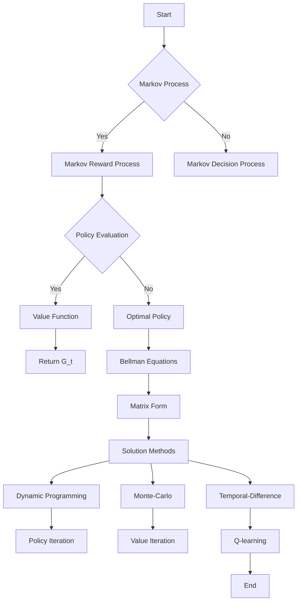

> [!summary] **Document Summary**
> This note provides a comprehensive overview of Markov Decision Processes (MDPs) and value-based reinforcement learning. It covers the foundational concepts of Markov processes, Markov reward processes, and MDPs, along with the recursive formulation of value functions through Bellman equations. The note also discusses the optimal value functions, optimal policies, and various solution methods for solving MDPs, including dynamic programming, Monte-Carlo, and temporal-difference learning.

## Markov Decision Processes and Value-Based Reinforcement Learning

### Introduction

Reinforcement learning is a general-purpose framework for decision-making. It involves an agent that can act and observe. The state is the sufficient statistic to characterize the future. The success is measured by a scalar reward signal. The goal is to select actions to maximize future reward (exploit), and in order to be effective, we should not forget to explore.

### Formalizing Reinforcement Learning with Fully Observable Environment

- **Markov Processes**
- **Markov Rewards**
- **Markov Decision Processes**

### Recursive Formulation for Value Functions

- The value function $v$ is a predictor of future reward.
- Used to evaluate the goodness/badness of states.
- Used to select actions, e.g., $v^{\pi}(s) = \mathbb{E}[R_{t+1} + \gamma R_{t+2} + \gamma^2 R_{t+3} + \ldots | S_t = s]$.

### Extensions of the Markov Decision Process

- Almost all RL problems can be formalized as MDPs.
- Optimal control primarily deals with continuous MDPs.
- Partially observable problems can be converted into MDPs.
- Bandits are MDPs with one state.

### Markov Process

A Markov process is a memoryless random process, i.e., a sequence of random states $S_1, S_2, \ldots$ with the Markov property.

**Definition (Markov Process):**
- $\mathcal{S}$: a finite set of states
- $P$: a state transition matrix, such that $P_{ss'} = P(S_{t+1} = s' | S_t = s)$

### Markov Reward Process

A Markov Reward Process (MRP) is a Markov chain with reward values.

**Definition (Markov Reward Process):**
- $\mathcal{S}$: a finite set of states
- $P$: a state transition matrix, such that $P_{ss'} = P(S_{t+1} = s' | S_t = s)$
- $R$: a reward function, such that $R_s = \mathbb{E}[R_{t+1} | S_t = s]$
- $\gamma$: a discount factor, $\gamma \in [0,1]$

### Return $G_t$

The return $G_t$ is the total discounted reward from time-step $t$.

**Definition (Return):**
- The value of receiving reward $R$ after $k + 1$ timesteps is $\gamma^k R$.
- $\gamma$ values immediate reward vs. delayed reward:
  - $\gamma \approx 0$ leads to "myopic" evaluation.
  - $\gamma \approx 1$ leads to "far-sighted" evaluation.

### Discount Term $\gamma$

- Mathematically convenient to discount rewards.
- Avoids infinite returns in cyclic Markov processes.
- Uncertainty about the future may not be fully represented.
- Application dependent:
  - In financial, immediate rewards may earn more interest than delayed rewards.
  - Biological plausibility (animal behavior shows preference for immediate reward).
- Undiscounted Markov reward processes ($\gamma = 1$), e.g., if all sequences terminate.

### Value Function

The state-value function $v(s)$ of a Markov Reward Process is the expected return starting from state $s$.

**Definition (Value Function):**
- Measures the long-term value of being in a certain state $s$.

### Bellman Equation for MRPs

The value function $v(S_t)$ can be decomposed into two parts:
1. Immediate reward $R_{t+1}$
2. Discounted value of successor state $\gamma v(S_{t+1})$

$$
v(s) = \mathbb{E}[G_t | S_t = s] = \mathbb{E}[R_{t+1} + \gamma v(S_{t+1}) | S_t = s]
$$

### Bellman Equation for MRPs – Which Future State?

The expected state-value of being in any state reachable from $s$:

$$
v(s) = \mathbb{E}[R_{t+1} | S_t = s] + \gamma \mathbb{E}[v(S_{t+1}) | S_t = s]
$$

$$
v(s) = R_s + \gamma \sum_{s'} P_{ss'} v(s')
$$

### Bellman Equation – Matrix Form

Considering $n$ available states:

$$
v = R + \gamma P v
$$

$$
v = (I - \gamma P)^{-1} R
$$

### Solving the Linear Bellman Equation

$$
v = R + \gamma P v
$$

$$
v = (I - \gamma P)^{-1} R
$$

- Computational complexity is $O(n^3)$ → Direct solution only feasible for small MRPs.
- Iterative methods for large MRPs:
  - Dynamic programming
  - Monte-Carlo evaluation
  - Temporal-Difference learning

### Markov Decision Process

A Markov Decision Process (MDP) is a Markov reward process with actions/decisions. It is an environment in which all states are Markov.

**Definition (Markov Decision Process):**
- $\mathcal{S}$: a finite set of states
- $\mathcal{A}$: a finite set of actions
- $P$: a state transition matrix, such that $P_{ss'}^a = P(S_{t+1} = s' | S_t = s, A_t = a)$
- $R$: a reward function, such that $R_s^a = \mathbb{E}[R_{t+1} | S_t = s, A_t = a]$
- $\gamma$: a discount factor, $\gamma \in [0,1]$

### Policy – Definition

A policy $\pi$ is a distribution over actions $a$ given states $s$:

$$
\pi(a | s) = P(A_t = a | S_t = s)
$$

**Definition (Policy):**
- Define the behavior of an agent.
- MDP policies depend only on the current state (Markovian).
- Policies are stationary (time-independent): $A_t \sim \pi(\cdot | s), \forall t > 0$

### Under Policy

Given an MDP $\mathcal{S}, \mathcal{A}, P, R, \gamma$ and a policy $\pi$:
- The state sequence $S_1, S_2, \ldots$ is a Markov process $(\mathcal{S}, P^\pi)$.
- The state and reward sequence $S_1, R_2, S_2, \ldots$ is a Markov reward process $(\mathcal{S}, P^\pi, R^\pi)$, such that:

### Value Function (with Policy)

The state-value function $v^\pi(s)$ of an MDP is the expected return starting from state $s$ and following policy $\pi$.

**Definition (Value Function):**
- The action-value function $q^\pi(s, a)$ is the expected return starting from state $s$, taking action $a$, and then following policy $\pi$.

### Bellman Expectation Equation – Value and Action-Value Functions

The state-value function can again be decomposed into immediate reward plus discounted value of successor state. Similarly, we can decompose the action-value function. Both come from the recursive nature of return $G_t$.

### Bellman Expectation for $v^\pi$

$$
v^\pi(s) = \sum_{a} \pi(a | s) q^\pi(s, a)
$$

### Bellman Expectation for $q^\pi$

$$
q^\pi(s, a) = \mathbb{E}^\pi[R_{t+1} + \gamma v^\pi(S_{t+1}) | S_t = s, A_t = a]
$$

$$
q^\pi(s, a) = R_s^a + \gamma \sum_{s'} P_{ss'}^a v^\pi(s')
$$

### Bellman Expectation Equation – Matrix Form

Again a linear system:

$$
v^\pi = R^\pi + \gamma P^\pi v^\pi
$$

With direct solution:

$$
v^\pi = (I - \gamma P^\pi)^{-1} R^\pi
$$

### Optimal Value Function

The optimal action-value function $q^*(s, a)$ is the maximum action-value function over all policies:

$$
q^*(s, a) = \max_\pi q^\pi(s, a)
$$

**Definition (Optimal State/Action Functions):**
- The optimal state-value function $v^*(s)$ is the maximum value function over all policies:

$$
v^*(s) = \max_\pi v^\pi(s)
$$

- The optimal value function determines the best possible performance in the MDP.
- An MDP is solved when we know the optimal value function.

### Optimal Policy Theorem

For any Markov Decision Process:
- There exists an optimal policy $\pi^*$ that is better than or equal to all other: $\pi^* \geq \pi, \forall \pi$.
- All optimal policies achieve the optimal value function: $v^{\pi^*}(s) = v^*(s)$.
- All optimal policies achieve the optimal action-value function: $q^{\pi^*}(s, a) = q^*(s, a)$.

Define a partial ordering over policies $\pi \geq \pi'$ if $v^\pi(s) \geq v^{\pi'}(s), \forall s$.

### Finding an Optimal Policy

An optimal policy can be found by maximizing over $q^*(s, a)$:
- There is always a deterministic optimal policy for any MDP.
- If we know $q^*(s, a)$, we straightforwardly find the optimal policy.

### Bellman Optimality Equations

Optimal value functions are recursively related Bellman-style.

### Bellman Optimality Equations - $v^*$

$$
v^*(s) = \max_a q^*(s, a)
$$

$$
v^*(s) = \max_a \left(R_s^a + \gamma \sum_{s'} P_{ss'}^a v^*(s')\right)
$$

### Bellman Optimality Equations - $q^*$

$$
q^*(s, a) = R_s^a + \gamma \sum_{s'} P_{ss'}^a \max_{a'} q^*(s', a')
$$

### Solving the Bellman Optimality Equation

- Bellman Optimality Equation is non-linear.
- No closed-form solution (in general).
- Many iterative solution methods:
  - Value Iteration
  - Policy Iteration
  - Q-learning
  - SARSA

### MDP Extensions

- **Infinite MDPs**: Countably infinite state and/or action spaces, continuous state and/or action spaces, closed form for linear quadratic model (LQR), continuous time, requires partial differential equations, Hamilton-Jacobi-Bellman (HJB) equation, limiting case of Bellman equation as time-step → 0.

- **Partially Observable MDP (POMDP)**: A Partially Observable MDP is an MDP with hidden states. A Hidden Markov Model with actions.

**Definition (POMDP):**

### Belief States

A history $H_t$ is a sequence of actions, observations, and rewards:

$$
H_t = A_0 O_1 R_1, \ldots, A_{t-1} O_t R_t
$$

**Definition (History):**

A belief state $b(h)$ is a distribution over states conditioned on the history $h$:

$$
b(h) = P(S_t = s_1 | H_t = h), \ldots, P(S_t = s_n | H_t = h)
$$

**Definition (Belief State):**

### Wrap-up

$$
v^\pi(s) = \mathbb{E}^\pi[R_{t+1} + \gamma v^\pi(S_{t+1}) | S_t = s]
$$

$$
v^\pi(s) = \sum_{a} \pi(a | s) q^\pi(s, a)
$$

$$
q^\pi(s, a) = \mathbb{E}^\pi[R_{t+1} + \gamma q^\pi(S_{t+1}, A_{t+1}) | S_t = s, A_t = a]
$$

$$
q^\pi(s, a) = R_s^a + \gamma \sum_{s'} P_{ss'}^a v^\pi(s')
$$

$$
v^*(s) = \max_a q^*(s, a)
$$

$$
q^*(s, a) = R_s^a + \gamma \sum_{s'} P_{ss'}^a v^*(s')
$$

### Take Home Messages

- MDPs are a formalism to describe a fully-observable environment for RL.
  - A state-transition system enriched with actions and reward.
  - Leverage Markov assumption to separate future from the past.
- A recursive formulation for value functions → Bellman equations.
- Any MDP allows for an optimal policy.
  - Maximisation process on the state-value function.
  - Recursive and nonlinear (no closed form).
- MDPs can be relaxed to infinite and continuous actions/state and partially observable environments (through belief instead of deterministic states).

### Next Lecture

Planning by Dynamic Programming
- A.K.A. solving a known MDP
- Dynamic programming
- A method for solving complex problems by breaking them down into subproblems
- Policy Evaluation & Iteration
- Value Evaluation

