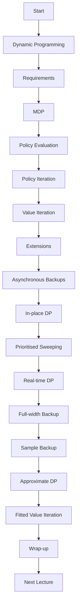

> [!summary] **Document Summary**
> This note explores the principles of Dynamic Programming (DP) in Reinforcement Learning, focusing on Policy and Value Iteration. It outlines the requirements for DP, the structure of Markov Decision Processes (MDPs), and the methods for policy evaluation, policy iteration, and value iteration. The note also discusses extensions such as asynchronous backups, in-place dynamic programming, prioritized sweeping, and real-time dynamic programming. Finally, it touches on approximate DP and fitted value iteration.

## Dynamic Programming in Reinforcement Learning: Policy and Value Iteration

### Introduction

**Dynamic Programming (DP):** A method for solving complex problems by breaking them down into subproblems. It is not divide-et-impera, but differentiates by overlapping breakdown.

**Requirements for Dynamic Programming:**
- **Optimal substructure:** The optimal solution can be decomposed into subproblems.
- **Overlapping subproblems:** Subproblems recur many times, and solutions can be cached and reused.
- **MDPs** satisfy both properties. The Bellman equation gives recursive decomposition, and the value function stores and reuses solutions.

### Planning by Dynamic Programming

Dynamic programming assumes full knowledge of the MDP. It can be used for planning in RL:
- **Prediction:** Input: MDP $\mathcal{S}, \mathcal{A}, P, R, \gamma$ and policy $\pi$ or MRP $\mathcal{S}, P, R, \gamma$. Output: value function $v^\pi$.
- **Control:** Input: MDP $\mathcal{S}, \mathcal{A}, P, R, \gamma$. Output: optimal value function $v^{\pi^*}$ and optimal policy $\pi^*$.

### Markov Decision Process (MDP)

An MDP is a Markov reward process with actions. It is an environment in which all states are Markov. An MDP is a tuple $\mathcal{S}, \mathcal{A}, P, R, \gamma$:
- $\mathcal{S}$: a finite set of states.
- $\mathcal{A}$: a finite set of actions.
- $P$: a state transition matrix, such that $P_{ss'}^a = P(S_{t+1} = s' | S_t = s, A_t = a)$.
- $R$: a reward function, such that $R(s, a) = \mathbb{E}[R_{t+1} | S_t = s, A_t = a]$.
- $\gamma$: a discount factor, $\gamma \in [0,1]$.

### Policy Evaluation

**Iterative Policy Evaluation:** Problem: evaluate a given policy $\pi$. Solution: iterative application of Bellman expectation backup $v_1 \rightarrow v_2 \rightarrow \cdots \rightarrow v^\pi$. Using synchronous backups:
- At each iteration $k + 1$,
- For all states $s \in \mathcal{S}$,
- Update $v_{k+1}(s)$ from $v_k(s')$ where $s'$ is a successor state of $s$.

**Formally:**
$$
v_{k+1}(s) = \sum_{a \in \mathcal{A}} \pi(a|s) \left[ R(s, a) + \gamma \sum_{s' \in \mathcal{S}} P_{ss'}^a v_k(s') \right]
$$

### Policy Iteration

**How to Improve a Policy:** Given policy $\pi$, evaluate the policy $v^\pi$, then improve the policy by acting greedily with respect to $v^\pi$.

**Policy Iteration:**
- **Policy evaluation:** Estimate $v^\pi$.
- **Policy improvement:** Generate $\pi' \geq \pi$, typically by acting greedily with respect to $v^\pi$.

**Policy Improvement (I):**
$$
\pi'(s) = \arg\max_{a \in \mathcal{A}} q^\pi(s, a)
$$
$$
q^\pi(s, \pi'(s)) = \max_{a \in \mathcal{A}} q^\pi(s, a) \geq q^\pi(s, \pi(s)) = v^\pi(s)
$$

**Policy Improvement (II):**
If improvement stops, we satisfy Bellman optimality:
$$
v^\pi(s) = v^*(s), \forall s \in \mathcal{S}, \text{ and } \pi \text{ is an optimal policy}
$$

### Value Iteration

**Optimality Principle:** Any optimal policy can be subdivided into two components:
- An optimal first action $a^*$.
- Followed by an optimal policy from the successor state $s'$.

**Deterministic Value Iteration:**
$$
v^*(s) \leftarrow \max_{a \in \mathcal{A}} \left[ R(s, a) + \gamma \sum_{s' \in \mathcal{S}} P_{ss'}^a v^*(s') \right]
$$

**Value Iteration:**
Problem: find optimal policy $\pi$. Solution: iterative application of Bellman optimality backup $v_1 \rightarrow v_2 \rightarrow \cdots \rightarrow v^*$. Using synchronous backups:
- At each iteration $k + 1$,
- For all states $s \in \mathcal{S}$,
- Update $v_{k+1}(s)$ from $v_k(s')$.

### Extensions

#### Asynchronous Backups

DP methods described so far used synchronous backups. Asynchronous DP backs up states individually, in any order. It can significantly reduce computation and is guaranteed to converge if all states continue to be selected.

**Three simple approaches for asynchronous DP:**
- In-place dynamic programming.
- Prioritised sweeping.
- Real-time dynamic programming.

#### In-place Dynamic Programming

Synchronous value iteration stores two copies of the value function. In-place value iteration only stores one copy of the value function.

#### Prioritised Sweeping

Use the magnitude of the Bellman error to guide state selection. Backup the state with the largest remaining Bellman error. Update Bellman error of affected states after each backup. Requires knowledge of reverse dynamics (predecessor states).

#### Real-time Dynamic Programming

Intuition: Only states that are relevant to the agent. Use the agent’s experience to guide the selection of states. After each time-step $S_t, A_t, R_{t+1}$, backup the state $S_t$.

### Full-width Backup

DP uses full-width backups. For each backup (sync or async), every successor state and action is considered. DP is effective for medium-sized problems (millions of states). For large problems, DP suffers from Bellman’s curse of dimensionality.

### Sample Backup

From now on, we consider sample backups. Using sample rewards and sample transitions $S, A, R, S'$. Instead of reward function $R$ and transition function $P$.

### Approximate Dynamic Programming

Approximate the value function using a function approximator $\tilde{v}(s; w)$. Apply dynamic programming to $\tilde{v}(\cdot; w)$.

**Fitted Value Iteration:**
- For each iteration $k$,
- Sample states $\tilde{S} \subseteq S$,
- For each state $s \subseteq \tilde{S}$, estimate target value using Bellman optimality equation,
- Train next value function $\tilde{v}(\cdot; w_{k+1})$ using targets $s, \tilde{v}(s)$.

### Wrap-up

**Take-home messages:**
- Dynamic Programming: Method for solving complex problems by breaking them down into subproblems.
- Policy iteration: Re-define the policy at each step and compute the value according to this new policy until the policy converges.
- Value iteration: Computes the optimal state value function by iteratively improving the estimate of $V(s)$.
- Policy vs Value iteration:
  - Policy can converge quicker (agent is interested in optimal policy).
  - Value iteration is computationally cheaper (per iteration).

### Next Lecture

Model-Free Prediction:
- Estimate the value function of an unknown MDP.
- Monte-Carlo approaches.
- Temporal-Difference learning.
- TD($\lambda$).

