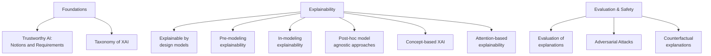

# Course Introduction: Explainable and Trustworthy AI

> **Course:** Explainable and Trustworthy AI
> **Lecture:** 0
> **Date:** 2026-02-26
> **Source:** XAI_00_course_intro.pdf

## Overview

This introductory lecture presents the organization of the Explainable and Trustworthy AI course (AY 2025-2026), covering the teaching staff, course topics, educational structure, exam format, and group project objectives. The course spans the full spectrum of AI explainability and trustworthiness, from foundational Trustworthy AI definitions to advanced explainability techniques and adversarial attacks.

## Content

### Teaching Staff

The teaching team consists of three members from PoliTo, reachable via email (name.surname@polito.it):

- **Eliana Pastor** (course lead)
- **Gabriele Ciravegna**
- **Eleonora Poeta**

### Course Topics

The syllabus covers eleven macro-topics ranging from theoretical foundations to practical techniques:

#### Topic breakdown

| Area | Topics |
|---|---|
| **Foundations** | Trustworthy AI (definitions and requirements), XAI taxonomy |
| **Explainability** | Explainable by design models, pre-modeling, in-modeling, post-hoc model-agnostic, concept-based, attention-based |
| **Evaluation & Safety** | Evaluation of explanations, adversarial attacks, counterfactual explanations |

### Course Structure

The course alternates theoretical and practical activities with no fixed time-slot distinction between lectures and labs:

- **Lectures** — theory and definitions
- **Hands-on and exercises** — practical application of concepts
- **Laboratories** — experimental activities and practical analysis of methods (starting from the third week)

#### Schedule

| Day | Time | Room |
|---|---|---|
| Thursday | 16:00-19:00 | Room 14 |
| Friday | 8:30-10:00 | Room 2I |

### Course Materials

- Announcements on the teaching portal (https://didattica.polito.it/) via institutional email
- Slides, practice texts, and all materials on the public course page: https://dbdmg.polito.it/dbdmg_web/2026/explainableand-trustworthy-ai-2025-2026/

### Exam

The exam consists of two components:

#### Written exam

Tests knowledge of:

- Main definitions and concepts of Explainable and Trustworthy AI
- Explanation techniques and their main characteristics
- Main libraries implementing explanation methods

#### Group project (3-4 students)

The project requires students to:

- Implement and evaluate a complete data science pipeline and its explanation
- Design and evaluate explanation methods
- Present the work in oral form

The project objectives follow a structured methodological flow:

1. **Literature review** — systematic review of works related to the project topics
2. **Research gap** — identification of gaps in the current literature
3. **Methodology and Implementation** — propose and implement a solution addressing those gaps
4. **Analysis** — assess the proposed solution and critically discuss the outcomes

## Key Concepts

| Concept | Definition | Note |
|---|---|---|
| **XAI** | Explainable Artificial Intelligence: methods to make AI model decisions understandable | Central acronym of the course |
| **Trustworthy AI** | AI that meets requirements of transparency, robustness, fairness, privacy, and human oversight | Topic of Lecture 1 |
| **Explainable by design** | Inherently interpretable models (e.g., decision trees, linear regression) | Opposed to black-box models |
| **Post-hoc explainability** | Explanations generated after training, independent of the underlying model | Model-agnostic approach |
| **Concept-based XAI** | Explanations based on high-level concepts understandable to humans | Alternative to feature-level explanations |
| **Adversarial attacks** | Techniques to fool AI models through deliberately crafted inputs | Relevant to robustness |
| **Counterfactual explanations** | Explanations describing how to change the input to obtain a different prediction | "What would have been needed to change the outcome?" |
| **Evaluation of explanations** | Metrics and methodologies to assess explanation quality and faithfulness | Fundamental for trust in XAI methods |

## Connections

- **Trustworthy AI** and its seven requirements are covered in depth in Lecture 1, forming the theoretical foundation for the entire course.
- The **XAI taxonomy** (model-agnostic vs. model-specific, post-hoc vs. by design) structures the topics of subsequent lectures on explainability.
- The **group project** requires integrated understanding of all techniques: explainability, evaluation, and practical implementation.
- **Adversarial attacks** connect to the technical robustness requirement of Trustworthy AI (Lecture 1) and will be covered in a dedicated lecture.
- The **explainability libraries** mentioned for the written exam will be used in lab sessions starting from the third week.