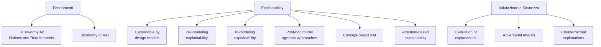
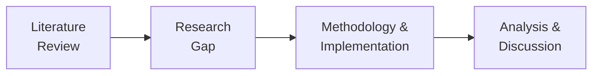

# Introduzione al Corso di Explainable and Trustworthy AI

> **Course:** Explainable and Trustworthy AI
> **Lecture:** 0
> **Date:** 2026-02-26
> **Source:** XAI_00_course_intro.pdf

## Overview

Questa lezione introduttiva presenta l'organizzazione del corso di Explainable and Trustworthy AI (AA 2025-2026), illustrando il corpo docente, gli argomenti trattati, la struttura didattica, le modalità d'esame e gli obiettivi del progetto di gruppo. Il corso copre l'intero spettro della spiegabilità e affidabilità dell'AI, dalle definizioni di Trustworthy AI fino alle tecniche avanzate di explainability e agli attacchi avversari.

## Content

### Corpo Docente

Il team didattico e composto da tre membri del PoliTo, contattabili via email (name.surname@polito.it):

- **Eliana Pastor** (referente del corso)
- **Gabriele Ciravegna**
- **Eleonora Poeta**

### Argomenti del Corso

Il programma copre undici macro-temi che spaziano dalle fondamenta teoriche alle tecniche pratiche:

#### Dettaglio degli argomenti

| Area | Argomenti |
|---|---|
| **Fondamenti** | Trustworthy AI (definizioni e requisiti), tassonomia dello XAI |
| **Explainability** | Modelli spiegabili per design, pre-modeling, in-modeling, post-hoc model-agnostic, concept-based, attention-based |
| **Valutazione e Sicurezza** | Valutazione delle spiegazioni, attacchi avversari, spiegazioni controfattuali |

### Struttura Didattica

Il corso alterna attività teoriche e pratiche senza distinzione fissa di fasce orarie tra lezioni e laboratori:

- **Lezioni frontali** — teoria e definizioni
- **Hands-on ed esercizi** — applicazione pratica dei concetti
- **Laboratori** — attività sperimentali e analisi pratica dei metodi (a partire dalla terza settimana)

#### Orario

| Giorno | Orario | Aula |
|---|---|---|
| Giovedi | 16:00-19:00 | Aula 14 |
| Venerdi | 8:30-10:00 | Aula 2I |

### Materiale Didattico

- Annunci sul portale didattico (https://didattica.polito.it/) tramite email istituzionale
- Slide, testi delle esercitazioni e materiali sulla pagina pubblica del corso: https://dbdmg.polito.it/dbdmg_web/2026/explainableand-trustworthy-ai-2025-2026/

### Esame

L'esame si compone di due parti:

#### Prova scritta

Verifica le conoscenze su:

- Definizioni e concetti principali di Explainable and Trustworthy AI
- Tecniche di spiegazione e loro caratteristiche
- Principali librerie che implementano i metodi di explainability

#### Progetto di gruppo (3-4 studenti)

Il progetto richiede di:

- Implementare e valutare una pipeline completa di data science e la sua spiegazione
- Progettare e valutare metodi di spiegazione
- Presentare il lavoro in forma orale

Gli obiettivi specifici del progetto seguono un flusso metodologico strutturato:

1. **Literature review** — revisione sistematica dei lavori relativi al tema del progetto
2. **Research gap** — identificazione delle lacune nella letteratura corrente
3. **Methodology and Implementation** — proposta e implementazione di una soluzione che affronti tali lacune
4. **Analysis** — valutazione della soluzione proposta e analisi critica dei risultati

## Key Concepts

| Concetto | Definizione | Nota |
|---|---|---|
| **XAI** | Explainable Artificial Intelligence: insieme di metodi per rendere comprensibili le decisioni dei modelli AI | Acronimo centrale del corso |
| **Trustworthy AI** | AI che rispetta requisiti di trasparenza, robustezza, equita, privacy e supervisione umana | Argomento della Lezione 1 |
| **Explainable by design** | Modelli intrinsecamente interpretabili (es. alberi decisionali, regressione lineare) | Contrapposti ai modelli black-box |
| **Post-hoc explainability** | Spiegazioni generate dopo il training, indipendenti dal modello sottostante | Approccio model-agnostic |
| **Concept-based XAI** | Spiegazioni basate su concetti di alto livello comprensibili all'umano | Alternativa alle spiegazioni feature-level |
| **Attacchi avversari** | Tecniche per ingannare i modelli AI tramite input appositamente modificati | Rilevante per la robustezza |
| **Spiegazioni controfattuali** | Spiegazioni che descrivono come cambiare l'input per ottenere una diversa predizione | "Cosa sarebbe servito per cambiare il risultato?" |
| **Valutazione delle spiegazioni** | Metriche e metodologie per valutare la qualità e fedeltà delle spiegazioni | Fondamentale per la fiducia nei metodi XAI |

## Connections

- La **Trustworthy AI** e i suoi sette requisiti vengono approfonditi nella Lezione 1, che costituisce il fondamento teorico dell'intero corso.
- La **tassonomia dello XAI** (model-agnostic vs model-specific, post-hoc vs by design) struttura gli argomenti delle Lezioni successive su explainability.
- Il **progetto di gruppo** richiede la comprensione integrata di tutte le tecniche: explainability, valutazione e implementazione pratica.
- Gli **attacchi avversari** si collegano al requisito di robustezza tecnica della Trustworthy AI (Lezione 1) e saranno trattati in una lezione dedicata.
- Le **librerie di explainability** menzionate per l'esame scritto verranno utilizzate nei laboratori a partire dalla terza settimana.