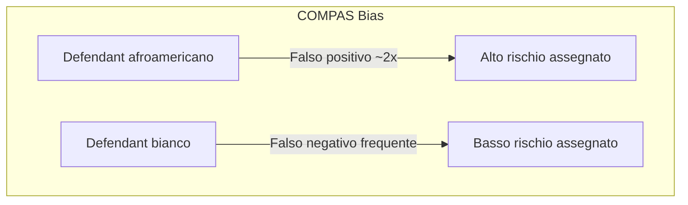
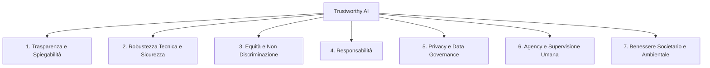
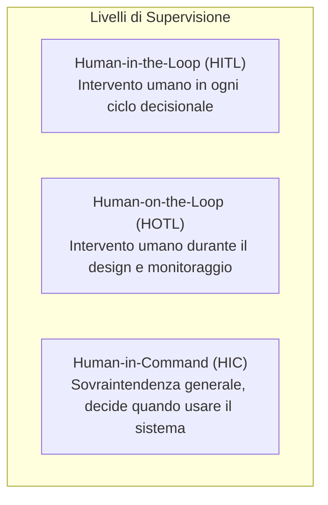

# Trustworthy AI: Motivazione e Definizioni

> **Course:** Explainable and Trustworthy AI  
> **Lecture:** 1  
> **Date:** 2026-04-03  
> **Source:** XAI_01_trustworthy_ai.pdf

## Overview

Questa lezione introduce il concetto di **Trustworthy AI**, partendo da casi reali in cui modelli di Machine Learning hanno prodotto risultati problematici, ingiusti o pericolosi. Vengono presentati i sette requisiti fondamentali delineati dalla European Commission per garantire che i sistemi AI siano degni di fiducia, con particolare attenzione a **trasparenza, spiegabilità, robustezza tecnica, equità, responsabilità, privacy e supervisione umana**.

## Content

### L'ubiquità dei modelli di Machine Learning

I modelli di Machine Learning sono ormai pervasivi in numerosi domini critici: finanza, diagnosi medica, sistemi di raccomandazione, reti sociali, ambito legale e smart cities. Questa diffusione solleva una domanda fondamentale: **ci possiamo fidare di questi modelli?**

La risposta non è scontata. I modelli possono apprendere pattern veri ma potenzialmente letali se impiegati senza cautela, possono imparare pattern ingiusti e discriminatori, possono essere ingannati da input apparentemente innocui, e possono commettere errori senza che vi sia un chiaro meccanismo di responsabilità.

### Casi Studio: Quando l'AI Fallisce

#### Il caso della pneumonie — Caruana et al. (2015)

L'obiettivo era costruire un modello per predire il rischio di morte nei pazienti con polmonite a partire da dati di ricovero. Sono stati creati due modelli: uno interpretabile ma meno accurato, e uno non interpretabile ma più accurato. I ricercatori hanno optato per il modello interpretabile.

La scelta si è rivelata fondamentale. Il modello interpretabile ha appreso un'associazione controintuitiva: **storia di asma → minor probabilità di morte per polmonite**. Questo è effettivamente un pattern reale nei dati, perché i pazienti asmatici ricevono più attenzione, notano i sintomi prima e vengono trattati con cure di qualità superiore e più tempestive. Tuttavia, utilizzare questo modello per decidere le ammissioni ospedaliere sarebbe stato fatale per gli asmatici: il modello li avrebbe classificati a basso rischio, negando loro il trattamento intensivo che invece necessitano.

Senza la possibilità di ispezionare il modello, questo problema pericoloso non sarebbe mai stato scoperto. Questo caso dimostra che **in applicazioni ad alto rischio come la sanità, è imperativo che gli esperti di dominio possano analizzare il comportamento del modello prima di ritenerlo affidabile**.

#### COMPAS — Bias razziale nella predizione della recidiva

COMPAS è uno strumento di valutazione del rischio utilizzato per assistere i giudici nelle decisioni giudiziarie. Un'analisi di ProPublica su 7.000 persone arrestate nella contea di Broward, Florida, ha rivelato **disparità razziali significative**. L'algoritmo assegnava erroneamente un rischio elevato di recidiva ai defendant afroamericani a un tasso quasi doppio rispetto ai defendant bianchi (falsi positivi). Al contrario, i defendant bianchi venivano classificati erroneamente come a basso rischio molto più spesso rispetto ai neri.

#### Amazon Recruiting Tool — Discriminazione di genere

Un sistema di recruiting basato su AI di Amazon ha mostrato bias contro le donne, penalizzando le candidate che avevano frequentato college esclusivamente femminili e i curriculum contenenti la parola "women's" (es. "women's chess club"). Il sistema aveva appreso dai dati storici che il settore tech è dominato da uomini, perpetuando così il bias esistente.

#### Attacchi avversari — Fooling dei modelli

Nel 2015, i ricercatori hanno dimostrato che è possibile ingannare le reti neurali convoluzionali aggiungendo rumore impercettibile all'input. Nell'esempio classico, un'immagine di panda viene classificata come gibbon con oltre il 99% di confidenza dopo l'aggiunta di noise, mentre per un osservatore umano entrambe le immagini sono chiaramente panda.

Inoltre, sono state create **patch avversarie** in grado di nascondere persone dai rilevatori di oggetti come YOLOv2: una persona che tiene una patch non viene rilevata, mentre la stessa persona senza la patch viene identificata correttamente. Questo rappresenta un rischio concreto per i sistemi di sorveglianza.

#### Air Canada Chatbot — Responsabilità legale

Un chatbot di Air Canada ha fornito informazioni false sulla politica di rimborsi. La compagnia aerea ha sostenuto che "il chatbot è un'entità legale separata responsabile delle proprie azioni", ma il tribunale ha condannato la compagnia, obbligandola a emettere un rimborso parziale e pagare le spese legali del cliente. La compagnia ha successivamente disattivato il chatbot.

#### Algoritmo per gli A-levels (UK, 2020)

Durante la pandemia, gli esami finali A-level sono stati cancellati e sostituiti da voti predetti dagli insegnanti, poi corretti da un algoritmo. Il sistema è stato accusato di bias contro gli studenti provenienti da contesti socioeconomici meno privilegiati. Il problema principale è stata la **mancanza di trasparenza**: senza spiegazioni su come le predizioni venivano effettuate, non c'era alcuna fiducia nel sistema.

#### Apple Card — Bias percepito

Un marito e una moglie con lo stesso storico di credito hanno ottenuto limiti di credito molto diversi (il marito: 20x quello della moglie). Dopo indagini, non è stato trovato un bias reale nei dati, ma la fiducia era già compromessa. L'episodio dimostra che **ricostruire la fiducia una volta persa è estremamente difficile**.

#### Google Gemini — Bias nell'image generation

Google ha bloccato la generazione di immagini di persone su Gemini dopo accuse di anti-white bias. Il bilanciamento tra evitare la discriminazione e non produrre risultati inesatti o storicamente scorretti si è rivelato molto complesso.

### I Sette Requisiti della Trustworthy AI

La European Commission ha definito sette requisiti chiave per una AI degna di fiducia, pubblicati nelle *Ethics Guidelines for Trustworthy AI*:

### 1. Trasparenza e Spiegabilità

La maggior parte dei modelli AI sono **black box**, la cui opacità può manifestarsi a molteplici livelli: i dati utilizzati, il modello/algoritmo, la funzione appresa e i motivi del suo funzionamento, e l'intenzione e il modello di business del prodotto AI.

#### Spiegabilità

La **spiegabilità** (explainability) è la capacità di spiegare il ragionamento dietro le decisioni o previsioni del sistema AI in termini comprensibili agli esseri umani. Le spiegazioni devono essere **adattate allo stakeholder**: un profano, un esperto di dominio, un regolatore o un ricercatore AI necessitano di livelli di dettaglio diversi.

L'**Articolo 13 e 14 del GDPR** stabilisce che, quando viene effettuato il profiling, il soggetto dei dati ha diritto a "informazioni significative sulla logica coinvolta". Esiste quindi un **diritto alla spiegazione** quando le decisioni AI hanno un impatto significativo sulla vita delle persone.

Va considerato il **trade-off accuratezza-spiegabilità**: migliorare la spiegabilità può ridurre l'accuratezza e viceversa. La decisione su come bilanciare questi due aspetti dipende dal contesto applicativo.

#### Tracciabilità

I dataset e i processi che producono le decisioni del sistema AI devono essere documentati per aumentare la trasparenza, includendo la raccolta dati, il labeling e l'algoritmo utilizzato. La tracciabilità facilita l'auditabilità e la spiegabilità.

#### Comunicazione

Le capacità, i benefici, i limiti e i rischi potenziali del sistema AI devono essere comunicati agli utenti finali. Gli esseri umani hanno il diritto di sapere che stanno interagendo con un sistema AI e devono ricevere un adeguato training sul suo utilizzo.

### 2. Robustezza Tecnica e Sicurezza

I sistemi AI devono essere **resilienti e sicuri**, sviluppati con un approccio preventivo ai rischi, comportandosi come previsto e minimizzando danni non intenzionali.

#### Sicurezza Generale

Definire i potenziali rischi associati all'uso del sistema AI, includendo metriche di valutazione e un **piano di fallback** in caso di problemi. Devono essere identificate possibili minacce come difetti di design, difetti tecnici, uso improprio e uso malevolo.

#### Resilienza agli Attacchi

I sistemi AI devono essere protetti contro vulnerabilità a molteplici livelli:

| Livello di attacco | Tipo |
|---|---|
| Dati | **Data poisoning**, manipolazione dei dati di training |
| Modello | **Model leakage**, **model inversion** per inferire i parametri |
| Input | **Adversarial attacks** per alterare il comportamento del modello (model evasion) |

Devono essere implementate misure per garantire integrità, robustezza e sicurezza, con monitoraggio continuo del sistema.

#### Accuratezza

I sistemi AI devono essere accurati e capaci di fare previsioni, raccomandazioni o decisioni corrette. I dati devono essere aggiornati, di alta qualità, completi e rappresentativi. Per le applicazioni critiche che incidono direttamente sulla vita umana è richiesto un livello di accuratezza molto elevato.

#### Affidabilità e Riproducibilità

I sistemi AI devono essere **affidabili** (funzionare correttamente con una gamma di input e situazioni) e **riproducibili** (stesso comportamento quando ripetuti nelle stesse condizioni). I processi di testing e verifica devono essere documentati e operazionalizzati.

### 3. Equità, Diversità e Non Discriminazione

I dati riflettono i bias e le discriminazioni della nostra società. Di conseguenza, i sistemi AI possono codificare questi bias, perpetuando pregiudizi storici e causando discriminazione indiretta contro certi gruppi.

Per evitare bias ingiusti è necessario: identificare possibili bias discriminatori e rimuoverli a molteplici livelli (raccolta dati, processing, design dell'algoritmo); valutare e enforce la diversità e rappresentatività nei dati; definire chiaramente le **misure di valutazione dell'equità**; includere esperti con background diversi per garantire diversità di opinioni.

I sistemi AI devono inoltre essere progettati secondo i principi di **Universal Design**, accessibili a prescindere da età, genere, abilità o caratteristiche.

### 4. Responsabilità

La responsabilità (accountability) ricade su molteplici entità:

| Entità | Responsabilità |
|---|---|
| **Utenti AI** | Comprendere funzionalità e limitazioni, uso appropriato |
| **Aziende** | Linee guida chiare, responsabili delle conseguenze dell'uso |
| **Sviluppatori** | Design e training responsabili, misure di sicurezza |
| **Data Provider** | Qualità e accuratezza dei dati |

L'**auditabilità** è fondamentale: assessment di algoritmi, dati e processi di design da parte di auditor interni ed esterni, facilitati da tracciabilità e logging.

### 5. Privacy e Data Governance

La privacy è un **diritto fondamentale**. I sistemi AI possono inferire informazioni private (preferenze, orientamento sessuale, età, genere, opinioni politiche o religiose). È necessario valutare l'impatto del sistema sulla privacy per l'intero ciclo di vita, includendo le informazioni generate durante l'interazione. Vale il **diritto all'oblio**.

La **data governance** è il processo di gestione dei dati durante il loro intero ciclo di vita, garantendo che siano sicuri, privati, accurati, disponibili e usabili. I dati devono essere testati e documentati a ogni fase (planning, training, testing, deployment), e l'accesso deve essere strettamente controllato.

### 6. Agency Umana e Supervisione

#### Agency Umana

I sistemi AI dovrebbero **supportare** (non sostituire) la decisione umana. L'**Articolo 22 del GDPR** stabilisce che il soggetto dei dati ha il diritto di non essere sottoposto a una decisione basata esclusivamente sul processing automatizzato che produca effetti giuridici o lo riguardi in modo significativo.

#### Meccanismi di Supervisione

### 7. Benessere Societario e Ambientale

I sistemi AI dovrebbero avere un impatto positivo sulla società e sull'ambiente, considerando le conseguenze a lungo termine del loro deploy.

## Key Concepts

| Concetto | Definizione | Nota |
|---|---|---|
| **Trustworthy AI** | AI che rispetta i 7 requisiti della European Commission | Fondato su etica e regolazione (EU AI Act, GDPR) |
| **Explainability** | Capacità di spiegare le decisioni AI in termini umani | Adattata allo stakeholder; diritto GDPR Art. 13-14 |
| **Trade-off accuratezza-spiegabilità** | Bilanciamento tra prestazioni e comprensibilità | Contesto-dipendente |
| **Data poisoning** | Manipolazione dei dati di training per alterare il modello | Attacco a livello di dati |
| **Adversarial attack** | Input studiati per ingannare il modello | Attacco a livello di input (es. patch avversarie) |
| **Auditability** | Capacità di sottoporre il sistema a valutazione interna/esterna | Facilitata da tracciabilità e logging |
| **HITL / HOTL / HIC** | Tre livelli di supervisione umana | Da intervento per ogni decisione a supervisione generale |
| **Bias algoritmico** | Discriminazione appresa dai dati storici | Può essere indiretto e non intenzionale |

## Connections

- Il **caso COMPAS** collega ai temi di fairness e bias che verranno probabilmente approfonditi nelle lezioni successive.
- Le **attacchi avversari** sono trattati in dettaglio nei corsi di Machine Learning e Deep Learning.
- Il **GDPR** (Art. 13, 14, 22) è rilevante anche per il corso di Large Language Models quando si parla di dati personali e privacy.
- Il **trade-off accuratezza-spiegabilità** sarà centrale nelle lezioni sui metodi di explainability (LIME, SHAP, attention-based explanation).
