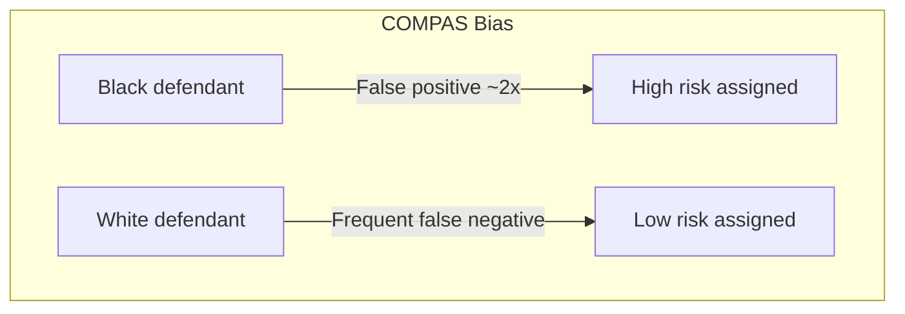
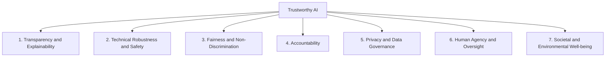
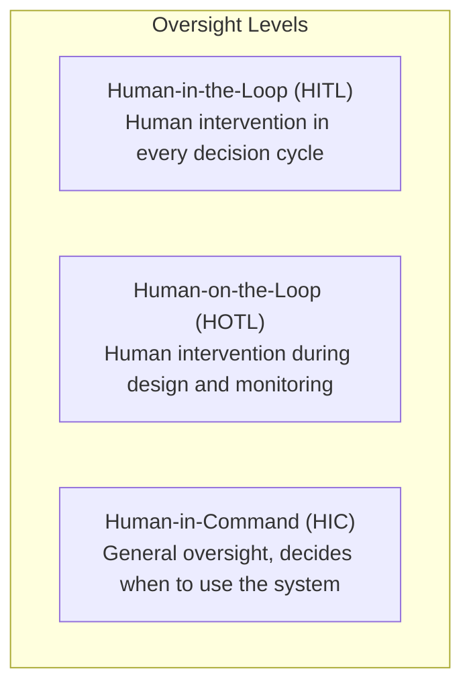

# Trustworthy AI: Motivation and Definitions

> **Course:** Explainable and Trustworthy AI  
> **Lecture:** 1  
> **Date:** 2026-04-03  
> **Source:** XAI_01_trustwothy_ai.pdf

## Overview

This lecture introduces the concept of **Trustworthy AI**, starting from real-world cases where Machine Learning models have produced problematic, unfair, or dangerous outcomes. The seven fundamental requirements defined by the European Commission for trustworthy AI systems are presented, with particular emphasis on **transparency, explainability, technical robustness, fairness, accountability, privacy, and human oversight**.

## Content

### The Ubiquity of Machine Learning Models

Machine Learning models are now pervasive across numerous critical domains: finance, medical diagnosis, recommender systems, social networks, the legal system, and smart cities. This widespread adoption raises a fundamental question: **can we trust these models?**

The answer is far from straightforward. Models can learn true patterns but ones that are potentially fatal if deployed carelessly, they can learn unfair and discriminatory patterns, they can be fooled by seemingly innocuous inputs, and they can make mistakes without a clear accountability mechanism.

### Case Studies: When AI Fails

#### The Pneumonia Risk Case — Caruana et al. (2015)

The goal was to build a model predicting the risk of death in pneumonia patients from hospitalization data. Two models were created: an interpretable but less accurate one, and a non-interpretable but more accurate one. The researchers opted for the interpretable model.

This choice proved crucial. The interpretable model learned a counterintuitive association: **history of asthma → lower probability of death from pneumonia**. This is actually a real pattern in the data, because asthmatic patients receive more attention, notice symptoms earlier, and are treated with higher-quality, more timely care. However, using this model for hospital admission decisions would have been fatal for asthmatics: the model would classify them as low risk, denying them the intensive treatment they actually need.

Without the ability to inspect the model, this dangerous issue would never have been discovered. This case demonstrates that **in high-risk applications such as healthcare, it is imperative for domain experts to analyze model behavior before deeming it trustworthy**.

#### COMPAS — Racial Bias in Recidivism Prediction

COMPAS is a risk assessment tool used to assist judges in judicial decisions. A ProPublica analysis of 7,000 arrested individuals in Broward County, Florida, revealed **significant racial disparities**. The algorithm erroneously assigned a high recidivism risk to Black defendants at nearly twice the rate compared to white defendants (false positives). Conversely, white defendants were more frequently mislabeled as low risk compared to Black defendants.

#### Amazon Recruiting Tool — Gender Discrimination

An Amazon AI-based recruiting system showed bias against women, penalizing applicants who had attended all-women's colleges and resumes containing the word "women's" (e.g., "women's chess club"). The system had learned from historical data that the tech industry is male-dominated, thus perpetuating the existing bias.

#### Adversarial Attacks — Fooling Models

In 2015, researchers demonstrated that CNNs can be fooled by adding imperceptible noise to the input. In the classic example, a panda image is classified as a gibbon with over 99% confidence after adding noise, while to a human observer both images are clearly pandas.

Additionally, **adversarial patches** have been created that can hide people from object detectors like YOLOv2: a person holding a patch goes undetected, while the same person without the patch is correctly identified. This poses a concrete risk to surveillance systems.

#### Air Canada Chatbot — Legal Accountability

An Air Canada chatbot provided false information about the refund policy. The airline argued that "the chatbot is a separate legal entity responsible for its own actions," but the court ruled against the airline, ordering a partial refund and payment of the customer's legal fees. The airline subsequently shut down the chatbot.

#### A-levels Algorithm (UK, 2020)

During the pandemic, final A-level exams were cancelled and replaced by teacher-predicted grades, then adjusted by an algorithm. The system was accused of bias against students from less privileged socioeconomic backgrounds. The main issue was the **lack of transparency**: without explanations of how predictions were made, there was zero trust in the system.

#### Apple Card — Perceived Bias

A husband and wife with the same credit history received very different credit limits (the husband: 20x that of the wife). After investigation, no real bias was found in the data, but trust was already compromised. The episode demonstrates that **rebuilding trust once lost is extremely difficult**.

#### Google Gemini — Image Generation Bias

Google blocked the generation of images of people on Gemini after accusations of anti-white bias. Balancing between avoiding discrimination and not producing inaccurate or historically incorrect results proved very challenging.

### The Seven Requirements of Trustworthy AI

The European Commission has defined seven key requirements for trustworthy AI, published in the *Ethics Guidelines for Trustworthy AI*:

### 1. Transparency and Explainability

Most AI models are **black boxes**, whose opacity can manifest at multiple levels: the data used, the model/algorithm, the learned function and the reasons behind its behavior, and the intention and business model of the AI product.

#### Explainability

**Explainability** is the ability to explain the reasoning behind AI decisions or predictions in terms understandable to humans. Explanations must be **tailored to the stakeholder**: a layperson, a domain expert, a regulator, or an AI researcher require different levels of detail.

**Articles 13 and 14 of the GDPR** state that when profiling takes place, the data subject has the right to "meaningful information about the logic involved." There is therefore a **right to explanation** when AI decisions have a significant impact on people's lives.

The **accuracy-explainability trade-off** must be considered: improving explainability may reduce accuracy and vice versa. The decision on how to balance these two aspects depends on the application context.

#### Traceability

The datasets and processes that produce AI system decisions must be documented to increase transparency, including data collection, labeling, and the algorithm used. Traceability facilitates auditability and explainability.

#### Communication

The capabilities, benefits, limitations, and potential risks of the AI system must be communicated to end users. Humans have the right to know they are interacting with an AI system and must receive adequate training on its use.

### 2. Technical Robustness and Safety

AI systems must be **resilient and secure**, developed with a preventive approach to risks, behaving as intended and minimizing unintended harm.

#### General Safety

Potential risks associated with AI system use must be defined, including evaluation metrics and a **fallback plan** in case of problems. Possible threats such as design faults, technical faults, misuse, and malicious use must be identified.

#### Attack Resilience

AI systems must be protected against vulnerabilities at multiple levels:

| Attack level | Type |
|---|---|
| Data | **Data poisoning**, manipulation of training data |
| Model | **Model leakage**, **model inversion** to infer parameters |
| Input | **Adversarial attacks** to alter model behavior (model evasion) |

Measures must be implemented to ensure integrity, robustness, and security, with continuous system monitoring.

#### Accuracy

AI systems must be accurate and capable of making correct predictions, recommendations, or decisions. Data must be up-to-date, high-quality, complete, and representative. A high level of accuracy is required for critical applications that directly impact human lives.

#### Reliability and Reproducibility

AI systems must be **reliable** (function correctly with a range of inputs and situations) and **reproducible** (same behavior when repeated under the same conditions). Testing and verification processes must be documented and operationalized.

### 3. Fairness, Diversity, and Non-Discrimination

Data reflects the biases and discriminations of our society. Consequently, AI systems can encode these biases, perpetuating historical prejudices and causing indirect discrimination against certain groups.

To avoid unfair bias it is necessary to: identify and remove discriminatory biases at multiple levels (data collection, processing, algorithm design); evaluate and enforce data diversity and representativeness; clearly define **fairness evaluation measures**; include experts from diverse backgrounds to ensure diversity of opinions.

AI systems should also be designed according to **Universal Design** principles, accessible regardless of age, gender, abilities, or characteristics.

### 4. Accountability

Accountability falls on multiple entities:

| Entity | Responsibility |
|---|---|
| **AI Users** | Understand functionality and limitations, appropriate use |
| **Businesses** | Clear guidelines, responsible for consequences of AI use |
| **Developers** | Responsible design and training, safety measures |
| **Data Providers** | Quality and accuracy of data |

**Auditability** is essential: assessment of algorithms, data, and design processes by internal and external auditors, facilitated by traceability and logging.

### 5. Privacy and Data Governance

Privacy is a **fundamental right**. AI systems can infer private information (preferences, sexual orientation, age, gender, political or religious views). The impact of the system on privacy must be assessed for the entire lifecycle, including information generated during interaction. The **right to be forgotten** applies.

**Data governance** is the process of managing data throughout its entire lifecycle, ensuring it is secure, private, accurate, available, and usable. Data must be tested and documented at every stage (planning, training, testing, deployment), and access must be strictly controlled.

### 6. Human Agency and Oversight

#### Human Agency

AI systems should **support** (not replace) human decision-making. **Article 22 of the GDPR** states that the data subject has the right not to be subject to a decision based solely on automated processing that produces legal effects or similarly significantly affects them.

#### Oversight Mechanisms

### 7. Societal and Environmental Well-being

AI systems should have a positive impact on society and the environment, considering the long-term consequences of their deployment.

## Key Concepts

| Concept | Definition | Note |
|---|---|---|
| **Trustworthy AI** | AI that respects the 7 European Commission requirements | Based on ethics and regulation (EU AI Act, GDPR) |
| **Explainability** | Ability to explain AI decisions in human terms | Tailored to stakeholder; GDPR right Art. 13-14 |
| **Accuracy-explainability trade-off** | Balancing performance and interpretability | Context-dependent |
| **Data poisoning** | Manipulation of training data to alter the model | Attack at the data level |
| **Adversarial attack** | Crafted inputs designed to fool the model | Attack at the input level (e.g., adversarial patches) |
| **Auditability** | Ability to subject the system to internal/external evaluation | Facilitated by traceability and logging |
| **HITL / HOTL / HIC** | Three levels of human oversight | From per-decision intervention to general supervision |
| **Algorithmic bias** | Discrimination learned from historical data | Can be indirect and unintentional |

## Connections

- The **COMPAS case** connects to fairness and bias topics that will likely be deepened in subsequent lectures.
- **Adversarial attacks** are covered in detail in the Machine Learning and Deep Learning courses.
- The **GDPR** (Art. 13, 14, 22) is also relevant to the Large Language Models course when discussing personal data and privacy.
- The **accuracy-explainability trade-off** will be central in lectures on explainability methods (LIME, SHAP, attention-based explanation).
