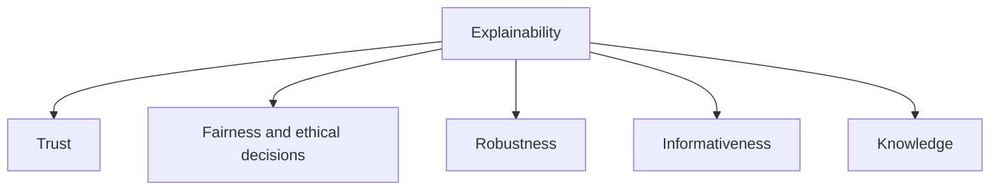
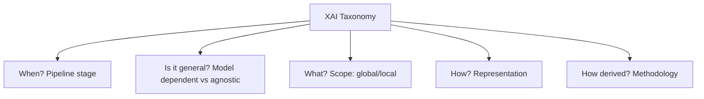

# Taxonomy of Explainable AI

> **Course:** Explainable and Trustworthy AI  
> **Lecture:** 2  
> **Date:** 2026-04-03  
> **Source:** XAI_02_XAI_taxonomy.pdf

## Overview

This lecture introduces a comprehensive taxonomy of **Explainable AI (XAI)**, defining key terminology and classifying explainability methods along five dimensions: ML pipeline stage, generalizability, scope, explanation representation, and derivation methodology.

## Content

### Key Definitions: Interpretability vs Explainability

The ML community has not yet reached a unanimous definition, but important distinctions exist:

- **Interpretability**: an interpretable model is transparent in its operation and provides information about input-output relationships. Primarily refers to models that are **inherently interpretable** by design.
- **Explainability**: the ability to explain the decision-making process of an AI model in terms understandable to the end user. Primarily refers to models that are **not inherently comprehensible** and require post-hoc methods.

Other terms in the literature include **understandability** (ability to understand the model in reasonable time), **comprehensibility** (patterns identified by the AI system are comprehensible), **intelligibility** (the model is interpretable by humans), and **mental fit** (a human's ability to grasp the model). These terms are often used interchangeably; in this course we primarily use *interpretable* and *explainable*.

### Desiderata of XAI Research

Understanding an AI model and its predictions enables achieving other objectives, which coincide with Trustworthy AI requirements:

**Trust:** If we can understand the model, we can decide whether to trust it. Pneumonia case: the interpretable model revealed a dangerous pattern. Apple Card case: users did not trust the model because it was opaque.

**Fairness:** If we can understand the model, we can assess whether it relies on sensitive or discriminatory information. COMPAS case: analysis revealed biased predictions. A-levels case: opacity raised fairness concerns.

**Robustness:** If we can inspect erroneous predictions, we can actively work on model debugging.

**Informativeness:** Revealing reasons behind predictions informs users. Example: "We rejected your loan request because your income was insufficient or unstable."

**Knowledge:** Inspecting model behavior can lead to new forms of knowledge. Example: AlphaGo played moves never seen before by humans ("So beautiful").

### The Five Dimensions of the XAI Taxonomy

#### Dimension 1: ML Pipeline Stage

Explainability involves the entire AI development pipeline:

1. **Pre-modeling** — before building the model: data exploration, feature selection, feature engineering
2. **In-modeling (Explainable Modeling)** — building inherently interpretable models, managing the accuracy-interpretability trade-off
3. **Post-modeling (Post-hoc)** — after development: explaining predictions and behavior of already trained models

#### Dimension 2: Generalizability

- **Model dependent**: solutions applicable only to specific models (e.g., approaches for SVM, specific neural networks). They rely on model structure/properties.
- **Model agnostic**: solutions applicable to any model. They treat the model as an oracle (predictions, output probabilities).

Advantages of model agnostic solutions: model flexibility, explanation flexibility, representation flexibility, lower switching cost, easier model comparison.

#### Dimension 3: Explainability Scope

- **Global**: how the model works in general
- **Subgroup**: how it behaves on data subgroups
- **Individual/Local**: explaining reasons behind individual predictions

Explaining a single prediction is a simpler task than explaining an entire model: it is easier to approximate behavior for a single instance, and a single local explanation is easier to understand and analyze than a global one.

#### Dimension 4: Explanation Representation

Explanations can be represented in various formats:

| Representation | Description |
|---|---|
| **Feature importance / Input attribution** | How much each feature contributed to the prediction |
| **Local rules** | If-then rules describing behavior for a specific instance |
| **Visualizations** | Visual representations (ICE plots, heatmaps) |
| **Explanations by example** | Selected or generated instances to explain |

**Explanations by example** are divided into:
- **Prototypes**: representative instances of the predicted class
- **Counterfactuals**: the smallest change that alters the prediction (e.g., "if income increases by 10K → loan approved")
- **Adversarial examples**: counterfactuals designed to fool the model (not to interpret it)

#### Dimension 5: Derivation Methodology

- **Explaining by removing** (occlusion/perturbation): remove features to quantify their influence
- **Local surrogate**: approximate the complex model with a local interpretable model
- **Gradient-based**: leverage gradients of the output with respect to inputs
- **Counterfactual methods**: generate alternative instances to understand how small changes affect the output

## Key Concepts

| Concept | Definition | Note |
|---|---|---|
| **Interpretability** | Transparent model showing input-output relationships | Inherently interpretable models |
| **Explainability** | Ability to explain decisions in human terms | Often post-hoc, for black box models |
| **Model agnostic** | Method applicable to any model | Treats model as oracle |
| **Global scope** | General model behavior | Harder to obtain |
| **Local scope** | Single prediction | Simpler and often more useful |
| **Feature importance** | Contribution of each feature to prediction | Can be numerical, graphical, or tabular |
| **Counterfactual** | Smallest change that alters prediction | Intuitive for humans |

## Connections

- The three stages (pre/in/post-modeling) are developed in lectures 03a, 03b, 04-06
- Interpretability links to trust and fairness concepts from lecture 01
- Model agnostic solutions (LIME, SHAP) are covered in lectures 05-06
- Counterfactuals will be deepened in subsequent lectures
