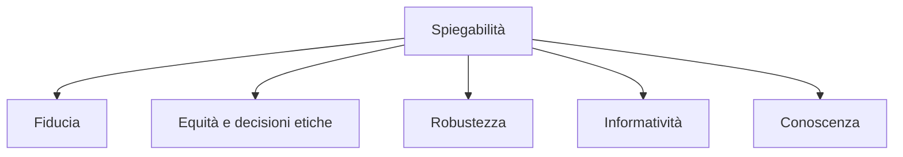
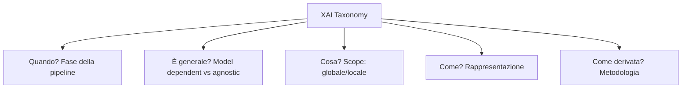
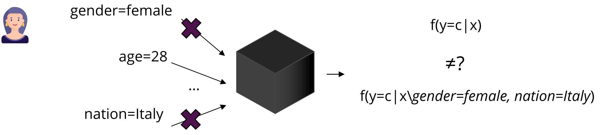

# Tassonomia della Explainable AI

> **Course:** Explainable and Trustworthy AI  
> **Lecture:** 2  
> **Date:** 2026-04-03  
> **Source:** XAI_02_XAI_taxonomy.pdf

## Overview

Questa lezione introduce una tassonomia completa della **Explainable AI (XAI)**, definendo i termini fondamentali e classificando i metodi di spiegabilità secondo cinque dimensioni: fase della pipeline ML, generalizzabilità, scope, rappresentazione della spiegazione e metodologia di derivazione.

## Content

### Definizioni Chiave: Interpretability vs Explainability

La comunità ML non ha ancora un accordo univoco sulla definizione di questi termini, ma esistono distinzioni importanti:

- **Interpretability**: un modello interpretabile è trasparente nel suo funzionamento e fornisce informazioni sulle relazioni tra input e output. Si riferisce principalmente a modelli **intrinsecamente interpretabili** per design.
- **Explainability**: capacità di spiegare il processo decisionale di un modello AI in termini comprensibili per l'utente finale. Si riferisce principalmente a modelli che **non sono di per sé comprensibili** e richiedono metodi post-hoc.

Altri termini utilizzati in letteratura includono **understandability** (capacità di comprendere il modello in un tempo ragionevole), **comprehensibility** (i pattern identificati dal sistema AI sono comprensibili), **intelligibility** (il modello è interpretabile da umani), e **mental fit** (capacità di un umano di afferrare il modello). Questi termini sono spesso usati in modo intercambiabile; in questo corso useremo principalmente *interpretabile* ed *explainable*.

### Desiderata della Ricerca in XAI

Comprendere un modello AI e le sue previsioni permette di raggiungere altri obiettivi, che coincidono con i requisiti della Trustworthy AI:

**Fiducia (Trust):** Se possiamo comprendere il modello, possiamo decidere se fidarci. Caso pneumonia: il modello interpretabile ha rivelato un pattern pericoloso. Caso Apple Card: gli utenti non si fidavano perché il modello era opaco.

**Equità (Fairness):** Se possiamo comprendere il modello, possiamo valutare se si basa su informazioni sensibili o discriminatorie. Caso COMPAS: l'analisi ha rivelato predizioni biased. Caso A-levels: l'opacità ha generato preoccupazioni sull'equità.

**Robustezza (Robustness):** Se possiamo ispezionare le previsioni errate, possiamo lavorare attivamente al debugging del modello.

**Informatività (Informativeness):** Rivelare le ragioni dietro le previsioni informa gli utenti. Esempio: "Abbiamo respinto la tua richiesta di prestito perché il tuo reddito era insufficiente o instabile."

**Conoscenza (Knowledge):** Ispezionare il comportamento del modello può portare a nuove forme di conoscenza. Esempio: AlphaGo ha giocato mosse mai viste prima da umani ("So beautiful").

### Le Cinque Dimensioni della Tassonomia XAI

#### Dimensione 1: Fase della Pipeline ML

La spiegabilità coinvolge l'intera pipeline di sviluppo AI:

1. **Pre-modeling** — prima di costruire il modello: esplorazione dati, selezione feature, feature engineering
2. **In-modeling (Explainable Modeling)** — costruire modelli intrinsecamente interpretabili, gestendo il trade-off accuratezza-interpretabilità
3. **Post-modeling (Post-hoc)** — dopo lo sviluppo: spiegare previsioni e comportamento di modelli già addestrati

#### Dimensione 2: Generalizzabilità

- **Model dependent**: soluzioni applicabili solo a modelli specifici (es. approcci per SVM, reti neurali specifiche). Si basano sulla struttura/proprietà del modello.
- **Model agnostic**: soluzioni applicabili a qualsiasi modello. Trattano il modello come un oracolo (previsioni, probabilità di output).

Vantaggi delle soluzioni model agnostic: flessibilità del modello, flessibilità della spiegazione, flessibilità della rappresentazione, costo inferiore per il cambio di modello, facilità di confronto tra modelli.

#### Dimensione 3: Scope della Spiegabilità

- **Globale**: come funziona il modello in generale
- **Subgroup**: come si comporta su sottogruppi di dati
- **Individuale/Locale**: spiegare le ragioni dietro singole previsioni

Spiegare una singola previsione è un compito più semplice che spiegare un intero modello: è più facile approssimare il comportamento per una singola istanza, e una singola spiegazione locale è più facile da comprendere e analizzare rispetto a una spiegazione globale.

#### Dimensione 4: Rappresentazione della Spiegazione

Le spiegazioni possono essere rappresentate in diversi formati:

| Rappresentazione | Descrizione |
|---|---|
| **Feature importance / Input attribution** | Quanto ogni feature ha contribuito alla previsione |
| **Regole locali** | Regole if-then che descrivono il comportamento per un'istanza specifica |
| **Visualizzazioni** | Rappresentazioni visive (ICE plots, heatmaps) |
| **Explanations by example** | Istanze selezionate o generate per spiegare |

Le **explanations by example** si dividono in:
- **Prototipi**: istanze rappresentative della classe predetta
- **Counterfactual**: il minimo cambiamento che altera la previsione (es. "se il reddito aumenta di 10K → prestito approvato")
- **Adversarial examples**: counterfactual progettati per ingannare il modello (non per interpretarlo)

#### Dimensione 5: Metodologia di Derivazione

- **Explaining by removing** (occlusion/perturbation): rimuovere feature per quantificare la loro influenza
- **Local surrogate**: approssimare il modello complesso con un modello interpretabile locale
- **Gradient-based**: sfruttare i gradienti dell'output rispetto agli input
- **Counterfactual methods**: generare istanze alternative per capire come piccoli cambiamenti influenzano l'output

## Key Concepts

| Concetto | Definizione | Nota |
|---|---|---|
| **Interpretability** | Modello trasparente che mostra relazioni input-output | Modelli intrinsecamente interpretabili |
| **Explainability** | Capacità di spiegare decisioni in termini umani | Spesso post-hoc, per modelli black box |
| **Model agnostic** | Metodo applicabile a qualsiasi modello | Tratta il modello come oracolo |
| **Scope globale** | Comportamento generale del modello | Più difficile da ottenere |
| **Scope locale** | Singola previsione | Più semplice e spesso più utile |
| **Feature importance** | Contributo di ogni feature alla previsione | Può essere numerico, grafico o tabulare |
| **Counterfactual** | Minimo cambiamento che altera la previsione | Intuitivo per gli umani |

## Connections

- Le tre fasi (pre/in/post-modeling) sono sviluppate nelle lezioni 03a, 03b, 04-06
- L'interpretability è collegata ai concetti di fiducia e fairness della lezione 01
- Le soluzioni model agnostic (LIME, SHAP) sono trattate nelle lezioni 05-06
- I counterfactual saranno approfonditi in lezioni successive
