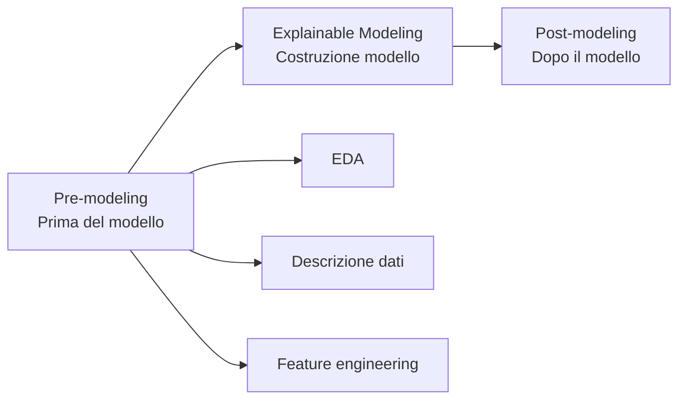
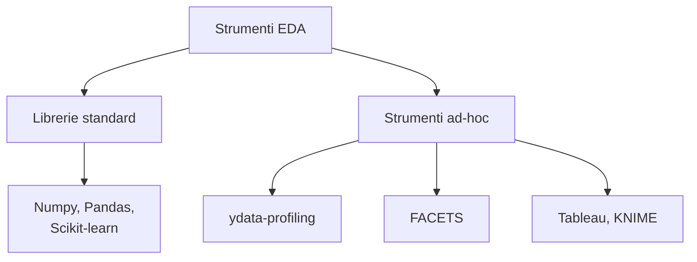
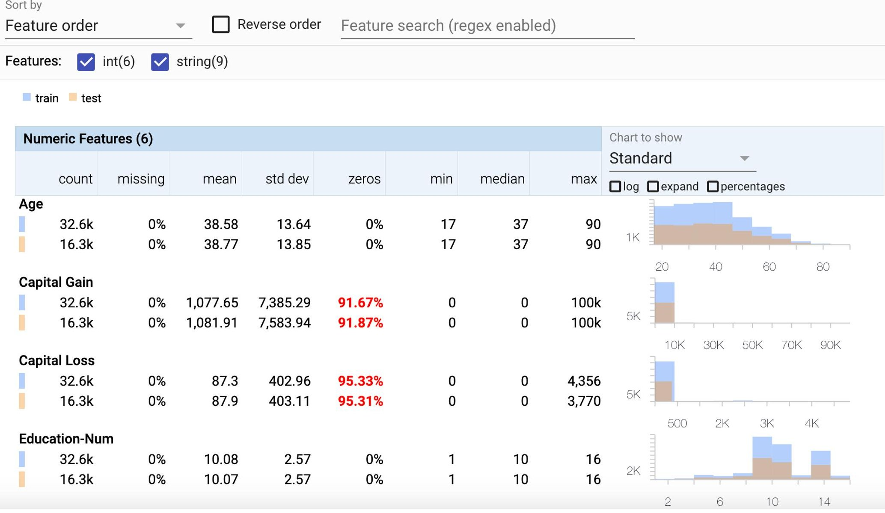
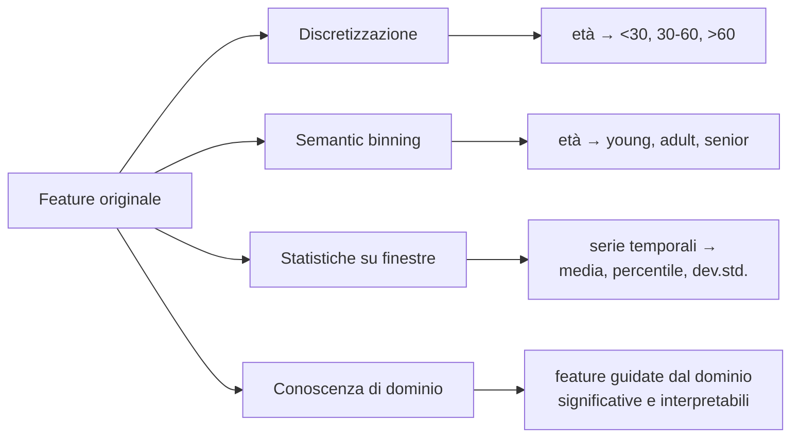

# Spiegabilità Pre-Modeling

> **Course:** Explainable and Trustworthy AI
> **Lecture:** 3a
> **Date:** 2026-04-03
> **Source:** XAI_03a_premodeling.pdf

## Overview

Questa lezione copre la fase di **spiegabilità pre-modeling**, ovvero tutte le attività che precedono la costruzione del modello vero e proprio. L'obiettivo è acquisire una migliore comprensione dei dati e pre-processarli preservandone l'interpretabilità, identificando e correggendo bias prima del modeling. Vengono presentati tre pilastri: l'analisi esplorativa dei dati (EDA), la descrizione e documentazione dei dataset, e il feature engineering interpretabile.

## Content

### Posizione della Pre-Modeling nella Pipeline

La spiegabilità coinvolge l'intera pipeline di sviluppo AI, divisa in tre fasi:

La pre-modeling si concentra su: esplorazione dei dati, descrizione e sommario dei dataset, e selezione/preprocessing delle feature preservandone l'interpretabilità.

### L'Analisi Esplorativa dei Dati (EDA)

L'**Exploratory Data Analysis** è il primo passo fondamentale della spiegabilità pre-modeling. Utilizza tecniche statistiche e visualizzazioni per estrarre un sommario delle caratteristiche principali del dataset:

- Riepilogo dei dati e visualizzazione del dataset
- Calcolo e analisi delle proprietà statistiche: media, deviazione standard, percentuale di campioni mancanti, dimensionalità delle feature, presenza di outlier

Conoscere i dati permette di comprendere meglio il modello che verrà addestrato e di **esporre bias** che potrebbero esistere nei dati.

#### Strumenti per l'EDA

| Tool | Caratteristiche |
|---|---|
| **Numpy, Pandas, Scikit-learn** | Librerie Python standard per analisi statistica |
| **ydata-profiling** | Analisi univariata (statistiche descrittive, visualizzazioni), multivariata (correlazioni, dati mancanti, interazioni pairwise), confronto tra dataset |
| **FACETS** | Analisi statistica feature-by-feature, distribuzione dei dati, focus su problemi comuni come valori mancanti, esplorazione delle relazioni tra datapoint |

### Descrizione del Dataset

Documentare correttamente un dataset è essenziale per molteplici ragioni:

- **Comunicazione**: assicurare una comunicazione corretta tra creatori e utenti dei dati
- **Trasparenza**: chiara origine dei dati, caratteristiche e potenziali bias
- **Evitare uso improprio** dei dati
- **Considerazioni etiche**: aiutare a identificare bias sistemici nei modelli
- **Riproducibilità**: abilitare la riproduzione di risultati e analisi
- **Data governance**: fornire linee guida per la gestione dei dati
- **Collaborazione e condivisione**: dati documentati possono essere condivisi facilmente
- **Preservazione a lungo termine**: mantenere accessibilità e usabilità nel tempo
- **Gestione del rischio**: identificare rischi come problemi di privacy, vulnerabilità di sicurezza o problemi di qualità

**Punti da indirizzare nella documentazione:**

| Aspetto | Descrizione |
|---|---|
| **Motivazione** | Ragioni per creare il dataset, chi l'ha creato o finanziato |
| **Composizione** | Cosa fornisce il dataset, presenza di errori, rumore o ridondanze |
| **Processo di raccolta** | Come sono stati acquisiti i dati, chi era coinvolto |
| **Preprocessing** | Informazioni su preprocessing o cleansing |
| **Usi** | Per quali task i dati possono o non possono essere usati |
| **Distribuzione** | Come sarà disseminato, restrizioni e licenze |
| **Manutenzione** | Aggiornamenti pianificati, supporto e comunicazione agli utenti |

#### Standard per la Documentazione

Esistono diverse raccomandazioni per standardizzare le descrizioni:

| Standard | Riferimento |
|---|---|
| **Datasheets for Datasets** | Gebru et al., Communications of the ACM, 2021 |
| **Data Statements** | Bender & Friedman, TACL, 2018 |
| **Dataset Nutrition Labels** | Holland et al., Data Protection and Privacy, 2020 |

### Feature Engineering Interpretabile

La selezione e il preprocessing delle feature devono preservare l'interpretabilità:

#### Selezione delle Feature

Un numero ridotto di feature riduce la complessità e rende il processo e il modello più interpretabili. Metodi comuni:

- **Eliminazione ricorsiva delle feature**: rimozione iterativa delle feature meno importanti
- **Processi di selezione interpretabili**:
  - Guidati da esperti di dominio: selezionano le feature più importanti per il processo
  - Basati su correlazione: mantengono solo uno o pochi rappresentanti tra feature correlate

#### Trasformazioni Interpretabili

Creare o trasformare feature in modo comprensibile per gli umani:

- **Discretizzazione**: da età numerica a categorie (<30, 30-60, >60)
- **Semantic binning**: da età a concetti (young, adult, senior)
- **Statistiche su finestre**: da serie temporali a media, percentile, deviazione standard su finestre
- **Integrazione di conoscenza di dominio**: creare feature guidate dal dominio significative e interpretabili

## Key Concepts

| Concetto | Definizione | Nota |
|---|---|---|
| **EDA** | Analisi statistica e visiva esplorativa dei dati | Primo passo per comprendere i dati |
| **ydata-profiling** | Tool per analisi univariata, multivariata e confronto dataset | Genera report automatici |
| **FACETS** | Tool per analisi feature-by-feature e distribuzione dei dati | Sviluppato da Google PAIR |
| **Datasheets for Datasets** | Standard per documentare dataset | Gebru et al., 2021 |
| **Data Statements** | Standard per mitigare bias nei dataset NLP | Bender & Friedman, 2018 |
| **Dataset Nutrition Labels** | Standard per etichettare la "qualità nutrizionale" dei dati | Holland et al., 2020 |
| **Discretizzazione** | Conversione di feature continue in categorie | Aumenta interpretabilità |
| **Semantic binning** | Binning con etichette semantiche | Es. età → young/adult/senior |
| **Selezione interpretabile** | Selezione feature guidata da esperti o correlazione | Priorità a processi comprensibili |

## Connections

- L'EDA e la descrizione dei dati preparano il terreno per la fase di modeling (lezione 03b)
- Le *Datasheets for Datasets* sono rilevanti per il requisito di trasparenza della lezione 01
- La selezione interpretabile delle feature è un prerequisito per i modelli interpretabili (lezione 03b)
- L'identificazione di bias durante l'EDA si collega all'equità e non discriminazione (lezione 01)
- Il feature engineering interpretabile è il fondamento dei concetti di concept bottleneck trattati nelle lezioni 08-08b
