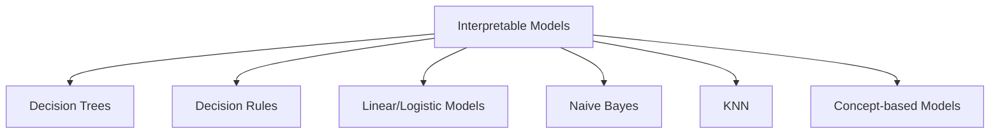

# In-modeling Explainability

> **Course:** Explainable and Trustworthy AI  
> **Lecture:** 3b  
> **Date:** 2026-04-03  
> **Source:** XAI_03b_inmodeling.pdf

## Overview

This lecture covers the **in-modeling explainability** phase, i.e., designing, training, and adopting inherently interpretable models. The main interpretable models are presented (decision trees, rules, linear/logistic models, Naïve Bayes, KNN), along with their interpretation mechanisms and strategies for targeting interpretability by design.

## Content

### Inherently Interpretable Models

The central idea is to adopt models that are interpretable by their very structure. However, adopting an interpretable model does not automatically guarantee interpretability (e.g., very deep trees, linear models on high-dimensional data). There is an **interpretability-performance trade-off**: interpretable models are typically less accurate.

The main interpretable models are:

### Decision Trees

Decision trees are simple supervised models used for classification and regression. The tree structure consists of:

- **Root node**: topmost node where the first decision is made
- **Internal (decision) nodes**: represent decisions or tests on attributes
- **Edges**: possible outcomes of a decision
- **Leaf nodes**: terminal nodes providing the final decision

**Tree construction:**
1. Begin with the entire dataset at the root node
2. Select the best splitting attribute based on a criterion (e.g., **Gini Impurity**)
3. Partition the dataset into subsets based on the selected attribute's values
4. Recursively apply until: all instances in the leaf belong to the same class, no more attributes to split on, or stopping criteria are met (max depth, min leaf samples)
5. Assign a class label to each leaf based on majority

**Global interpretation:**

- **Tree structure**: analysis of decision paths
- **Decision rules**: extraction of if-then rules from the path
- **Feature importance**: importance of each feature based on impurity reduction

**Impurity-based feature importance (Gini Importance):**

The importance of a feature is the normalized total reduction of the impurity criterion obtained by using that feature for splitting. The Gini Index for a node $t$ is:

$$GINI(t) = 1 - \sum_{j} [p(j|t)]^2$$

where $p(j|t)$ is the relative frequency of class $j$ at node $t$. Gini is maximum ($1 - 1/n_c$) when all classes are equally represented, and minimum ($0$) when all instances belong to one class.

**Local interpretation:** Tracing the decision path from the root node to the leaf for a specific instance. Each node in the path explains why the prediction was made.

**Advantages:** global and local interpretability, intuitive and human-friendly explanations, native visualization, facilitates communication with non-technical stakeholders, enables trust assessment.

**Limitations:** lower accuracy compared to more complex models, interpretable only when small (few nodes, low depth).

### Decision Rules

Decision rules classify instances using "if...then..." rules:

$$\text{Rule: (Condition)} \rightarrow y$$

where Condition is a conjunction of simple predicates and $y$ is the class label. Rule extraction can occur via induction algorithms (e.g., CN2, RIPPER) or from decision trees.

**Decision list vs Decision set:**
- **Decision list**: ordered rules; prediction based on the first satisfied rule
- **Decision set**: independent and mutually exclusive rules, with conflict resolution strategies like majority voting

Global interpretation analyzes the rules themselves and feature importance (features appearing in more rules are more important). Local interpretation analyzes the single rule satisfied by the instance.

### Linear Regression

A linear regression model predicts the target as a weighted sum of inputs:

$$y = \beta_0 + \beta_1 x_1 + \beta_2 x_2 + \ldots + \beta_p x_p$$

The coefficients $\beta_i$ represent the change in the dependent variable for a one-unit change in the corresponding independent variable, holding all others constant. If $\beta_i$ is positive, $x_i$ increases the prediction; if negative, it decreases it.

**Example:** $\text{Salary} = 40000 + 3000 \times \text{YearsExp} + 2000 \times \text{EducationLevel}$
- Intercept: person with zero experience and zero education → $40,000
- Each additional year of experience → +$3,000
- Each additional year of education → +$2,000

### Logistic Regression

Logistic regression extends the linear model to classification:

$$P(y=1) = \frac{1}{1 + \exp(-(\beta_0 + \beta_1 x_1 + \ldots + \beta_p x_p))}$$

The coefficients represent the change in **log-odds** of the event for a one-unit change in the predictor variable:

$$\ln\left(\frac{P(y=1)}{1-P(y=1)}\right) = \beta_0 + \beta_1 x_1 + \ldots + \beta_p x_p$$

If we increase the value of feature $x_i$ by one unit, the odds change by a factor of $\exp(\beta_i)$. **Example:** if $\beta_{\text{hours}} = 0.8$, each additional study hour multiplies the odds of passing the exam by $\exp(0.8) \approx 2.22$.

### Naïve Bayes

The Naïve Bayes classifier uses Bayes' theorem with the feature independence assumption:

$$P(C_k|x) = \frac{1}{Z} P(C_k) \prod_{i=1}^{n} P(x_i|C_k)$$

**Feature importance** is given by conditional probabilities of features given classes: higher probabilities indicate the feature is more indicative of that class.

**Advantages:** simple, easy to implement, provides feature importance. **Limitations:** feature independence assumption, limited expressiveness and low performance.

### KNN (K-Nearest Neighbors)

Prediction is based on the K nearest neighbors of the instance. It is an **explanation by example**: KNN provides similar instances as its explanation.

**Advantages:** intuitive explanation (similar to human reasoning for some data types, e.g., similar images). **Limitations:** difficult to interpret with many features, no global interpretation.

### Targeting Interpretability by Design

Beyond inherently interpretable models, strategies exist to impose interpretability constraints on more complex models:

- **Explainability via regularization**: apply regularization to improve interpretability (e.g., limit number of tree leaves, non-zero weights for linear models). Problem: these models may still underperform compared to more complex ones.
- **Concept Bottleneck Models**: models operating through interpretable concepts as intermediate bottleneck (Koh et al., ICML 2020).

### Explanations-in-the-Loop (TED)

The **TED (Teaching Explanations for Decisions)** framework trains AI systems to jointly provide a prediction and its explanation:

**Analogy with human learning:**
- *Training*: supervisor shows the employee examples and teaches the correct action + the reason (e.g., "insufficient income")
- *Deployment*: the employee makes independent decisions and provides explanations based on what they learned

**Training data:** $(X, Y, E)$ where $E$ are *rationales* — human annotations explaining the labels (ground truth explanation).

**Advantages:** explainability directly in training, alignment with human reasoning and values, customizable explanations for the target audience.

**Limitations:** requires datasets annotated with explanations, explanations may reflect human expectations rather than actual model behavior. This introduces the distinction between **faithfulness** (the explanation matches the model's internal workings) and **plausibility** (the explanation matches what humans expect).

## Key Concepts

| Concept | Definition | Note |
|---|---|---|
| **Gini Impurity** | Node impurity measure: $1 - \sum p_j^2$ | Used for tree splits |
| **Gini Importance** | Total impurity reduction for a feature | Global feature importance |
| **Log-odds** | Logarithm of the odds ratio | Logistic regression coefficient interpretation |
| **Decision list** | Ordered rules, first satisfied wins | Type of decision rules |
| **Decision set** | Independent rules, conflict resolution | Type of decision rules |
| **TED** | Teaching Explanations for Decisions | Training with ground truth explanations |
| **Faithfulness vs Plausibility** | Model-faithful explanation vs human expectation | Key trade-off |
| **Concept Bottleneck** | Model with interpretable concepts as bottleneck | Interpretability by design |

## Connections

- The interpretability-performance trade-off is central to all XAI and motivates post-hoc methods (lectures 04-06)
- TED and explanations-in-the-loop connect explainability to training, a theme that recurs in concept-based models
- Gini-based feature importance is a predecessor of permutation importance methods (lecture 04)
