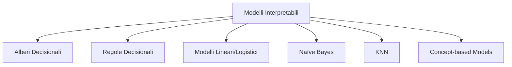
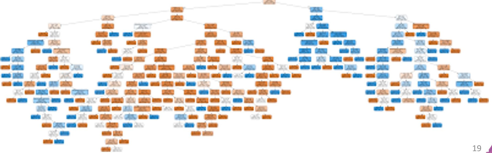
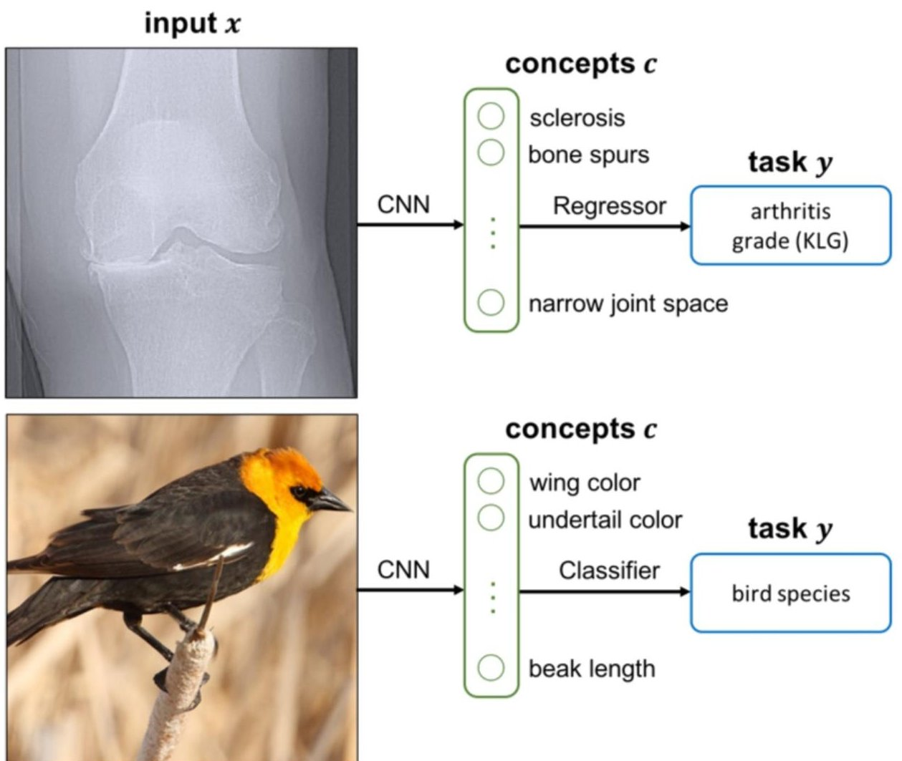
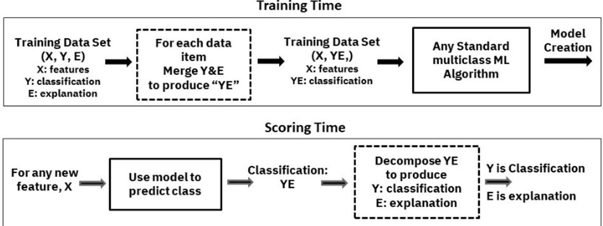

# Spiegabilità In-Modeling

> **Course:** Explainable and Trustworthy AI  
> **Lecture:** 3b  
> **Date:** 2026-04-03  
> **Source:** XAI_03b_inmodeling.pdf

## Overview

Questa lezione copre la fase di **spiegabilità in-modeling**, ovvero la progettazione, l'addestramento e l'adozione di modelli intrinsecamente interpretabili. Vengono presentati i principali modelli interpretabili (alberi decisionali, regole, modelli lineari/logistici, Naïve Bayes, KNN), i loro meccanismi di interpretazione e le strategie per targetizzare l'interpretabilità per design.

## Content

### Modelli Intrinsecamente Interpretabili

L'idea centrale è adottare modelli che sono interpretabili per la loro struttura stessa. Tuttavia, adottare un modello interpretabile non garantisce automaticamente l'interpretabilità (es. alberi molto profondi, modelli lineari su dati ad alta dimensionalità). Esiste un **trade-off tra interpretabilità e performance**: i modelli interpretabili sono tipicamente meno accurati.

I principali modelli interpretabili sono:

### Alberi Decisionali

Gli alberi decisionali sono modelli supervisionati semplici usati per classificazione e regressione. La struttura ad albero è composta da:

- **Nodo radice**: nodo superiore dove viene presa la prima decisione
- **Nodi interni (decisionali)**: rappresentano decisioni o test su attributi
- **Archi**: possibili esiti di una decisione
- **Nodi foglia**: nodi terminali che forniscono la decisione finale

**Costruzione dell'albero:**
1. Si inizia con l'intero dataset nel nodo radice
2. Si seleziona il miglior attributo di split basato su un criterio (es. **Gini Impurity**)
3. Si partiziona il dataset in sottoinsiemi basati sui valori dell'attributo selezionato
4. Si applica ricorsivamente fino a: tutte le istanze nella foglia appartengono alla stessa classe, non ci sono più attributi per lo split, o si raggiungono criteri di stop (profondità massima, campioni minimi per foglia)
5. Si assegna un'etichetta di classe a ogni foglia basata sulla maggioranza

**Interpretazione globale:**

- **Struttura dell'albero**: analisi dei percorsi decisionali
- **Regole decisionali**: estrazione di regole if-then dal percorso
- **Feature importance**: importanza di ogni feature basata sulla riduzione dell'impurità

**Feature importance basata sull'impurità (Gini Importance):**

L'importanza di una feature è la riduzione totale normalizzata del criterio di impurità ottenuta usando quella feature per lo split. L'indice di Gini per un nodo $t$ è:

$$GINI(t) = 1 - \sum_{j} [p(j|t)]^2$$

dove $p(j|t)$ è la frequenza relativa della classe $j$ nel nodo $t$. Il Gini è massimo ($1 - 1/n_c$) quando tutte le classi sono equamente rappresentate, e minimo ($0$) quando tutte le istanze appartengono a una sola classe.

**Interpretazione locale:** Tracciamento del percorso decisionale dal nodo radice alla foglia per un'istanza specifica. Ogni nodo nel percorso spiega perché la previsione è stata presa.

**Vantaggi:** interpretabilità globale e locale, spiegazioni intuitive e human-friendly, visualizzazione nativa, facilita comunicazione con stakeholder non tecnici, permette di valutare la fiducia nel modello.

**Limitazioni:** bassa accuratezza rispetto a modelli più complessi, interpretabili solo se piccoli (pochi nodi, bassa profondità).

### Regole Decisionali

Le regole decisionali classificano le istanze usando regole "if...then...":

$$\text{Rule: (Condition)} \rightarrow y$$

dove Condition è una congiunzione di predicati semplici e $y$ è l'etichetta di classe. L'estrazione delle regole può avvenire tramite algoritmi di induzione (es. CN2, RIPPER) o da alberi decisionali.

**Decision list vs Decision set:**
- **Decision list**: regole ordinate; la previsione si basa sulla prima regola soddisfatta
- **Decision set**: regole indipendenti e mutuamente esclusive, con strategie di risoluzione dei conflitti come majority voting

L'interpretazione globale analizza le regole stesse e la feature importance (feature che compaiono in più regole sono più importanti). L'interpretazione locale analizza la singola regola soddisfatta dall'istanza.

### Regressione Lineare

Un modello di regressione lineare predice il target come somma pesata degli input:

$$y = \beta_0 + \beta_1 x_1 + \beta_2 x_2 + \ldots + \beta_p x_p$$

I coefficienti $\beta_i$ rappresentano il cambiamento nella variabile dipendente per un'unità di cambiamento nella variabile indipendente corrispondente, tenendo costanti tutte le altre variabili. Se $\beta_i$ è positivo, $x_i$ aumenta la previsione; se negativo, la diminuisce.

**Esempio:** $\text{Salary} = 40000 + 3000 \times \text{YearsExp} + 2000 \times \text{EducationLevel}$
- Intercetta: persona con zero esperienza e zero educazione → $40.000
- Ogni anno aggiuntivo di esperienza → +$3.000
- Ogni anno aggiuntivo di educazione → +$2.000

### Regressione Logistica

La regressione logistica estende il modello lineare alla classificazione:

$$P(y=1) = \frac{1}{1 + \exp(-(\beta_0 + \beta_1 x_1 + \ldots + \beta_p x_p))}$$

I coefficienti rappresentano il cambiamento nella **log-odds** dell'evento per un'unità di cambiamento nella variabile predittore:

$$\ln\left(\frac{P(y=1)}{1-P(y=1)}\right) = \beta_0 + \beta_1 x_1 + \ldots + \beta_p x_p$$

Se aumentiamo il valore della feature $x_i$ di un'unità, le odds cambiano di un fattore $\exp(\beta_i)$. **Esempio:** se $\beta_{\text{hours}} = 0.8$, ogni ora aggiuntiva di studio moltiplica le odds di superare l'esame per $\exp(0.8) \approx 2.22$.

### Naïve Bayes

Il classificatore Naïve Bayes usa il teorema di Bayes con l'assunzione di indipendenza delle feature:

$$P(C_k|x) = \frac{1}{Z} P(C_k) \prod_{i=1}^{n} P(x_i|C_k)$$

La **feature importance** è data dalle probabilità condizionali delle feature dato le classi: probabilità più alte indicano che la feature è più indicativa di quella classe.

**Vantaggi:** semplice, facile da implementare, fornisce feature importance. **Limitazioni:** assunzione di indipendenza delle feature, espressività limitata e basse performance.

### KNN (K-Nearest Neighbors)

La previsione si basa sui K vicini più prossimi dell'istanza. È una spiegazione **by example**: il KNN fornisce come spiegazione le istanze simili.

**Vantaggi:** spiegazione intuitiva (simile al ragionamento umano per alcuni tipi di dati, es. immagini simili). **Limitazioni:** difficile da interpretare con molte feature, non offre interpretazione globale.

### Targetizzare l'Interpretabilità per Design

Oltre ai modelli intrinsecamente interpretabili, esistono strategie per imporre vincoli di interpretabilità a modelli più complessi:

- **Explainability via regularization**: applicare regolarizzazione per migliorare l'interpretabilità (es. limitare il numero di foglie di un albero, pesi diversi da zero per modelli lineari). Problema: questi modelli possono ancora sotto-performare rispetto a modelli più complessi.
- **Concept Bottleneck Models**: modelli che operano tramite concetti interpretabili come bottleneck intermedio (Koh et al., ICML 2020).

### Explanations-in-the-Loop (TED)

Il framework **TED (Teaching Explanations for Decisions)** addestra sistemi AI a fornire congiuntamente una previsione e la sua spiegazione:

**Analogia con l'apprendimento umano:**
- *Training*: il supervisore mostra al dipendente esempi e insegna l'azione corretta + la ragione (es. "reddito insufficiente")
- *Deployment*: il dipendente prende decisioni indipendenti e fornisce spiegazioni basate su ciò che ha imparato

**Dati di training:** $(X, Y, E)$ dove $E$ sono le *rationale* — annotazioni umane che spiegano le etichette (ground truth explanation).

**Vantaggi:** spiegabilità direttamente nel training, allineamento al ragionamento e ai valori umani, spiegazioni personalizzabili per il pubblico target.

**Limitazioni:** richiede dataset annotati con spiegazioni, le spiegazioni potrebbero riflettere aspettative umane piuttosto che il funzionamento reale del modello. Questo introduce la distinzione tra **faithfulness** (la spiegazione corrisponde al funzionamento interno del modello) e **plausibility** (la spiegazione corrisponde a ciò che gli umani si aspettano).

## Key Concepts

| Concetto | Definizione | Nota |
|---|---|---|
| **Gini Impurity** | Misura dell'impurità di un nodo: $1 - \sum p_j^2$ | Usata per lo split negli alberi |
| **Gini Importance** | Riduzione totale dell'impurità per una feature | Feature importance globale |
| **Log-odds** | Logaritmo del rapporto delle odds | Interpretazione dei coefficienti nella regressione logistica |
| **Decision list** | Regole ordinate, prima soddisfatta vince | Tipo di regole decisionali |
| **Decision set** | Regole indipendenti, risoluzione conflitti | Tipo di regole decisionali |
| **TED** | Teaching Explanations for Decisions | Training con spiegazioni ground truth |
| **Faithfulness vs Plausibility** | Spiegazione fedele al modello vs aspettativa umana | Trade-off chiave |
| **Concept Bottleneck** | Modello con concetti interpretabili come bottleneck | Interpretabilità per design |

## Connections

- Il trade-off interpretabilità-performance è centrale in tutta la XAI e motiva i metodi post-hoc (lezioni 04-06)
- TED e le explanations-in-the-loop collegano la spiegabilità al training, tema che ritorna nei concept-based models
- La feature importance basata su Gini è un predecessore dei metodi di permutation importance (lezione 04)
