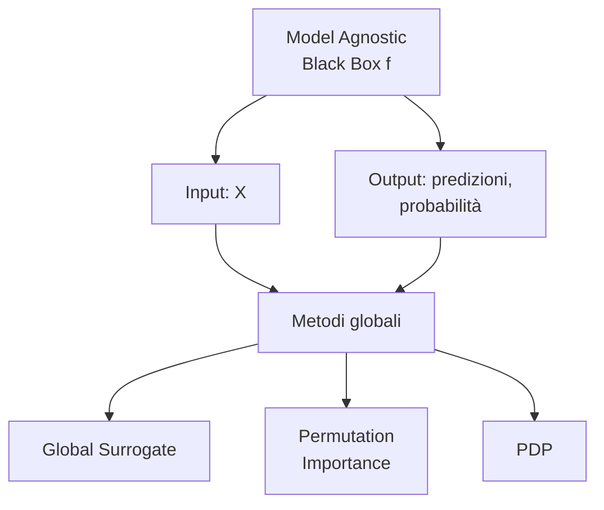
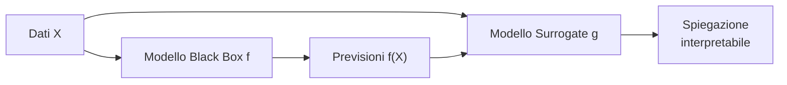
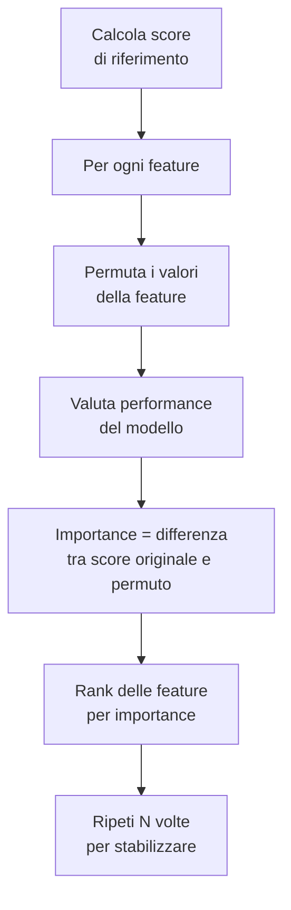
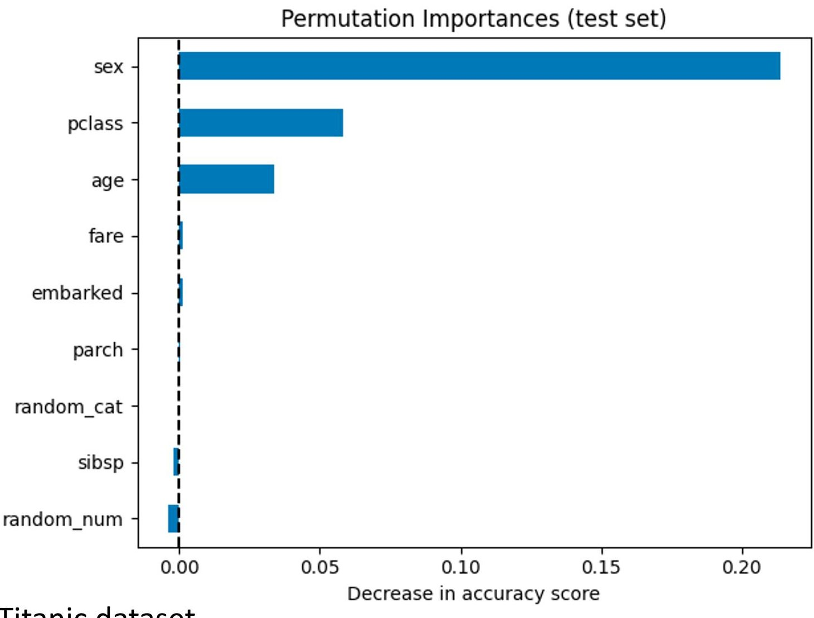
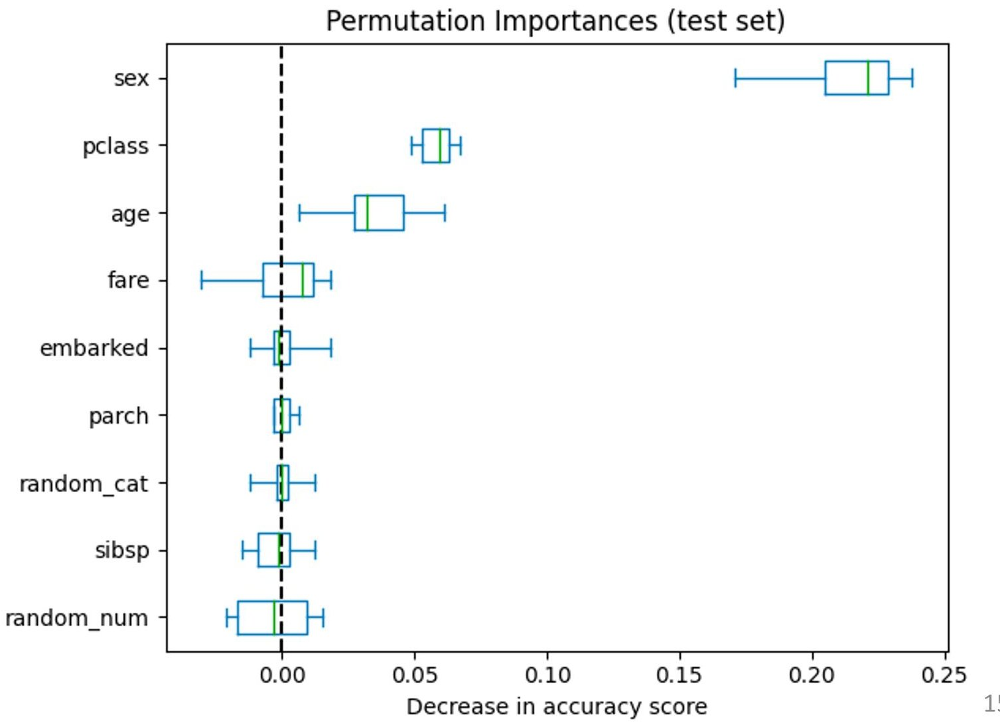
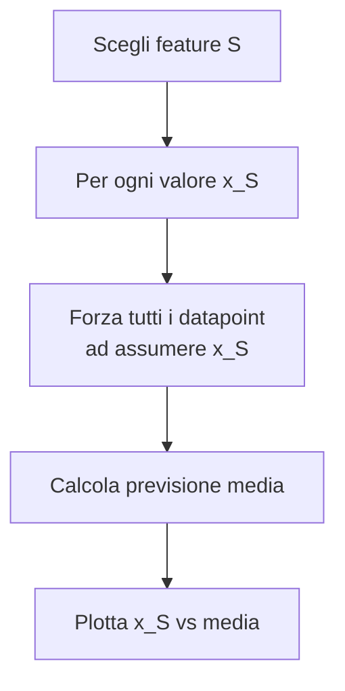

# Spiegabilità Post-Modeling Globale

> **Course:** Explainable and Trustworthy AI
> **Lecture:** 4
> **Date:** 2026-04-03
> **Source:** XAI_04_posthoc_global.pdf

## Overview

Questa lezione introduce la spiegabilità **post-modeling** con focus su metodi **globali** e **model agnostic**. Vengono presentati tre approcci principali: global surrogate models, permutation feature importance e partial dependence plots (PDP). Il thread comune è trattare il modello come un oracolo opaco e approssimarne il comportamento globale con strumenti interpretabili.

## Content

### Soluzioni Model Agnostic

I metodi model agnostic sono applicabili a qualsiasi modello, trattandolo come un oracolo che fornisce previsioni e probabilità di output.

**Vantaggi delle soluzioni model agnostic:**

| Vantaggio | Descrizione |
|---|---|
| **Flessibilità del modello** | Spiegare modelli complessi e ad alta performance |
| **Flessibilità della spiegazione** | Adottare il formato più adatto per gli utenti |
| **Flessibilità della rappresentazione** | La rappresentazione per le spiegazioni può differire da quella del modello |
| **Costo inferiore di cambio** | Cambiare il modello preservando la spiegazione |
| **Confronto tra modelli** | Più facile se la rappresentazione è la stessa |

### Global Surrogate Models

Un **global surrogate model** è un modello interpretabile che approssima un modello complesso (black box). Viene addestrato sulle previsioni del modello originale:

**Obiettivo:** approssimare la funzione di previsione $f$ con un modello surrogate $g$ interpretabile, sotto il vincolo che $g$ sia interpretabile (es. albero decisionale, regressione lineare, regole).

**Procedure:**
1. Dati di training $X$ (stessi usati per $f$ o nuovi con stessa distribuzione)
2. Labeling: ottenere le previsioni di $f$ per $X$
3. Scegliere un modello interpretabile $g$
4. Addestrare $g$ su $(X, f(X))$
5. Valutazione: misurare quanto bene $g$ replica $f$ (MSE, accuracy, AUC-ROC)
6. Interpretazione: interpretare $g$ per ottenere insight sul comportamento di $f$

#### TREPAN

**TREPAN** (Craven & Shavlik, 1995) è una variante che usa alberi considerando la fedeltà al modello originale nel processo di costruzione. Usa espansione *best-first* che prioritizza i nodi con maggiore potenziale di aumentare la fedeltà:

$$\text{score}(n) = \text{reach}(n) \times (1 - \text{fidelity}(n))$$

dove $\text{reach}(n)$ è la frazione stimata di istanze che raggiungono il nodo $n$ e $\text{fidelity}(n)$ è la fedeltà stimata dell'albero al modello per quelle istanze.

**Vantaggi:** rappresentazione semplificata, diverse forme di spiegazione, abilita sia spiegabilità globale che locale, facile da costruire, flessibilità nella scelta di $g$.

**Limitazioni:** è un'approssimazione, rischio di oversimplification, non cattura le sfumature locali, dipende dalla qualità dei dati di training, il surrogate può ancora essere difficile da interpretare.

### Permutation Feature Importance

La **permutation feature importance** stima l'importanza delle feature valutando l'impatto del permutare (shuffling) i valori delle feature sulle performance del modello.

**L'idea:** più il calo di performance è alto quando una feature viene permutata, più quella feature è importante.

**Rappresentazione visiva:** i risultati vengono mostrati tramite **bar plot** (media dell'importanza) e **box plot** (distribuzione dell'importanza su più esecuzioni), che permettono di confrontare visivamente la rilevanza delle feature.

**Vantaggi:** model agnostic, interpretazione intuitiva, insight globale compresso, implementazione semplice, nessuna assunzione di linearità, il performance ratio permette confronti tra modelli, non richiede riaddestramento.

**Limitazioni:** assunzione di indipendenza delle feature (se correlate, crea istanze irrealistiche — es. "persona di 1.8m e 20kg" — e l'importanza viene condivisa), legato alle performance del modello, richiede ground truth, dipendenza dalla casualità dello shuffling.

### Partial Dependence Plots (PDP)

Le **PDP** sono uno strumento di visualizzazione per comprendere la relazione tra previsioni del modello e feature specifiche di input. Mostrano la dipendenza tra l'outcome e un insieme di feature di interesse, marginalizzando sulle altre feature. Tipicamente si analizzano una o due feature alla volta.

Per una feature di interesse $X_S$ e le altre feature $X_C$, la partial dependence è:

$$pd_S(x_S) = \mathbb{E}_{X_C}[f(x_S, X_C)] = \int f(x_S, x_C) \, dP(x_C)$$

In pratica, viene approssimata dalla media sui dati:

$$pd_S(x_S) \approx \frac{1}{n} \sum_{i=1}^{n} f(x_S, x_C^{(i)})$$

La PDP a un valore $x_S$ è la **previsione media se forziamo tutti i datapoint ad assumere quel valore della feature**.

#### Esempio Pratico

Per calcolare $pd(Age=10)$ su un dataset Titanic: si sostituisce l'età di ogni passeggero con 10, si ottiene la previsione per ciascuno, e si calcola la media delle probabilità. Ripetendo per diversi valori di età si costruisce il grafico PDP.

**Vantaggi:** computazione intuitiva, spiegazione in forma visuale, facile da implementare.

**Limitazioni:** assunzione di indipendenza tra feature (se correlate, crea dati irrealistici), tipicamente analizza una feature alla volta, non mostra la distribuzione della feature (rischio di overinterpretare regioni con pochi dati), l'effetto marginale medio può nascondere effetti eterogenei (es. compensazione tra effetti positivi e negativi).

## Key Concepts

| Concetto | Definizione | Nota |
|---|---|---|
| **Global surrogate** | Modello interpretabile che approssima il black box | Addestrato su $f(X)$ |
| **TREPAN** | Surrogate basato su alberi con espansione best-first | Score: $\text{reach} \times (1 - \text{fidelity})$ |
| **Permutation importance** | Impatto dello shuffling di una feature sulle performance | Più calo → più importante; mostrato con bar/box plot |
| **PDP** | Relazione media tra feature e previsione | Marginalizza sulle altre feature |
| **Model agnostic** | Metodo applicabile a qualsiasi modello | Tratta il modello come oracolo |
| **Performance ratio** | Rapporto tra performance originale e permuto | Permette confronto tra modelli diversi |

## Connections

- I global surrogate models sono il counterpart globale dei local surrogate (LIME, lezione 05)
- La permutation importance è un metodo globale che condivide principi con explaining by removing (lezione 06)
- Le PDP sono complementari alle ICE plots (Individual Conditional Expectation) menzionate nella tassonomia (lezione 02)
- L'assunzione di indipendenza delle feature è un limite condiviso da PDP, permutation importance e metodi basati sulla rimozione (lezione 06)
- I global surrogate collegano ai modelli interpretabili della lezione 03b: il surrogate è un modello intrinsecamente interpretabile usato per spiegare un black box
