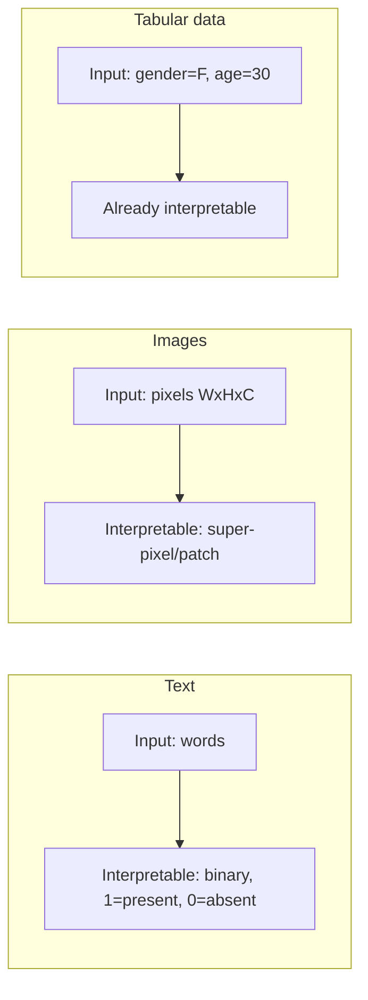

# Local Explainability via Interpretable Surrogates

> **Course:** Explainable and Trustworthy AI  
> **Lecture:** 5  
> **Date:** 2026-04-03  
> **Source:** XAI_05_local_surrogate.pdf

## Overview

This lecture covers local explainability methods based on **interpretable surrogates**, focusing on **LIME** (Local Interpretable Model-Agnostic Explanations), **LORE** (Local Rule-Based Explanations), and **LACE** (Local Associative Classifier Explanations).

## Content

### From Global to Local Explanations

While global surrogate models (lecture 04) approximate the model's global behavior, **local surrogates** approximate the model's behavior **in the locality of a single prediction**. The idea is that it is easier to approximate the model with a simple model in a small neighborhood than across the entire space.

### LIME — Local Interpretable Model-Agnostic Explanations

LIME (Ribeiro et al., KDD 2016) trains a local interpretable model in the neighborhood of the prediction to explain.

**Fundamental properties of explanations:**

- **Interpretable**: qualitative understanding, features for explaining can differ from those for training
- **Locally faithful**: correspond to how the model behaves in the neighborhood of the explained instance (local fidelity, which does not imply global fidelity)

**Formal definition:**

$$\text{explanation}(x) = \arg\min_{g \in G} L(f, g, \pi_x) + \Omega(g)$$

where:
- $x$ is the instance to explain, $f$ is the model to explain
- $G$ is the family of interpretable models
- $\pi_x$ is the proximity measure between $x$ and perturbed instances $z$ (defines locality)
- $\Omega(g)$ is the complexity of $g$ (e.g., number of non-zero weights in a linear model)
- $L(f, g, \pi_x)$ measures how unfaithful $g$ is to $f$ in the locality given by $\pi_x$

**LIME Procedure:**
1. Given instance $x$
2. Generate the neighborhood of $x$ via perturbations
3. Get predictions of $f$ for these local points
4. Weight samples according to proximity to $x$
5. Train a weighted interpretable model on the neighborhood dataset
6. Explain the prediction by interpreting the local model

### Interpretable Data Representation (a)

Explanations must use a representation interpretable to humans, which can differ from the model's representation:

### Neighborhood Generation (b)

Locality is generated via **perturbations**:

- **Text**: randomly remove words from input. Prediction obtained by concatenating present words and replacing removed ones with special token [UNK]. Proximity measured via cosine similarity.
- **Images**: use super-pixel representation, perturb by toggling patches.
- **Tabular data**: for numerical features, perturb by sampling from Normal(0,1); for categorical features, sample from training distribution.

### Interpretable Model (c)

A weighted linear model is trained on the generated samples:

$$L(f, g, \pi_x) = \sum_{z, z' \in \mathcal{Z}} \pi_x(z)(f(z) - g(z'))^2$$

- **LASSO**: L1 regularization to minimize number of non-zero coefficients
- **Ridge**: L2 regularization
- Parameter $K$: controls interpretability (e.g., text: limit number of words)

**LIME advantages:** model agnostic, local explanations, interpretable representations distinct from model's, provides feature attributions, control over number of interpretable features, supports images, text, and tabular data.

**LIME limitations:** perturbed samples may be unrealistic, does not consider correlations, sensitive to perturbation method choice, explanation instability (diverge across multiple runs), potential inconsistency (explanations for similar instances may differ).

### LORE — Local Rule-Based Explanations

LORE (Guidotti et al., 2018) uses a **decision tree classifier** as local surrogate, with neighborhood generated via **genetic algorithm**. Provides as explanation:
- **Decision path** (local rule)
- **Counterfactual rules** (conditions to change to alter the predicted class)

**Advantages:** model agnostic, local explanations, provides local rules and counterfactual explanations.
**Limitations:** genetic neighborhood more expensive, potentially unrealistic samples, focus on structured data.

### LACE — Local Associative Classifier Explanations

LACE (Pastor & Baralis, 2019) uses an **associative classifier** as local surrogate, with neighborhood based on actual training data. Provides as explanation:
- **Association rule** (local rule)
- **Feature attributions** as prediction difference for individual features and local rules

**Advantages:** model agnostic, local explanations, local rules, feature attributions.
**Limitations:** requires actual training data for neighborhood, training data neighborhood may be insufficient, focus on structured data.

## Key Concepts

| Concept | Definition | Note |
|---|---|---|
| **LIME** | Local Interpretable Model-Agnostic Explanations | Weighted local linear model |
| **Local fidelity** | Explanation faithfulness to model in neighborhood | Does not imply global fidelity |
| **Super-pixel** | Interpretable representation for images | Homogeneous pixel patches |
| **LORE** | Local Rule-Based Explanations | Surrogate: decision tree, neighborhood: genetic |
| **LACE** | Local Associative Classifier Explanations | Surrogate: associative classifier |

## Connections

- LIME is the local version of the global surrogate (lecture 04)
- LIME perturbations share principles with explaining by removing (lecture 06)
- LORE and LACE provide rule-based explanations, linking to interpretable models (lecture 03b)
- LORE's counterfactual explanations anticipate dedicated counterfactual methods
