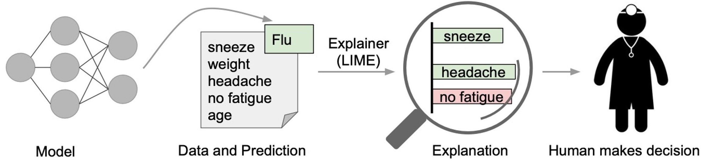
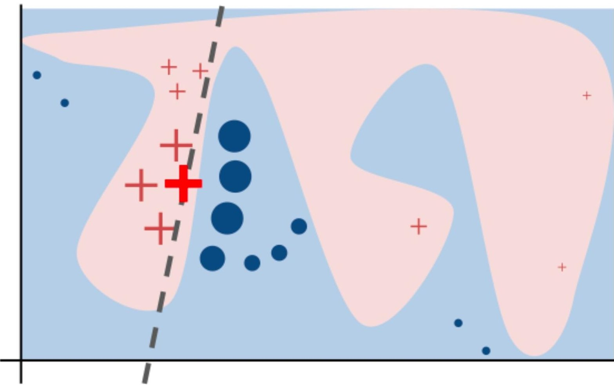
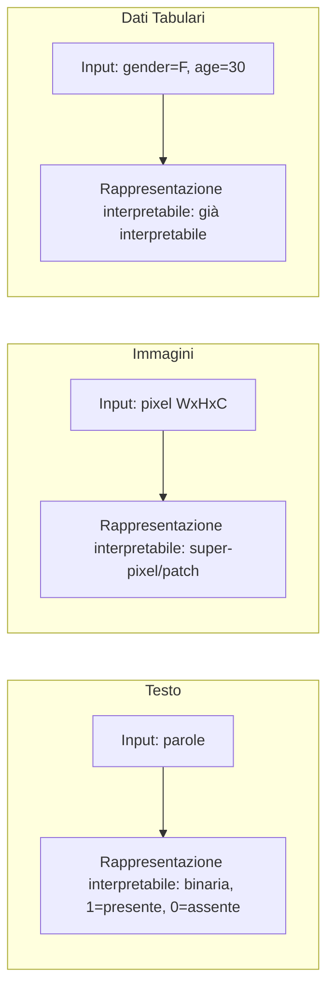

# Spiegabilità Locale tramite Surrogate Interpretabili

> **Course:** Explainable and Trustworthy AI  
> **Lecture:** 5  
> **Date:** 2026-04-03  
> **Source:** XAI_05_local_surrogate.pdf

## Overview

Questa lezione copre i metodi di spiegabilità locale basati su **surrogate interpretabili**, con focus su **LIME** (Local Interpretable Model-Agnostic Explanations), **LORE** (Local Rule-Based Explanations) e **LACE** (Local Associative Classifier Explanations).

## Content

### Dalle Spiegazioni Globali a Quelle Locali

Mentre i global surrogate models (lezione 04) approssimano il comportamento globale del modello, i **local surrogate** approssimano il comportamento del modello **nella località di una singola previsione**. L'idea è che è più facile approssimare il modello con un modello semplice in un piccolo intorno rispetto all'intero spazio.

### LIME — Local Interpretable Model-Agnostic Explanations

LIME (Ribeiro et al., KDD 2016) addestra un modello interpretabile locale nel vicinato della previsione da spiegare.

**Proprietà fondamentali delle spiegazioni:**

- **Interpretabili**: comprensione qualitativo, le feature per spiegare possono differire da quelle per l'addestramento
- **Localmente fedeli**: corrispondono a come il modello si comporta nel vicinato dell'istanza spiegata (local fidelity, che non implica global fidelity)

**Definizione formale:**

$$\text{explanation}(x) = \arg\min_{g \in G} L(f, g, \pi_x) + \Omega(g)$$

dove:
- $x$ è l'istanza da spiegare, $f$ è il modello da spiegare
- $G$ è la famiglia di modelli interpretabili
- $\pi_x$ è la misura di prossimità tra $x$ e le istanze perturbate $z$ (definisce la località)
- $\Omega(g)$ è la complessità di $g$ (es. numero di pesi non nulli in un modello lineare)
- $L(f, g, \pi_x)$ misura quanto $g$ è infedele a $f$ nella località data da $\pi_x$

**Procedure LIME:**
1. Data l'istanza $x$
2. Generare il vicinato di $x$ tramite perturbazioni
3. Ottenere le previsioni di $f$ per questi punti locali
4. Pesare i campioni secondo la prossimità a $x$
5. Addestrare un modello interpretabile pesato sul dataset di vicinato
6. Spiegare la previsione interpretando il modello locale

### Rappresentazione Interpretabile dei Dati (a)

La spiegazione locale approssima il comportamento del modello in un intorno ristretto dello spazio delle feature, come illustrato dalla classificazione binaria con decision boundary:

Le spiegazioni devono usare una rappresentazione interpretabile per gli umani, che può differire da quella usata dal modello:

### Generazione del Vicinato (b)

La località viene generata tramite **perturbazioni**:

- **Testo**: si rimuovono casualmente parole dall'input. La previsione viene ottenuta concatenando le parole presenti e sostituendo quelle rimosse con un token speciale [UNK]. La prossimità viene misurata tramite cosine similarity.
- **Immagini**: si usa la rappresentazione tramite super-pixel, e si perturbano accendendo/spegnendo patch.
- **Dati tabulari**: per feature numeriche, si perturba campionando da una Normal(0,1); per feature categoriche, si campiona dalla distribuzione di training.

### Modello Interpretabile (c)

Si addestra un modello lineare pesato sui campioni generati:

$$L(f, g, \pi_x) = \sum_{z, z' \in \mathcal{Z}} \pi_x(z)(f(z) - g(z'))^2$$

- **LASSO**: regolarizzazione L1 per minimizzare il numero di coefficienti non nulli
- **Ridge**: regolarizzazione L2
- Parametro $K$: controlla l'interpretabilità (es. testo: limitare il numero di parole)

**Vantaggi di LIME:** model agnostic, spiegazioni locali, rappresentazioni interpretabili distinte da quelle del modello, fornisce feature attributions, controllo sul numero di feature interpretabili, supporta immagini, testo e dati tabulari.

**Limitazioni di LIME:** i campioni perturbati possono essere irrealistici, non considera correlazioni, sensibile alla scelta del metodo di perturbazione, instabilità delle spiegazioni (divergono tra esecuzioni multiple), potenziale inconsistenza (spiegazioni per istanze simili possono differire).

### LORE — Local Rule-Based Explanations

LORE (Guidotti et al., 2018) usa un **decision tree classifier** come surrogate locale, con vicinato generato tramite **algoritmo genetico**. Fornisce come spiegazione:
- **Decision path** (regola locale)
- **Regole controfattuali** (condizioni da cambiare per alterare la classe predetta)

**Vantaggi:** model agnostic, spiegazioni locali, fornisce regole locali e spiegazioni controfattuali.
**Limitazioni:** vicinato genetico più costoso, campioni potenzialmente irrealistici, focus su dati strutturati.

### LACE — Local Associative Classifier Explanations

LACE (Pastor & Baralis, 2019) usa un **classificatore associativo** come surrogate locale, con vicinato basato sui dati di training reali. Fornisce come spiegazione:
- **Regola di associazione** (regola locale)
- **Feature attributions** come differenza di previsione per feature individuali e regole locali

**Vantaggi:** model agnostic, spiegazioni locali, regole locali, feature attributions.
**Limitazioni:** richiede i dati di training reali per derivare il vicinato, vicinato dai dati di training potrebbe essere insufficiente, focus su dati strutturati.

## Key Concepts

| Concetto | Definizione | Nota |
|---|---|---|
| **LIME** | Local Interpretable Model-Agnostic Explanations | Modello lineare pesato locale |
| **Local fidelity** | Fedeltà della spiegazione al modello nel vicinato | Non implica fedeltà globale |
| **Super-pixel** | Rappresentazione interpretabile per immagini | Patch di pixel omogenei |
| **LORE** | Local Rule-Based Explanations | Surrogate: decision tree, vicinato: genetico |
| **LACE** | Local Associative Classifier Explanations | Surrogate: classificatore associativo |

## Connections

- LIME è la versione locale del global surrogate (lezione 04)
- Le perturbazioni di LIME condividono principi con explaining by removing (lezione 06)
- LORE e LACE forniscono spiegazioni come regole, collegandosi ai modelli interpretabili (lezione 03b)
- Le spiegazioni controfattuali di LORE anticipano i metodi controfattuali dedicati
