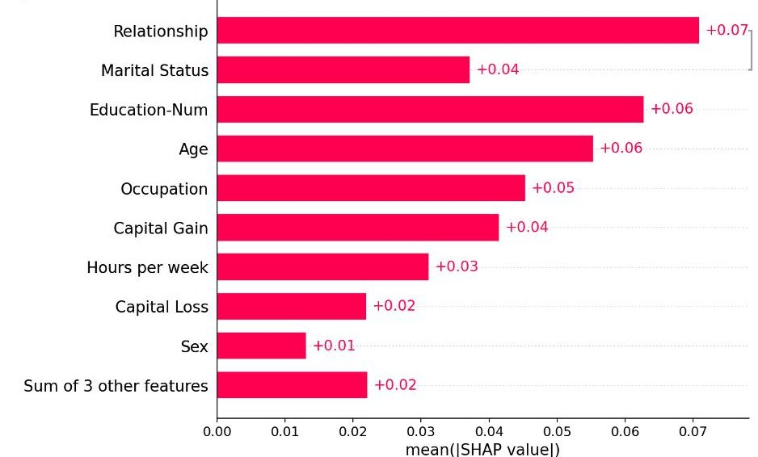
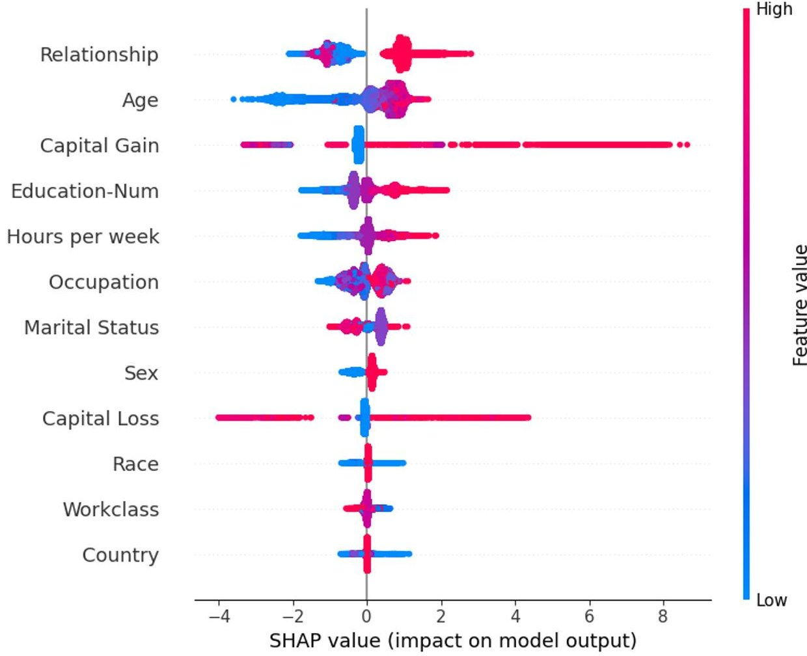
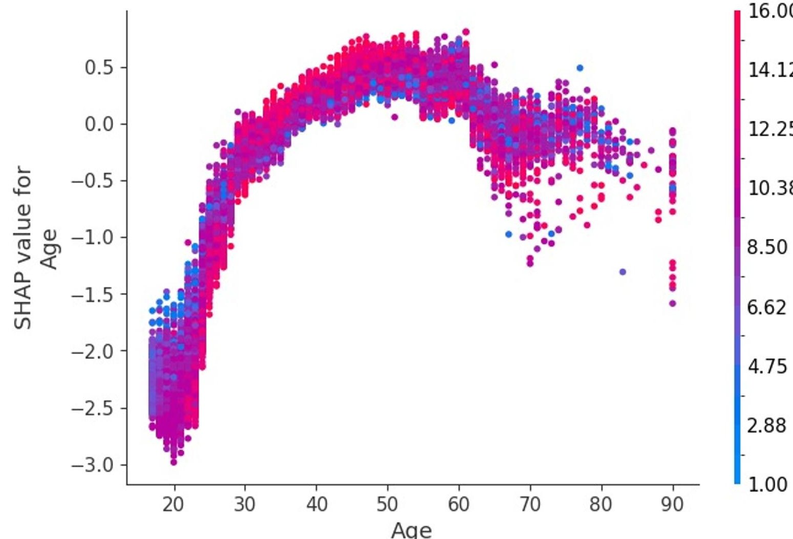

# Spiegazione tramite Rimozione (Occlusion/Perturbation)

> **Course:** Explainable and Trustworthy AI  
> **Lecture:** 6  
> **Date:** 2026-04-03  
> **Source:** XAI_06_local_explaining_by_removing.pdf

## Overview

Questa lezione copre i metodi di spiegabilità basati sulla **rimozione di feature** (occlusion/perturbation), partendo dall'approccio base PredDiff, passando per i **Shapley Values** dalla teoria dei giochi, fino ad arrivare a **SHAP** (SHapley Additive exPlanations). Viene presentata anche una cornice unificata per tutti i metodi basati sulla rimozione.

## Content

### Il Principio di Base

L'idea è **rimuovere una o più feature di input** (o simulare la rimozione) per quantificare l'influenza della feature sulla previsione:

$$f(y=c|x) \neq f(y=c|x \setminus \{gender=female, nation=Italy\})$$

### PredDiff — Prediction Difference

PredDiff (Robnik-Šikonja & Kononenko, 2008) è l'approccio base. L'importanza dell'attributo $A_i$ è:

$$predDiff_{f_i}(x) = f(x) - f(x \setminus A_i)$$

**Due modi per valutare la differenza:**

- **Differenza in probabilità:** $predDiff_{f_i}(x) = P(y=c|x) - P(y=c|x \setminus A_i)$
- **Differenza informativa:** $infoDiff_{f_i}(x) = \log_2 P(y=c|x) - \log_2 P(y=c|x \setminus A_i)$

**Come simulare la rimozione?** Si usa un "valore medio":

$$P(y|x \setminus A_i) = \sum_{j=1}^{m_i} P(A_i = a_j) \cdot P(y|x \leftarrow A_i = a_j)$$

Per feature categoriche: si sostituisce il valore con tutti i possibili valori, pesando per la probabilità a priori. Per feature numeriche: si discretizza e si usa il punto medio dei sotto-intervalli come valore rappresentativo.

**Interpretazione:** importanza più alta → la feature impatta maggiormente la previsione. Contributo positivo → spinge verso la classe predetta. Contributo negativo → spinge contro.

**Vantaggi:** model agnostic, spiegazioni locali, feature attributions, interpretazione diretta. **Limitazioni:** definito solo per dati strutturati, perturbazioni irrealistiche, richiede accesso ai dati, non considera interazioni tra feature.

### Considerare le Interazioni: Shapley Values

Per considerare il contributo di multiple feature contemporaneamente (rimuovere $A_i$ e rimuovere $A_i$ e $A_j$), serve un modo per aggregare gli score di importanza in un'unica attribuzione. La risposta: **valori di Shapley**.

### Valori di Shapley

I valori di Shapley provengono dalla **teoria dei giochi**. L'idea è assegnare un punteggio di rilevanza a ogni giocatore di una squadra che collabora, analogamente alle feature di un modello:

$$\phi_i(v) = \sum_{S \subseteq N \setminus \{i\}} \frac{|N| - |S|! \cdot (|S| - 1)!}{|N|!} (v(S \cup \{i\}) - v(S))$$

dove $N$ è l'insieme dei giocatori (feature), $S$ è una coalizione di giocatori, e $v(S)$ è il payoff totale della coalizione $S$.

**Proprietà dei valori di Shapley:**

| Proprietà | Descrizione |
|---|---|
| **Efficiency** | La somma di tutti i valori di Shapley è uguale al valore dell'intera squadra: $\sum_{i \in N} \phi_i(v) = v(N)$ |
| **Simmetry** | Giocatori con lo stesso contributo marginale hanno lo stesso $\phi$ |
| **Linearity** | $\phi_i(v + w) = \phi_i(v) + \phi_i(w)$ |
| **Null player** | Giocatore con contributo marginale nullo ha $\phi_i = 0$ |

![Decomposizione dei valori di Shapley: da E[f(z)] a f(x), con contributi phi_0...phi_4 per le singole feature](images/img-020.png)

I valori di Shapley sono **l'unico** metodo di assegnazione che soddisfa tutte e quattro le proprietà.

### Applicare i Valori di Shapley alla XAI

**Analogia:**

| Teoria dei giochi | XAI |
|---|---|
| Giocatori | Valori delle feature |
| Punteggio totale $v(N)$ | Differenza di probabilità rispetto alla previsione media |
| Coalizione $S$ | Feature presenti, le altre sono "rimosse" |
| $v(S)$ | Probabilità di previsione marginalizzando sulle feature non in $S$ |
| $\phi_i$ | Feature attribution |

La funzione $v$ per la XAI è definita come:

$$v(S) = f_S - \mathbb{E}[f(X)]$$

dove $f_S$ è la previsione del modello marginalizzando sulle feature non in $S$.

**Problema computazionale:** il calcolo esatto richiede $2^{|N|}$ coalizioni — esponenziale nel numero di feature. **Soluzione:** approssimazione con **sampling Monte Carlo**.

### Approssimazione Monte Carlo dei Valori di Shapley

1. Per $m = 1, \ldots, M$ iterazioni:
   - Campionare un'istanza casuale $z$ dal dataset
   - Selezionare casualmente una permutazione dei valori delle feature
   - Calcolare $x_{+j}$ (valori di $x$ prima di $j$-esima nella permutazione + $j$) e $x_{-j}$ (valori di $z$ dopo la $j$-esima)
   - Calcolare il contributo marginale: $\phi_i^m = f(x_{+j}) - f(x_{-j})$
2. Calcolare i valori di Shapley come media: $\phi_i = \frac{1}{M} \sum_{m=1}^{M} \phi_i^m$

### SHAP — SHapley Additive exPlanations

SHAP (Lundberg & Lee, NeurIPS 2017) unifica diversi metodi di spiegazione sotto il framework dei valori di Shapley, proponendo:

- **KernelSHAP**: stima kernel-based, model agnostic
- **TreeSHAP**: stima efficiente per modelli basati su alberi (non model agnostic)
- Aggregazione delle spiegazioni locali per insight globali

**SHAP come modello surrogate lineare:**

$$g(x') = \phi_0 + \sum_{i=1}^{M} \phi_i x'_i$$

dove $x'_i \in \{0, 1\}$ modella la presenza/assenza di feature interpretabili, e $\phi_i$ sono i valori di Shapley.

**Proprietà delle feature attribution additive:**

| Proprietà | Descrizione |
|---|---|
| **Local accuracy** | $f(x) = g(x') = \phi_0 + \sum \phi_i x'_i$ quando $x = h_x(x')$ |
| **Missingness** | Feature mancanti ($x'_i = 0$) hanno attribuzione 0 |
| **Consistency** | Se il contributo marginale di una feature aumenta, la sua attribuzione non diminuisce |

I valori di Shapley sono **l'unico** modello di spiegazione $g$ che soddisfa la definizione di additive feature attribution methods e queste tre proprietà.

**KernelSHAP** stima i valori di SHAP addestrando un modello lineare pesato con un kernel specifico (Shapley kernel) su coalizioni campionate:

$$\pi_{x'}(z') = \frac{M-1}{M \binom{M}{|z'|} |z'|(M - |z'|)}$$

**Insight globali con SHAP:**

- **Feature importance**: media dei valori assoluti di Shapley per feature su tutto il dataset: $I_j = \frac{1}{n} \sum_{i=1}^{n} |\phi_j^{(i)}|$

- **Summary plot**: density scatter plot con valori di Shapley per feature e istanza

- **Dependence plot**: valore della feature vs valore di Shapley, colorato per un'altra feature per evidenziare interazioni

### Cornice Unificata per i Metodi basati sulla Rimozione

Covert, Lundberg & Lee (2021) propongono una cornice unificata che caratterizza questi metodi secondo tre dimensioni:

1. **Feature removal**: come il metodo rimuove le feature (zeroing, default values, blurring, marginalizzazione)
2. **Model behavior**: cosa viene spiegato (probabilità di classe, loss di previsione, loss su dataset)
3. **Summary technique**: come si riassume l'influenza di ogni feature (rimozione individuale, modello additivo, valori di Shapley)

## Key Concepts

| Concetto | Definizione | Nota |
|---|---|---|
| **PredDiff** | Differenza di previsione con/senza feature | Approccio base, explaining by removing |
| **Valore di Shapley** | Contributo marginale medio ponderato | Teoria dei giochi, unico soddisfa 4 assiomi |
| **Efficiency** | Somma delle attribuzioni = differenza dalla media | Proprietà dei valori di Shapley |
| **SHAP** | SHapley Additive exPlanations | Framework unificato, KernelSHAP + TreeSHAP |
| **KernelSHAP** | Stima SHAP via kernel lineare pesato | Model agnostic |
| **TreeSHAP** | Stima SHAP efficiente per alberi | Non model agnostic |
| **Shapley kernel** | Kernel per pesare le coalizioni in KernelSHAP | Usato nella loss di LIME modificata |

## Connections

- PredDiff è il caso base che motiva i metodi più sofisticati
- I valori di Shapley collegano teoria dei giochi e XAI
- SHAP unifica LIME (lezione 05) e metodi basati sulla rimozione in un framework comune
- La proprietà di efficiency di SHAP collega alle partial dependence plots (lezione 04)
- L'assunzione di indipendenza delle feature è condivisa con PDP e permutation importance (lezione 04)
