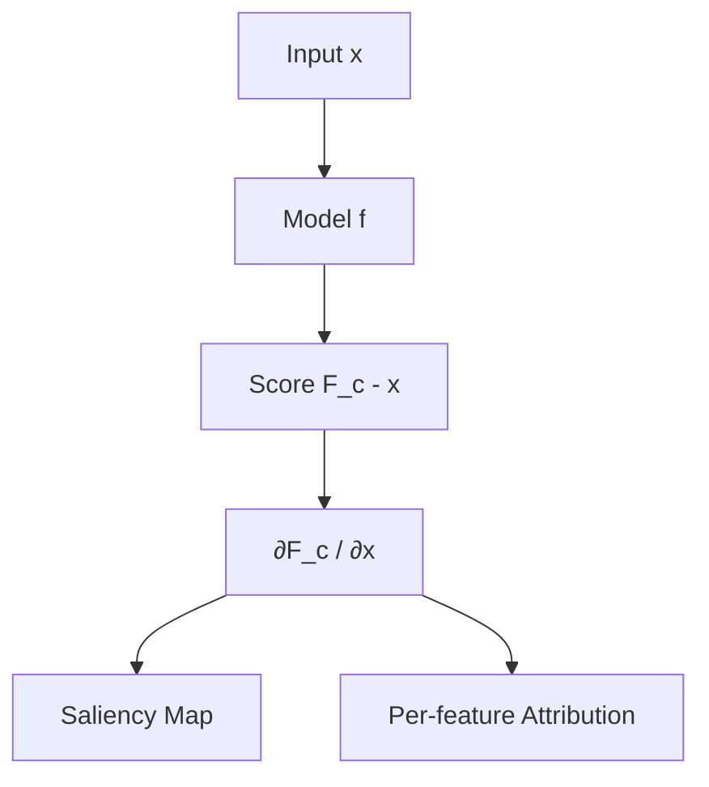
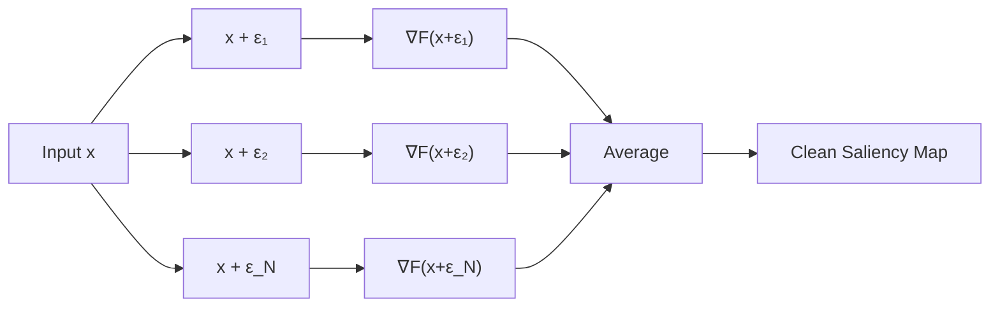
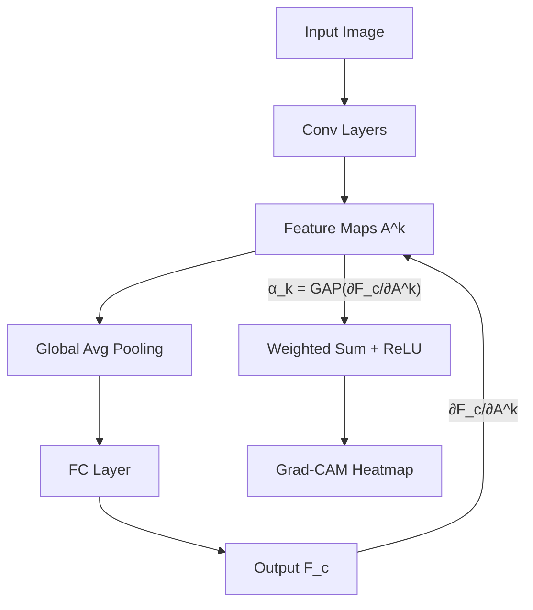
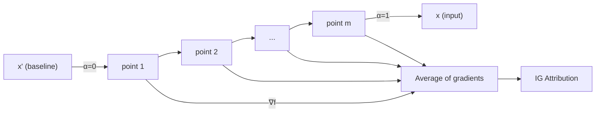

# Gradient-based Explainability Methods

> **Course:** Explainable and Trustworthy AI
> **Lecture:** 7
> **Date:** 2026-04-18
> **Source:** XAI_07_local_gradient_based.pdf

## Overview

This lecture presents **gradient-based explainability methods**, a family of local techniques that leverage gradient information of the model with respect to input features to identify which features are most influential in the decision-making process. The following methods are covered in detail: **Vanilla Gradient**, **SmoothGrad**, **Gradient × Input**, **Grad-CAM** (with Guided Grad-CAM), and **Integrated Gradients**, along with analysis of their formal properties (sensitivity axiom), advantages, and limitations.

## Content

### Gradient-based Methods — Introduction

Gradient-based explainability methods exploit gradient information of the model with respect to input features to determine the importance of each feature in the model's decision. The main characteristics of this family of methods are:

- The attribution has the **same size as the input** (e.g., for images, an importance value for each pixel)
- They assign each part of the input a value interpreted as **relevance**
- They differ in how the gradient is computed
- They are generally **computationally efficient** compared to other explainability approaches

### Vanilla Gradient — Saliency Maps

#### From Training to Explainability

During training, gradients are computed **with respect to model parameters** ($\partial L / \partial w$) to update them via backpropagation. In gradient-based explainability, gradients are computed **with respect to input features** ($\partial F_c / \partial x$), analyzing how variations in input features directly influence the output.

#### Formulation

Given a network trained for $C$ classes, the output for input $I$ is a prediction vector $F(I) = [F_1(I), \ldots, F_C(I)]$, where $F_c(I)$ is the score for class $c$. The goal is to compute a relevance score $R = [R_1, \ldots, R_p]$ for each of the $p$ features with respect to score $F_c$:

$$\nabla_x F_c(x) = \left[\frac{\partial F_c}{\partial x_1}, \ldots, \frac{\partial F_c}{\partial x_p}\right]$$

The interpretation is based on the first-order Taylor expansion: $F(I) \approx w \cdot I + b$, where the weight vector $w = R$ is the derivative of the score. The weights $R$ define the importance of each feature of $I$ for class $c$.

For images, the scores $w$ must be aggregated to obtain a saliency map $M \in \mathbb{R}^{H \times W}$:

$$M_{i,j} = \max_k |w_{i,j,k}|$$

i.e., the channel dimensions are collapsed by taking the maximum absolute value.

#### Limitation: Noise

The Vanilla Gradient produces **noisy** saliency maps. The derivative can fluctuate significantly at small scales: slight variations in the input can cause important changes in the model output, generating unstable and hard-to-interpret gradients.

### SmoothGrad

SmoothGrad addresses the noise problem in Vanilla Gradient by **averaging gradients over noise-perturbed inputs**:

$$M_{SmoothGrad} = \frac{1}{N} \sum_{k=1}^{N} \nabla_x F_c(x + \epsilon_k)$$

where $\epsilon_k$ is Gaussian noise. The intuition is that by averaging gradients over multiple modifications of the input, fluctuations are smoothed out and noise is averaged away.

**Parameters:** noise level $\sigma$ and number of samples $N$.

SmoothGrad can be combined with any gradient-based method as a post-processing technique to improve the visual quality of attribution maps.

### Gradient × Input

A variant of Vanilla Gradient where the gradient with respect to the input is **element-wise multiplied** with the input itself:

$$R = \nabla_x F_c(x) \odot x$$

This operation generally provides better results than plain Vanilla Gradient, as it accounts for both the model's sensitivity (gradient) and the actual feature value (input). It can be combined with SmoothGrad for further improvement.

### Grad-CAM

**Gradient-weighted Class Activation Mapping** is a method specifically designed for **CNN-based architectures** that exploits gradient information in the last convolutional layer.

#### Intuition

Deeper representations in a CNN capture higher-level visual constructs. Convolutional layers naturally retain spatial information (which is lost in fully-connected layers), so the last convolutional layers represent the best compromise between high-level semantics and detailed spatial information.

#### Formulation

Let $A^k \in \mathbb{R}^{U \times V}$ be the feature map activations of a convolutional layer (typically the last). Grad-CAM produces a coarse localization map $L_{Grad-CAM}^c \in \mathbb{R}^{U \times V}$:

$$L_{Grad-CAM}^c = ReLU\left(\sum_k \alpha_k^c A^k\right)$$

where the weights $\alpha_k^c$ capture the importance of feature map $A^k$ for class $c$:

$$\alpha_k^c = \frac{1}{Z} \sum_{i} \sum_{j} \frac{\partial F_c}{\partial A_{i,j}^k}$$

**ReLU** is applied because we are only interested in features with a positive influence on the class (pixels whose intensity should be increased to increase the score of class $c$).

#### Process

1. Compute the gradient of score $F_c$ with respect to activations $A^k$ of the last convolutional layer via backpropagation
2. Compute the global average for each channel (Global Average Pooling) to obtain $\alpha_k^c$
3. Multiply the average weights by the layer activations and apply ReLU
4. Upsample the map $L_{Grad-CAM}^c$ to the input size and visualize as a heatmap

#### Guided Grad-CAM

Grad-CAM produces coarse importance maps (resolution of the last convolutional layer). For per-pixel importance, Grad-CAM is combined with another attribution method (e.g., Vanilla Gradient):

$$\text{Guided Grad-CAM} = \text{upsample}(L_{Grad-CAM}^c) \odot R$$

where $R$ is the pixel-level attribution map from the secondary method.

### Integrated Gradients

Proposed by Sundararajan et al. (2017), it solves the **sensitivity** problem that affects Gradient × Input and other gradient-based methods.

#### Axioms

The method is defined starting from two fundamental axioms:

- **Sensitivity**: if two inputs $x$ and $x'$ differ in only one feature but produce different predictions, then that feature must receive a non-zero attribution
- **Implementation invariance**: if two models $f$ and $f'$ have identical input/output behavior, the attributions must be identical

Gradient × Input **fails** the sensitivity test: for $f(x) = 1 - \text{ReLU}(1-x)$, both $f(0) = 0$ and $f(2) = 1$ produce zero attribution.

#### Formulation

Integrated Gradients compares the input with a **baseline** (e.g., zero vector), interpolates between the baseline and the input, and computes the average of gradients along this path:

$$\text{IntegratedGradients}_i(x) = (x_i - x'_i) \times \int_{\alpha=0}^{1} \frac{\partial f(x' + \alpha \times (x - x'))}{\partial x_i} \, d\alpha$$

In practice, the integral is numerically approximated with $m$ steps:

$$\text{IntegratedGradients}_i(x) \approx (x_i - x'_i) \times \frac{1}{m} \sum_{k=1}^{m} \frac{\partial f\left(x' + \frac{k}{m} \times (x - x')\right)}{\partial x_i}$$

The intuition is that the attribution represents the **total contribution** of input features as we move from the baseline (nothing) to the actual input.

Integrated Gradients **satisfies** the sensitivity axiom, unlike Gradient × Input. It can be combined with SmoothGrad for additional robustness, but it is computationally more expensive than other gradient-based methods.

### Advantages and Limitations of Gradient-based Methods

| Aspect | Detail |
|---|---|
| **Efficiency** | Many methods are computationally efficient (e.g., Vanilla Gradient, Grad-CAM) |
| **Visualization** | Effective saliency maps for visual inspection |
| **Sensitivity axiom not satisfied** | Vanilla Gradient and Gradient × Input fail the sensitivity axiom |
| **Insensitivity to model and data** | Some methods may behave as edge detectors rather than explainers |
| **Sensitivity to perturbations** | Small changes in input can produce unstable explanations |
| **Vanishing gradient** | In certain regions the gradient can saturate, producing zero attributions |
| **Different methods, different explanations** | It is unclear which method to "trust" — need for evaluation approaches |

## Key Concepts

| Concept | Definition | Note |
|---|---|---|
| **Vanilla Gradient** | Gradient of class score with respect to input, used as saliency map | Produces noisy maps; first gradient-based method |
| **SmoothGrad** | Average of gradients over N noise-perturbed inputs | Post-processing technique applicable to any gradient-based method |
| **Gradient × Input** | Element-wise product between gradient and input | Better than Vanilla Gradient but fails the sensitivity axiom |
| **Grad-CAM** | Uses gradients in the last convolutional layer to produce importance heatmaps | CNN-specific; coarse resolution, combinable with Guided Backprop |
| **Guided Grad-CAM** | Element-wise combination of Grad-CAM with a pixel-level attribution method | Solves Grad-CAM's coarse resolution problem |
| **Integrated Gradients** | Average of gradients along an interpolation path from baseline to input | Satisfies sensitivity and implementation invariance axioms; more computationally expensive |
| **Sensitivity axiom** | Features with different predictions must receive different attributions | Failed by Gradient × Input but satisfied by Integrated Gradients |
| **Taylor expansion** | Linear approximation of the score function: $F(I) \approx w \cdot I + b$ | Justifies using the gradient as an importance measure |

## Connections

- Gradient-based methods complement the local explainability techniques covered in previous lectures (LIME in lecture 05, explanation by removal in lecture 06), offering differently grounded approaches.
- **Grad-CAM** is widely used in computer vision applications and is often compared with surrogate-based methods (LIME).
- **Integrated Gradients** is one of the most commonly used methods in practice thanks to its axiomatic properties; it is also relevant for the Large Language Models course in text model explainability.
- The **need for explanation evaluation approaches** will be covered in subsequent lectures on explainability evaluation.
