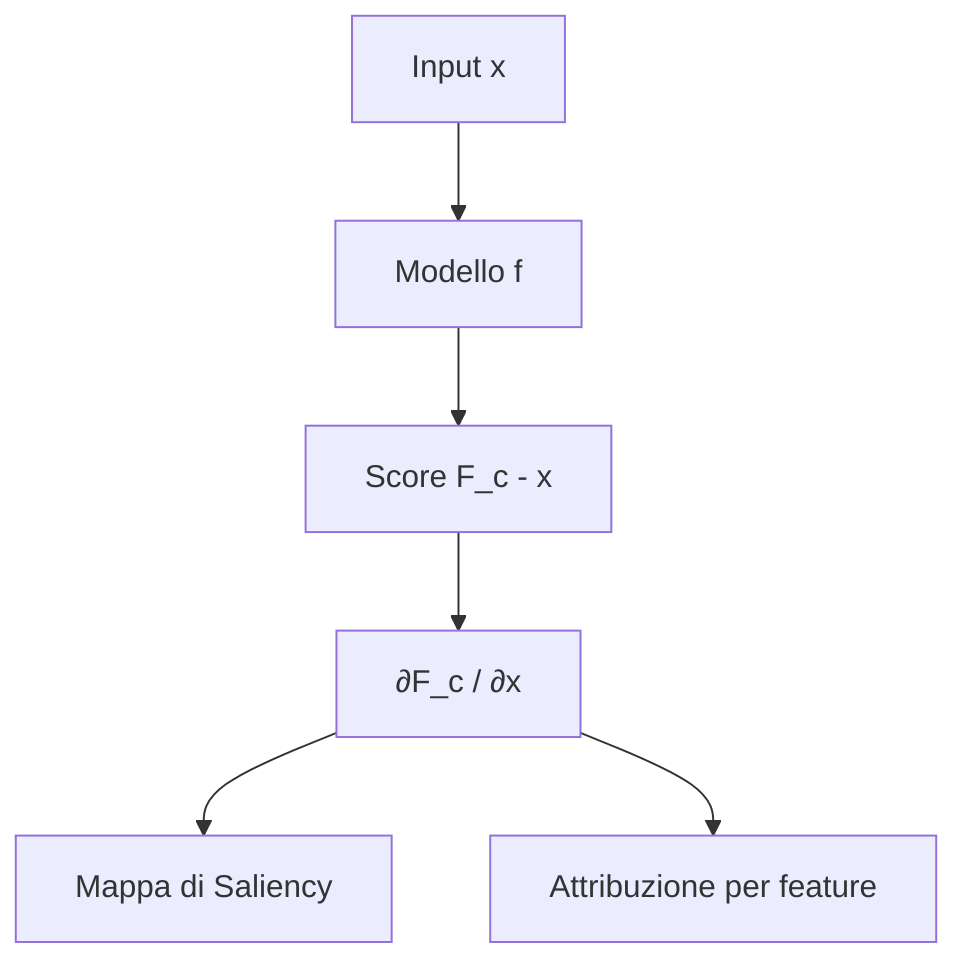
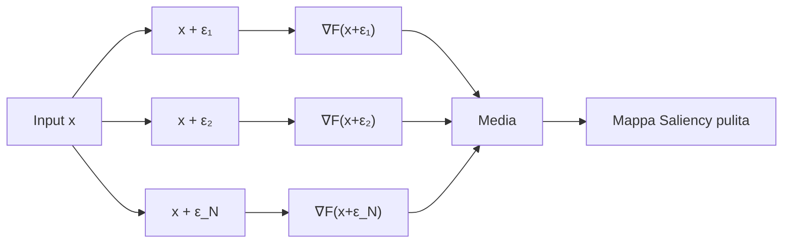
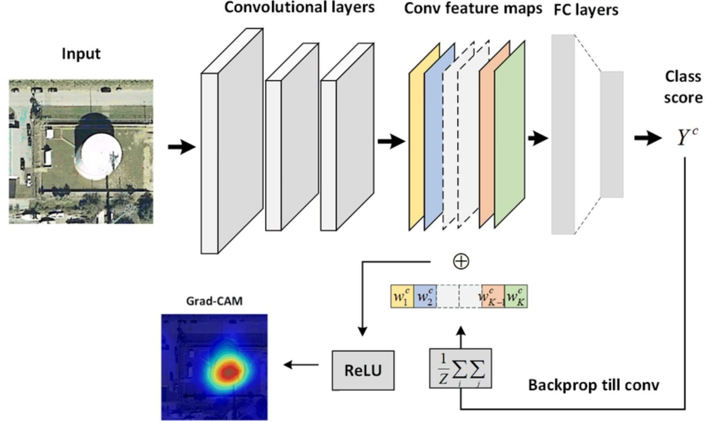
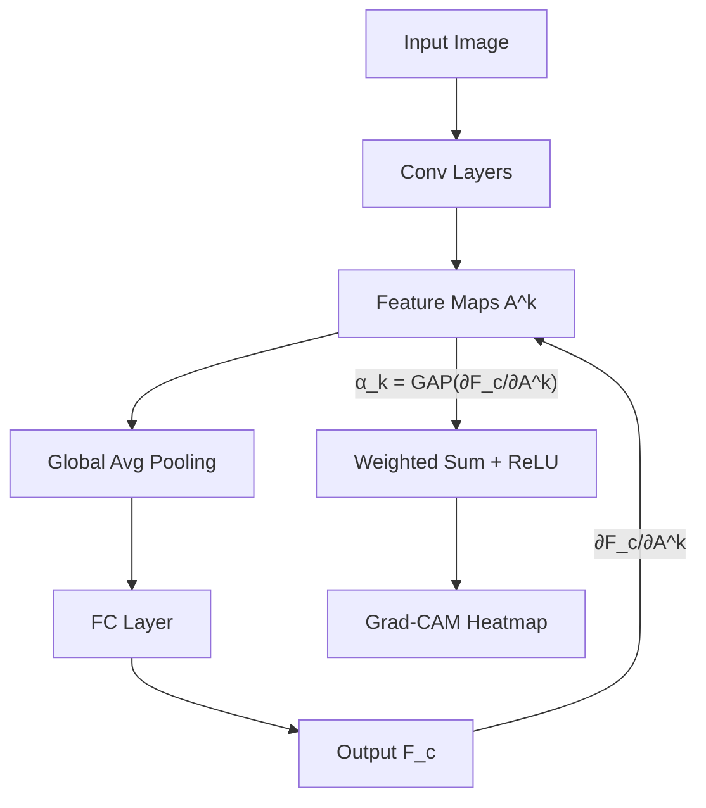
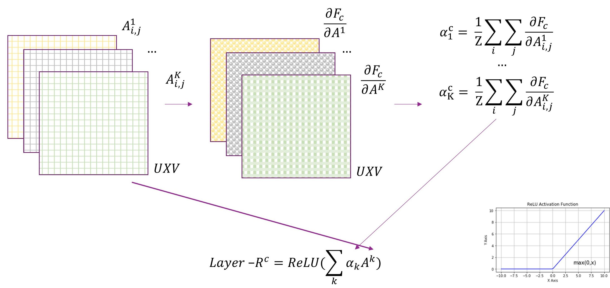
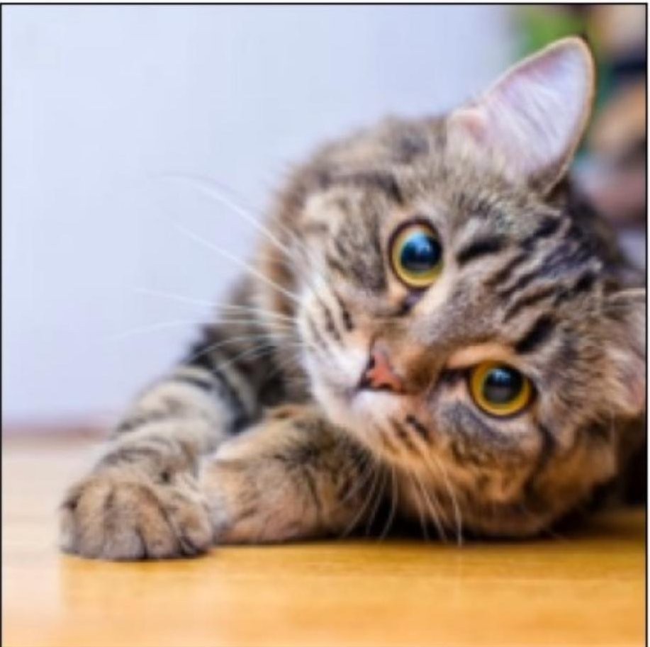
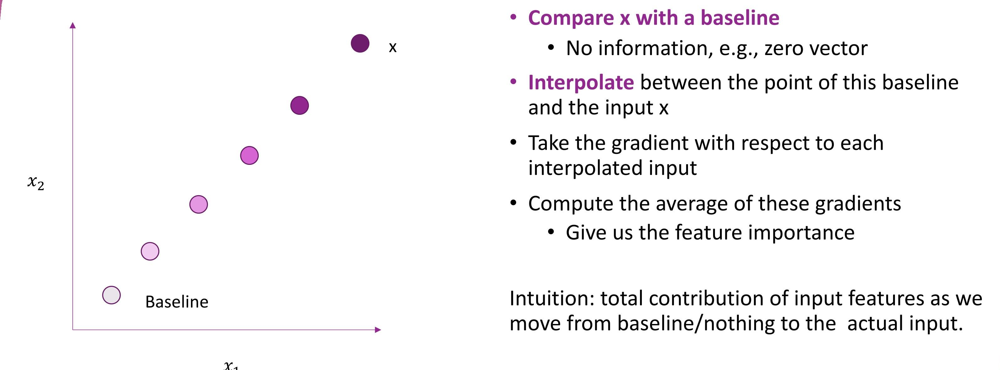
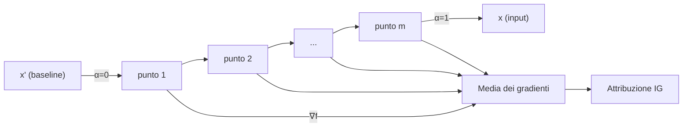

# Spiegabilità basata su Gradienti

> **Course:** Explainable and Trustworthy AI
> **Lecture:** 7
> **Date:** 2026-04-18
> **Source:** XAI_07_local_gradient_based.pdf

## Overview

Questa lezione presenta i metodi di spiegabilità **basati su gradienti**, una famiglia di tecniche locali che sfruttano l'informazione del gradiente del modello rispetto alle feature di input per identificare quali feature sono più influenti nel processo decisionale. Vengono trattati nel dettaglio il **Vanilla Gradient**, **SmoothGrad**, **Gradient × Input**, **Grad-CAM** (con Guided Grad-CAM) e **Integrated Gradients**, con analisi delle loro proprietà formali (assioma di sensibilità), vantaggi e limitazioni.

## Content

### Metodi basati su Gradienti — Introduzione

I metodi di spiegabilità basata su gradienti sfruttano le informazioni di gradiente del modello rispetto alle feature di input per determinare l'importanza di ciascuna feature nella decisione del modello. Le caratteristiche principali di questa famiglia di metodi sono:

- L'attribuzione ha la **stessa dimensione dell'input** (es. per immagini, un valore di importanza per ogni pixel)
- Assegnano a ciascuna parte dell'input un valore interpretato come **rilevanza**
- Differiscono tra loro nella modalità di calcolo del gradiente
- Sono generalmente **computazionalmente efficienti** rispetto ad altri approcci di spiegabilità

### Vanilla Gradient — Saliency Maps

#### Dall'addestramento alla spiegabilità

Durante l'addestramento, i gradienti vengono calcolati **rispetto ai parametri** del modello ($\partial L / \partial w$) per aggiornarli tramite backpropagation. Nella spiegabilità basata su gradienti, invece, si calcolano i gradienti **rispetto alle feature di input** ($\partial F_c / \partial x$), analizzando come le variazioni nelle feature di input influenzano direttamente l'output.

#### Formulazione

Data una rete addestrata per $C$ classi, l'output per l'input $I$ è un vettore di predizione $F(I) = [F_1(I), \ldots, F_C(I)]$, dove $F_c(I)$ è lo score per la classe $c$. Il goal è calcolare un punteggio di rilevanza $R = [R_1, \ldots, R_p]$ per ciascuna delle $p$ feature rispetto allo score $F_c$:

$$\nabla_x F_c(x) = \left[\frac{\partial F_c}{\partial x_1}, \ldots, \frac{\partial F_c}{\partial x_p}\right]$$

L'interpretazione è basata sull'espansione di Taylor al primo ordine: $F(I) \approx w \cdot I + b$, dove il vettore dei pesi $w = R$ è la derivata dello score. I pesi $R$ definiscono l'importanza di ciascuna feature di $I$ per la classe $c$.

Per immagini, è necessario aggregare i punteggi $w$ per ottenere una mappa di saliency $M \in \mathbb{R}^{H \times W}$:

$$M_{i,j} = \max_k |w_{i,j,k}|$$

ovvero si collassano le dimensioni dei canali prendendo il valore massimo in valore assoluto.

#### Limitazione: Rumore

Il Vanilla Gradient produce mappe di saliency **rumorose**. La derivata può fluttuare significativamente a piccole scale: lievi variazioni nell'input possono causare cambiamenti importanti nell'output del modello, generando gradienti instabili e difficili da interpretare.

### SmoothGrad

SmoothGrad affronta il problema del rumore nel Vanilla Gradient **mediando i gradienti su input perturbati con rumore gaussiano**:

$$M_{SmoothGrad} = \frac{1}{N} \sum_{k=1}^{N} \nabla_x F_c(x + \epsilon_k)$$

dove $\epsilon_k$ è rumore gaussiano. L'intuizione è che mediando i gradienti su molteplici modificazioni dell'input, le fluttuazioni si smussano e il rumore viene mediato.

**Parametri:** livello di rumore $\sigma$ e numero di campioni $N$.

SmoothGrad può essere combinato con qualsiasi metodo gradient-based come tecnica di post-processing per migliorare la qualità visiva delle mappe di attribuzione.

### Gradient × Input

Variante del Vanilla Gradient in cui il gradiente rispetto all'input viene **moltiplicato elemento per elemento** con l'input stesso:

$$R = \nabla_x F_c(x) \odot x$$

Questa operazione fornisce generalmente risultati migliori rispetto al Vanilla Gradient puro, poiché tiene conto sia della sensibilità del modello (gradiente) che del valore effettivo della feature (input). Può essere combinato con SmoothGrad per ulteriore miglioramento.

### Grad-CAM

**Gradient-weighted Class Activation Mapping** è un metodo specifico per architetture **CNN-based** che sfrutta le informazioni di gradiente nell'ultimo layer convoluzionale.

#### Intuizione

Le rappresentazioni più profonde in una CNN catturano costrutti visivi di livello superiore. I layer convoluzionali mantengono naturalmente l'informazione spaziale (persa nei fully-connected layers), quindi gli ultimi layer convoluzionali rappresentano il miglior compromesso tra semantica di alto livello e dettaglio spaziale.

#### Formulazione

Sia $A^k \in \mathbb{R}^{U \times V}$ le attivazioni di una feature map di un layer convoluzionale (tipicamente l'ultimo). Grad-CAM produce una mappa di localizzazione grezza $L_{Grad-CAM}^c \in \mathbb{R}^{U \times V}$:

$$L_{Grad-CAM}^c = ReLU\left(\sum_k \alpha_k^c A^k\right)$$

dove i pesi $\alpha_k^c$ catturano l'importanza della feature map $A^k$ per la classe $c$:

$$\alpha_k^c = \frac{1}{Z} \sum_{i} \sum_{j} \frac{\partial F_c}{\partial A_{i,j}^k}$$

La **ReLU** viene applicata perché si è interessati solo alle feature con influenza positiva sulla classe (pixel la cui intensità dovrebbe essere aumentata per incrementare lo score della classe $c$).

#### Processo

1. Calcolare il gradiente dello score $F_c$ rispetto alle attivazioni $A^k$ dell'ultimo layer convoluzionale tramite backpropagation
2. Calcolare la media globale per ogni canale (Global Average Pooling) per ottenere $\alpha_k^c$
3. Moltiplicare i pesi medi per le attivazioni del layer e applicare ReLU
4. Upsample la mappa $L_{Grad-CAM}^c$ alla dimensione dell'input e visualizzarla come heatmap

#### Guided Grad-CAM

Grad-CAM produce mappe di importanza grezze (risoluzione dell'ultimo layer convoluzionale). Per ottenere importanza per-pixel, si combina Grad-CAM con un altro metodo di attribuzione (es. Vanilla Gradient):

$$\text{Guided Grad-CAM} = \text{upsample}(L_{Grad-CAM}^c) \odot R$$

dove $R$ è la mappa di attribuzione pixel-level del metodo secondario.

### Integrated Gradients

Proposto da Sundararajan et al. (2017), risolve il problema della **sensibilità** che affligge Gradient × Input e altri metodi basati su gradienti.

#### Assiomi

Il metodo è definito a partire da due assiomi fondamentali:

- **Sensibilità**: se due input $x$ e $x'$ differiscono per una sola feature ma producono predizioni diverse, allora quella feature deve ricevere un'attribuzione non nulla
- **Invarianza all'implementazione**: se due modelli $f$ e $f'$ hanno comportamento input/output identico, le attribuzioni devono essere identiche

Gradient × Input **fallisce** il test di sensibilità: per $f(x) = 1 - \text{ReLU}(1-x)$, sia $f(0) = 0$ che $f(2) = 1$ producono attribuzione zero.

#### Formulazione

Integrated Gradients confronta l'input con una **baseline** (es. vettore zero), interpola tra la baseline e l'input, e calcola la media dei gradienti lungo questo percorso:

$$\text{IntegratedGradients}_i(x) = (x_i - x'_i) \times \int_{\alpha=0}^{1} \frac{\partial f(x' + \alpha \times (x - x'))}{\partial x_i} \, d\alpha$$

In pratica, l'integrale viene approssimato numericamente con $m$ passi:

$$\text{IntegratedGradients}_i(x) \approx (x_i - x'_i) \times \frac{1}{m} \sum_{k=1}^{m} \frac{\partial f\left(x' + \frac{k}{m} \times (x - x')\right)}{\partial x_i}$$

L'intuizione è che l'attribuzione rappresenta il **contributo totale** delle feature di input mentre ci si muove dalla baseline (niente) all'input reale.

Integrated Gradients **soddisfa** l'assioma di sensibilità, al contrario di Gradient × Input. Può essere combinato con SmoothGrad per ulteriore robustezza, ma è computazionalmente più costoso degli altri metodi gradient-based.

### Vantaggi e Limitazioni dei Metodi basati su Gradienti

| Aspetto | Dettaglio |
|---|---|
| **Efficienza** | Molti metodi sono computazionalmente efficienti (es. Vanilla Gradient, Grad-CAM) |
| **Visualizzazione** | Mappe di saliency efficaci per ispezione visiva |
| **Non soddisfano sensibilità** | Vanilla Gradient e Gradient × Input falliscono l'assioma di sensibilità |
| **Insensibilità a modello e dati** | Alcuni metodi possono comportarsi come edge detector piuttosto che come spiegatori |
| **Sensibilità a perturbazioni** | Piccoli cambiamenti nell'input possono produrre spiegazioni instabili |
| **Vanishing gradient** | In certe regioni il gradiente può saturare, producendo attribuzioni nulle |
| **Spiegazioni diverse per metodi diversi** | Non è chiaro quale metodo "fidarsi" — necessità di approcci di valutazione |

## Key Concepts

| Concetto | Definizione | Nota |
|---|---|---|
| **Vanilla Gradient** | Gradiente dello score di classe rispetto all'input, usato come mappa di saliency | Produce mappe rumorose; primo metodo gradient-based |
| **SmoothGrad** | Media dei gradienti su N input perturbati con rumore gaussiano | Tecnica di post-processing applicabile a qualsiasi metodo gradient-based |
| **Gradient × Input** | Prodotto elemento per elemento tra gradiente e input | Migliore di Vanilla Gradient ma fallisce l'assioma di sensibilità |
| **Grad-CAM** | Usa i gradienti nell'ultimo layer convoluzionale per produrre heatmap di importanza | Specifico per CNN; risoluzione grezza, combinabile con Guided Backprop |
| **Guided Grad-CAM** | Combinazione elemento per elemento di Grad-CAM con un metodo di attribuzione pixel-level | Risolve il problema della risoluzione grezza di Grad-CAM |
| **Integrated Gradients** | Media dei gradienti lungo un percorso di interpolazione dalla baseline all'input | Soddisfa gli assiomi di sensibilità e invarianza; computazionalmente più costoso |
| **Assioma di sensibilità** | Feature con predizioni diverse devono ricevere attribuzioni diverse | Fallito da Gradient × Input ma soddisfatto da Integrated Gradients |
| **Espansione di Taylor** | Approssimazione lineare della funzione di score: $F(I) \approx w \cdot I + b$ | Giustifica l'uso del gradiente come misura di importanza |

## Connections

- I metodi gradient-based completano le tecniche di explainability locale viste nelle lezioni precedenti (LIME nella lezione 05, explanation by removal nella lezione 06), offrendo approcci diversamente fondati.
- **Grad-CAM** è ampiamente utilizzato in applicazioni di computer vision e viene spesso confrontato con i metodi surrogate-based (LIME).
- **Integrated Gradients** è uno dei metodi più utilizzati in pratica grazie alle sue proprietà assiomatiche; è rilevante anche per il corso di Large Language Models nell'explainability di modelli di testo.
- La **necessità di approcci di valutazione** per le spiegazioni sarà trattata nelle lezioni successive sulla valutazione dell'explainability.
