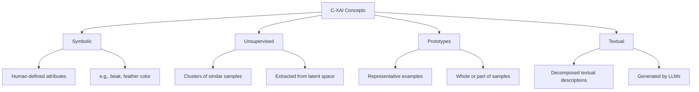
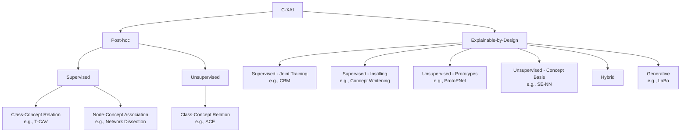

# Concept-based Explainability — Part I

> **Course:** Explainable and Trustworthy AI
> **Lecture:** 8
> **Date:** 2024-04-28
> **Source:** XAI_08_CXAI_I.pdf

## Overview

This lecture introduces **Concept-based eXplainable AI (C-XAI)**, a paradigm that overcomes the limitations of traditional pixel-level feature attribution methods. It examines the fundamental problems of saliency maps (similarity to edge detectors, insensitivity to layer randomization, indistinguishability across different classes) and presents a comprehensive taxonomy of concept types (symbolic, unsupervised, prototypes, textual), concept-based explanation types (class-concept relation, node-concept association, concept visualization), and the full spectrum of C-XAI methods, both post-hoc and explainable-by-design.

## Content

### Motivation — Limitations of Standard Explainability

Traditional explainability methods (saliency maps, gradient-based approaches) suffer from fundamental issues that undermine their reliability.

#### Similarity to Edge Detectors

Some saliency maps, particularly those considering input values (e.g., Gradient x Input), produce explanations visually similar to those of a simple edge detector. This raises the concern that the method may be detecting contours rather than explaining the model's reasoning.

#### Insensitivity to Randomization

Randomizing one or more layers of the network does not produce significant changes in the explanations: the explanation of a completely randomized network still looks similar to the original. This indicates that some explanation methods are more input-dependent than model-dependent.

#### Indistinguishability Across Classes

Saliency maps of very different classes (e.g., "Siberian Husky" and "Transverse Flute") can be visually indistinguishable, making it impossible to determine which class is being explained by looking at the map alone.

#### The Core Problem

> "Showing where a network is looking does not tell us what the network is seeing in a given input" — Rudin (2019), Achtibat et al. (2023)

Traditional methods show **where** the network is looking, but not **what** the network is seeing. This gap motivates the shift to higher-level concept-based explanations.

### Concept-based eXplainable AI (C-XAI)

#### Definition of Concept

A concept is "any abstraction, such as a colour, an object, or even an idea" (Molnar, 2020). Concepts operate at a higher level of abstraction than individual features or pixels, making them more understandable to humans.

#### Types of Concepts

**Symbolic Concepts**: human-defined attributes or abstractions (e.g., a bird's beak, its color). They require auxiliary data and annotations, which can be at the image level (more expensive but more precise) or at the class level (less expensive but less precise, as the attribute may not be visible).

**Unsupervised Concept Basis**: clusters of similar samples extracted from the network's internal representation (latent space). They are not built to resemble human-defined concepts, but capture abstractions that are more understandable than individual features (e.g., a cluster of green birds). Clustering algorithms are required for extraction.

**Prototypes**: representative examples of peculiar traits from training samples. They can be entire samples or parts of a sample (e.g., a particular type of beak). Unlike unsupervised concept bases, they represent a single example rather than a group. The set of prototypes should be representative of the entire dataset.

**Textual Concepts**: textual descriptions of main classes, decomposed into distinctive pieces. Each piece embodies a characteristic that can be shared across classes (e.g., "a bird with bright feathers"). They require a Large Language Model (LLM) with domain knowledge and are employed as a numerical embedding of the corresponding text.

### Types of Concept-based Explanations

There are three fundamental types of concept-based explanations:

#### Class-Concept Relation

Analyzes the relationship between a specific concept and an output class of the model. It can express the importance of a single concept or a logic rule involving multiple concepts and their connection to an output class. Applicable to all concept types: for instance, with prototypes, $parrot := 0.8 \cdot \text{prototype}_1 + 0.2 \cdot \text{prototype}_2$.

#### Node-Concept Association

Assigns a concept to an internal unit (or filter) of the network, enhancing model transparency. It can be defined **post-hoc** by considering the hidden units that maximally activate on input samples representing a concept, or **forced during training** by requiring a unit to predict a concept.

#### Concept Visualization

Highlights the input features that best represent a specific concept, analogous to saliency maps but applied to concepts. It is crucial when employing non-symbolic concepts (needed to understand which unsupervised attributes or prototypes the network has learned). Often combined with one of the previous explanation types.

### C-XAI Taxonomy: Post-hoc vs Explainable-by-Design

#### Post-hoc Supervised Methods

The standard pipeline: (1) project samples representing the concepts into the model's latent space, (2) analyze their relationship to the prediction or hidden node activations. They do not compromise the model's learning capacity and provide more interpretable explanations than standard post-hoc methods. However, they cannot ensure the network truly knows the concepts (it has not been trained for that).

**T-CAV (Testing with Concept Activation Vectors)** (Kim et al., 2018): a post-hoc supervised method providing class-concept relations. It takes a pre-trained model, requires a set of data annotated with concepts, analyzes the projection of these data into the model's latent space, and correlates the projection with those of the output classes.

**Network Dissection** (Bau et al., 2017): a post-hoc supervised method providing node-concept association. Similarly to T-CAV, it analyzes the activations of hidden nodes when fed with annotated data, associating to each node the concept for which it activates the most (on average).

#### Post-hoc Unsupervised Methods

**ACE (Automatic Concept-based Explanations)** (Ghorbani et al., 2019): a post-hoc unsupervised method providing class-concept relations. It does not require annotated concept data. It splits input data into smaller crops, analyzes the projections of the crops in the model's latent space, clusters the projections (clusters are unsupervised concepts), and analyzes the correlation of unsupervised concepts with output classes.

#### Explainable-by-Design Supervised Models — Joint Training

**Concept Bottleneck Models (CBM)** (Koh et al., 2020): train a model from scratch with a hidden layer that explicitly predicts concepts (node-concept association by-design). The predicted concepts are used to make the final prediction. If the task predictor is a white-box model, class-concept relations can also be extracted. Pros: very intuitive explanations ("I see a beak, feathers and not a muzzle, it is a bird"), allow concept interventions and model interaction. Cons: require data annotated with both classes and concepts.

#### Explainable-by-Design Supervised Models — Instilling Concepts

**Concept Whitening** (Chen et al., 2020): unlike joint training, takes a pre-trained model and turns it into an explainable-by-design one. The concept-annotated data may differ from the training data. It fine-tunes a certain layer to predict the given concepts, while keeping the top of the network trained to predict the original classes.

#### Explainable-by-Design Unsupervised Models — Prototypes

**ProtoPNet** (Chen et al., 2019): do not require annotated concepts. The network is trained both to predict the output class and to encode the most representative training examples in the hidden layers. Node-concept association by-design, with class-concept relations if the task predictor is white-box. To visualize prototypes: check the part of the sample for which the prototype activates the most.

#### Explainable-by-Design Unsupervised Models — Concept Basis

**SE-NN (Self-Explaining Neural Networks)** (Alvarez Melis & Jaakkola, 2018): the network is trained to predict the output class and create clusters of samples in the latent representation. To characterize unsupervised concepts: visualize the samples closest to the centroids, or decode the centroids if using an auto-encoder.

#### Hybrid Models

Combine supervised and unsupervised concepts: train the network to predict a set of concepts with a subset of neurons and create a clusterized representation in the remaining neurons. Pros: overcome the accuracy trade-off of fully supervised models, decrease annotation cost, avoid concept leakage. Cons: most information required to classify classes is encoded in the unsupervised neurons, making concept interventions less effective.

#### Generative Models

**LaBo (Language in a Bottle)** (Yang et al., 2023): employ a generative model to create concept labels. For each class, a description is requested from an LLM and decomposed into small pieces. The textual embeddings are aligned to the latent input representation to produce concept scores used for final classification. Pros: no concept labeling required. Cons: per-class labeling, require an external generative model with knowledge of the problem.

### C-XAI Part II — Preview

The second part of the lecture will cover in detail:
- **T-CAV**: post-hoc supervised method for class-concept relations
- **CBM (Concept Bottleneck Model)**: supervised explainable-by-design model
- **CEM (Concept Embedding Model)**: advanced variant of CBMs

## Key Concepts

| Concept | Definition | Note |
|---|---|---|
| **Concept** | A high-level abstraction (color, object, idea) used to explain model behavior | "Any abstraction, such as a colour, an object, or even an idea" (Molnar, 2020) |
| **Symbolic Concepts** | Human-defined attributes, annotated at image or class level | Require auxiliary data; class-level annotation cheaper but less precise |
| **Unsupervised Concepts** | Clusters of similar samples extracted from the network's latent space | Not built to resemble human concepts; capture interpretable abstractions |
| **Class-Concept Relation** | Analysis of the correlation between a concept and a model output class | Can express importance or multi-concept logic rules |
| **Node-Concept Association** | Assignment of a concept to an internal network unit, post-hoc or by-design | Enhances model transparency |
| **CBM** | Model with intermediate layer predicting explicit concepts, used for final classification | Explainable-by-design; allows concept interventions |
| **T-CAV** | Post-hoc method projecting annotated data into latent space and correlating with classes | By Kim et al. (2018); covered in detail in Part II |
| **ProtoPNet** | Network encoding representative prototypes in hidden layers to explain predictions | Prototypes = parts of training samples; visualizable |
| **Concept Whitening** | Transforms a pre-trained model into explainable-by-design via concept fine-tuning | Does not require training from scratch |
| **Hybrid Models** | Combine supervised neurons (annotated concepts) and unsupervised neurons (clusters) | Overcome accuracy trade-off but make interventions less effective |

## Connections

- The limitations of saliency maps described in this lecture connect directly to the gradient-based methods covered in **Lecture 07**, highlighting why pixel-level approaches are insufficient.
- **Lecture 09** (C-XAI Part II) will deepen the coverage of T-CAV, CBM, and CEM with implementations and practical examples.
- The prototypes mentioned in this lecture are a form of "explanation by example," a theme introduced in **Lecture 05** with surrogate-based methods.
- The distinction between post-hoc and explainable-by-design mirrors the classification of explainability methods presented in **Lecture 02** (XAI methods taxonomy).
- The concept of concept interventions in CBMs anticipates the human-model interaction themes covered in the trustworthiness lectures.