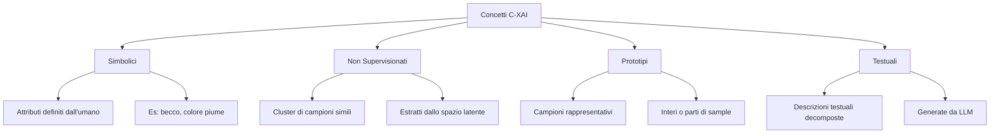
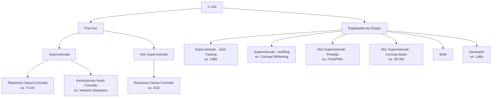
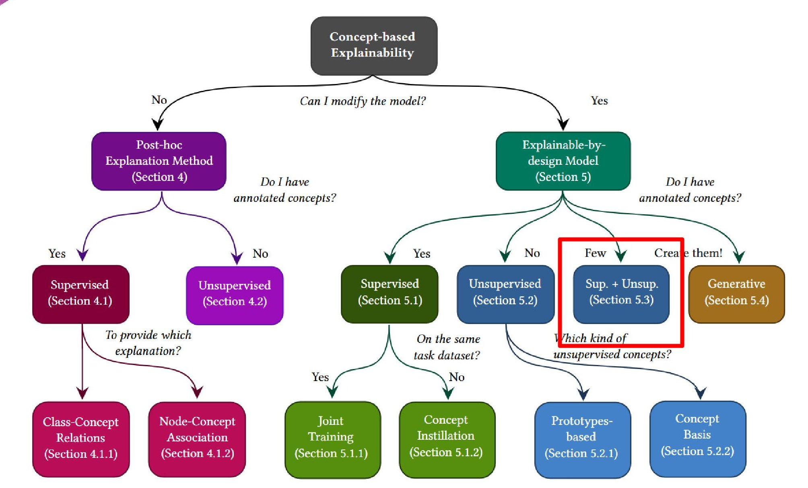
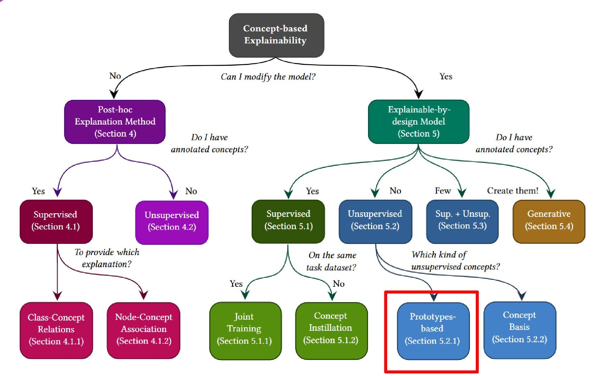
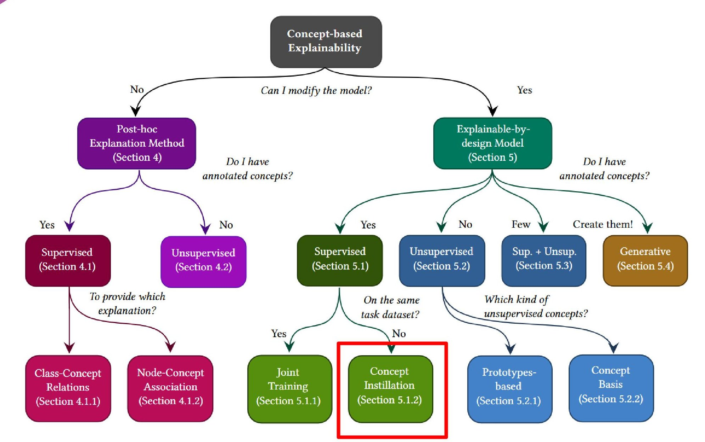
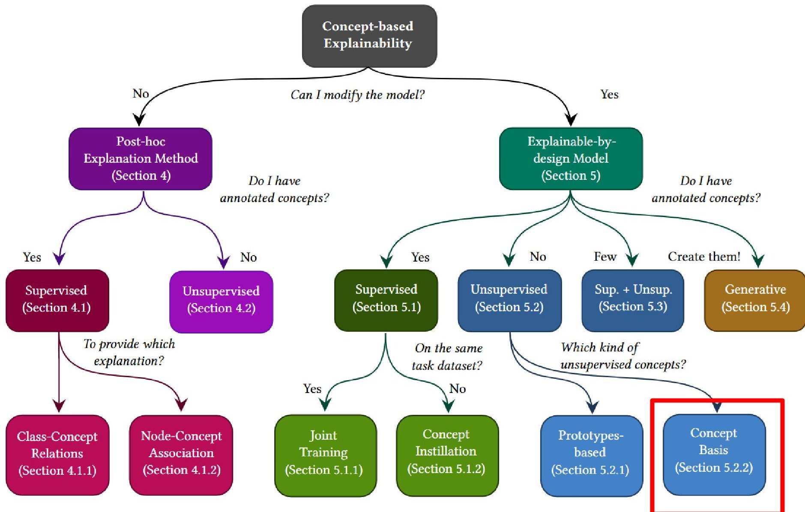
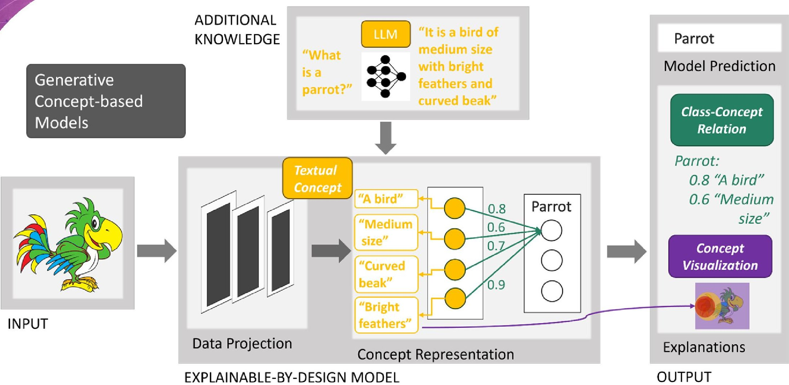

# Spiegabilità basata su Concetti — Parte I

> **Course:** Explainable and Trustworthy AI
> **Lecture:** 8
> **Date:** 2024-04-28
> **Source:** XAI_08_CXAI_I.pdf

## Overview

Questa lezione introduce la **Concept-based eXplainable AI (C-XAI)**, un paradigma che supera i limiti dei metodi di spiegabilità tradizionali basati su feature pixel-level. Si analizzano i problemi fondamentali delle saliency map (somiglianza con edge detector, insensibilità alla randomizzazione dei layer, indistinguibilità tra classi diverse) e si presenta una tassonomia completa dei concetti (simbolici, non supervisionati, prototipi, testuali), dei tipi di spiegazione basata su concetti (relazione classe-concetto, associazione nodo-concetto, visualizzazione di concetti) e dell'intera gamma di metodi C-XAI, sia post-hoc che explainable-by-design.

## Content

### Motivazione — Limiti della Spiegabilità Standard

I metodi di spiegabilità tradizionali (saliency map, gradient-based) presentano problemi fondamentali che ne compromettono l'affidabilità.

#### Somiglianza con Edge Detector

Alcune saliency map, in particolare quelle che considerano i valori di input (es. Gradient x Input), producono spiegazioni visivamente simili a quelle di un semplice edge detector. Questo solleva il dubbio che il metodo stia rilevando contorni piuttosto che spiegare il ragionamento del modello.

#### Insensibilità alla Randomizzazione

La randomizzazione di uno o più layer della rete non produce cambiamenti significativi nelle spiegazioni: la spiegazione di una rete completamente randomizzata risulta ancora simile a quella originale. Questo indica che alcuni metodi di spiegazione sono più dipendenti dall'input che dal modello.

#### Indistinguibilità tra Classi Diverse

Le saliency map di classi molto diverse (es. "Siberian Husky" e "Transverse Flute") possono risultare visivamente indistinguibili, rendendo impossibile determinare quale classe venga spiegata solo osservando la mappa.

#### Il Problema Fondamentale

> "Showing where a network is looking does not tell us what the network is seeing in a given input" — Rudin (2019), Achtibat et al. (2023)

I metodi tradizionali mostrano **dove** la rete guarda, ma non **cosa** la rete sta vedendo. Questo gap motiva il passaggio a spiegazioni basate su concetti di livello superiore.

### Concept-based eXplainable AI (C-XAI)

#### Definizione di Concetto

Un concetto è "qualsiasi astrazione, come un colore, un oggetto, o persino un'idea" (Molnar, 2020). I concetti operano a un livello di astrazione superiore rispetto alle singole feature o ai pixel, risultando più comprensibili per gli esseri umani.

#### Tipologie di Concetti

**Concetti Simbolici**: attributi o astrazioni definiti dall'essere umano (es. il becco di un uccello, il colore). Richiedono dati ausiliari e annotazioni, che possono essere a livello di immagine (più costose ma più precise) o a livello di classe (meno costose ma meno precise).

**Concetti Non Supervisionati (Unsupervised Concept Basis)**: cluster di campioni simili estratti dalla rappresentazione interna della rete (spazio latente). Non sono costruiti per assomigliare a concetti umani, ma catturano astrazioni più comprensibili rispetto a singole feature (es. un cluster di uccelli verdi). Richiedono algoritmi di clustering per l'estrazione.

**Prototipi**: esempi rappresentativi di tratti peculiari dei campioni di training. Possono essere campioni interi o parti di un campione (es. un particolare tipo di becco). A differenza dei concetti non supervisionati, rappresentano un singolo esempio anziché un gruppo. Il set di prototipi deve essere rappresentativo dell'intero dataset.

**Concetti Testuali**: descrizioni testuali delle classi principali, decomposte in pezzi distintivi. Ciascun pezzo incarna una caratteristica condivisibile tra classi diverse (es. "un uccello con piume brillanti"). Richiedono un Large Language Model (LLM) con conoscenza del dominio e vengono impiegati come embedding numerico del testo corrispondente.

### Tipi di Spiegazione basata su Concetti

Esistono tre tipi fondamentali di spiegazione basata su concetti:

#### Relazione Classe-Concetto (Class-Concept Relation)

Analizza la relazione tra un concetto specifico e una classe di output del modello. Può esprimere l'importanza di un concetto o una regola logica che coinvolge concetti multipli e la loro connessione a una classe di output. Applicabile a tutti i tipi di concetti: ad esempio, con i prototipi si ha $parrot := 0.8 \cdot \text{prototype}_1 + 0.2 \cdot \text{prototype}_2$.

#### Associazione Nodo-Concetto (Node-Concept Association)

Assegna un concetto a un'unità interna (o filtro) della rete, migliorando la trasparenza del modello. Può essere definita **post-hoc** considerando le unità nascoste che si attivano massimamente su campioni rappresentanti un concetto, oppure **forzata durante il training** richiedendo a un'unità di predire un concetto.

#### Visualizzazione di Concetti (Concept Visualization)

Evidenzia le feature di input che meglio rappresentano un concetto specifico, in modo analogo alle saliency map ma applicato ai concetti. È cruciale quando si impiegano concetti non simbolici (necessità di capire quali attributi non supervisionati o prototipi la rete ha appreso). Spesso combinata con uno dei due tipi precedenti.

### Tassonomia C-XAI: Post-hoc vs Explainable-by-Design

#### Metodi Post-hoc Supervisionati

Il pipeline standard prevede di: (1) proiettare i campioni rappresentanti i concetti nello spazio latente del modello, (2) analizzare la loro relazione con la predizione o le attivazioni dei nodi nascosti. Non compromettono la capacità di apprendimento del modello e forniscono spiegazioni più interpretabili rispetto ai metodi post-hoc standard. Tuttavia, non possono garantire che la rete conosca realmente i concetti.

**T-CAV (Testing with Concept Activation Vectors)** (Kim et al., 2018): metodo post-hoc supervisionato che fornisce relazioni classe-concetto. Prende un modello pre-addestrato, richiede un set di dati annotato con concetti, analizza la proiezione di questi dati nello spazio latente e correla tale proiezione con quelle delle classi di output.

**Network Dissection** (Bau et al., 2017): metodo post-hoc supervisionato che fornisce associazione nodo-concetto. Similmente a T-CAV, analizza le attivazioni dei nodi nascosti quando alimentati con dati annotati, associando a ciascun nodo il concetto per cui si attiva maggiormente (in media).

#### Metodi Post-hoc Non Supervisionati

**ACE (Automatic Concept-based Explanations)** (Ghorbani et al., 2019): metodo post-hoc non supervisionato che fornisce relazioni classe-concetto. Non richiede dati annotati con concetti. Divide i dati di input in ritagli più piccoli (crops), analizza le proiezioni dei crops nello spazio latente del modello, clusterizza le proiezioni (i cluster sono i concetti non supervisionati) e analizza la correlazione di questi concetti con le classi di output.

#### Modelli Explainable-by-Design Supervisionati — Joint Training

**Concept Bottleneck Models (CBM)** (Koh et al., 2020): addestrano un modello da zero con un layer nascosto che predice concetti espliciti (associazione nodo-concetto by-design). I concetti predetti vengono usati per effettuare la predizione finale. Se il task predictor è un modello white-box, si possono anche estrarre relazioni classe-concetto. Vantaggi: spiegazioni molto intuitive ("vedo un becco, piume e non un muso, e un uccello"), permettono interventi sui concetti e interazione con il modello. Svantaggi: richiedono dati annotati sia con classi che con concetti.

#### Modelli Explainable-by-Design Supervisionati — Instilling Concepts

**Concept Whitening** (Chen et al., 2020): a differenza del joint training, prende un modello pre-addestrato e lo trasforma in un modello explainable-by-design. I dati annotati con concetti possono essere diversi dai dati di training. Fine-tuna un certo layer per predire i concetti dati, mantenendo il training della parte superiore della rete per predire le classi originali.

#### Modelli Explainable-by-Design Non Supervisionati — Prototipi

**ProtoPNet** (Chen et al., 2019): non richiedono concetti annotati. La rete viene addestrata sia per predire la classe di output che per codificare nei layer nascosti gli esempi di training più rappresentativi. Associazione nodo-concetto by-design, con relazioni classe-concetto se il task predictor è white-box. Per visualizzare i prototipi: si analizza la parte del campione per cui il prototipo si attiva maggiormente.

#### Modelli Explainable-by-Design Non Supervisionati — Concept Basis

**SE-NN (Self-Explaining Neural Networks)** (Alvarez Melis & Jaakkola, 2018): la rete viene addestrata per predire la classe di output e creare cluster di campioni nella rappresentazione latente. Per caratterizzare i concetti non supervisionati: si visualizzano i campioni più vicini ai centroidi o si decodificano i centroidi se si impiega un auto-encoder.

#### Modelli Ibridi

Combinano concetti supervisionati e non supervisionati: addestrano la rete a predire un set di concetti con un sottoinsieme di neuroni e a creare una rappresentazione clusterizzata nei neuroni rimanenti. Vantaggi: superano il trade-off accuratezza dei modelli completamente supervisionati, riducono il costo di annotazione, evitano il "concept leakage". Svantaggi: la maggior parte dell'informazione necessaria per classificare le classi viene codificata nei neuroni non supervisionati, rendendo gli interventi sui concetti meno efficaci.

#### Modelli Generativi

**LaBo (Language in a Bottle)** (Yang et al., 2023): impiegano un modello generativo per creare le etichette dei concetti. Per ogni classe viene richiesta una descrizione a un LLM, decomposta in piccoli pezzi. Gli embedding testuali vengono allineati alla rappresentazione latente dell'input per produrre punteggi concettuali usati per la classificazione finale. Vantaggi: nessuna etichettatura di concetti richiesta. Svantaggi: etichettatura per-classe, richiedono un modello generativo esterno con conoscenza del problema.

### C-XAI Parte II — Anteprima

Nella Parte II del corso saranno trattati nel dettaglio:
- **T-CAV**: metodo post-hoc supervisionato per relazioni classe-concetto
- **CBM (Concept Bottleneck Model)**: modello explainable-by-design supervisionato
- **CEM (Concept Embedding Model)**: variante avanzata dei CBM

## Key Concepts

| Concetto | Definizione | Nota |
|---|---|---|
| **Concetto** | Astrazione di alto livello (colore, oggetto, idea) usata per spiegare il comportamento del modello | "Any abstraction, such as a colour, an object, or even an idea" (Molnar, 2020) |
| **Concetti Simbolici** | Attributi definiti dall'essere umano, annotati a livello di immagine o di classe | Richiedono dati ausiliari; annotazione a livello di classe meno costosa ma meno precisa |
| **Concetti Non Supervisionati** | Cluster di campioni simili estratti dallo spazio latente della rete | Non costruiti per assomigliare a concetti umani; catturano astrazioni interpretabili |
| **Relazione Classe-Concetto** | Analisi della correlazione tra un concetto e una classe di output del modello | Può esprimere importanza o regole logiche multi-concetto |
| **Associazione Nodo-Concetto** | Assegnazione di un concetto a un'unità interna della rete, post-hoc o by-design | Migliora la trasparenza del modello |
| **CBM** | Modello con layer intermedio che predice concetti espliciti, usati per la classificazione finale | Explainable-by-design; permette interventi sui concetti |
| **T-CAV** | Metodo post-hoc che proietta dati annotati nello spazio latente e correla con le classi | Di Kim et al. (2018); trattato in dettaglio nella Parte II |
| **ProtoPNet** | Rete che codifica prototipi rappresentativi nei layer nascosti per spiegare le predizioni | Prototipi = parti di campioni di training; visualizzabili |
| **Concept Whitening** | Trasforma un modello pre-addestrato in explainable-by-design mediante fine-tuning su concetti | Non richiede ri-addestramento da zero |
| **Modelli Ibridi** | Combinano neuroni supervisionati (concetti annotati) e neuroni non supervisionati (cluster) | Superano il trade-off accuratezza ma rendono gli interventi meno efficaci |

## Connections

- I limiti delle saliency map descritti in questa lezione si collegano direttamente ai metodi gradient-based trattati nella **Lezione 07**, evidenziando perché gli approcci pixel-level siano insufficienti.
- La **Lezione 09** (C-XAI Parte II) approfondirà i metodi T-CAV, CBM e CEM con implementazioni e esempi pratici.
- I prototipi menzionati in questa lezione sono una forma di "explanation by example", tema introdotto nella **Lezione 05** con i metodi surrogate-based.
- La distinzione tra post-hoc e explainable-by-design rispecchia la classificazione dei metodi di spiegabilità presentata nella **Lezione 02** (tassonomia dei metodi XAI).
- Il concetto di intervento sui concetti (concept interventions) nei CBM anticipa i temi di interazione umano-modello trattati nelle lezioni sulla trustworthiness.