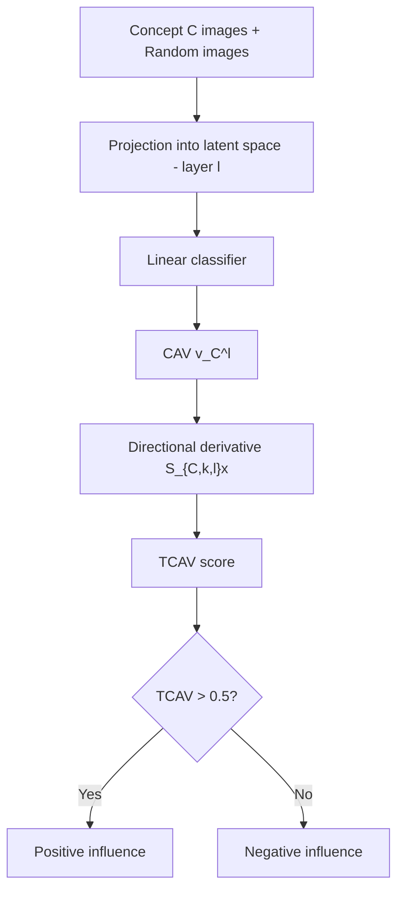
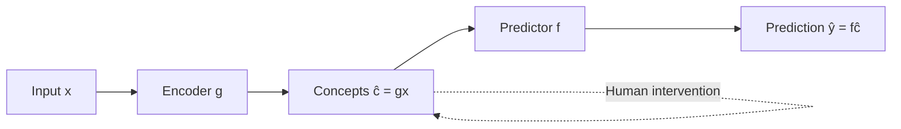
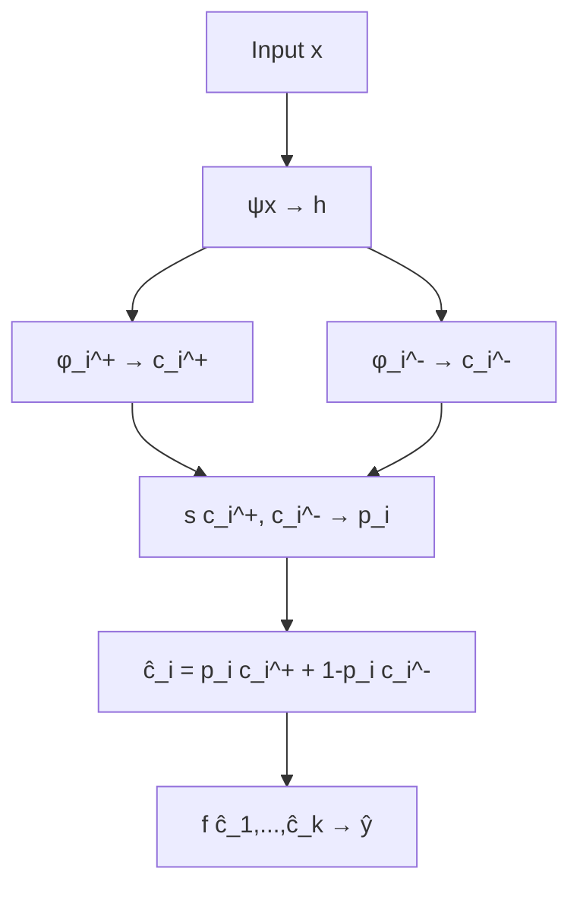

# Concept-based Explainability — Part II

> **Course:** Explainable and Trustworthy AI
> **Lecture:** 9
> **Date:** 2026-04-22
> **Source:** C-XAI-II.pdf

## Overview

This lecture deepens three fundamental approaches to concept-based explainability: **T-CAV** (Testing with Concept Activation Vectors) for quantitatively measuring the influence of user-chosen concepts on predictions, **Concept Bottleneck Models** (CBM) that force the model to pass through an intermediate layer of interpretable concepts, and **Concept Embedding Models** (CEM) that overcome the accuracy-explainability trade-off by representing concepts as pairs of supervised embeddings.

## Content

### Testing with Concept Activation Vectors (T-CAV)

Traditional explainability methods (e.g., saliency maps) show *where* the model looks, but do not answer high-level questions like "did the concept of *stripes* influence the zebra classification?". T-CAV addresses this by providing a quantitative score measuring how relevant a user-chosen concept is for a given prediction class.

#### T-CAV Components

T-CAV requires five elements:

1. A dataset with positive examples for a concept and random images
2. The original dataset with target classes
3. The trained model to explain
4. The Concept Activation Vectors (CAV)
5. The T-CAV score quantifying the concept's influence on a class

#### Constructing Concept Activation Vectors (CAV)

Given a trained model, both concept images and random images are projected into the model's latent space (the internal activations at a given layer $l$). A **linear classifier** is then trained to separate the concept projections from the random image projections. The CAV $\mathbf{v}_C^l$ is the **vector orthogonal to the decision boundary** of this classifier:

$$\mathbf{v}_C^l = \text{normal vector to the linear classifier boundary}$$

This vector represents the direction in latent space corresponding to concept $C$ at layer $l$.

#### Sorting Images with CAVs

To sort a set of images with respect to a concept, compute the **cosine similarity** between each image's latent representation $f_l(x)$ and the CAV $\mathbf{v}_C^l$:

$$\text{similarity} = \cos(f_l(x),\, \mathbf{v}_C^l)$$

#### Computing the T-CAV Score

For each input $x$ of class $k$, compute the **directional derivative** of the class score with respect to the CAV:

$$S_{C,k,l}(x) = \nabla f_{l \to k}(x) \cdot \mathbf{v}_C^l$$

- $S_{C,k,l}(x) > 0$: **positive** influence of the concept
- $S_{C,k,l}(x) < 0$: **negative** influence of the concept

The T-CAV score is the fraction of class $k$ samples with positive directional derivative:

$$TCAV_{C,k,l} = \frac{|\{x \in X_k : S_{C,k,l}(x) > 0\}|}{|X_k|}$$

**Properties:**

- $TCAV_{C,k,l} \in [0, 1]$
- $TCAV > 0.5$: positive influence of concept $C$ on class $k$
- $TCAV < 0.5$: negative influence

#### Example: Bias Identification

T-CAV can reveal model biases. In a GoogleNet example, the concept "Woman" has a negative T-CAV score for the "Doctor" class, indicating the model negatively associates the female gender with the medical profession — a clear bias signal.

#### When and Where Concepts Are Learnt

The accuracy of the **linear probe** (the classifier used to extract the CAV) indicates whether the network has learnt a concept:

- High accuracy: the network has automatically learnt the concept
- Low accuracy: the network does not use that concept for prediction
- Simpler concepts have high accuracy throughout the network
- High-level concepts are better captured at higher layers

### Concept Bottleneck Models (CBM)

Proposed by Koh et al. (ICML 2020), CBMs address the opacity of end-to-end models by introducing an explicit intermediate layer of interpretable concepts.

#### Architecture

A CBM consists of two modules:

- **Encoder** $g$: maps input $x$ to a concept vector $\hat{c} = g(x)$, where each element $\hat{c}_i$ represents the probability of concept $i$ being present
- **Predictor** $f$: takes the concept vector $\hat{c}$ and produces the final prediction $\hat{y} = f(\hat{c})$

The flow is: $x \to g(x) = \hat{c} \to f(\hat{c}) = \hat{y}$

The overall loss is:

$$\mathcal{L} = \mathcal{L}_y(f(\hat{c}_i), y_i) + \lambda \, \mathcal{L}_c(g(x_i), c_i)$$

where $\mathcal{L}_y$ is the task loss and $\mathcal{L}_c$ is the concept loss.

#### Training Strategies

| Strategy | Formulation | Characteristics |
|---|---|---|
| **Independent** | $\hat{f} = \arg\min_f \sum_i \mathcal{L}_y(f(c_i), y_i)$; $\hat{g} = \arg\min_g \sum_i \mathcal{L}_c(g(x_i), c_i)$ | $g$ trained first, then frozen; $f$ uses ground truth concepts |
| **Sequential** | $\hat{f} = \arg\min_f \sum_i \mathcal{L}_y(f(g(x_i)), y_i)$ | $g$ trained first; $f$ trained on $g$'s predictions |
| **Joint** | $\hat{f}, \hat{g} = \arg\min_{f,g} \sum_i \mathcal{L}_y(f(c_i), y_i) + \lambda \sum_i \mathcal{L}_c(g(x_i), c_i)$ | $f$ and $g$ trained together for some $\lambda > 0$ |
| **Standard** | $\hat{f}, \hat{g} = \arg\min_{f,g} \sum_i \mathcal{L}_y(f(c_i), y_i)$ | Ignores the concept loss |

#### Interpretability/Accuracy Trade-off

- **Sequential and Independent** are more trustworthy because they prevent *concept leakage* (information bypassing the concept layer)
- **Joint** provides better task accuracy
- The $\lambda$ value modulates the trade-off
- The **Standard** (end-to-end) model still has higher average accuracy

#### Concept Interventions

A key property of CBMs is the ability to perform **interventions**: a human expert can correct predicted concept values (e.g., "this X-ray actually shows a bone spur") and observe how the final prediction changes.

#### Explicit Concept Training

| Method | X-Ray Concept Error (lower is better) |
|---|---|
| Independent | 0.53 |
| Sequential | 0.53 |
| Joint | 0.54 |
| TCAV (Probe) | 0.68 |

Explicit concept training ensures the model represents concepts correctly. A standard end-to-end model may not have learnt certain concepts, making them unidentifiable via probing.

#### CBM Drawbacks

- **Poor trade-offs**: difficulty balancing accuracy and explainability
- **Low concept efficiency**: CBMs do not scale well to real-world conditions where concept annotations are scarce

### Concept Embedding Models (CEM)

Proposed by Espinosa Zarlenga et al. (NeurIPS 2022), CEMs overcome CBM limitations by representing concepts as **pairs of supervised embeddings** rather than binary scalars.

#### CEM Workflow

1. $h = \psi(x)$: the model's latent space
2. $\mathbf{c}_i^+ = \phi_i^+(x)$: neural model dedicated to the $i$-th positive concept embedding
3. $p_i = s[\mathbf{c}_i^+, \mathbf{c}_i^-]$: the concept score (probability of presence) is a shared function operating on the concatenation of concept embeddings
4. $\hat{c}_i = p_i \, \mathbf{c}_i^+ + (1 - p_i) \, \mathbf{c}_i^-$: the concept embedding is the weighted combination of positive and negative embeddings
5. $f([\hat{c}_1, \ldots, \hat{c}_k])$: the task predictor operates on the concatenation of all concept embeddings

#### A Neural-Symbolic Approach

CEMs are positioned as a **neural-symbolic** approach, combining neural and symbolic elements:

| Approach | Concept Representation | Space |
|---|---|---|
| **Neural** | Unsupervised embeddings | $\mathbf{c}_i \in \mathbb{R}^k$ |
| **Symbolic (CBM)** | Supervised scalars | $\mathbf{c}_i \in [0,1]$ |
| **Neural-Symbolic (CEM)** | Pairs of supervised embeddings | $\mathbf{c}_i \in \mathbb{R}^k$, $\mathbf{c}_i = \text{agg}(\mathbf{c}_i^+, \mathbf{c}_i^-)$ |

#### CEM Advantages

- **Beyond trade-offs**: CEMs overcome the accuracy-explainability trade-off that limits CBMs
- **High concept efficiency**: they scale to real-world conditions where concept annotations are scarce
- **Effective interventions**: CEMs respond correctly to concept interventions

#### CEM vs Hybrid Approach

The hybrid approach combines CBMs with unsupervised neurons:

| | CEM | Hybrid (CBM + unsupervised neurons) |
|---|---|---|
| **PRO** | High accuracy + high concept efficiency | High accuracy + high concept efficiency |
| **CON** | Not directly interpretable | Concept interventions have no effect on prediction |

In the hybrid approach, all information needed for prediction is encoded in the unsupervised neurons, making interventions ineffective.

#### CEM Interpretability

CEMs are **not directly interpretable** because concepts are vectors in $\mathbb{R}^k$ rather than scalars. However, an interpretable model can be built on top of Concept Embeddings using a concept encoder with a predictor operating on concept scores (e.g., "0.8 Round + 0.1 Red → Apple").

## Key Concepts

| Concept | Definition | Note |
|---|---|---|
| **T-CAV** | Quantitative score measuring the influence of a concept on a prediction class | Values in $[0,1]$; $> 0.5$ indicates positive influence |
| **CAV** | Vector orthogonal to the decision boundary of a linear classifier in latent space | Represents the concept's direction in activation space |
| **Directional derivative** | Dot product between the score gradient and the CAV: $S = \nabla f \cdot \mathbf{v}_C$ | Positive/negative sign indicates positive/negative influence |
| **Concept Bottleneck Model** | Architecture with an interpretable concept layer between input and output | Enables human interventions on concepts |
| **Concept leakage** | Information that bypasses the concept layer in a CBM | Prevented by independent or sequential training |
| **Concept Embedding Model** | Represents concepts as pairs of supervised embeddings ($\mathbf{c}_i^+, \mathbf{c}_i^-$) | Overcomes the accuracy-explainability trade-off |
| **Concept score** | $p_i = s[\mathbf{c}_i^+, \mathbf{c}_i^-]$ — probability of concept presence | Shared function across concepts |
| **Concept intervention** | Human correction of concept values to modify the prediction | Effective in CBMs and CEMs; ineffective in hybrid approach |
| **Linear probe** | Linear classifier used to test whether a concept is represented at a layer | High accuracy indicates the network has learnt the concept |

## Connections

- T-CAV extends local explainability methods (saliency maps, lecture 07) by answering high-level conceptual questions rather than providing only pixel-level maps.
- CBMs connect to the discussion on intrinsic explainability (lecture 08): concepts are an integral part of the architecture, not a post-hoc explanation.
- CEMs address the accuracy-explainability trade-off discussed in lecture 08 on interpretable vs. black-box models.
- Bias detection via T-CAV (e.g., gender bias in "Doctor" classification) connects to the trustworthiness and fairness themes of the course.
- The concept of probing internal layers with linear classifiers is a cross-cutting technique in XAI that will be revisited in the analysis of text data models.