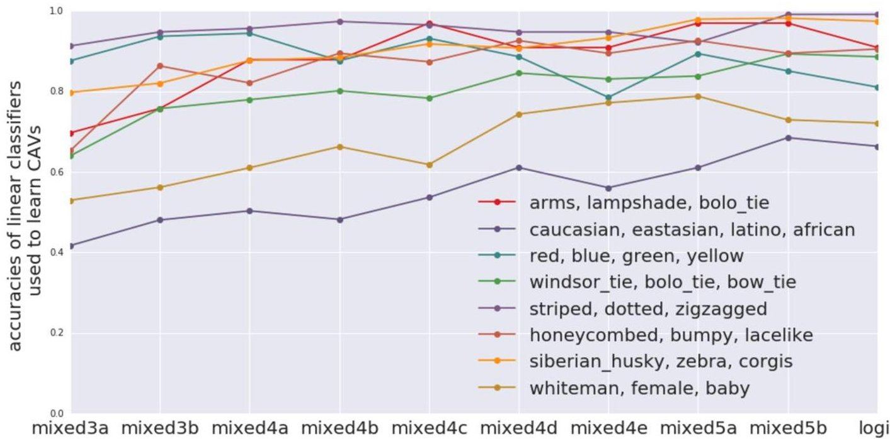
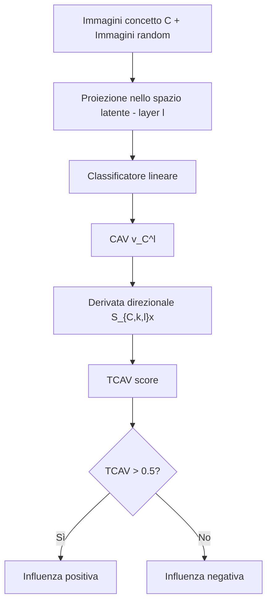
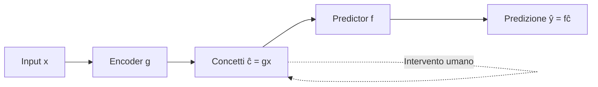
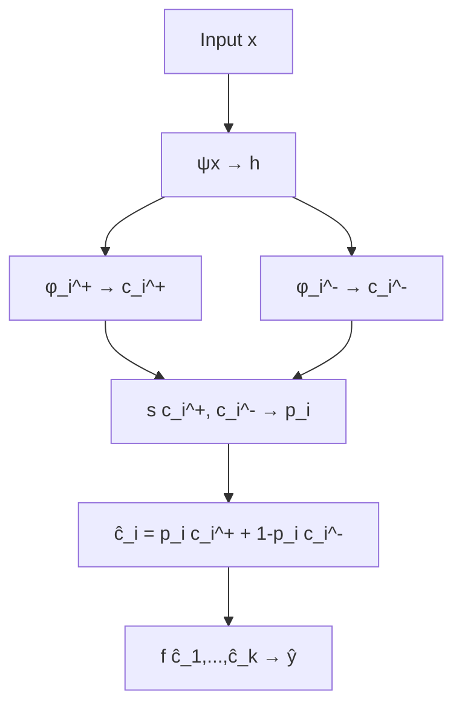

# Spiegabilità basata su Concetti — Parte II

> **Course:** Explainable and Trustworthy AI
> **Lecture:** 9
> **Date:** 2026-04-22
> **Source:** C-XAI-II.pdf

## Overview

Questa lezione approfondisce tre approcci fondamentali per la spiegabilità basata su concetti: **T-CAV** (Testing with Concept Activation Vectors) per misurare quantitativamente l'influenza di concetti scelti dall'utente sulle predizioni, i **Concept Bottleneck Models** (CBM) che obbligano il modello a passare attraverso uno strato intermedio di concetti interpretabili, e i **Concept Embedding Models** (CEM) che superano il trade-off accuratezza-spiegabilità rappresentando i concetti come coppie di embedding supervisionati.

## Content

### Testing with Concept Activation Vectors (T-CAV)

I metodi di spiegabilità tradizionali (es. saliency maps) mostrano *dove* il modello guarda, ma non rispondono a domande di alto livello come "il concetto di *strisce* ha influenzato la classificazione come zebra?". T-CAV risolve questo problema fornendo un punteggio quantitativo che misura quanto un concetto scelto dall'utente sia rilevante per una data classe di predizione.

#### Componenti di T-CAV

T-CAV richiede cinque elementi:

1. Un dataset con esempi positivi per un concetto e immagini casuali
2. Il dataset originale con le classi target
3. Il modello addestrato da spiegare
4. I Concept Activation Vectors (CAV)
5. Lo score T-CAV che quantifica l'influenza del concetto su una classe

#### Pipeline T-CAV

#### Costruzione dei Concept Activation Vectors (CAV)

Dato un modello addestrato, si proiettano sia le immagini del concetto sia immagini casuali nello spazio latente del modello (gli attivazioni interne a un certo layer $l$). Si addestra quindi un **classificatore lineare** per separare le proiezioni del concetto da quelle delle immagini casuali. Il CAV $\mathbf{v}_C^l$ è il **vettore ortogonale al decision boundary** di questo classificatore:

$$\mathbf{v}_C^l = \text{vettore normale al boundary del classificatore lineare}$$

Questo vettore rappresenta la direzione nello spazio latente che corrisponde al concetto $C$ al layer $l$.

#### Ordinamento delle immagini con i CAV

Per ordinare un insieme di immagini rispetto a un concetto, si calcola la **similarità coseno** tra la rappresentazione latente di ciascuna immagine $f_l(x)$ e il CAV $\mathbf{v}_C^l$:

$$\text{similarity} = \cos(f_l(x),\, \mathbf{v}_C^l)$$

#### Calcolo dello Score T-CAV

Per ogni input $x$ della classe $k$, si calcola la **derivata direzionale** dello score di classe rispetto al CAV:

$$S_{C,k,l}(x) = \nabla f_{l \to k}(x) \cdot \mathbf{v}_C^l$$

- $S_{C,k,l}(x) > 0$: influenza **positiva** del concetto
- $S_{C,k,l}(x) < 0$: influenza **negativa** del concetto

Lo score T-CAV è la frazione di campioni della classe $k$ con derivata direzionale positiva:

$$TCAV_{C,k,l} = \frac{|\{x \in X_k : S_{C,k,l}(x) > 0\}|}{|X_k|}$$

**Proprietà:**

- $TCAV_{C,k,l} \in [0, 1]$
- $TCAV > 0.5$: influenza positiva del concetto $C$ sulla classe $k$
- $TCAV < 0.5$: influenza negativa

#### Esempio: Identificazione di Bias

T-CAV può rivelare bias nei modelli. In un esempio con GoogleNet, il concetto "Woman" ha uno score T-CAV negativo per la classe "Doctor", indicando che il modello associa negativamente il genere femminile alla professione medica — un chiaro segnale di bias.

#### Quando e dove i concetti vengono appresi

L'accuratezza della **linear probe** (il classificatore usato per estrarre il CAV) indica se la rete ha appreso un concetto:

- Alta accuratezza: la rete ha appreso il concetto automaticamente
- Bassa accuratezza: la rete non usa quel concetto per la predizione
- Concetti semplici hanno alta accuratezza in tutti i layer
- Concetti di alto livello vengono catturati meglio nei layer superiori

### Concept Bottleneck Models (CBM)

Proposti da Koh et al. (ICML 2020), i CBM affrontano il problema dell'opacità dei modelli end-to-end introducendo uno strato intermedio esplicito di concetti interpretabili.

#### Architettura

Un CBM è composto da due moduli:

- **Encoder** $g$: mappa l'input $x$ in un vettore di concetti $\hat{c} = g(x)$, dove ogni elemento $\hat{c}_i$ rappresenta la probabilità di presenza del concetto $i$
- **Predictor** $f$: prende il vettore dei concetti $\hat{c}$ e produce la predizione finale $\hat{y} = f(\hat{c})$

Il flusso è: $x \to g(x) = \hat{c} \to f(\hat{c}) = \hat{y}$

La perdita complessiva è:

$$\mathcal{L} = \mathcal{L}_y(f(\hat{c}_i), y_i) + \lambda \, \mathcal{L}_c(g(x_i), c_i)$$

dove $\mathcal{L}_y$ è la task loss e $\mathcal{L}_c$ è la concept loss.

#### Strategie di Training

| Strategia | Formulazione | Caratteristiche |
|---|---|---|
| **Indipendente** | $\hat{f} = \arg\min_f \sum_i \mathcal{L}_y(f(c_i), y_i)$; $\hat{g} = \arg\min_g \sum_i \mathcal{L}_c(g(x_i), c_i)$ | $g$ addestrato prima, poi freezato; $f$ usa concetti ground truth |
| **Sequenziale** | $\hat{f} = \arg\min_f \sum_i \mathcal{L}_y(f(g(x_i)), y_i)$ | $g$ addestrato prima; $f$ addestrato sulle predizioni di $g$ |
| **Congiunta** | $\hat{f}, \hat{g} = \arg\min_{f,g} \sum_i \mathcal{L}_y(f(c_i), y_i) + \lambda \sum_i \mathcal{L}_c(g(x_i), c_i)$ | $f$ e $g$ addestrati insieme per qualche $\lambda > 0$ |
| **Standard** | $\hat{f}, \hat{g} = \arg\min_{f,g} \sum_i \mathcal{L}_y(f(c_i), y_i)$ | Ignora la concept loss |

#### Trade-off Interpretabilità/Accuratezza

- **Sequenziale e Indipendente** sono più affidabili perché prevengono il *concept leakage* (informazioni che bypassano i concetti)
- **Congiunta** offre migliore accuratezza sul task
- Il valore di $\lambda$ modula il compromesso
- Il modello **Standard** (end-to-end) ha comunque accuratezza mediamente superiore

#### Interventi sui Concetti

Una proprietà chiave dei CBM è la possibilità di **intervento**: un esperto umano può correggere i valori dei concetti predetti (es. "questa radiografia mostra effettivamente una spina dorsale") e osservare come cambia la predizione finale.

#### Addestramento Esplicito dei Concetti

| Metodo | Errore Concetti X-Ray (↓) |
|---|---|
| Independent | 0.53 |
| Sequential | 0.53 |
| Joint | 0.54 |
| TCAV (Probe) | 0.68 |

L'addestramento esplicito dei concetti garantisce che il modello li rappresenti correttamente. Un modello end-to-end standard potrebbe non aver appreso certi concetti, rendendoli non identificabili tramite probing.

#### Limitazioni dei CBM

- **Trade-off sfavorevole**: difficoltà nel conciliare accuratezza e spiegabilità
- **Bassa efficienza dei concetti**: i CBM non scalano bene in condizioni reali dove le annotazioni dei concetti sono scarse

### Concept Embedding Models (CEM)

Proposti da Espinosa Zarlenga et al. (NeurIPS 2022), i CEM superano le limitazioni dei CBM rappresentando i concetti come **coppie di embedding supervisionati** anziché scalari binari.

#### Workflow dei CEM

1. $h = \psi(x)$: spazio latente del modello
2. $\mathbf{c}_i^+ = \phi_i^+(x)$: embedding per il concetto positivo $i$
3. $\mathbf{c}_i^- = \phi_i^-(x)$: embedding per il concetto negativo $i$
4. $p_i = s[\mathbf{c}_i^+, \mathbf{c}_i^-]$: score del concetto (probabilità di presenza), funzione condivisa che opera sulla concatenazione degli embedding
5. $\hat{c}_i = p_i \, \mathbf{c}_i^+ + (1 - p_i) \, \mathbf{c}_i^-$: l'embedding del concetto è la combinazione pesata degli embedding positivo e negativo
6. $f([\hat{c}_1, \ldots, \hat{c}_k])$: il task predictor opera sulla concatenazione di tutti gli embedding dei concetti

#### Approccio Neural-Symbolico

I CEM si collocano come approccio **neural-symbolic**, combinando elementi neurali e simbolici:

| Approccio | Rappresentazione Concetti | Spazio |
|---|---|---|
| **Neurale** | Embedding non supervisionati | $\mathbf{c}_i \in \mathbb{R}^k$ |
| **Simbolico (CBM)** | Scalari supervisionati | $\mathbf{c}_i \in [0,1]$ |
| **Neural-Symbolic (CEM)** | Coppie di embedding supervisionati | $\mathbf{c}_i \in \mathbb{R}^k$, $\mathbf{c}_i = \text{agg}(\mathbf{c}_i^+, \mathbf{c}_i^-)$ |

#### Vantaggi dei CEM

- **Oltre il trade-off**: i CEM superano il compromesso accuratezza-spiegabilità che limita i CBM
- **Alta efficienza dei concetti**: scalano a condizioni reali dove le annotazioni dei concetti sono scarse
- **Interventi efficaci**: i CEM rispondono correttamente agli interventi sui concetti

#### CEM vs Approccio Ibrido

L'approccio ibrido combina CBM con neuroni non supervisionati:

| | CEM | Ibrido (CBM + neuroni unsupervised) |
|---|---|---|
| **PRO** | Alta accuratezza + alta efficienza concetti | Alta accuratezza + alta efficienza concetti |
| **CONTRO** | Non direttamente interpretabile | Interventi sui concetti non hanno effetto sulla predizione |

Nell'approccio ibrido, tutte le informazioni necessarie per la predizione sono codificate nei neuroni non supervisionati, rendendo inefficaci gli interventi.

#### Interpretabilità dei CEM

I CEM sono **non direttamente interpretabili** perché i concetti sono vettori in $\mathbb{R}^k$ anziché scalari. Tuttavia, è possibile costruire un modello interpretabile sopra i Concept Embeddings utilizzando un concetto encoder con un predictor che opera sugli score dei concetti (es. "0.8 Round + 0.1 Red → Apple").

## Key Concepts

| Concetto | Definizione | Nota |
|---|---|---|
| **T-CAV** | Score quantitativo che misura l'influenza di un concetto su una classe di predizione | Valori in $[0,1]$; $> 0.5$ indica influenza positiva |
| **CAV** | Vettore ortogonale al decision boundary di un classificatore lineare nello spazio latente | Rappresenta la direzione del concetto nello spazio delle attivazioni |
| **Derivata direzionale** | Prodotto scalare tra il gradiente dello score e il CAV: $S = \nabla f \cdot \mathbf{v}_C$ | Segno positivo/negativo indica influenza positiva/negativa |
| **Concept Bottleneck Model** | Architettura con strato intermedio di concetti interpretabili tra input e output | Permette interventi umani sui concetti |
| **Concept Leakage** | Informazioni che bypassano lo strato dei concetti nel CBM | Evitato da training indipendente o sequenziale |
| **Concept Embedding Model** | Rappresenta concetti come coppie di embedding supervisionati ($\mathbf{c}_i^+, \mathbf{c}_i^-$) | Superano il trade-off accuratezza-spiegabilità |
| **Concept Score** | $p_i = s[\mathbf{c}_i^+, \mathbf{c}_i^-]$ — probabilità di presenza del concetto | Funzione condivisa tra concetti |
| **Intervento sui concetti** | Correzione umana dei valori dei concetti per modificare la predizione | Funzionale in CBM e CEM; inefficace nell'approccio ibrido |
| **Linear Probe** | Classificatore lineare usato per testare se un concetto è rappresentato in un layer | Alta accuratezza indica concetto appreso dalla rete |

## Connections

- T-CAV estende i metodi di spiegabilità locale (saliency maps, lezione 07) rispondendo a domande concettuali di alto livello anziché fornire solo mappe pixel-level.
- I CBM si collegano alla discussione sulla spiegabilità intrinseca (lezione 08): i concetti sono parte integrante dell'architettura, non una spiegazione post-hoc.
- I CEM affrontano il trade-off accuratezza-spiegabilità discusso nella lezione 08 sui modelli interpretabili vs black-box.
- La rilevazione di bias tramite T-CAV (es. bias di genere nella classificazione "Doctor") si collega ai temi di trustworthiness e fairness del corso.
- Il concetto di probing dei layer interni con classificatori lineari è una tecnica trasversale in XAI che verrà ripresa anche nell'analisi di modelli per dati testuali.