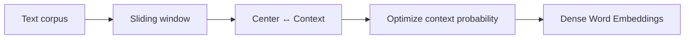
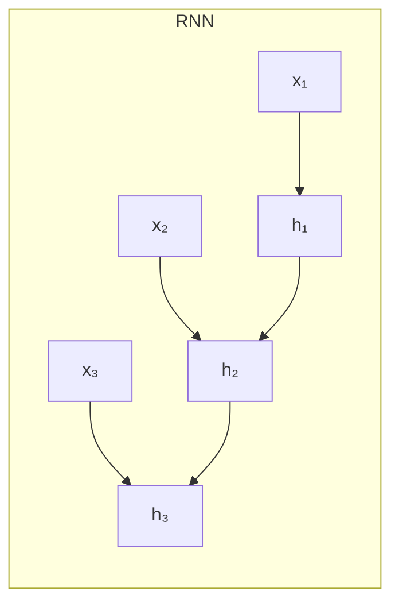
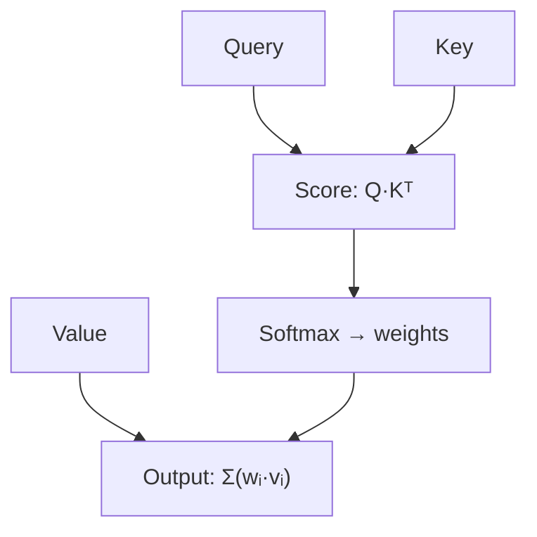
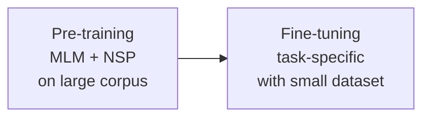

# Introduction to Natural Language Processing

> **Course:** Explainable and Trustworthy AI
> **Lecture:** 9
> **Date:** 2026-04-26
> **Source:** XAI_09_NLP_intro.pdf

## Overview

This lecture introduces the fundamentals of Natural Language Processing (NLP), covering the evolution from **one-hot** word representations to BERT's contextualized **word embeddings**. Topics include distributional semantics, the **Word2Vec** algorithm, recurrent neural networks (**RNN**, bidirectional, multi-layer), the **self-attention** mechanism, and the **Transformer** architecture, concluding with **BERT** and the pre-training/fine-tuning paradigm.

## Content

### Word Representations

#### One-Hot Encoding

The traditional representation encodes each word as a sparse vector with dimensionality equal to the vocabulary size. Every word is orthogonal to all others — no notion of similarity.

**Limitations**:
- Huge dimensionality (e.g., 500K)
- Dot product always zero → no semantic relationship

#### Distributional Semantics and Word2Vec

The meaning of a word emerges from the context in which it appears (*"You shall know a word by the company it keeps"*, Firth). **Word2Vec** learns dense fixed-size vectors that capture semantic similarity and relationships.

Vector operations capture analogies: $\vec{king} - \vec{man} + \vec{woman} \approx \vec{queen}$.

Pre-trained embeddings (Word2Vec, GloVe) can be downloaded and used as a starting point for neural networks.

**Limitations of static embeddings**: each word has a fixed vector regardless of context. Polysemy is not handled ("river bank" vs "money bank").

### Language Modeling and Recurrent Neural Networks

#### Window-Based Neural Network

A fixed-window approach takes the last $n$ words to predict the next one. Problems: arbitrary text length, different weights per position, no symmetry in word processing.

#### Recurrent Neural Networks (RNN)

RNNs apply the same weights $W$ at each timestep, maintaining a **hidden state** that accumulates information from the previous context.

**Sentence encoding**: the final hidden state or the element-wise mean/max of all hidden states.

**Improvements**:
- **Multi-layer RNN** — stacking layers for deeper representations
- **Bidirectional RNN** — left and right context (not applicable to language modeling)

| RNN Architecture | Typical tasks |
|---|---|
| One-to-one | Sentence classification |
| One-to-many | Text generation |
| Many-to-one | Sentiment analysis |
| Many-to-many | Translation, NER |

**Advantages**: process texts of any length, fixed model size.

**Limitations**: sequential propagation (not parallelizable), difficulty with long-distance dependencies (vanishing/exploding gradients).

### Self-Attention and Transformer

#### Self-Attention

Each word uses its own representation as a **query** to access information from a set of **values**, creating contextualized representations. Interaction distance $O(1)$ between words.

**Three problems and solutions**:

| Problem | Solution |
|---|---|
| No notion of order | **Positional encoding** added to embedding |
| No non-linearities | **Feed-forward network** after each layer |
| Access to future | **Masking** (set scores to $-\infty$) |

#### Transformer Architecture

The Transformer uses **multi-head attention**: multiple attention mechanisms in parallel, each learning different aspects.

Three variants:
- **Encoder**: bidirectional self-attention → classification
- **Decoder**: unidirectional masked attention → language modeling
- **Encoder-Decoder**: cross-attention for seq2seq (e.g., translation)

### BERT

**BERT** (Bidirectional Encoder Representations from Transformers) uses only the encoder with 12 layers (base). Since the encoder cannot do pure language modeling, it introduces two pre-training tasks:

- **Masked Language Modeling (MLM)**: mask 15% of tokens and predict them
- **Next Sentence Prediction (NSP)**: predict whether two sentences are consecutive

[CLS] token for classification, sub-token tokenization. Covered in detail in the next lab.

## Key Concepts

| Concept | Definition | Note |
|---|---|---|
| **Word Embedding** | Dense vector representation of a word | Word2Vec, GloVe: static, non-contextualized |
| **One-Hot Encoding** | Sparse 1/V vector for each word | No similarity between words |
| **Distributional semantics** | Meaning from contextual co-occurrences | Principle: "company it keeps" (Firth) |
| **RNN** | Network with shared weights over temporal sequence | Hidden state accumulates previous context |
| **Self-Attention** | Query/Key/Value for contextualized representations | O(1) interaction distance |
| **Multi-Head Attention** | Multiple attention heads in parallel | Each head learns different aspects |
| **Transformer** | Attention-based architecture without recurrence | Encoder (bidirectional), Decoder (unidirectional) |
| **BERT** | Pre-trained Transformer encoder with MLM + NSP | Bidirectional contextualized representations |
| **Positional Encoding** | Position information added to embedding | Needed because attention has no intrinsic order |
| **Fine-tuning** | Adapting pre-trained model to specific task | Small dataset sufficient |

## Connections

- BERT is the foundation for attention-based explainability methods covered in lecture 07.
- **Static word embeddings** (Word2Vec) are covered in depth in the Deep NLP course.
- The **Transformer** is the architecture behind LLMs, covered in the Large Language Models course.
- **RNNs** and the **vanishing gradient** problem are covered in Advanced Machine Learning.
- The next lab will use BERT via **HuggingFace** for classification and explainability.
