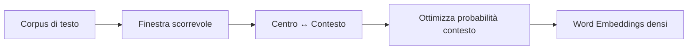
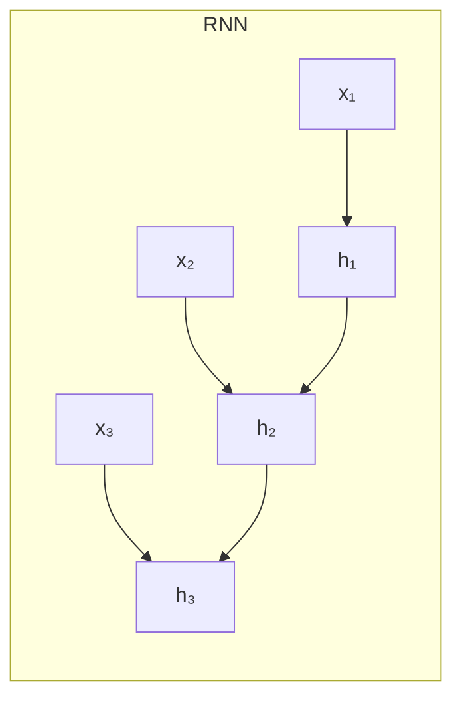
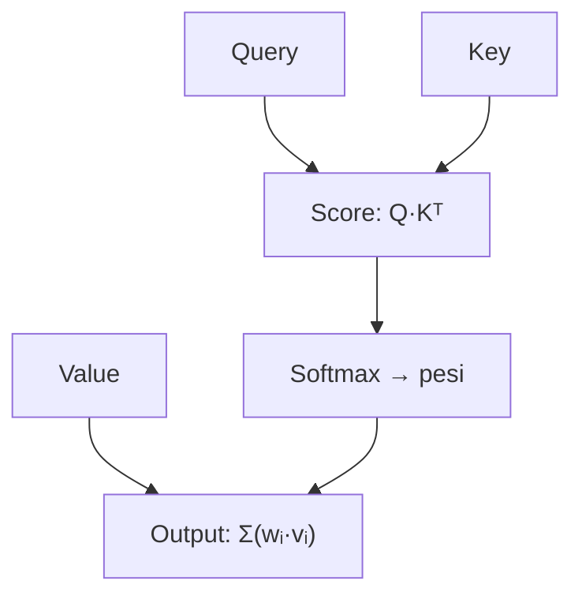
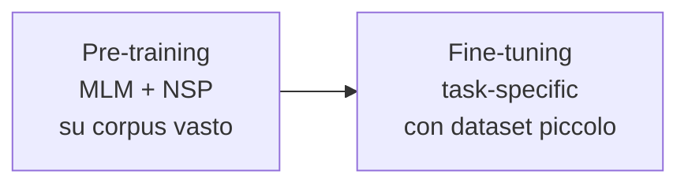

# Introduzione al Natural Language Processing

> **Course:** Explainable and Trustworthy AI
> **Lecture:** 9
> **Date:** 2026-04-26
> **Source:** XAI_09_NLP_intro.pdf

## Overview

Questa lezione introduce i fondamenti del Natural Language Processing (NLP), coprendo l'evoluzione dalla rappresentazione **one-hot** dei vocaboli fino ai **word embeddings** contestualizzati di BERT. Vengono presentati la semantica distribuzionale, l'algoritmo **Word2Vec**, le reti neurali ricorrenti (**RNN**, bidirezionali, multi-layer), il meccanismo di **self-attention** e l'architettura **Transformer**, concludendo con il modello **BERT** e il paradigma pre-training/fine-tuning.

## Content

### Rappresentazione delle Parole

#### One-Hot Encoding

La rappresentazione tradizionale codifica ogni parola come vettore sparso di dimensione pari al vocabolario. Ogni parola è ortogonale alle altre — nessuna nozione di similarità.

**Limitazioni**:
- Dimensionalità enorme (es. 500K)
- Prodotto scalare sempre zero → nessuna relazione semantica

#### Semantica Distribuzionale e Word2Vec

Il significato di una parola emerge dal contesto in cui appare (*"You shall know a word by the company it keeps"*, Firth). **Word2Vec** impara vettori densi a dimensione fissa che catturano similarità e relazioni semantiche.

Le operazioni vettoriali catturano analogie: $\vec{king} - \vec{man} + \vec{woman} \approx \vec{queen}$.

I pre-trained embeddings (Word2Vec, GloVe) si scaricano e usano come punto di partenza per reti neurali.

**Limitazioni degli embeddings statici**: ogni parola ha un vettore fisso, indipendente dal contesto. La polisemia non è gestita ("river bank" vs "money bank").

### Language Modeling e Retrici Neurali

#### Window-Based Neural Network

Un approccio con finestra fissa prende le ultime $n$ parole per predire la successiva. Problemi: testo di lunghezza arbitraria, pesi diversi per posizione, nessuna simmetria nel trattamento delle parole.

#### Reti Neurali Ricorrenti (RNN)

Le RNN applicano gli stessi pesi $W$ ad ogni timestep, mantenendo uno **hidden state** che accumula informazione dal contesto precedente.

**Encoding delle frasi**: l'hidden state finale o l'element-wise mean/max di tutti gli hidden states.

**Miglioramenti**:
- **Multi-layer RNN** — stacking di layer per rappresentazioni più profonde
- **Bidirectional RNN** — contesto sinistro e destro (non applicabile al language modeling)

| Architettura RNN | Task tipici |
|---|---|
| One-to-one | Classificazione frase |
| One-to-many | Generazione testo |
| Many-to-one | Sentiment analysis |
| Many-to-many | Traduzione, NER |

**Vantaggi**: processo testi di qualsiasi lunghezza, dimensione fissa del modello.

**Limitazioni**: propagazione sequenziale (non parallelizzabile), difficoltà con dipendenze a lungo termine (vanishing/exploding gradients).

### Self-Attention e Transformer

#### Self-Attention

Ogni parola usa la propria rappresentazione come **query** per accedere informazioni da un insieme di **value**, creando rappresentazioni contestualizzate. Distanza di interazione $O(1)$ tra parole.

**Tre problemi e soluzioni**:

| Problema | Soluzione |
|---|---|
| Nessuna nozione di ordine | **Positional encoding** aggiunto all'embedding |
| Assenza di non-linearità | **Feed-forward network** dopo ogni layer |
| Accesso al futuro | **Masking** (setta score a $-\infty$) |

#### Architettura Transformer

Il Transformer usa **multi-head attention**: multipli meccanismi di attention in parallelo, ognuno impara aspetti diversi.

Tre varianti:
- **Encoder**: self-attention bidirezionale → classificazione
- **Decoder**: masked attention unidirezionale → language modeling
- **Encoder-Decoder**: cross-attention per seq2seq (es. traduzione)

### BERT

**BERT** (Bidirectional Encoder Representations from Transformers) usa solo l'encoder con 12 layer (base). Poiché l'encoder non può fare language modeling puro, introduce due task di pre-training:

- **Masked Language Modeling (MLM)**: maschera il 15% dei token e li predice
- **Next Sentence Prediction (NSP)**: predice se due frasi sono consecutive

Token [CLS] per classificazione, sub-token tokenization. Approfondito nel prossimo lab.

## Key Concepts

| Concetto | Definizione | Nota |
|---|---|---|
| **Word Embedding** | Rappresentazione vettoriale densa di una parola | Word2Vec, GloVe: statici, non contestualizzati |
| **One-Hot Encoding** | Vettore sparso 1/V per ogni parola | Nessuna similarità tra parole |
| **Semantica distribuzionale** | Significato dalle co-occorrenze contestuali | Principio: "company it keeps" (Firth) |
| **RNN** | Rete con pesi condivisi su sequenza temporale | Hidden state accumula contesto precedente |
| **Self-Attention** | Query/Key/Value per rappresentazioni contestualizzate | Distanza di interazione O(1) |
| **Multi-Head Attention** | Multipli attention head in parallelo | Ogni head impara aspetti diversi |
| **Transformer** | Architettura basata su attention, senza ricorrenza | Encoder (bidirezionale), Decoder (unidirezionale) |
| **BERT** | Transformer encoder pre-trainato con MLM + NSP | Rappresentazioni bidirezionali contestualizzate |
| **Positional Encoding** | Informazione di posizione aggiunta all'embedding | Necessaria perché attention non ha ordine intrinseco |
| **Fine-tuning** | Adattamento del modello pre-trainato a task specifico | Dataset piccolo sufficiente |

## Connections

- BERT è la base per i metodi di spiegabilità basati su attention analizzati a lezione 07.
- I **word embeddings statici** (Word2Vec) sono approfonditi nel corso di Deep NLP.
- Il **Transformer** è l'architettura alla base degli LLM, corso Large Language Models.
- Le **RNN** e il **vanishing gradient** sono trattati in Advanced Machine Learning.
- Il prossimo lab userà BERT via **HuggingFace** per classificazione e spiegabilità.
