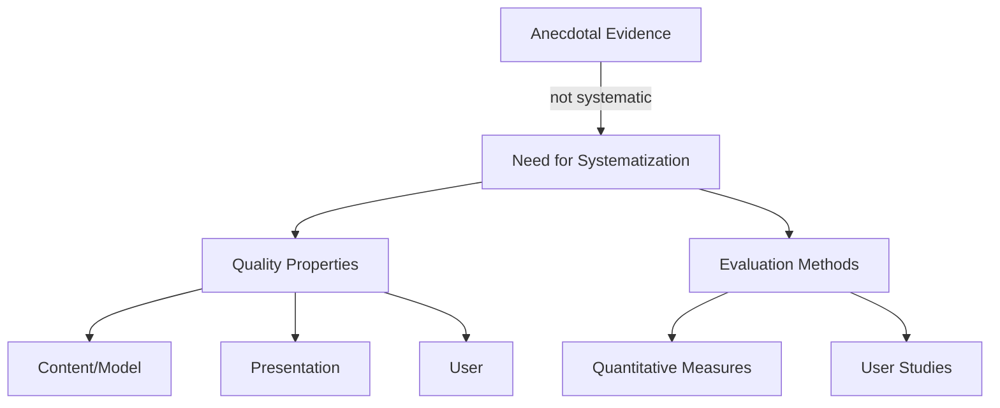
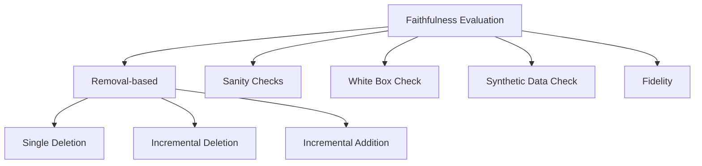

# Evaluation of Explanations in XAI

> **Course:** Explainable and Trustworthy AI
> **Lecture:** 10
> **Date:** 2026-04-09
> **Source:** XAI_10_evaluation.pdf

## Overview

This lecture presents a systematic framework for evaluating the quality of explanations produced by Explainable AI methods, moving beyond the anecdotal evidence approach. The taxonomy by Nauta et al. (2023) is introduced, organizing quality properties into three dimensions — **Content/Model**, **Presentation**, and **User** — along with quantitative methods to measure them, with particular focus on faithfulness through removal-based techniques, sanity checks, white box checks, synthetic data checks, and fidelity measures.

## Content

### From Anecdotal Evidence to Systematization

The anecdotal approach to explanation evaluation consists of showing visually convincing examples: an explanation appears valid, plausible, and clear. This approach **does not allow** a systematic, quantifiable, and comparable analysis of explanation quality. A framework is needed that defines:

1. The **quality properties** of explanations
2. The **evaluation methods** and measures to quantify them

The primary reference is the survey by Nauta et al. (2023): *"From anecdotal evidence to quantitative evaluation methods: A systematic review on evaluating explainable AI"*, ACM Computing Surveys 55.13s (2023): 1-42.

### Fundamental Distinction: Faithfulness vs Plausibility

Two properties are often conflated but fundamentally different:

- **Plausibility**: alignment of the explanation with **human reasoning**, what we expect as humans
- **Faithfulness**: alignment of the explanation with **model behavior**, its inner workings

We cannot assume that explanations provided by a method are **faithful by default**. There is no guarantee that a plausible explanation reflects the model's internal reasoning, and vice versa. A non-plausible explanation could indicate an error in the model's reasoning **or** an error in the explanation method.

### Quality Properties — Content/Model

Content/Model properties evaluate the explanation in relation to the behavior of model $f$.

#### Faithfulness

Faithfulness measures the alignment of the explanation with the inner workings of model $f$: *"Does the explanation reflect the model's behavior?"* It is subdivided into:

- **Correctness / Comprehensiveness**: whether the explanation captures all elements relevant for the output of $f$
- **Completeness / Sufficiency**: the extent to which the explanation covers the model's output, i.e., whether the set of highlighted elements is **sufficient** to explain the output of $f$

#### Consistency

Identical inputs should produce identical explanations. It assesses how **deterministic** the explanation method is. It includes **Implementation Invariance**: two models that produce the same outputs for all inputs should have the same explanations.

#### Continuity

Similar inputs should produce similar explanations. It describes how continuous/smooth the explanation function is. For small variations in the input, we expect not only a similar model response but also a similar explanation.

#### Contrastivity

Describes how **discriminative** the explanation is with respect to other targets or events. An explanation should not only explain the "why" but also the "why not", i.e., why some other event did not occur. It includes **separability**: non-identical instances from different populations must have dissimilar explanations.

#### Covariate Complexity

The complexity of the covariates (features) used in the explanation. Covariates should be **comprehensible**, using an interpretable data representation.

### Quality Properties — Presentation

Presentation properties concern the format and structure of the explanation.

#### Compactness

The size of the explanation, motivated by the limitation of human cognitive capacity. Explanations should be **sparse, short, and non-redundant**. A more compact explanation is more understandable. Measurable as the number of features in the explanation, length of the rule/path, or redundancy (lower overlap among explanations = higher interpretability).

#### Composition

Describes the presentation format, organization, and structure of the explanation. It should prioritize clear forms of explanation and higher-level information. The preferred form may vary based on the target users.

#### Confidence

Describes whether the explanation includes a measure of **uncertainty**. Few methods assess this aspect.

### Quality Properties — User

User properties evaluate the explanation from the user's perspective.

#### Plausibility/Coherence

Assesses the alignment of the explanation with human reasoning, with relevant background knowledge, beliefs, and general consensus. Also known as **reasonableness** and agreement with human rationales. Evaluated through:

- **User studies**
- **Comparison with ground truth** from datasets annotated with human rationales (similarity measures, e.g., rank correlation for feature importance, Intersection-over-Union for saliency maps, ROUGE and BLEU for textual explanations)
- **XAI Methods agreement**: comparing a novel explainer with an established one

#### Context

Describes how **relevant** the explanation is to the user and their needs. Explanations should be designed for the user, based on their expertise level and the stakeholder involved (data scientist, domain expert, policy maker, data controller).

#### Controllability

Assesses how much a user can **control, correct, or interact** with an explanation.

### Evaluation Methods for Faithfulness

The methods for evaluating faithfulness represent the quantitative core of the lecture.

#### Removal-based Methods

They study the effect of removing/perturbing what the explanation highlights and measure the effect on the output of $f$. Used for **feature attribution** methods. Problem: as with removal-based explanations, this generates **out-of-distribution** samples.

**I — Single Deletion**: Evaluates the change in output when removing/perturbing a single feature.

- Removing the feature with the highest importance score should cause the **largest change** in the output
- Removing the least important feature should have **no impact**
- A feature with no effect on the output should have importance **zero**

**II — Incremental Deletion**: Iteratively remove features, in descending order (from most to least important) or ascending order. Often subsets are removed, e.g., the top-k most influential and the bottom-k.

$$\text{Impact} = \text{Area over the Perturbation Curve (AOPC)}$$

$$\text{AOPC} = \frac{1}{K} \sum_{k=1}^{K} \left( f(x) - f(x_{\setminus k}) \right)$$

where $x_{\setminus k}$ is the input with the top $k$ features removed.

**III — Incremental Addition**: Iteratively add features starting from an "empty" input.

#### Evaluating Comprehensiveness (Correctness)

Incremental Deletion evaluates the **comprehensiveness** of the explanation:

- Measure the **drop in model probability** if the important attributes are removed — are they all captured?
- Filter out attributes with negative contribution (they pull the prediction away from the chosen label)
- Progressively consider the $k$ most important attributes (e.g., $k$ from 10% to 100%, step of 10%)
- Average the result
- **Higher drop is better** (if we remove truly important attributes, we expect a large drop)

#### Evaluating Sufficiency (Completeness)

Incremental Deletion also evaluates **sufficiency**:

- Measure the **drop in model probability** if the **non-important** attributes are removed, keeping only the important ones
- If we preserve the important attributes, we expect **no drop or a minimal drop**
- Filter out attributes with negative contribution
- Progressively consider the $k$ least important attributes
- Average the result
- **Closer to zero is better**

| Property | What is measured | What is removed | Target |
|---|---|---|---|
| **Comprehensiveness** | Drop removing important attributes | Top-k positive attributes | High drop |
| **Sufficiency** | Drop removing non-important attributes | Bottom-k attributes | Drop close to 0 |

#### Sanity Checks

**Model Parameter Randomization Check**: Measures the sensitivity of the explanation to model $f$. Compare the explanation of model $f$ with the explanation when the parameters are **randomized** or weights are re-initialized. We expect a **change** in the explanation. If there is no change after randomization, the explanation is not sensitive to $f$ and does not reflect its inner reasoning.

#### White Box Check

Use interpretable approaches to derive **ground truth** explanations:

1. Use an explanation method to explain the prediction of a **white box classifier**
2. Compare the explanation with the "ground-truth" explanation from the white box model
3. Evaluate how closely the explanation reflects the true one

#### Synthetic Data Check

Use synthetic data to control model behavior and assume the ground truth explanation:

1. Train a model on **controlled synthetic data** — we expect the model to learn such patterns (e.g., "if attribute = 1, class = 1")
2. Compare the explanation with the ground-truth one based on the controlled data
3. Evaluate how closely the explanation reflects the true one

Note: we are assuming that model $f$ has learned the intended reasoning.

#### Fidelity

**Fidelity** measures the agreement between the output of $f$ and the explanation when applied to the input: how well the explanations **mimic** the output of $f$ if used to make predictions.

- Use the explanation to make a prediction (e.g., by applying a surrogate model or using feature weights to generate a linear model)
- Verify whether the output of $f$ and the explanation **match**
- Measurable as the fraction of samples for which $f$ and the explanation make the **same decision**

$$\text{Fidelity} = \frac{|\{x : f(x) = g(x)\}|}{N}$$

where $g$ is the surrogate model/explanation and $N$ is the number of samples.

Differs from comprehensiveness/sufficiency: it compares **outputs**, not the reasoning process.

### Evaluating Other Properties

#### Consistency — Implementation Invariance

Two models that produce the same outputs for all inputs should have the same explanations. Example: similarity between feature importance scores across different random initializations of $f$.

#### Continuity — Stability/Sensitivity/Robustness

Measures the similarity between explanations for an instance $x$ and its slightly different version:

- Consider a neighbor sample or a perturbation by adding noise
- Compute similarity, e.g., **rank order correlation** or **cosine similarity**

$$\text{Stability}(x) = \text{sim}(\text{Expl}(x),\, \text{Expl}(x + \epsilon))$$

#### Contrastivity — Target Sensitivity

Features highlighted by an explanation for a certain class should **differ** between different classes. Compute similarity between explanations for $x$ with respect to different classes. **The larger the difference, the better the explanation**.

#### Covariate Complexity

Often used for **Concept-based XAI**. Includes:

- **Covariate Homogeneity**: how consistently a covariate (e.g., prototype/cluster of images) represents a predefined human-interpretable concept
- **Disentanglement**: how disentangled the covariates are — e.g., a prototype represents a single concept

### Summary of Evaluation Methods by Dimension

| Dimension | Property | Main Method |
|---|---|---|
| **Content/Model** | Faithfulness (Comprehensiveness) | Incremental Deletion |
| **Content/Model** | Faithfulness (Sufficiency) | Incremental Deletion (inverse) |
| **Content/Model** | Consistency | Implementation Invariance |
| **Content/Model** | Continuity | Stability/Sensitivity |
| **Content/Model** | Contrastivity | Target Sensitivity |
| **Content/Model** | Covariate Complexity | Homogeneity, Disentanglement |
| **Presentation** | Compactness, Composition | User studies, anecdotal evidence |
| **Presentation** | Confidence | Check for uncertainty information |
| **User** | Plausibility | User studies, comparison with human rationales |
| **User** | Context | User studies |
| **User** | Controllability | User studies, anecdotal evidence |

## Key Concepts

| Concept | Definition | Note |
|---|---|---|
| **Faithfulness** | Alignment of the explanation with the model's internal behavior | Fundamental property; do not assume faithfulness by default |
| **Plausibility** | Alignment of the explanation with human reasoning and prior knowledge | Distinct from faithfulness; a plausible explanation may not be faithful |
| **Comprehensiveness** | The explanation captures all elements relevant for the output | Evaluated via Incremental Deletion: high drop = good |
| **Sufficiency** | The set of highlighted elements is sufficient to explain the output | Evaluated via inverse Incremental Deletion: drop close to 0 = good |
| **Sanity Check** | Verifies that the explanation is sensitive to model parameters | Weight randomization: if explanation does not change, it is not faithful |
| **Fidelity** | Agreement between model output and explanation output when used as predictor | Differs from comprehensiveness: compares outputs, not reasoning |
| **Implementation Invariance** | Models with identical outputs must have identical explanations | Sub-property of consistency |
| **Target Sensitivity** | Explanations for different classes should differ | Measures the contrastivity of the explanation |
| **Compactness** | The explanation should be short, sparse, and non-redundant | Motivated by human cognitive limitations |
| **AOPC** | Area over the Perturbation Curve: measures impact of iterative feature removal | Quantitative metric for removal-based evaluation |

## Connections

- Explanation evaluation addresses the need identified in lecture 07 (gradient-based methods) and lecture 06 (explanation by removal), where it was observed that **different methods produce different explanations** for the same input.
- **Removal-based evaluation** methods (Single Deletion, Incremental Deletion/Addition) are conceptually linked to the removal-based explanation methods covered in lecture 06 (Occlusion, Meaningful Perturbation).
- **Fidelity** with surrogate models directly connects to surrogate-based methods (LIME) covered in lecture 05: the local surrogate model is evaluated on how well it approximates the original model's behavior.
- **Sanity checks** with parameter randomization are applicable to all explanation methods seen in the course: gradient-based (lectures 07-08), perturbation-based (lecture 06), and surrogate-based (lecture 05).
- The Presentation and User properties anticipate the discussion on **how to present explanations** to end users and the human-centered perspective of explainability, covered in subsequent lectures.