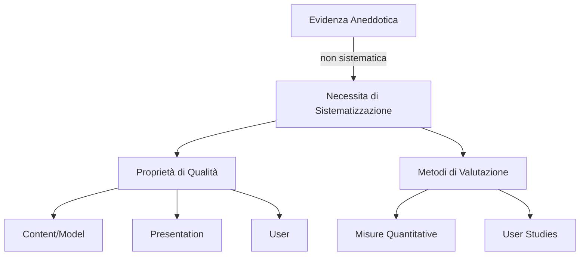
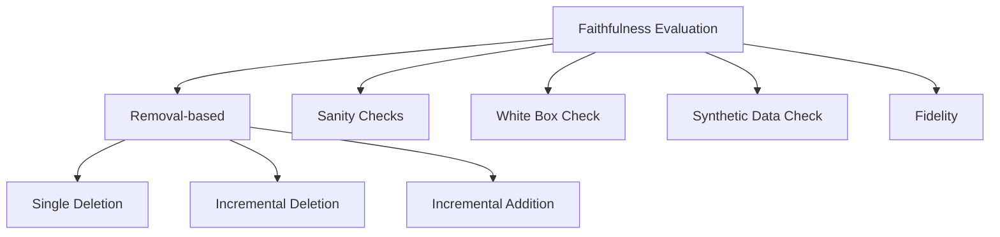

# Valutazione delle Spiegazioni nell'XAI

> **Course:** Explainable and Trustworthy AI
> **Lecture:** 10
> **Date:** 2026-04-09
> **Source:** XAI_10_evaluation.pdf

## Overview

Questa lezione presenta un framework sistematico per la valutazione della qualità delle spiegazioni prodotte dai metodi di Explainable AI, superando l'approccio basato su evidenza aneddotica. Viene introdotta la tassonomia di Nauta et al. (2023) che organizza le proprietà di qualità in tre dimensioni — **Content/Model**, **Presentation** e **User** — e vengono descritti i metodi quantitativi per misurarle, con particolare focus sulla fedeltà (faithfulness) attraverso tecniche di rimozione, sanity check, white box check, synthetic data check e misure di fedeltà (fidelity).

## Content

### Dall'Evidenza Aneddotica alla Sistematizzazione

L'approccio aneddotico alla valutazione delle spiegazioni si limita a mostrare esempi visivamente convincenti: una spiegazione appare valida, plausibile e chiara. Questo approccio **non consente** un'analisi sistematica, quantificabile e comparabile della qualità delle spiegazioni. È necessario un framework che definisca:

1. Le **proprietà di qualità** della spiegazione
2. I **metodi di valutazione** e le misure per quantificarle

Il riferimento principale e la survey di Nauta et al. (2023): *"From anecdotal evidence to quantitative evaluation methods: A systematic review on evaluating explainable AI"*, ACM Computing Surveys 55.13s (2023): 1-42.

### Distinzione Fondamentale: Faithfulness vs Plausibility

Due proprita sono spesso confuse ma fondamentalmente diverse:

- **Plausibility (Plausibilita)**: allineamento della spiegazione con il **ragionamento umano**, cio che ci aspettiamo come esseri umani
- **Faithfulness (Fedeltà)**: allineamento della spiegazione con il **comportamento del modello**, il suo funzionamento interno

Non si può assumere che le spiegazioni fornite da un metodo siano **fedeli per default**. Non vi è garanzia che una spiegazione plausibile rifletta il ragionamento interno del modello, e viceversa. Una spiegazione non plausibile potrebbe indicare un errore nel ragionamento del modello **oppure** un errore nel metodo di spiegazione.

### Proprietà di Qualità — Content/Model

Le proprietà Content/Model valutano la spiegazione in relazione al comportamento del modello $f$.

#### Faithfulness (Fedeltà)

La faithfulness misura l'allineamento della spiegazione con il funzionamento interno del modello $f$: *"La spiegazione riflettè il comportamento del modello?"*. Si suddivide in:

- **Correctness (Correttezza) / Comprehensiveness**: la spiegazione cattura tutti gli elementi rilevanti per l'output di $f$
- **Completeness (Completezza) / Sufficiency**: la spiegazione copre l'output del modello, ovvero se l'insieme di elementi evidenziati e **sufficiente** per spiegare l'output di $f$

#### Consistency (Consistenza)

Input identici devono produrre spiegazioni identiche. Valuta quanto il metodo di spiegazione è **deterministico**. Include la **Implementation Invariance**: due modelli che producono gli stessi output per tutti gli input devono avere le stesse spiegazioni.

#### Continuity (Continuita)

Input simili devono produrre spiegazioni simili. Descrive quanto la funzione di spiegazione è continua/regolare. Per piccole variazioni dell'input, ci si aspetta non solo una risposta del modello simile, ma anche una spiegazione simile.

#### Contrastivity (Contrastivita)

Descrive quanto la spiegazione è **discriminante** rispetto ad altri target o eventi. Una spiegazione non dovrebbe spiegare solo il "perché", ma anchè il "perché no", ovvero perché un altro evento non si e verificato. Include la **separabilita**: istanze non identiche di popolazioni diverse devono avere spiegazioni dissimili.

#### Covariate Complexity (Complessità delle Covariate)

La complessità delle covariate (feature) usate nella spiegazione. Le covariate dovrebbero essere **comprensibili**, utilizzando una rappresentazione dei dati interpretabile.

### Proprietà di Qualità — Presentation

Le proprietà Presentation riguardano il formato e la struttura della spiegazione.

#### Compactness (Compattezza)

La dimensione della spiegazione, motivata dalla limitazione della capacita cognitiva umana. Le spiegazioni dovrebbero essere **sparse, brevi e non ridondanti**. Una spiegazione più compatta e più comprensibile. Misurabile come numero di feature nella spiegazione, lunghezza della regola/percorso, o ridondanza (minore sovrapposizione tra spiegazioni = maggiore interpretabilità).

#### Composition (Composizione)

Descrivè il formato di presentazione, l'organizzazione e la struttura della spiegazione. Dovrebbe privilegiare forme chiare di spiegazione e informazioni di alto livello. La forma preferita può variare in base agli utenti target.

#### Confidence (Confidenza)

Descrive se la spiegazione include una misura di **incertezza**. Pochi metodi valutano questo aspetto.

### Proprietà di Qualità — User

Le proprietà User valutano la spiegazione dal punto di vista dell'utente.

#### Plausibility/Coherence (Plausibilita/Coerenza)

Valuta l'allineamento della spiegazione con il ragionamento umano, con conoscenze pregresse, credenze e consenso generale. Anche nota come **ragionevolezza** e accordo con le razionali umane. Valutata tramite:

- **User studies**
- **Confronto con ground truth** da dataset annotati con razionali umane (similarita, es. rank correlation per feature importance, Intersection-over-Union per saliency map, ROUGE e BLEU per spiegazioni testuali)
- **Accordo tra metodi XAI**: confronto di un nuovo explainer con uno consolidato

#### Context (Contesto)

Descrive quanto la spiegazione e **rilevante** per l'utente e le sue esigenze. Le spiegazioni dovrebbero essere progettate per l'utente, in base al livello di competenza e allo stakeholder coinvolto (data scientist, domain expert, policy maker, data controller).

#### Controllability (Controllabilita)

Valuta quanto un utente può **controllare, correggere o interagire** con una spiegazione.

### Metodi di Valutazione per la Faithfulness

I metodi per valutare la faithfulness rappresentano il nucleo quantitativo della lezione.

#### Metodi basati sulla Rimozione

Studiano l'effetto della rimozione/perturbazione di cio che la spiegazione evidenzia, misurando l'effetto sull'output di $f$. Usati per metodi di **feature attribution**. Problema: come per le spiegazioni basate su rimozione, si generano **campioni out-of-distribution**.

**I — Single Deletion**: Valuta il cambiamento nell'output quando si rimuove/perturba una singola feature.

- Rimuovere la feature con lo score di importanza più alto dovrebbe causarè il **maggiore cambiamento** nell'output
- Rimuovere la feature meno importante dovrebbe avere **nessun impatto**
- Una feature senza effetto sull'output dovrebbe avere importanza **zero**

**II — Incremental Deletion**: Rimozione iterativa delle feature, in ordine decrescente (dalla più importante alla meno importante) o crescente. Spesso si rimuovono sottoinsiemi, es. le top-k più influenti e le bottom-k.

$$\text{Impatto} = \text{Area over the Perturbation Curve (AOPC)}$$

$$\text{AOPC} = \frac{1}{K} \sum_{k=1}^{K} \left( f(x) - f(x_{\setminus k}) \right)$$

dove $x_{\setminus k}$ e l'input con le prime $k$ feature rimosse.

**III — Incremental Addition**: Aggiunta iterativa a partire da un input "vuoto".

#### Valutazione della Comprehensiveness (Correttezza)

L'Incremental Deletion valuta la **comprehensiveness** della spiegazione:

- Si misura il **calo di probabilità** del modello se si rimuovono gli attributi importanti — sono tutti catturati?
- Si filtrano gli attributi con contributo negativo
- Si considerano progressivamente i $k$ attributi più importanti (es. $k$ dal 10% al 100%, passo del 10%)
- Si media il risultato
- **Migliore è il calo più alto** (se rimuoviamo gli attributi veramente importanti, ci aspettiamo un forte calo)

#### Valutazione della Sufficiency (Completezza)

L'Incremental Deletion valuta anche la **sufficiency**:

- Si misura il **calo di probabilità** se si rimuovono gli attributi **non** importanti, mantenendo solo quelli importanti
- Se preserviamo gli attributi importanti, ci aspettiamo **nessun calo o calo minimo**
- Si filtrano gli attributi con contributo negativo
- Si considerano progressivamente i $k$ attributi meno importanti
- Si media il risultato
- **Migliore è il valore più vicino a zero**

| Proprietà | Cosa si misura | Cosa si rimuove | Obiettivo |
|---|---|---|---|
| **Comprehensiveness** | Calo rimuovendo attributi importanti | Top-k attributi positivi | Calo elevato |
| **Sufficiency** | Calo rimuovendo attributi non importanti | Bottom-k attributi | Calo vicino a 0 |

#### Sanity Checks

**Model Parameter Randomization Check**: Misura la sensibilità della spiegazione al modello $f$. Si confronta la spiegazione del modello $f$ con la spiegazione quando si **randomizzano i parametri** o si re-inizializzano i pesi. Ci si aspetta un **cambiamento** nella spiegazione. Se non cambia dopo la randomizzazione, la spiegazione non è sensibile a $f$ e non riflettè il ragionamento interno del modello.

#### White Box Check

Si utilizzano approcci interpretabili per derivare spiegazioni **ground truth**:

1. Si usa un metodo di spiegazione per spiegare la predizione di un **classificatore white box**
2. Si confronta la spiegazione con la spiegazione "ground truth" dal modello white box
3. Si valuta quanto la spiegazione riflette quella vera

#### Synthetic Data Check

Si utilizzano dati sintetici per controllarè il comportamento del modello e assumere la spiegazione ground truth:

1. Si addestra un modello su **dati sintetici controllati** — ci si aspetta chè il modello apprenda tali pattern (es. "se attributo = 1, classe = 1")
2. Si confronta la spiegazione con quella ground truth basata sui dati controllati
3. Si valuta quanto la spiegazione riflette quella vera

Nota: si assume chè il modello $f$ abbia appreso il ragionamento inteso.

#### Fidelity

La **fidelity** misura l'accordo tra l'output di $f$ e la spiegazione quando applicata all'input: quanto bene le spiegazioni **mimano** l'output di $f$ se usate per fare predizioni.

- Si usa la spiegazione per fare una predizione (es. applicando un modello surrogato o usando i pesi delle feature per generare un modello lineare)
- Si verifica se l'output di $f$ e della spiegazione **coincidono**
- Misurabile come la frazione di campioni per cui $f$ e la spiegazione prendono la **stessa decisione**

$$\text{Fidelity} = \frac{|\{x : f(x) = g(x)\}|}{N}$$

dove $g$ è il modello surrogato/spiegazione e $N$ il numero di campioni.

Differisce da comprehensiveness/sufficiency: confronta gli **output**, non il processo di ragionamento.

### Valutazione delle Altre Proprietà

#### Consistency — Implementation Invariance

Due modelli che producono gli stessi output per tutti gli input devono avere le stesse spiegazioni. Esempio: similarita tra gli score di importanza delle feature attraverso diverse inizializzazioni random di $f$.

#### Continuity — Stability/Sensitivity/Robustness

Misura la similarita tra spiegazioni per un'istanza $x$ e una sua versione leggermente diversa:

- Si considera un campione vicino o una perturbazione con rumore
- Si calcola la similarita, es. **rank order correlation** o **cosine similarity**

$$\text{Stability}(x) = \text{sim}(\text{Expl}(x),\, \text{Expl}(x + \epsilon))$$

#### Contrastivity — Target Sensitivity

Le feature evidenziate dalla spiegazione per una certa classe dovrebbero **differire** tra classi diverse. Si calcola la similarita tra spiegazioni per $x$ rispetto a classi diverse. **Maggiore è la differenza, migliore è la spiegazione**.

#### Covariate Complexity

Spesso usata per **Concept-based XAI**. Include:

- **Covariate Homogeneity**: quanto costantemente una covariate (es. prototipo/cluster di immagini) rappresenta un concetto interpretabile
- **Disentanglement**: quanto le covariate sono disentangled — es. un prototipo rappresenta un singolo concetto

### Riepilogo dei Metodi di Valutazione per Dimensione

| Dimensione | Proprietà | Metodo Principale |
|---|---|---|
| **Content/Model** | Faithfulness (Comprehensiveness) | Incremental Deletion |
| **Content/Model** | Faithfulness (Sufficiency) | Incremental Deletion (inverso) |
| **Content/Model** | Consistency | Implementation Invariance |
| **Content/Model** | Continuity | Stability/Sensitivity |
| **Content/Model** | Contrastivity | Target Sensitivity |
| **Content/Model** | Covariate Complexity | Homogeneity, Disentanglement |
| **Presentation** | Compactness, Composition | User studies, evidenza aneddotica |
| **Presentation** | Confidence | Verifica presenza informazione incertezza |
| **User** | Plausibility | User studies, confronto con razionali umane |
| **User** | Context | User studies |
| **User** | Controllability | User studies, evidenza aneddotica |

## Key Concepts

| Concetto | Definizione | Nota |
|---|---|---|
| **Faithfulness** | Allineamento della spiegazione con il comportamento interno del modello | Proprietà fondamentale; non assumere fedeltà per default |
| **Plausibility** | Allineamento della spiegazione con il ragionamento umano e le conoscenze pregresse | Distinta dalla faithfulness; una spiegazione plausibile può non essere fedele |
| **Comprehensiveness** | La spiegazione cattura tutti gli elementi rilevanti per l'output | Valutata con Incremental Deletion: calo elevato = buona |
| **Sufficiency** | L'insieme di elementi evidenziati e sufficiente per spiegare l'output | Valutata con Incremental Deletion inverso: calo vicino a 0 = buona |
| **Sanity Check** | Verifica che la spiegazione sia sensibile ai parametri del modello | Randomizzazione dei pesi: se la spiegazione non cambia, non è fedele |
| **Fidelity** | Accordo tra output del modello e output della spiegazione usata come predittore | Differisce da comprehensiveness: confronta output, non ragionamento |
| **Implementation Invariance** | Modelli con output identici devono avere spiegazioni identiche | Sotto-proprietà della consistency |
| **Target Sensitivity** | Spiegazioni per classi diverse devono essere diverse | Misura la contrastivita della spiegazione |
| **Compactness** | La spiegazione dovrebbe essere breve, sparsa e non ridondante | Motivata dalla limitazione cognitiva umana |
| **AOPC** | Area over the Perturbation Curve: misura dell'impatto della rimozione iterativa delle feature | Metrica quantitativa per removal-based evaluation |

## Connections

- La valutazione delle spiegazioni risponde alla necessità emersa nella lezione 07 (metodi gradient-based) e lezione 06 (explanation by removal), dove si osserva che **metodi diversi producono spiegazioni diverse** per lo stesso input.
- I metodi di **removal-based evaluation** (Single Deletion, Incremental Deletion/Addition) sono concettualmente legati ai metodi di spiegazione per rimozione visti nella lezione 06 (Occlusion, Meaningful Perturbation).
- La **fidelity** con modelli surrogati collega direttamente ai metodi surrogate-based (LIME) trattati nella lezione 05: il modello surrogato locale viene valutato per quanto bene approssima il comportamento del modello originale.
- Le **sanity checks** con randomizzazione dei parametri sono applicabili a tutti i metodi di spiegazione visti nel corso: gradient-based (lezioni 07-08), perturbation-based (lezione 06) e surrogate-based (lezione 05).
- Le proprietà Presentation e User anticipano la discussione su **come presentare le spiegazioni** agli utenti finali e la prospettiva human-centered dell'explainability, temi trattati nelle lezioni successive.