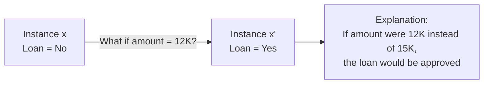
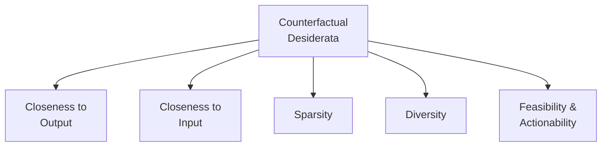
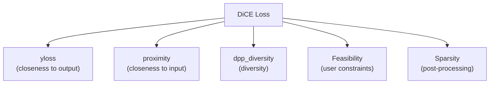
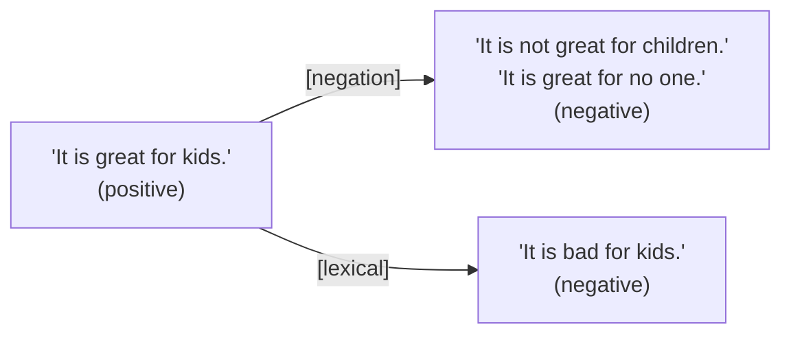

# Counterfactual Explanations in XAI

> **Course:** Explainable and Trustworthy AI
> **Lecture:** 13
> **Date:** 2026-05-10
> **Source:** XAI_13_counterfactuals.pdf

## Overview

This lecture introduces counterfactual explanations, an example-based explanation method that answers the "What if...?" question by identifying the smallest change in feature values that alters the model's prediction. The lecture covers the fundamental desiderata (closeness to the output, closeness to the input, sparsity, diversity, feasibility), the pioneering Wachter et al. algorithm with its balanced loss function, the DiCE extension for generating diverse and feasible counterfactuals, the application to NLP with Polyjuice, and quantitative and cognitive evaluation metrics.

## Content

### Introduction to Counterfactual Explanations

Counterfactual explanations involve changing some aspects of an input to see how the output changes, answering the question **"What if...?"**. Their purpose is to provide insight into model decision-making by illustrating how small changes can lead to different outcomes.

Given an instance $x$ with prediction $y = f(x)$ and a desired output $y'$, a **counterfactual explanation** describes the smallest change to the feature values that changes the prediction to a predefined output. It is an **example-based** explanation, as it produces a new instance $x'$ that, starting from $x$, has some features modified.

### Why Counterfactual Explanations?

Counterfactual explanations offer three main advantages:

- **Interpretability**: help users understand the model's decision boundary, as they involve changing few features
- **Trust**: show how decisions can be altered, providing insights also when users should contest the decision (e.g., if changing the outcome requires modifying a sensitive and protected attribute)
- **Actionability**: offer actionable insights on how to change outcomes

### Desiderata of Counterfactual Explanations

A good counterfactual should satisfy the following properties:

| Property | Description |
|---|---|
| **Closeness to the output** | The counterfactual should produce the predefined prediction as closely as possible |
| **Closeness to the input** | The counterfactual's features should be as similar as possible to the original instance |
| **Sparsity** | The counterfactual should change only a few features |
| **Diversity** | Generate multiple counterfactual explanations that are different from each other, to identify the most suitable alterations |
| **Feasibility** | Feature values should be possible and realistic (e.g., not "height 1.90m and weight 10kg", not "decrease age") |

### The Wachter et al. Algorithm

The algorithm by Wachter et al. (2017) is among the first methods for generating counterfactual explanations, targeting the two properties of **closeness to the output** and **closeness to the input**.

Given a model $f$, an instance $x$, an outcome $y$, and a desired outcome $y'$, the goal is to find a counterfactual $x'$ as close as possible to $x$ but with $f(x') = y'$.

#### Loss Function

The counterfactual $x'$ is identified by minimizing the following loss function:

$$L(x, x', y', \lambda) = \lambda \cdot (f(x') - y')^2 + d(x, x')$$

where:
- $\lambda \cdot (f(x') - y')^2$ measures **closeness to the predefined output** (quadratic distance)
- $d(x, x')$ measures **closeness to the input** instance
- $\lambda$ is a regularization parameter balancing the two components

Larger $\lambda$ favors counterfactuals very close to $y'$; smaller $\lambda$ favors counterfactuals very close to $x$.

#### Distance Function

The distance $d$ between the instance and the counterfactual is defined as:

$$d(x, x') = \sum_{j=1}^{p} \frac{|x_j - x'_j|}{MAD_j}$$

where $MAD_j$ is the median absolute deviation of feature $j$ over the dataset:

$$MAD_j = \text{median}_{i \in \{1,...,n\}} |x_{i,j} - \text{median}_{i \in \{1,...,n\}} x_{i,j}|$$

The feature-wise distance is scaled by the inverse of the MAD to prevent features with different variations from having different impacts (e.g., age and income).

#### Selection of $\lambda$

Since $\lambda$ may be difficult to select, the approach proposes choosing a **tolerance** $\epsilon$ for how far from $y'$ the counterfactual's prediction is allowed to be:

$$|f(x') - y'| \leq \epsilon$$

The loss is minimized for $x'$ while gradually increasing $\lambda$ until a sufficiently close solution is found:

$$\arg\min_{x'} \max_{\lambda} L(x, x', y', \lambda)$$

#### Algorithm

1. Given an instance $x$ to be explained, the desired outcome $y'$, a tolerance $\epsilon$, and a (low) initial value for $\lambda$
2. Sample a random instance as the initial counterfactual
3. Optimize the loss with the initially sampled counterfactual as the starting point
4. While $|f(x') - y'| > \epsilon$: increase $\lambda$ and re-optimize the loss
5. Repeat steps 2-4 and return the list of counterfactuals or the one that minimizes the loss

### DiCE: Diverse Counterfactual Explanations

DiCE (Mothilal et al., 2019) extends Wachter et al. by also considering the properties of **diversity** and **feasibility**. The goal is to generate a set of counterfactual examples $\{c_1, c_2, \dots, c_k\}$ that lead to a different decision than $x$ toward $y'$.

#### Loss Function Terms

DiCE introduces three terms in the loss function:

**Closeness to the input** (proximity):

$$\text{proximity} = -\frac{1}{k} \sum_{i=1}^{k} \text{dist}(x, x'_i)$$

**Closeness to the predefined output** (yloss):

$$\text{yloss} = \frac{1}{k} \sum_{i=1}^{k} \text{yloss}(f(x'_i), y')$$

**Diversity** via Determinantal Point Processes (DPP):

$$\text{dpp\_diversity} = \det(K)$$

where $K_{ij} = \frac{1}{1 + \text{dist}(x'_i, x'_j)}$ and $\text{dist}(x'_i, x'_j)$ is the distance between two counterfactuals. The determinant of a symmetric matrix with large values in $[0,1]$ (i.e., similar counterfactuals = small distance = large $K_{ij}$) will be small (close to 0), penalizing similar counterfactuals.

#### Additional Constraints

**Feasibility**: users can impose constraints on feature manipulation, such as upper bounds (e.g., income not beyond 1M) or specifying which variables can be changed (e.g., age not changeable).

**Sparsity**: this property is not included in the loss function but is handled in **post-processing**, operating on the generated counterfactuals to reduce the number of modified features.

#### Final Loss Function

$$X' = \arg\min_{x'_1, \dots, x'_k} \frac{1}{k} \sum_{i=1}^{k} \text{yloss}(f(x'_i), y') + \frac{\lambda_1}{k} \sum_{i=1}^{k} \text{dist}(x, x'_i) - \lambda_2 \cdot \text{dpp\_diversity}(x'_1, \dots, x'_k)$$

where $X'$ is the set of $k$ counterfactuals and $\lambda_1$, $\lambda_2$ are regularization terms.

### Counterfactual Generation for NLP: Polyjuice

Polyjuice (Wu et al., 2021) is a tool for generating counterfactuals in the NLP domain, for the purposes of **explaining, evaluating, and improving** models. It generates a diverse set of counterfactuals by making minimal changes to the original text, altering words, phrases, or larger textual structures while preserving grammatical correctness and naturalness.

Supported transformations include: synonym replacement, paraphrasing, insertion, deletion, and **negation**.

#### Polyjuice Desiderata

Polyjuice satisfies the following desiderata:

- **Closeness to the input**: fine-tuning GPT-2 on close sentence pairs, using the original text as context for perturbation
- **Fluency and diversity**: provided by GPT-2 itself, with fine-tuning on multiple datasets and diverse perturbations
- **Controlled perturbation**: via prompting (e.g., `<|perturb|> [negation]`, `<|perturb|> [lexical]`)
- **Feasibility**: perturbations are linguistically valid

### Evaluating Counterfactuals

The quality of generated counterfactuals is evaluated with quantitative and cognitive metrics.

#### Quantitative Metrics

**Validity (CF-validity)**: fraction of examples returned by a method that are actually counterfactuals:

$$\text{CF-validity} = \frac{|\{x' \in X' \; s.t. \; f(x') = y'\}|}{k}$$

**Proximity (CF-proximity)**: mean of feature-wise distances between the counterfactual and the original input:

$$\text{CF-proximity} = \frac{1}{k} \sum_{i=1}^{k} \text{dist}(x, x'_i)$$

**Sparsity (CF-sparsity)**: average number of features changed between the original input and the counterfactual:

$$\text{CF-sparsity} = \frac{1}{k} \sum_{i=1}^{k} \frac{1}{d} \mathbb{1}[\text{changes}]$$

where $d$ is the total number of features.

**Diversity**: mean of feature-wise distances between each pair of counterfactual examples:

$$\text{CF-diversity} = \frac{1}{\#\text{pairs}} \sum_{i,j} \text{dist}(x'_i, x'_j)$$

#### Cognitive Metrics

Intuitiveness and comprehensibility are evaluated through **user studies**, measuring how well users can understand and use counterfactual explanations.

### Advantages and Disadvantages

#### Advantages

- **Easy to interpret**: changing a feature changes the prediction — the causal relationship is immediate
- **Explanation by example**: the counterfactual is a concrete instance with minimal modifications
- **Training data independence**: depending on the method, accessing training data is not always required
- **Ease of implementation**: often reduces to minimizing a loss function

#### Disadvantages

- **Feasibility**: suggested changes might not be realistic or feasible (e.g., change age, increase salary)
- **Ambiguity**: there can be many counterfactual explanations for a single decision, with no unique criterion to choose the best one
- **Local validity**: counterfactuals are specific to the individual instance and do not generalize to others
- **User preference**: some users may prefer other forms of explanation

## Key Concepts

| Concept | Definition | Note |
|---|---|---|
| **Counterfactual explanation** | The smallest change to feature values that changes the prediction to a predefined output | Example-based explanation |
| **Closeness to the output** | The counterfactual should produce the target prediction as closely as possible | Measured as quadratic distance $f(x') - y'$ |
| **Closeness to the input** | The counterfactual's features should be similar to the original instance | Distance scaled with MAD |
| **MAD** | Median Absolute Deviation of a feature over the dataset | Used to normalize distance across features with different scales |
| **Wachter et al.** | Pioneering algorithm balancing closeness to output and input with parameter $\lambda$ | Solves $\arg\min_{x'} \max_{\lambda} L$ |
| **DiCE** | Extension that generates diverse and feasible counterfactuals | Uses DPP for diversity |
| **DPP** | Determinantal Point Processes: diversity measure based on the determinant of a similarity matrix | Penalizes similar counterfactuals |
| **Polyjuice** | Tool for generating counterfactuals in NLP via fine-tuned GPT-2 | Supports negation, paraphrasing, lexical substitution |
| **CF-validity** | Fraction of generated counterfactuals that actually produce the target class | Fundamental quantitative metric |
| **Sparsity** | Number of features changed between input and counterfactual | Handled in post-processing in DiCE |

## Connections

- Counterfactuals are a **local** explanation method that fits within the XAI taxonomy framework from lecture 02: they are post-hoc, model-agnostic, and example-based explanations.
- The Wachter et al. approach shares with removal-based methods (lecture 06) the idea of studying how input perturbations influence the model's output.
- The **feasibility** of counterfactuals is linked to the trust and AI ethics themes introduced in lecture 01: if changing the outcome requires modifying a protected attribute, the model may be discriminatory.
- Quantitative evaluation metrics (validity, proximity, sparsity, diversity) fit within the systematic evaluation framework presented in lecture 10.
- Polyjuice connects to the XAI application in NLP covered in lecture 09, extending the concept of explanation from the token/feature level to controlled textual transformations.
