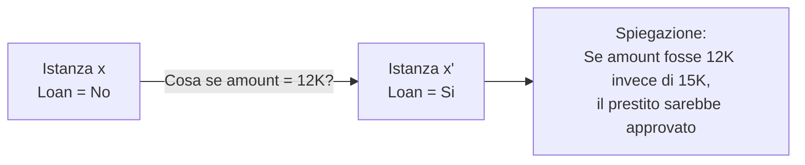
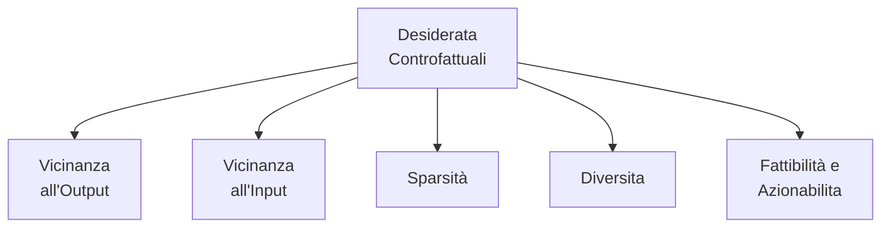
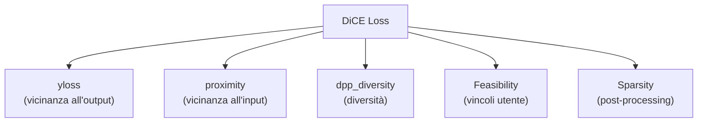
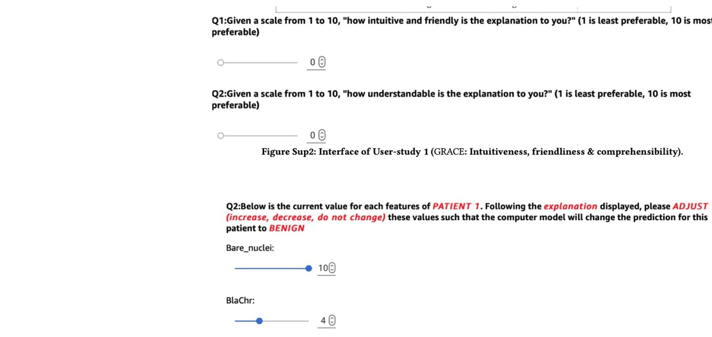
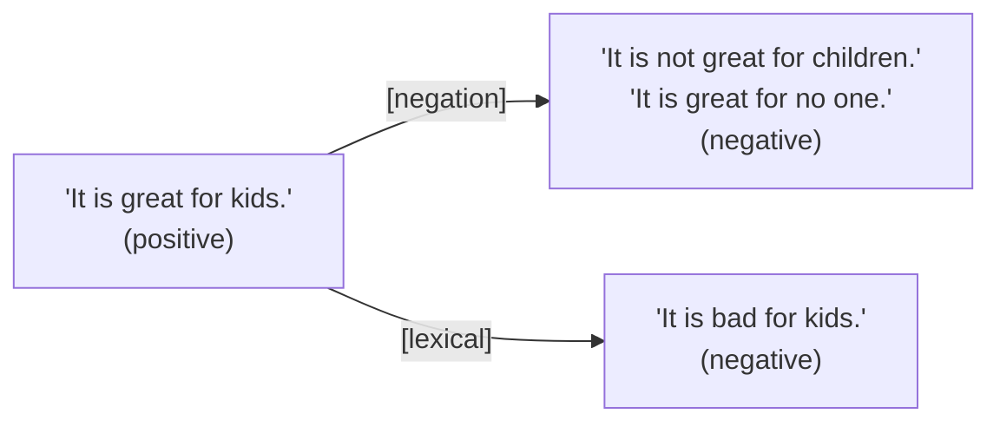

# Spiegazioni Controfattuali nell'XAI

> **Course:** Explainable and Trustworthy AI
> **Lecture:** 13
> **Date:** 2026-05-10
> **Source:** XAI_13_counterfactuals.pdf

## Overview

Questa lezione introduce le spiegazioni controfattuali, un metodo di spiegazione basato su esempi che risponde alla domanda "Cosa succederebbe se...?" identificando il più piccolo cambiamento nelle feature che altera la predizione del modello. Vengono presentati i desiderata fondamentali (vicinanza all'output, vicinanza all'input, sparsità, diversità, fattibilità), l'algoritmo pioneero di Wachter et al. con la sua funzione di perdita bilanciata, l'estensione DiCE per generare controfattuali diversi e fattibili, l'applicazione all'NLP con Polyjuice, e le metriche di valutazione quantitativa e cognitiva.

## Content

### Introduzione alle Spiegazioni Controfattuali

Le spiegazioni controfattuali coinvolgono il cambiamento di alcuni aspetti di un input per osservare come varia l'output, rispondendo alla domanda **"Cosa succederebbe se...?"**. Lo scopo è fornire insight nel processo decisionale del modello illustrando come piccole modifiche possano portare a risultati diversi.

Data un'istanza $x$ con predizione $y = f(x)$ e un output desiderato $y'$, una **spiegazione controfattuale** descrive il più piccolo cambiamento ai valori delle feature che modifica la predizione verso l'output predefinito. Si tratta di una spiegazione **basata su esempi**, poiche produce una nuova istanza $x'$ che, partendo da $x$, ha alcune feature modificate.

### Perché le Spiegazioni Controfattuali?

Le spiegazioni controfattuali offrono tre vantaggi principali:

- **Interpretabilità**: aiutano gli utenti a comprendere il confine decisionale del modello, poiche coinvolgono il cambiamento di poche feature
- **Fiducia**: mostrano come le decisioni possano essere alterate, fornendo insight anche su quando gli utenti dovrebbero contestare la decisione (es. se per cambiare l'esito e necessario modificare un attributo sensibile e protetto)
- **Azionabilita**: offrono suggerimenti concreti su come modificare l'esito

### Desiderata delle Spiegazioni Controfattuali

Un buon controfattuale dovrebbe soddisfare le seguenti proprietà:

| Proprietà | Descrizione |
|---|---|
| **Vicinanza all'output** | Il controfattuale dovrebbe produrre la predizione predefinita il più fedelmente possibile |
| **Vicinanza all'input** | Le feature del controfattuale dovrebbero essere il più simile possibile all'istanza originale |
| **Sparsità** | Il controfattuale dovrebbe modificare solo poche feature |
| **Diversita** | Generare spiegazioni controfattuali multiple e diverse tra loro, per identificare le alterazioni più adatte |
| **Fattibilità** | I valori delle feature dovrebbero essere possibili e realistici (es. non "altezza 1.90m e peso 10kg", non "diminuire l'età") |

### L'Algoritmo di Wachter et al.

L'algoritmo di Wachter et al. (2017) e tra i primi metodi per generare spiegazioni controfattuali, mirando a soddisfare le due proprietà di **vicinanza all'output** e **vicinanza all'input**.

Dati un modello $f$, un'istanza $x$, un esito $y$ e un esito desiderato $y'$, l'obiettivo e trovare un controfattuale $x'$ il più vicino possibile a $x$ ma con $f(x') = y'$.

#### Funzione di Perdita

Il controfattuale $x'$ si identifica minimizzando la seguente funzione di perdita:

$$L(x, x', y', \lambda) = \lambda \cdot (f(x') - y')^2 + d(x, x')$$

dove:
- $\lambda \cdot (f(x') - y')^2$ misura la **vicinanza all'output** predefinito (distanza quadratica)
- $d(x, x')$ misura la **vicinanza all'input** originale
- $\lambda$ è un parametro di regolarizzazione che bilancia le due componenti

Valori grandi di $\lambda$ privilegiano controfattuali molto vicini a $y'$; valori piccoli privilegiano controfattuali molto vicini a $x$.

#### Funzione di Distanza

La distanza $d$ tra l'istanza e il controfattuale è definita come:

$$d(x, x') = \sum_{j=1}^{p} \frac{|x_j - x'_j|}{MAD_j}$$

dove $MAD_j$ è la deviazione assoluta mediana della feature $j$ sul dataset:

$$MAD_j = \text{median}_{i \in \{1,...,n\}} |x_{i,j} - \text{median}_{i \in \{1,...,n\}} x_{i,j}|$$

La distanza feature-wise è scalata dall'inverso del MAD per evitare che feature con variazioni diverse abbiano impatti differenti (es. età e reddito).

#### Selezione di $\lambda$

Poiche $\lambda$ può essere difficile da selezionare, l'approccio propone di scegliere una **tolleranza** $\epsilon$ per la distanza ammissibile tra la predizione del controfattuale e $y'$:

$$|f(x') - y'| \leq \epsilon$$

Si minimizza la loss per $x'$ aumentando gradualmente $\lambda$ fino a trovare una soluzione sufficientemente vicina:

$$\arg\min_{x'} \max_{\lambda} L(x, x', y', \lambda)$$

#### Algoritmo

1. Dati un'istanza $x$, l'esito desiderato $y'$, una tolleranza $\epsilon$ e un valore iniziale (basso) per $\lambda$
2. Campionarè un'istanza random come controfattuale iniziale
3. Ottimizzare la loss con il controfattuale campionato come punto di partenza
4. Mentre $|f(x') - y'| > \epsilon$: aumentare $\lambda$ e ri-ottimizzare la loss
5. Ripetere i passi 2-4 e restituire la lista di controfattuali o quello che minimizza la loss

### DiCE: Diverse Counterfactual Explanations

DiCE (Mothilal et al., 2019) estende Wachter et al. considerando anche le proprietà di **diversità** e **fattibilità**. L'obiettivo e generarè un insieme di controfattuali $\{c_1, c_2, \dots, c_k\}$ che portino a una decisione diversa da $x$ verso $y'$.

#### Termini della Funzione di Perdita

DiCE introduce tre termini nella funzione di perdita:

**Vicinanza all'input** (proximity):

$$\text{proximity} = -\frac{1}{k} \sum_{i=1}^{k} \text{dist}(x, x'_i)$$

**Vicinanza all'output** (yloss):

$$\text{yloss} = \frac{1}{k} \sum_{i=1}^{k} \text{yloss}(f(x'_i), y')$$

**Diversita** tramite Determinantal Point Processes (DPP):

$$\text{dpp\_diversity} = \det(K)$$

dove $K_{ij} = \frac{1}{1 + \text{dist}(x'_i, x'_j)}$ e $\text{dist}(x'_i, x'_j)$ e la distanza tra due controfattuali. Il determinante di una matrice simmetrica con valori grandi in $[0,1]$ (cioe controfattuali simili = piccola distanza = grande $K_{ij}$) sara piccolo (vicino a 0), penalizzando controfattuali simili.

#### Vincoli Aggiuntivi

**Fattibilità**: gli utenti possono imporre vincoli sulla manipolazione delle feature, ad esempio limiti superiori (es. reddito non oltre 1M) o specificare quali variabili possono essere modificate (es. età non modificabile).

**Sparsità**: questa proprietà non e inclusa nella funzione di perdita ma gestita in **post-processing**, operando sui controfattuali generati per ridurrè il numero di feature modificate.

#### Funzione di Perdita Finale

$$X' = \arg\min_{x'_1, \dots, x'_k} \frac{1}{k} \sum_{i=1}^{k} \text{yloss}(f(x'_i), y') + \frac{\lambda_1}{k} \sum_{i=1}^{k} \text{dist}(x, x'_i) - \lambda_2 \cdot \text{dpp\_diversity}(x'_1, \dots, x'_k)$$

dove $X'$ e l'insieme di $k$ controfattuali e $\lambda_1$, $\lambda_2$ sono termini di regolarizzazione.

### Generazione Controfattuale per NLP: Polyjuice

Polyjuice (Wu et al., 2021) e uno strumento per generare controfattuali nel dominio NLP, con scopi di **spiegazione, valutazione e miglioramento** dei modelli. Genera un insieme diversificato di controfattuali apportando modifiche minime al testo originale, alterando parole, frasi o strutture testuali più ampie preservando correttezza grammaticale e naturalezza.

Le trasformazioni supportate includono: sostituzione di sinonimi, parafrasi, inserimento, cancellazione e **negazione**.

#### Desiderata di Polyjuice

Polyjuice soddisfa i seguenti desiderata:

- **Vicinanza all'input**: fine-tuning di GPT-2 su coppie di frasi simili, usando il testo originale come contesto per la perturbazione
- **Fluenza e diversità**: fornite da GPT-2 stesso, con fine-tuning su dataset multipli e perturbazioni diverse
- **Controllo della perturbazione**: tramite prompting (es. `<|perturb|> [negation]`, `<|perturb|> [lexical]`)
- **Fattibilità**: le perturbazioni sono linguisticamente valide

### Valutazione dei Controfattuali

La qualità dei controfattuali generati si valuta con metriche quantitative e cognitive.

#### Metriche Quantitative

**Validita (CF-validity)**: frazione di esempi restituiti dal metodo che sono effettivamente controfattuali:

$$\text{CF-validity} = \frac{|\{x' \in X' \; s.t. \; f(x') = y'\}|}{k}$$

**Prossimita (CF-proximity)**: media delle distanze feature-wise tra il controfattuale e l'input originale:

$$\text{CF-proximity} = \frac{1}{k} \sum_{i=1}^{k} \text{dist}(x, x'_i)$$

**Sparsità (CF-sparsity)**: numero medio di feature modificate tra l'input originale e il controfattuale:

$$\text{CF-sparsity} = \frac{1}{k} \sum_{i=1}^{k} \frac{1}{d} \mathbb{1}[\text{modifiche}]$$

dove $d$ è il numero totale di feature.

**Diversita**: media delle distanze feature-wise tra ogni coppia di controfattuali:

$$\text{CF-diversity} = \frac{1}{\#\text{pairs}} \sum_{i,j} \text{dist}(x'_i, x'_j)$$

#### Metriche Cognitive

L'intuitivita e la comprensibilità vengono valutate tramite **user study**, misurando quanto gli utenti riescono a comprendere e utilizzare le spiegazioni controfattuali.

### Vantaggi e Svantaggi

#### Vantaggi

- **Facilita di interpretazione**: cambiare una feature cambia la predizione — la relazione causale e immediata
- **Spiegazione per esempio**: il controfattuale è un'istanza concreta con modifiche minime
- **Indipendenza dai dati di training**: a seconda del metodo, non è sempre necessario accedere ai dati di addestramento
- **Facilita di implementazione**: spesso si riduce alla minimizzazione di una funzione di perdita

#### Svantaggi

- **Fattibilità**: le modifiche suggerite potrebbero non essere realistiche o fattibili (es. cambiare l'età, aumentare il salario)
- **Ambiguita**: possono esistere molte spiegazioni controfattuali per una singola decisione, senza un criterio univoco per scegliere la migliore
- **Validita locale**: i controfattuali sono specifici alla singola istanza e non generalizzabili ad altre
- **Preferenza utente**: alcuni utenti potrebbero preferire altre forme di spiegazione

## Key Concepts

| Concetto | Definizione | Nota |
|---|---|---|
| **Spiegazione controfattuale** | Il più piccolo cambiamento ai valori delle feature che modifica la predizione verso un output predefinito | Spiegazione basata su esempi |
| **Vicinanza all'output** | Il controfattuale dovrebbe produrre la predizione target il più fedelmente possibile | Misurata come distanza quadratica $f(x') - y'$ |
| **Vicinanza all'input** | Le feature del controfattuale dovrebbero essere simili all'istanza originale | Distanza scalata con MAD |
| **MAD** | Deviazione Assoluta Mediana di una feature sul dataset | Usata per normalizzare la distanza tra feature con scale diverse |
| **Wachter et al.** | Algoritmo pioniere che bilancia vicinanza all'output e all'input con parametro $\lambda$ | Risolve $\arg\min_{x'} \max_{\lambda} L$ |
| **DiCE** | Estensione che genera controfattuali diversi e fattibili | Usa DPP per la diversità |
| **DPP** | Determinantal Point Processes: misura di diversità basata sul determinante di una matrice di similarita | Penalizza controfattuali simili tra loro |
| **Polyjuice** | Strumento per generare controfattuali in NLP tramite GPT-2 fine-tuned | Supporta negazione, parafrasi, sostituzione lessicale |
| **CF-validity** | Frazione di controfattuali generati che producono effettivamente la classe target | Metrica quantitativa fondamentale |
| **Sparsità** | Numero di feature modificate tra input e controfattuale | Gestita in post-processing in DiCE |

## Connections

- I controfattuali sono un metodo di spiegazione **locale** che si colloca nel framework della tassonomia XAI vista nella lezione 02: sono spiegazioni post-hoc, model-agnostic e basate su esempi.
- L'approccio di Wachter et al. condivide con i metodi basati su rimozione (lezione 06) l'idea di studiare come le perturbazioni dell'input influenzano l'output del modello.
- La **fattibilità** dei controfattuali e legata alla tematica della fiducia e dell'etica dell'IA introdotta nella lezione 01: se per cambiare l'esito e necessario modificare un attributo protetto, il modello potrebbe essere discriminatorio.
- Le metriche di valutazione quantitativa (validita, prossimita, sparsità, diversità) si inseriscono nel framework di valutazione sistematico presentato nella lezione 10.
- Polyjuice si collega all'applicazione dell'XAI nell'NLP trattata nella lezione 09, estendendo il concetto di spiegazione dal livello di token/feature al livello di trasformazioni testuali controllate.
