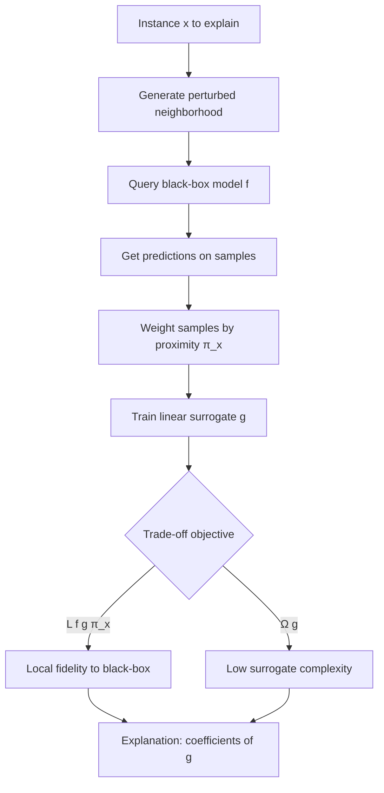

# Interactive LIME Session: Quiz and Core Concepts

> **Course:** Explainable and Trustworthy AI
> **Lecture:** Lab
> **Date:** 2026-03-19
> **Source:** Interactive_session_LIME.pdf

## Overview

This interactive session presents six multiple-choice questions covering the fundamental aspects of LIME (Local Interpretable Model-agnostic Explanations): the algorithm's step sequence, the notion of interpretable representation for images, the meaning of terms in the objective function, perturbation limitations, explanation stability, and the fidelity-interpretability trade-off.

## Content

### Sequence of LIME Steps

The correct order of high-level steps is:

1. **Generate neighborhood** around the instance to explain
2. **Get predictions** from the black-box model on perturbed samples
3. **Weight by proximity** using the kernel function π_x
4. **Train an interpretable model** (linear surrogate) on the weighted samples
5. **Explain** by returning the surrogate model's coefficients

Common mistakes include confusing the order of neighborhood generation and prediction, or training the surrogate on original labels rather than the black-box model's predictions.

### Interpretable Representation for Images

For images, the interpretable representation in LIME is:

- A binary vector of **superpixel/patch segments**
- Each superpixel is on (1) or off (0), indicating the presence or absence of that segment
- It does NOT use: gradient maps, raw pixel matrices (WxHxC), or learned embeddings

Discretization into superpixels reduces the input space to a dimension manageable by a linear model.

### Objective Function and the Ω(g) Term

The LIME objective function is:

```
explanation(x) = argmin_g L(f, g, π_x) + Ω(g)
```

The two terms represent:

- **L(f, g, π_x)**: the fidelity of surrogate g to the black-box model f, weighted by proximity π_x
- **Ω(g)**: the complexity of the surrogate model, minimized to keep explanations interpretable

Ω(g) is NOT: the proximity, the prediction error of f, or the number of perturbed samples.

### Unrealistic Sample Problem

LIME may generate unrealistic neighbor samples because:

- Perturbations are generated **independently per feature**, ignoring correlations between features
- For example, in a medical dataset it might generate "age 25, cholesterol 300" — a statistically implausible combination
- This is NOT caused by the simplicity of the linear surrogate, the distance metric used, or insufficient sample count

### Explanation Instability

Running LIME twice on the same instance can yield different explanations. The most direct remedy is:

- **Increase the number of perturbed samples** generated for the neighborhood
- A larger sampling reduces variance in the surrogate's coefficient estimates
- Switching surrogate type, reducing K, or changing the distance metric do not address the root cause

### LIME's Fundamental Trade-off

The full objective captures:

> The trade-off between **faithfully approximating the black-box locally** and **keeping the surrogate model simple enough to interpret**

This is not a bias-variance trade-off, a computation speed issue, or a matter of interpretable vs. raw features.



## Key Concepts

| Concept | Definition | Note |
|---------|------------|------|
| **LIME** | Local Interpretable Model-agnostic Explanations | Local, model-agnostic explanation method |
| **Surrogate model** | Interpretable model (e.g., linear) trained locally | Approximates black-box behavior in the neighborhood |
| **Proximity kernel π_x** | Function weighting samples by distance from x | Closer samples receive higher weight |
| **Ω(g)** | Surrogate complexity term in the objective function | Minimized to ensure interpretability |
| **Superpixel** | Image segments used as interpretable representation | Binary vector: 1 = present, 0 = absent |
| **Independent perturbation** | Sample generation varying each feature separately | Primary cause of unrealistic samples |
| **Neighborhood** | Set of perturbed samples around instance x | Basis for surrogate model training |
| **Local fidelity** | How well the surrogate reproduces black-box predictions near x | Measured by L(f, g, π_x) |
| **Stability** | Consistency of explanations across repeated runs | Improved by increasing sample count |

## Connections

- The objective L(f, g, π_x) + Ω(g) formalizes the fidelity-interpretability trade-off discussed in the theoretical LIME lectures (Lectures 7-8)
- The linear surrogate model relates to weighted linear regression covered in machine learning foundations
- The superpixel representation for images is a practical application of segmentation methods discussed in the neural network explainability module
- LIME explanation instability is part of the critical discussion on reliability of post-hoc methods (Lectures 9-10)
- The issue of unrealistic per-feature perturbations connects LIME to limitations of model-agnostic versus model-aware methods