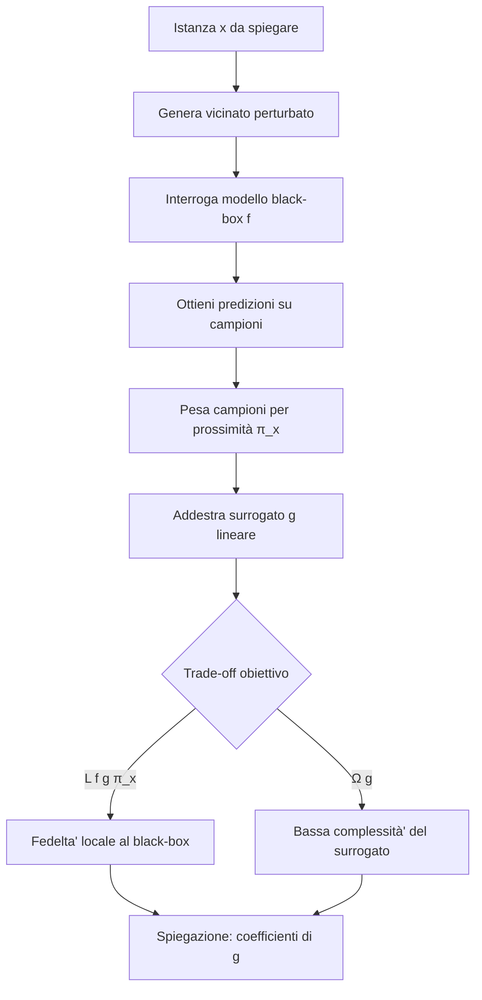

# Sessione Interattiva su LIME: Quiz e Concetti Fondamentali

> **Course:** Explainable and Trustworthy AI
> **Lecture:** Lab
> **Date:** 2026-03-19
> **Source:** Interactive_session_LIME.pdf

## Overview

Questa sessione interattiva propone sei domande a risposta multipla che coprono gli aspetti fondamentali di LIME (Local Interpretable Model-agnostic Explanations): la sequenza dei passi dell'algoritmo, la nozione di rappresentazione interpretabile per le immagini, il significato dei termini nella funzione obiettivo, i limiti delle perturbazioni, la stabilità delle spiegazioni e il trade-off tra fedeltà e interpretabilità.

## Content

### Sequenza dei Passi di LIME

L'ordine corretto dei passi di alto livello è:

1. **Generare il vicinato** (neighborhood) attorno all'istanza da spiegare
2. **Ottenere le predizioni** del modello black-box sui campioni perturbati
3. **Ponderare per prossimità** usando la funzione kernel π_x
4. **Addestrare un modello interpretabile** (surrogato lineare) sui campioni pesati
5. **Spiegare** restituendo i coefficienti del modello surrogato

L'errore comune è confondere l'ordine della generazione del vicinato e delle predizioni, oppure addestrare il surrogato sulle etichette originali anzichè sulle predizioni del modello black-box.

### Rappresentazione Interpretabile per le Immagini

Per le immagini, la rappresentazione interpretabile in LIME è:

- Un vettore binario di **superpixel/segmenti di patch**
- Ogni superpixel è acceso (1) o spento (0), indicando la presenza o assenza di quel segmento
- Non si usano: mappe di gradiente, matrici di pixel grezzi (WxHxC) o embedding appresi

La discretizzazione in superpixel riduce lo spazio degli input a una dimensione gestibile per un modello lineare.

### Funzione Obiettivo e il Termine Ω(g)

La funzione obiettivo di LIME è:

```
explanation(x) = argmin_g L(f, g, π_x) + Ω(g)
```

I due termini rappresentano:

- **L(f, g, π_x)**: la fedeltà' del surrogato g rispetto al modello black-box f, pesata dalla prossimità π_x
- **Ω(g)**: la complessità' del modello surrogato, minimizzata per mantenere le spiegazioni interpretabili

Ω(g) NON è: la prossimità, l'errore di predizione di f, o il numero di campioni perturbati.

### Problema dei Campioni Irrealistici

LIME può' generare campioni vicini irrealistici perché':

- Le perturbazioni sono generate **independently per feature**, ignorando le correlazioni tra feature
- Ad esempio, per un dataset medico, potrebbe generare "età' 25, colesterolo 300" — una combinazione statisticamente implausibile
- Questo NON è dovuto alla semplicita' del surrogato lineare, alla metrica di distanza usata, o al numero insufficiente di campioni

### Instabilità delle Spiegazioni

Eseguendo LIME due volte sulla stessa istanza si possono ottenere spiegazioni diverse. La soluzione più' diretta è:

- **Aumentare il numero di campioni perturbati** generati per il vicinato
- Un campionamento più' ampio riduce la varianza nella stima dei coefficienti del surrogato
- Cambiare il tipo di surrogato, ridurre K, o cambiare metrica di distanza non risolvono il problema alla radice

### Trade-off Fondamentale di LIME

L'obiettivo completo cattura:

> Il trade-off tra **approssimare fedelmente il black-box localmente** e **mantenere il modello surrogato abbastanza semplice da essere interpretabile**

Non si tratta di trade-off bias-variance, di velocita' di calcolo, o di feature interpretabili vs. grezze.



## Key Concepts

| Concetto | Definizione | Nota |
|----------|-------------|------|
| **LIME** | Local Interpretable Model-agnostic Explanations | Metodo locale, modello-agnostico per spiegazioni |
| **Modello surrogato** | Modello interpretabile (es. lineare) addestrato localmente | Approssima il comportamento del black-box nel vicinato |
| **Kernel di prossimità π_x** | Funzione che pondera i campioni in base alla distanza da x | Campioni più' vicini hanno peso maggiore |
| **Ω(g)** | Termine di complessità' del surrogato nella funzione obiettivo | Minimizzato per garantire interpretabilità' |
| **Superpixel** | Segmenti di immagine usati come rappresentazione interpretabile | Vettore binario: 1 = presente, 0 = assente |
| **Perturbazione indipendente** | Generazione di campioni variando ogni feature separatamente | Causa principale di campioni irrealistici |
| **Vicinato** | Insieme di campioni perturbati attorno all'istanza x | Base per l'addestramento del surrogato |
| **Fedelta' locale** | Quanto il surrogato riproduce le predizioni del black-box vicino a x | Misurata da L(f, g, π_x) |
| **Stabilita'** | Consistenza delle spiegazioni su esecuzioni ripetute | Migliorata aumentando il numero di campioni |

## Connections

- La funzione obiettivo L(f, g, π_x) + Ω(g) formalizza il trade-off tra fedeltà' e interpretabilità' discusso nelle lezioni teoriche su LIME (Lectures 7-8)
- Il concetto di modello surrogato lineare si ricollega alla regressione lineare pesata trattata nei fondamenti di machine learning
- La rappresentazione tramite superpixel per le immagini è un'applicazione pratica dei metodi di segmentazione visti nel modulo sulla spiegabilità' delle reti neurali
- L'instabilità delle spiegazioni LIME è un aspetto della discussione critica sulla affidabilità' dei metodi post-hoc (Lectures 9-10)
- Il problema delle perturbazioni irrealistiche per feature indipendenti collega LIME alle limitazioni dei metodi model-agnostic rispetto ai metodi model-aware